# SociallyFed Development Context - UNIFIED ARCHITECTURE

## 🎯 PROJECT OVERVIEW - INTEGRATED SYSTEM
You are working on SociallyFed, a sophisticated digital wellness platform that combines:
- **Privacy-first social media analysis** using the SociallyFed Pyramid framework
- **Professional counselor/client management** with real-time collaboration
- **Multi-tenant architecture** supporting individual, professional, and enterprise users
- **Hybrid deployment** options (cloud, on-premise, hybrid)

## 🏗️ UNIFIED ARCHITECTURE STRATEGY
**Current Phase**: Integrating two production-ready applications into unified system
- **Mobile App**: Sophisticated PWA (8.5/10 architecture score) with advanced features
- **Server App**: Production-ready .NET API with LLM integration and PostgreSQL
- **Integration Goal**: API Gateway connecting mobile → server with multi-tenancy

### Integration Architecture:
```
Mobile App → API Gateway → Server Services
                ↓
            Auth Service (JWT)
            Journal Service (PostgreSQL + Multi-tenant)
            LLM Service (Semantic Kernel + Ollama)
            Analytics Service (Background Jobs)
            Professional Services (Counselor/Client APIs)
```


## 📱 CURRENT DEVELOPMENT FOCUS: MOBILE (Server Integration & Professional Features)

### Repository Structure - MOBILE INTEGRATION FOCUS  
**Mobile/Client Repository** (Ionic 7 + React + TypeScript)
- **Tech Stack**: Ionic/React, Capacitor, PWA, IndexedDB, Firebase (transitioning to server)
- **Integration Purpose**:
  - Server API integration replacing Firebase-only patterns
  - Tenant-aware mobile configuration and switching  
  - Professional dashboard for counselor client management
  - Real-time collaboration enhanced for professional use
  - Environment-specific configuration for deployment flexibility

### Key Integration Components:
- **API Services**: Replace Firebase calls with server API integration
- **Tenant Management**: Multi-tenant configuration and switching
- **Professional UI**: Counselor dashboard, client management, progress tracking
- **Authentication Integration**: Server JWT flow replacing Firebase Auth
- **Environment Configuration**: Dynamic server endpoints for deployment models

### Current Mobile Integration Priorities:
1. **Server API Integration**
   - Replace Firebase storage with server API calls
   - Implement API Gateway communication layer
   - Add request/response transformation and caching
   - Error handling and offline queue management

2. **Tenant-Aware Configuration**
   - Multi-tenant mobile configuration system
   - Tenant switching UI and data isolation
   - Organization-level branding and customization
   - Tenant-specific feature flags and permissions

3. **Professional Dashboard Implementation**
   - Counselor client management interface
   - Client progress tracking and visualization
   - Data sharing controls and permissions
   - Professional communication and collaboration tools

4. **Enhanced Real-time Collaboration**
   - WebSocket integration with server for professional features
   - Live document sharing and editing
   - Presence indicators and notification system
   - Professional-grade collaboration workflows

5. **Environment-Specific Configuration**
   - Dynamic server endpoint configuration
   - Cloud/on-premise/hybrid deployment support
   - Feature detection and capability management
   - Deployment-specific optimizations

### Advanced Mobile Features (Preserve & Enhance):
- **PWA Capabilities**: Background sync, push notifications, offline functionality
- **ML Personalization**: Client-side pattern recognition and adaptive UI  
- **Performance Excellence**: 94/100 score with 70% memory optimization
- **Real-time Features**: WebSocket collaboration with enhanced professional capabilities
- **Security**: End-to-end encryption with granular privacy controls

### Mobile Architecture Strengths to Leverage:
- **Offline-First**: Complete functionality without connectivity
- **Advanced PWA**: Intelligent installation and app-like experience
- **ML Personalization**: Privacy-preserving client-side analytics
- **Real-time Collaboration**: WebSocket-based professional interaction
- **Multi-platform**: Web, iOS, Android with native optimizations


## 🔗 INTEGRATION COORDINATION REQUIREMENTS

### Multi-Tenancy Implementation:
- **Database Schema**: tenant_id columns on all user data tables
- **API Design**: Tenant-aware endpoints with /api/v1/tenants/{tenantId}/ pattern
- **Mobile Integration**: Tenant switching and configuration management
- **Data Isolation**: Row-level security and complete tenant separation

### Professional Services Features:
- **Counselor APIs**: Client management, progress tracking, reporting
- **Mobile Dashboard**: Professional interface for counselor workflow
- **Real-time Collaboration**: Enhanced WebSocket features for professional use
- **Data Sharing**: Granular permissions and privacy controls

### Environment Configuration:
- **Cloud Deployment**: Google Cloud Run + Firebase integration
- **On-Premise**: Docker Compose with local LLM (Ollama)
- **Hybrid**: Local LLM processing with cloud sync capabilities
- **Feature Flags**: Environment-specific feature management

### Business Model Support:
- **Individual Users**: Premium PWA experience with local AI processing
- **Professional Services**: Counselor/client management with real-time collaboration  
- **Enterprise**: Multi-tenant with SSO, white-label, and on-premise deployment

## 🎯 TODAY'S INTEGRATION SUCCESS CRITERIA

### Technical Integration:
- Mobile app communicates successfully with server APIs
- Multi-tenant data isolation working correctly
- Professional features functional for counselor/client scenarios
- Environment configuration supports target deployment model
- Integration tests passing for developed features

### Quality Standards:
- Maintain mobile app's 94/100 performance score
- Preserve server's enterprise-grade security and compliance
- Clean architecture patterns maintained in both applications
- Comprehensive error handling and user experience
- Complete documentation of integration decisions

## 📚 DEVELOPMENT CONTEXT FILES AVAILABLE

### Strategic Planning:
- `current_sprint.md` - Current unified architecture sprint status
- `daily_brief.md` - Today's integration priorities and tasks
- `strategic_architecture_assessment.md` - Complete strategic guidance

### Implementation Tracking:
- `implementation_log.md` - Historical progress and decisions
- `implementation_report_*.md` - Daily detailed progress reports

## 🚀 CLAUDE CODE INTEGRATION GUIDELINES

### Effective Prompting:
```
@claude Read DEVELOPMENT_CONTEXT.md and help me implement [specific integration feature]. 

Focus on:
1. [Mobile-server integration point]
2. [Multi-tenant consideration] 
3. [Professional services requirement]
4. [Environment configuration need]

Ensure this aligns with our unified architecture strategy.
```

### Integration Development Workflow:
1. **Read Context**: Always start with DEVELOPMENT_CONTEXT.md
2. **Check Dependencies**: Understand mobile-server coordination needs
3. **Implement Features**: Focus on integration and multi-tenancy
4. **Test Integration**: Validate cross-application functionality
5. **Document Decisions**: Update implementation reports

### Code Quality Standards:
- Follow existing architectural patterns in each application
- Maintain performance standards (mobile: 94/100, server: <200ms APIs)
- Implement comprehensive error handling
- Add integration tests for new functionality
- Document integration decisions and trade-offs


## 📋 CURRENT SESSION CONTEXT

📊 Current session context:
## Session Started: Sun 24 Aug 2025 16:27:29 AEST
**Project Focus**: SociallyFed Mobile App
**Repository**: /home/ben/Development/sociallyfed-mobile

### Today's Brief:
# Daily Brief - SociallyFed Mobile PWA
## Firebase Authentication Direct Integration
**Date**: Sunday, August 24, 2025  
**Sprint**: Firebase Auth Migration - Mobile PWA  
**Developer**: Mobile Team  
**Priority**: P0 CRITICAL - Fix Authentication CORS Issues

---

## 🎯 Today's Implementation Priorities

### Primary Goal
Replace the problematic server token exchange flow with direct Firebase Authentication while maintaining backward compatibility through feature flags. Eliminate CORS/COOP issues permanently.

### Critical Path Items (In Order)
1. **Firebase Auth Service Refactor** (2 hours)
   - Remove server token exchange dependency
   - Implement direct Firebase authentication
   - Add feature flag for auth mode selection

2. **Login Component Simplification** (1-2 hours)
   - Remove complex token exchange logic
   - Implement Firebase-first authentication
   - Add proper error handling and recovery

3. **API Service Updates** (2 hours)
   - Modify all API calls to use Firebase tokens
   - Update request interceptors
   - Handle both auth modes via feature flag

4. **Offline Mode Enhancement** (1 hour)
   - Ensure Firebase auth works offline
   - Cache user credentials properly
   - Handle auth state persistence

---

## 🔨 Specific Features to Build

### 1. Updated Firebase Configuration
```typescript
// src/services/firebaseConfig.ts
import { initializeApp } from 'firebase/app';
import { 
  getAuth, 
  setPersistence, 
  browserLocalPersistence,
  connectAuthEmulator 
} from 'firebase/auth';
import { getFirestore, connectFirestoreEmulator } from 'firebase/firestore';

const firebaseConfig = {
  apiKey: process.env.REACT_APP_FIREBASE_API_KEY || "AIzaSy...",
  authDomain: "sociallyfed-55780.firebaseapp.com",
  projectId: "sociallyfed-55780",
  storageBucket: "sociallyfed-55780.appspot.com",
  messagingSenderId: "512204327023",
  appId: process.env.REACT_APP_FIREBASE_APP_ID
};

// Initialize Firebase
const app = initializeApp(firebaseConfig);

// Initialize Auth with persistence
export const auth = getAuth(app);
setPersistence(auth, browserLocalPersistence);

// Initialize Firestore
export const db = getFirestore(app);

// Development: Connect to emulators
if (process.env.NODE_ENV === 'development' && process.env.REACT_APP_USE_EMULATORS) {
  connectAuthEmulator(auth, 'http://localhost:9099');
  connectFirestoreEmulator(db, 'localhost', 8080);
}

export default app;
```

### 2. Refactored Authentication Service
```typescript
// src/services/AuthenticationService.ts
import { 
  signInWithPopup, 
  signInWithRedirect,
  getRedirectResult,
  GoogleAuthProvider, 
  onAuthStateChanged, 
  User,
  signOut,
  getIdToken
} from 'firebase/auth';
import { auth } from './firebaseConfig';
import { SociallyFedConfigService } from './SociallyFedConfigService';

export interface AuthConfig {
  useFirebaseOnly: boolean;
  attemptServerSync: boolean;
  useRedirectFlow: boolean; // Avoid CORS issues
}

export class AuthenticationService {
  private currentUser: User | null = null;
  private authStateListeners: ((user: User | null) => void)[] = [];
  private config: AuthConfig;
  
  constructor() {
    this.config = this.loadAuthConfig();
    this.initializeAuthListener();
    this.checkRedirectResult();
  }
  
  private loadAuthConfig(): AuthConfig {
    const flags = SociallyFedConfigService.getInstance().getSimplifiedFlags();
    return {
      useFirebaseOnly: flags.useFirebaseOnly ?? true,
      attemptServerSync: flags.attemptServerSync ?? false,
      useRedirectFlow: flags.useRedirectFlow ?? true // Default to redirect to avoid CORS
    };
  }
  
  private initializeAuthListener(): void {
    onAuthStateChanged(auth, async (user) => {
      console.log('🔐 Auth state changed:', user?.email || 'signed out');
      this.currentUser = user;
      
      if (user) {
        // Store user data locally
        this.storeUserData(user);
        
        // Optionally sync with server if configured
        if (this.config.attemptServerSync) {
          await this.syncWithServer(user);
        }
      } else {
        this.clearUserData();
      }
      
      // Notify listeners
      this.authStateListeners.forEach(listener => listener(user));
    });
  }
  
  private async checkRedirectResult(): Promise<void> {
    try {
      const result = await getRedirectResult(auth);
      if (result?.user) {
        console.log('✅ Redirect sign-in successful:', result.user.email);
        // Navigation will be handled by auth state listener
      }
    } catch (error) {
      console.error('Redirect sign-in error:', error);
    }
  }
  
  async signInWithGoogle(): Promise<User> {
    const provider = new GoogleAuthProvider();
    provider.setCustomParameters({
      prompt: 'select_account',
      access_type: 'offline',
      include_granted_scopes: 'true'
    });
    
    try {
      if (this.config.useRedirectFlow) {
        // Use redirect flow to avoid CORS issues
        console.log('🔄 Initiating redirect sign-in...');
        await signInWithRedirect(auth, provider);
        // User will be redirected, auth state will be handled on return
        return null as any; // Flow continues after redirect
      } else {
        // Use popup flow (may have CORS issues)
        console.log('🔄 Initiating popup sign-in...');
        const result = await signInWithPopup(auth, provider);
        return result.user;
      }
    } catch (error: any) {
      console.error('❌ Sign-in failed:', error);
      
      // If popup fails due to CORS, try redirect
      if (error.code === 'auth/popup-blocked' || 
          error.code === 'auth/cancelled-popup-request') {
        console.log('🔄 Popup blocked, trying redirect...');
        await signInWithRedirect(auth, provider);
      }
      
      throw error;
    }
  }
  
  private storeUserData(user: User): void {
    const userData = {
      uid: user.uid,
      email: user.email,
      displayName: user.displayName,
      photoURL: user.photoURL,
      lastSignIn: new Date().toISOString()
    };
    
    localStorage.setItem('sf_user', JSON.stringify(userData));
    localStorage.setItem('sf_auth_method', 'firebase');
  }
  
  private clearUserData(): void {
    localStorage.removeItem('sf_user');
    localStorage.removeItem('sf_auth_method');
    localStorage.removeItem('sf_server_token');
  }
  
  private async syncWithServer(user: User): Promise<void> {
    if (!this.config.attemptServerSync) return;
    
    try {
      const idToken = await user.getIdToken();
      const response = await fetch(
        `${process.env.REACT_APP_SERVER_URL}/api/auth/firebase-login`,
        {
          method: 'POST',
          headers: { 'Content-Type': 'application/json' },
          body: JSON.stringify({ firebaseToken: idToken })
        }
      );
      
      if (response.ok) {
        const data = await response.json();
        if (data.serverToken) {
          localStorage.setItem('sf_server_token', data.serverToken);
        }
        console.log('✅ Server sync successful');
      } else {
        console.warn('⚠️ Server sync failed, continuing with Firebase only');
      }
    } catch (error) {
      console.warn('⚠️ Server sync error, continuing with Firebase only:', error);
    }
  }
  
  async getAuthHeaders(): Promise<HeadersInit> {
    const headers: HeadersInit = {
      'Content-Type': 'application/json'
    };
    
    if (this.currentUser) {
      try {
        const idToken = await this.currentUser.getIdToken();
        headers['X-Firebase-Token'] = idToken;
        
        // Include server token if available (backward compatibility)
        const serverToken = localStorage.getItem('sf_server_token');
        if (serverToken) {
          headers['Authorization'] = `Bearer ${serverToken}`;
        }
      } catch (error) {
        console.error('Failed to get auth token:', error);
      }
    }
    
    return headers;
  }
  
  async signOut(): Promise<void> {
    await signOut(auth);
    this.clearUserData();
    window.location.href = '/login';
  }
  
  getCurrentUser(): User | null {
    return this.currentUser;
  }
  
  isAuthenticated(): boolean {
    return !!this.currentUser;
  }
  
  onAuthStateChange(callback: (user: User | null) => void): () => void {
    this.authStateListeners.push(callback);
    // Return unsubscribe function
    return () => {
      const index = this.authStateListeners.indexOf(callback);
      if (index > -1) {
        this.authStateListeners.splice(index, 1);
      }
    };
  }
  
  // For immediate auth check
  async waitForAuthReady(): Promise<User | null> {
    return new Promise((resolve) => {
      const unsubscribe = onAuthStateChanged(auth, (user) => {
        unsubscribe();
        resolve(user);
      });
    });
  }
}

// Singleton instance
let authServiceInstance: AuthenticationService | null = null;

export const getAuthService = (): AuthenticationService => {
  if (!authServiceInstance) {
    authServiceInstance = new AuthenticationService();
  }
  return authServiceInstance;
};

export default getAuthService();
```

### 3. Simplified Login Component
```typescript
// src/pages/Login.tsx
import React, { useEffect, useState } from 'react';
import { useHistory } from 'react-router-dom';
import { IonPage, IonContent, IonButton, IonLoading, IonAlert } from '@ionic/react';
import { getAuthService } from '../services/AuthenticationService';
import { auth } from '../services/firebaseConfig';
import { onAuthStateChanged } from 'firebase/auth';
import './Login.css';

const Login: React.FC = () => {
  const history = useHistory();
  const [loading, setLoading] = useState(true);
  const [error, setError] = useState<string | null>(null);
  const [isSigningIn, setIsSigningIn] = useState(false);
  const authService = getAuthService();
  
  useEffect(() => {
    // Check authentication state
    const unsubscribe = onAuthStateChanged(auth, (user) => {
      if (user) {
        console.log('✅ User authenticated, redirecting to journal...');
        history.replace('/journal');
      } else {
        setLoading(false);
      }
    });
    
    return () => unsubscribe();
  }, [history]);
  
  const handleGoogleSignIn = async () => {
    try {
      setIsSigningIn(true);
      setError(null);
      
      await authService.signInWithGoogle();
      // If using redirect flow, the page will redirect
      // If using popup flow, auth state change will handle navigation
      
    } catch (error: any) {
      console.error('Sign-in error:', error);
      
      // User-friendly error messages
      if (error.code === 'auth/popup-closed-by-user') {
        setError('Sign-in cancelled. Please try again.');
      } else if (error.code === 'auth/network-request-failed') {
        setError('Network error. Please check your connection and try again.');
      } else {
        setError('Sign-in failed. Please try again or contact support.');
      }
      
      setIsSigningIn(false);
    }
  };
  
  const handleOfflineMode = () => {
    // Set offline mode flag and navigate
    localStorage.setItem('sf_offline_mode', 'true');
    history.push('/journal');
  };
  
  if (loading) {
    return (
      <IonPage>
        <IonContent>
          <IonLoading isOpen={true} message="Checking authentication..." />
        </IonContent>
      </IonPage>
    );
  }
  
  return (
    <IonPage>
      <IonContent className="login-content">
        <div className="login-container">
          <div className="login-header">
            <h1>Welcome to Baseline</h1>
            <p>A better journaling and mood tracking app.</p>
          </div>
          
          <div className="login-buttons">
            <IonButton
              expand="block"
              onClick={handleGoogleSignIn}
              disabled={isSigningIn}
              className="google-signin-btn"
            >
              {isSigningIn ? 'Signing in...' : 'Sign in with Google'}
            </IonButton>
            
            <IonButton
              expand="block"
              fill="outline"
              onClick={handleOfflineMode}
              className="offline-mode-btn"
            >
              Continue Offline
            </IonButton>
          </div>
          
          <div className="login-footer">
            <p>Your data is private: we're a non-profit, and we have no interest in using your data for anything.</p>
          </div>
        </div>
        
        <IonAlert
          isOpen={!!error}
          onDidDismiss={() => setError(null)}
          header="Sign-in Error"
          message={error || ''}
          buttons={['OK']}
        />
      </IonContent>
    </IonPage>
  );
};

export default Login;
```

### 4. API Service with Firebase Token
```typescript
// src/services/SociallyFedAPIService.ts
import { getAuthService } from './AuthenticationService';

export class SociallyFedAPIService {
  private baseUrl: string;
  private authService = getAuthService();
  
  constructor() {
    this.baseUrl = process.env.REACT_APP_SERVER_URL || 
                   'https://socially-fed-server-512204327023.us-central1.run.app';
  }
  
  private async makeRequest(
    endpoint: string,
    options: RequestInit = {}
  ): Promise<Response> {
    const headers = await this.authService.getAuthHeaders();
    
    const url = `${this.baseUrl}${endpoint}`;
    const config: RequestInit = {
      ...options,
      headers: {
        ...headers,
        ...options.headers
      }
    };
    
    try {
      const response = await fetch(url, config);
      
      // Handle token expiry
      if (response.status === 401) {
        console.log('🔄 Token expired, refreshing...');
        // Firebase tokens auto-refresh, retry once
        const newHeaders = await this.authService.getAuthHeaders();
        config.headers = { ...newHeaders, ...options.headers };
        return await fetch(url, config);
      }
      
      return response;
    } catch (error) {
      console.error('API request failed:', error);
      
      // Check if we're offline
      if (!navigator.onLine) {
        console.log('📵 Offline - request queued');
        // Queue for later sync
        this.queueOfflineRequest(endpoint, options);
      }
      
      throw error;
    }
  }
  
  private queueOfflineRequest(endpoint: string, options: RequestInit): void {
    const queue = JSON.parse(localStorage.getItem('sf_offline_queue') || '[]');
    queue.push({
      endpoint,
      options,
      timestamp: new Date().toISOString()
    });
    localStorage.setItem('sf_offline_queue', JSON.stringify(queue));
  }
  
  // Public API methods
  async getJournalEntries(): Promise<any> {
    const response = await this.makeRequest('/api/journal/entries');
    return response.json();
  }
  
  async createJournalEntry(entry: any): Promise<any> {
    const response = await this.makeRequest('/api/journal/entries', {
      method: 'POST',
      body: JSON.stringify(entry)
    });
    return response.json();
  }
  
  async generateInsights(entryId: string): Promise<any> {
    const response = await this.makeRequest(`/api/insights/generate/${entryId}`, {
      method: 'POST'
    });
    return response.json();
  }
}

export default new SociallyFedAPIService();
```

### 5. Configuration Service Updates
```typescript
// src/services/SociallyFedConfigService.ts
export interface SimplifiedFlags {
  // Authentication
  useFirebaseOnly: boolean;
  attemptServerSync: boolean;
  useRedirectFlow: boolean;
  enableOfflineMode: boolean;
  
  // Features
  enableEncryption: boolean;
  enableWebSocket: boolean;
  enableProfessionalServices: boolean;
  enableMultiTenant: boolean;
  
  // Development
  enableDebugMode: boolean;
  logAuthFlow: boolean;
}

export class SociallyFedConfigService {
  private static instance: SociallyFedConfigService;
  private flags: SimplifiedFlags;
  
  private constructor() {
    this.flags = this.loadFlags();
    this.exposeToWindow();
  }
  
  private loadFlags(): SimplifiedFlags {
    // Load from localStorage first
    const stored = localStorage.getItem('sf_simplified_flags');
    if (stored) {
      return JSON.parse(stored);
    }
    
    // Default configuration for Firebase-only mode
    return {
      useFirebaseOnly: true,
      attemptServerSync: false,
      useRedirectFlow: true, // Avoid CORS issues
      enableOfflineMode: true,
      enableEncryption: false, // Disabled to simplify auth
      enableWebSocket: false,
      enableProfessionalServices: false,
      enableMultiTenant: false,
      enableDebugMode: process.env.NODE_ENV === 'development',
      logAuthFlow: true
    };
  }
  
  private exposeToWindow(): void {
    if (typeof window !== 'undefined') {
      (window as any).SociallyFedConfig = this;
      (window as any).sfSetFlags = (flags: Partial<SimplifiedFlags>) => {
        this.updateFlags(flags);
      };
    }
  }
  
  public updateFlags(updates: Partial<SimplifiedFlags>): void {
    this.flags = { ...this.flags, ...updates };
    localStorage.setItem('sf_simplified_flags', JSON.stringify(this.flags));
    console.log('🔧 Config updated:', this.flags);
  }
  
  public getSimplifiedFlags(): SimplifiedFlags {
    return this.flags;
  }
  
  public static getInstance(): SociallyFedConfigService {
    if (!SociallyFedConfigService.instance) {
      SociallyFedConfigService.instance = new SociallyFedConfigService();
    }
    return SociallyFedConfigService.instance;
  }
}
```

---

## 📋 Technical Requirements

### Package Dependencies
```json
// package.json updates
{
  "dependencies": {
    "firebase": "^10.12.0",
    "@ionic/react": "^7.0.0",
    "@ionic/react-router": "^7.0.0",
    "react": "^18.2.0",
    "react-dom": "^18.2.0",
    "react-router-dom": "^6.0.0"
  }
}
```

### Environment Variables
```bash
# .env.local
REACT_APP_FIREBASE_API_KEY=AIzaSy...
REACT_APP_FIREBASE_AUTH_DOMAIN=sociallyfed-55780.firebaseapp.com
REACT_APP_FIREBASE_PROJECT_ID=sociallyfed-55780
REACT_APP_FIREBASE_STORAGE_BUCKET=sociallyfed-55780.appspot.com
REACT_APP_FIREBASE_MESSAGING_SENDER_ID=512204327023
REACT_APP_FIREBASE_APP_ID=1:512204327023:web:...

REACT_APP_SERVER_URL=https://socially-fed-server-512204327023.us-central1.run.app
REACT_APP_USE_EMULATORS=false
```

### Build Configuration
```javascript
// capacitor.config.ts or ionic.config.json
{
  "appId": "com.sociallyfed.mobile",
  "appName": "SociallyFed",
  "server": {
    "allowNavigation": [
      "sociallyfed-55780.firebaseapp.com",
      "accounts.google.com",
      "*.googleapis.com"
    ]
  }
}
```

---

## 🔌 Integration Points to Consider

### 1. Offline Mode
- Ensure Firebase auth persists offline
- Cache user data in IndexedDB for offline access
- Queue API requests when offline
- Sync when connection returns

### 2. PWA Manifest
- Update manifest with proper auth domain
- Ensure service worker handles auth redirects
- Configure proper start_url for authenticated users

### 3. Service Worker Updates
```javascript
// src/serviceWorkerRegistration.ts
// Add Firebase domains to cache whitelist
const CACHE_WHITELIST = [
  'sociallyfed-55780.firebaseapp.com',
  'identitytoolkit.googleapis.com',
  'securetoken.googleapis.com'
];
```

### 4. Routing Guards
```typescript
// src/components/PrivateRoute.tsx
import { Route, Redirect } from 'react-router-dom';
import { useAuthState } from 'react-firebase-hooks/auth';
import { auth } from '../services/firebaseConfig';

const PrivateRoute: React.FC<any> = ({ component: Component, ...rest }) => {
  const [user, loading] = useAuthState(auth);
  
  if (loading) return <IonLoading isOpen={true} />;
  
  return (
    <Route
      {...rest}
      render={(props) =>
        user ? <Component {...props} /> : <Redirect to="/login" />
      }
    />
  );
};
```

### 5. State Management
- Update any Redux/MobX stores to use Firebase user
- Ensure user state syncs across tabs
- Handle auth state in background tabs

---

## ✅ Definition of Done for Today's Work

### Must Complete
- [ ] Firebase configuration updated with correct credentials
- [ ] AuthenticationService refactored to use Firebase directly
- [ ] Login component simplified without token exchange
- [ ] CORS/COOP issues completely eliminated
- [ ] Basic offline mode support implemented
- [ ] Feature flags configured for Firebase-only mode
- [ ] Manual testing confirms sign-in works without errors

### Should Complete
- [ ] API service updated to use Firebase tokens
- [ ] Offline queue mechanism implemented
- [ ] Service worker configured for auth domains
- [ ] Private routes use Firebase auth state
- [ ] Error handling provides clear user feedback
- [ ] Redux/state management updated if applicable

### Nice to Have
- [ ] Analytics tracking for auth success/failure
- [ ] Performance monitoring for auth flow
- [ ] A/B testing setup for popup vs redirect
- [ ] Debug panel for auth troubleshooting
- [ ] Documentation updated with new auth flow

### Testing Checklist
```bash
# Install dependencies
npm install firebase

# Start development server
npm start

# Test authentication flow
# 1. Open browser DevTools
# 2. Clear all site data
# 3. Navigate to http://localhost:8100
# 4. Click "Sign in with Google"
# 5. Verify no CORS errors in console
# 6. Confirm successful redirect to /journal

# Test offline mode
# 1. Sign in successfully
# 2. Go offline (DevTools Network tab)
# 3. Refresh page
# 4. Verify app loads with cached user

# Test feature flags
# In browser console:
window.sfSetFlags({ useRedirectFlow: false });
# Try sign-in with popup mode

window.sfSetFlags({ attemptServerSync: true });
# Verify server sync attempts (may fail if server not ready)
```

### Mobile Testing
```bash
# Build for mobile
ionic build
ionic capacitor copy ios
ionic capacitor copy android

# Test on devices
ionic capacitor run ios -l --external
ionic capacitor run android -l --external
```

---

## 🚀 Next Steps (Tomorrow)

1. **Production Deployment**
   - Build optimized production bundle
   - Deploy to Firebase Hosting
   - Update Cloud Run service
   - Verify production authentication

2. **Enhanced Offline Support**
   - Implement comprehensive offline queue
   - Add background sync for PWA
   - Create offline indicator UI
   - Test offline-to-online transitions

3. **User Migration**
   - Create migration notice for existing users
   - Implement account linking for JWT users
   - Add analytics to track migration
   - Plan deprecation of old auth

---

## 📝 Notes for Implementation

### Common Issues and Solutions

1. **Redirect Loop**
   - Ensure auth state check doesn't trigger on /login
   - Clear redirect result after handling

2. **Token Refresh**
   - Firebase handles automatically
   - Force refresh: `user.getIdToken(true)`

3. **Offline Persistence**
   - Enable with `setPersistence(browserLocalPersistence)`
   - Falls back to session persistence if fails

4. **CORS on Localhost**
   - Add localhost to Firebase authorized domains
   - Use proper ports (3000, 8080, 8100)

### Performance Tips
1. Lazy load Firebase SDKs
2. Use Firebase Auth state instead of repeated checks
3. Cache user object in memory
4. Minimize token refresh calls

### Security Notes
1. Never store Firebase config keys in public repos
2. Use environment variables for sensitive config
3. Implement proper CSP headers
4. Validate auth state on each route change

### Resources
- [Firebase Auth Web Guide](https://firebase.google.com/docs/auth/web/start)
- [Ionic Firebase Integration](https://ionicframework.com/docs/native/firebase-authentication)
- [PWA Offline Strategies](https://web.dev/offline-cookbook/)

---

**Session Duration Estimate**: 5-6 hours  
**Complexity Level**: Medium  
**Risk Level**: Low (with proper feature flags)  
**Business Impact**: Critical - Permanently fixes authentication blocking issue

---
*Brief prepared for SociallyFed Mobile Team*  
*Firebase Authentication Direct Integration*  
*August 24, 2025*
### Current Sprint:
# Current Sprint Status - Terra API Integration & Professional Services Enhancement

## Sprint Overview
**Previous Sprint:** Unified Architecture Deployment ✅ **COMPLETED**  
**Current Phase:** **TERRA API INTEGRATION & WELLNESS PROFESSIONAL FEATURES** (Week 1)  
**Phase Duration:** January 13-19, 2025 (7 days)  
**Current Day:** Day 2 (January 14, 2025) **🔧 INTEGRATION & BUILD FIX DAY**  
**Phase Health:** 🟡 **CRITICAL ISSUES** - Server build blocked, mobile ready to integrate

---

## 📊 **DAY 1 PROGRESS SUMMARY**

### **✅ Mobile Achievements (100% Day 1-2 Objectives)**
- Terra Service implementation with OAuth flow complete
- PWA-compatible widget integration supporting 11+ providers
- Health data caching with 5-minute TTL implemented
- Terra Health Widget component (full and compact views)
- Database migration to v2 with Terra tables
- 100% test coverage on new Terra code
- OAuth success/error pages implemented

### **⚠️ Server Progress (85% Complete, Build Blocked)**
- Terra webhook controller implemented with HMAC validation
- Database schema migration executed successfully
- Redis caching configured with intelligent TTL
- Professional service interface extended (8 methods pending implementation)
- Hangfire background processing integrated
- AI correlation engine built (Pearson only)
- **BLOCKING ISSUE**: Build compilation errors preventing deployment

---

## 🎯 **DAY 2 OBJECTIVES - JANUARY 14, 2025**

### **🔴 CRITICAL PATH (Must Complete by 12:00)**

#### **Server Team - Fix Build Issues**
```csharp
// IMMEDIATE FIXES REQUIRED:
1. Type ambiguity: Use fully qualified Models.Terra.HealthCorrelation
2. Implement 8 missing ProfessionalService methods
3. Add missing using statements for Hangfire
4. Configure Terra API environment variables
5. Commit all code changes to prevent loss
```

#### **Mobile Team - API Gateway Integration**
```typescript
// BLOCKED UNTIL SERVER BUILD FIXED:
1. Create TerraAPIGateway service class
2. Implement webhook registration flow
3. Configure health data sync with retry logic
4. Set up error handling and offline queue
5. Add telemetry for API monitoring
```

### **📱 Mobile Integration Priorities**

#### **1. API Gateway Development** (After Server Fix)
- [ ] TerraAPIGateway service implementation
- [ ] Webhook registration on Terra connection
- [ ] Health data sync with exponential backoff
- [ ] Professional route authentication
- [ ] Request/response interceptors

#### **2. Multi-Tenant Database** (In Progress)
- [ ] Migrate to IndexedDB v3 with tenant support
- [ ] Add ClientCoachMapping table
- [ ] Implement data partitioning
- [ ] Create coach permission checks
- [ ] Add HIPAA consent tracking

#### **3. WebSocket Integration** (Afternoon)
- [ ] SignalR client for health updates
- [ ] Real-time event handlers
- [ ] Connection state management
- [ ] Offline message queue
- [ ] Health alert notifications

#### **4. Journal Enhancement** (In Progress)
- [ ] Integrate TerraHealthWidget into FinishJournal
- [ ] Add health context to mood submissions
- [ ] Create opt-in/opt-out toggle
- [ ] Display health-mood correlations
- [ ] Test data submission flow

### **🖥️ Server Priorities**

#### **1. Build Fix** (CRITICAL - Morning)
- [ ] Resolve type ambiguity issues
- [ ] Implement 8 ProfessionalService methods
- [ ] Add missing using statements
- [ ] Achieve clean compilation
- [ ] Run integration tests

#### **2. Smart Correlation** (ENHANCED - Afternoon)
- [ ] Implement Spearman correlation alongside Pearson
- [ ] Create SmartCorrelation class
- [ ] Add pattern detection logic
- [ ] Generate user-friendly interpretations
- [ ] Integrate with health analysis

#### **3. Environment Configuration** (HIGH)
- [ ] Configure Terra API credentials
- [ ] Set up Redis connection
- [ ] Configure Hangfire queues
- [ ] Set rate limiting parameters
- [ ] Update CORS settings

#### **4. Integration Testing** (Afternoon)
- [ ] End-to-end webhook flow
- [ ] Professional access validation
- [ ] Correlation calculation tests
- [ ] Performance benchmarks
- [ ] Security validation

---

## 🔄 **COORDINATION TIMELINE - DAY 2**

```mermaid
gantt
    title Day 2 Integration Timeline
    dateFormat HH:mm
    axisFormat %H:%M
    
    section Server
    Fix Build Issues        :crit, s1, 09:00, 2h
    Professional Methods    :crit, s2, after s1, 1h
    Environment Config      :s3, 11:00, 30m
    Smart Correlation       :s4, 13:00, 2h
    Integration Tests       :s5, 15:00, 1h
    
    section Mobile
    Wait for Server Fix     :crit, m1, 09:00, 2h
    API Gateway Setup       :crit, m2, after m1, 1h
    WebSocket Integration   :m3, 13:00, 2h
    Journal Enhancement     :m4, 14:00, 1h
    E2E Testing            :m5, 15:00, 1h
    
    section Joint
    Integration Sync        :milestone, 11:00, 0h
    API Testing            :j1, 14:00, 1h
    Performance Validation  :j2, 16:00, 30m
    Deployment Prep        :j3, 16:30, 30m
```



---

## ✅ **DEFINITION OF DONE - DAY 2**

### **Critical Requirements** (MUST HAVE by 17:00)
- [x] **Server Build**: Clean compilation achieved
- [ ] **Professional Methods**: All 8 methods implemented
- [ ] **Webhook Processing**: End-to-end test successful
- [ ] **Mobile Integration**: API Gateway connected
- [ ] **Journal Enhancement**: Health context working
- [ ] **Database Migration**: v3 with tenant support
- [ ] **Code Committed**: All changes in version control

### **Quality Gates** (MUST PASS)
- [ ] **Performance**: <500ms webhook, <1s API responses
- [ ] **Security**: HMAC validation, RLS policies active
- [ ] **Testing**: >80% coverage on new code
- [ ] **Documentation**: API endpoints documented
- [ ] **Monitoring**: Logging configured

### **Enhanced Features** (SHOULD COMPLETE)
- [ ] **Smart Correlation**: Spearman + Pearson working
- [ ] **WebSocket**: Real-time updates functional
- [ ] **Caching**: Redis with intelligent invalidation
- [ ] **Offline Queue**: Mobile resilience implemented
- [ ] **Telemetry**: API monitoring active

---

## 📊 **WEEK 1 UPDATED METRICS**

### **Progress Tracking**
| Component | Day 1 Target | Day 1 Actual | Day 2 Target | Status |
|-----------|-------------|--------------|--------------|--------|
| Mobile Terra Service | 100% | 100% ✅ | API Integration | 🟢 On Track |
| Server Webhook | 100% | 85% ⚠️ | Fix + Complete | 🔴 Blocked |
| Database Schema | 100% | 100% ✅ | v3 Migration | 🟢 Ready |
| UI Components | 50% | 60% ✅ | Journal Integration | 🟢 Ahead |
| Professional APIs | 50% | 40% ⚠️ | 100% Complete | 🟡 At Risk |
| Testing | 50% | 80% ✅ | E2E Complete | 🟢 Ahead |

### **Risk Assessment Update**
| Risk | Level | Status | Mitigation |
|------|-------|--------|------------|
| Server Build Failure | 🔴 HIGH | Active | Pair programming, 2-hour timebox |
| API Integration Delay | 🟡 MEDIUM | Pending | Mobile using mock data temporarily |
| Terra API Limits | 🟢 LOW | Monitored | Rate limiting implemented |
| Data Security | 🟢 LOW | Controlled | Encryption verified |

### **Performance Metrics**
- **Mobile Bundle**: +47KB (under 50KB target ✅)
- **API Response**: Pending (server build blocked)
- **Webhook Processing**: Pending (needs testing)
- **Cache Hit Rate**: Not measured yet
- **Test Coverage**: 92% mobile, pending server

---

## 🚨 **BLOCKING ISSUES & RESOLUTIONS**

### **Issue #1: Server Build Compilation Errors**
**Impact**: Blocks all server testing and deployment  
**Resolution**: 
1. Fix type ambiguity with fully qualified names (30 min)
2. Implement 8 ProfessionalService methods (90 min)
3. Add missing using statements (15 min)
**Owner**: Server team  
**Deadline**: 11:00 AM

### **Issue #2: Mobile-Server Integration Blocked**
**Impact**: Mobile cannot test real API integration  
**Resolution**: 
1. Use mock data until server fixed (temporary)
2. Prepare integration tests for quick validation
3. Have fallback to sandbox environment
**Owner**: Mobile team  
**Deadline**: Unblocked by 11:00 AM

### **Issue #3: Uncommitted Code Risk**
**Impact**: Potential code loss from both teams  
**Resolution**: 
1. Immediate commit of all changes
2. Create feature branches for WIP
3. Set up hourly auto-commit reminder
**Owner**: Both teams  
**Deadline**: IMMEDIATE

---

## 📈 **EXPECTED DAY 2 OUTCOMES**

### **By Noon (12:00)**
- ✅ Server build compiling cleanly
- ✅ Professional methods implemented
- ✅ Mobile API Gateway ready
- ✅ Initial integration test passing

### **By Close of Business (17:00)**
- ✅ End-to-end Terra flow functional
- ✅ Journal entries with health context
- ✅ Coach dashboard with basic health view
- ✅ Smart correlation (Pearson + Spearman)
- ✅ All code committed and documented

### **Stretch Goals (If Time Permits)**
- 🎯 WebSocket real-time updates
- 🎯 Advanced correlation visualizations
- 🎯 Offline queue implementation
- 🎯 Performance optimizations
- 🎯 Staging deployment

---

## 🔮 **WEEK 1 REMAINING SCHEDULE**

### **Day 3-4: UI Polish & Professional Features (Jan 15-16)**
- Complete coach dashboard enhancements
- Implement correlation visualizations
- Add health trend analysis
- Create wellness plan generation
- Implement alert system

### **Day 5: Advanced Integration (Jan 17)**
- Group analytics for coaches
- Bulk client operations
- Export functionality
- Advanced AI insights
- Performance optimization

### **Day 6-7: Testing & Deployment (Jan 18-19)**
- Comprehensive E2E testing
- Load testing with 100+ users
- Security audit
- Production deployment
- Beta user onboarding

---

**Last Updated**: January 14, 2025 06:00 AM - **DAY 2: INTEGRATION & BUILD FIX**  
**Sprint Health**: 🟡 **CRITICAL** - Server build blocking progress  
**Critical Path**: Fix build → Complete APIs → Integration testing → Coach features  
**Day 2 Target**: Unblock server, complete integration, test E2E flow  
**Business Impact**: On track for wellness professional MVP if issues resolved by noon

---

*Generated: January 14, 2025 - Terra API Integration Sprint - Day 2*  
*Priority Level: CRITICAL - Build issues must be resolved*  
*Success Probability: 85% - Clear path once build fixed*  
*Architecture Leverage: Still achieving 95% infrastructure reuse*  
*Beta Readiness: Friday target achievable with focused execution*

## 📅 TODAY'S DEVELOPMENT BRIEF

# Daily Brief - SociallyFed Mobile PWA
## Firebase Authentication Direct Integration
**Date**: Sunday, August 24, 2025  
**Sprint**: Firebase Auth Migration - Mobile PWA  
**Developer**: Mobile Team  
**Priority**: P0 CRITICAL - Fix Authentication CORS Issues

---

## 🎯 Today's Implementation Priorities

### Primary Goal
Replace the problematic server token exchange flow with direct Firebase Authentication while maintaining backward compatibility through feature flags. Eliminate CORS/COOP issues permanently.

### Critical Path Items (In Order)
1. **Firebase Auth Service Refactor** (2 hours)
   - Remove server token exchange dependency
   - Implement direct Firebase authentication
   - Add feature flag for auth mode selection

2. **Login Component Simplification** (1-2 hours)
   - Remove complex token exchange logic
   - Implement Firebase-first authentication
   - Add proper error handling and recovery

3. **API Service Updates** (2 hours)
   - Modify all API calls to use Firebase tokens
   - Update request interceptors
   - Handle both auth modes via feature flag

4. **Offline Mode Enhancement** (1 hour)
   - Ensure Firebase auth works offline
   - Cache user credentials properly
   - Handle auth state persistence

---

## 🔨 Specific Features to Build

### 1. Updated Firebase Configuration
```typescript
// src/services/firebaseConfig.ts
import { initializeApp } from 'firebase/app';
import { 
  getAuth, 
  setPersistence, 
  browserLocalPersistence,
  connectAuthEmulator 
} from 'firebase/auth';
import { getFirestore, connectFirestoreEmulator } from 'firebase/firestore';

const firebaseConfig = {
  apiKey: process.env.REACT_APP_FIREBASE_API_KEY || "AIzaSy...",
  authDomain: "sociallyfed-55780.firebaseapp.com",
  projectId: "sociallyfed-55780",
  storageBucket: "sociallyfed-55780.appspot.com",
  messagingSenderId: "512204327023",
  appId: process.env.REACT_APP_FIREBASE_APP_ID
};

// Initialize Firebase
const app = initializeApp(firebaseConfig);

// Initialize Auth with persistence
export const auth = getAuth(app);
setPersistence(auth, browserLocalPersistence);

// Initialize Firestore
export const db = getFirestore(app);

// Development: Connect to emulators
if (process.env.NODE_ENV === 'development' && process.env.REACT_APP_USE_EMULATORS) {
  connectAuthEmulator(auth, 'http://localhost:9099');
  connectFirestoreEmulator(db, 'localhost', 8080);
}

export default app;
```

### 2. Refactored Authentication Service
```typescript
// src/services/AuthenticationService.ts
import { 
  signInWithPopup, 
  signInWithRedirect,
  getRedirectResult,
  GoogleAuthProvider, 
  onAuthStateChanged, 
  User,
  signOut,
  getIdToken
} from 'firebase/auth';
import { auth } from './firebaseConfig';
import { SociallyFedConfigService } from './SociallyFedConfigService';

export interface AuthConfig {
  useFirebaseOnly: boolean;
  attemptServerSync: boolean;
  useRedirectFlow: boolean; // Avoid CORS issues
}

export class AuthenticationService {
  private currentUser: User | null = null;
  private authStateListeners: ((user: User | null) => void)[] = [];
  private config: AuthConfig;
  
  constructor() {
    this.config = this.loadAuthConfig();
    this.initializeAuthListener();
    this.checkRedirectResult();
  }
  
  private loadAuthConfig(): AuthConfig {
    const flags = SociallyFedConfigService.getInstance().getSimplifiedFlags();
    return {
      useFirebaseOnly: flags.useFirebaseOnly ?? true,
      attemptServerSync: flags.attemptServerSync ?? false,
      useRedirectFlow: flags.useRedirectFlow ?? true // Default to redirect to avoid CORS
    };
  }
  
  private initializeAuthListener(): void {
    onAuthStateChanged(auth, async (user) => {
      console.log('🔐 Auth state changed:', user?.email || 'signed out');
      this.currentUser = user;
      
      if (user) {
        // Store user data locally
        this.storeUserData(user);
        
        // Optionally sync with server if configured
        if (this.config.attemptServerSync) {
          await this.syncWithServer(user);
        }
      } else {
        this.clearUserData();
      }
      
      // Notify listeners
      this.authStateListeners.forEach(listener => listener(user));
    });
  }
  
  private async checkRedirectResult(): Promise<void> {
    try {
      const result = await getRedirectResult(auth);
      if (result?.user) {
        console.log('✅ Redirect sign-in successful:', result.user.email);
        // Navigation will be handled by auth state listener
      }
    } catch (error) {
      console.error('Redirect sign-in error:', error);
    }
  }
  
  async signInWithGoogle(): Promise<User> {
    const provider = new GoogleAuthProvider();
    provider.setCustomParameters({
      prompt: 'select_account',
      access_type: 'offline',
      include_granted_scopes: 'true'
    });
    
    try {
      if (this.config.useRedirectFlow) {
        // Use redirect flow to avoid CORS issues
        console.log('🔄 Initiating redirect sign-in...');
        await signInWithRedirect(auth, provider);
        // User will be redirected, auth state will be handled on return
        return null as any; // Flow continues after redirect
      } else {
        // Use popup flow (may have CORS issues)
        console.log('🔄 Initiating popup sign-in...');
        const result = await signInWithPopup(auth, provider);
        return result.user;
      }
    } catch (error: any) {
      console.error('❌ Sign-in failed:', error);
      
      // If popup fails due to CORS, try redirect
      if (error.code === 'auth/popup-blocked' || 
          error.code === 'auth/cancelled-popup-request') {
        console.log('🔄 Popup blocked, trying redirect...');
        await signInWithRedirect(auth, provider);
      }
      
      throw error;
    }
  }
  
  private storeUserData(user: User): void {
    const userData = {
      uid: user.uid,
      email: user.email,
      displayName: user.displayName,
      photoURL: user.photoURL,
      lastSignIn: new Date().toISOString()
    };
    
    localStorage.setItem('sf_user', JSON.stringify(userData));
    localStorage.setItem('sf_auth_method', 'firebase');
  }
  
  private clearUserData(): void {
    localStorage.removeItem('sf_user');
    localStorage.removeItem('sf_auth_method');
    localStorage.removeItem('sf_server_token');
  }
  
  private async syncWithServer(user: User): Promise<void> {
    if (!this.config.attemptServerSync) return;
    
    try {
      const idToken = await user.getIdToken();
      const response = await fetch(
        `${process.env.REACT_APP_SERVER_URL}/api/auth/firebase-login`,
        {
          method: 'POST',
          headers: { 'Content-Type': 'application/json' },
          body: JSON.stringify({ firebaseToken: idToken })
        }
      );
      
      if (response.ok) {
        const data = await response.json();
        if (data.serverToken) {
          localStorage.setItem('sf_server_token', data.serverToken);
        }
        console.log('✅ Server sync successful');
      } else {
        console.warn('⚠️ Server sync failed, continuing with Firebase only');
      }
    } catch (error) {
      console.warn('⚠️ Server sync error, continuing with Firebase only:', error);
    }
  }
  
  async getAuthHeaders(): Promise<HeadersInit> {
    const headers: HeadersInit = {
      'Content-Type': 'application/json'
    };
    
    if (this.currentUser) {
      try {
        const idToken = await this.currentUser.getIdToken();
        headers['X-Firebase-Token'] = idToken;
        
        // Include server token if available (backward compatibility)
        const serverToken = localStorage.getItem('sf_server_token');
        if (serverToken) {
          headers['Authorization'] = `Bearer ${serverToken}`;
        }
      } catch (error) {
        console.error('Failed to get auth token:', error);
      }
    }
    
    return headers;
  }
  
  async signOut(): Promise<void> {
    await signOut(auth);
    this.clearUserData();
    window.location.href = '/login';
  }
  
  getCurrentUser(): User | null {
    return this.currentUser;
  }
  
  isAuthenticated(): boolean {
    return !!this.currentUser;
  }
  
  onAuthStateChange(callback: (user: User | null) => void): () => void {
    this.authStateListeners.push(callback);
    // Return unsubscribe function
    return () => {
      const index = this.authStateListeners.indexOf(callback);
      if (index > -1) {
        this.authStateListeners.splice(index, 1);
      }
    };
  }
  
  // For immediate auth check
  async waitForAuthReady(): Promise<User | null> {
    return new Promise((resolve) => {
      const unsubscribe = onAuthStateChanged(auth, (user) => {
        unsubscribe();
        resolve(user);
      });
    });
  }
}

// Singleton instance
let authServiceInstance: AuthenticationService | null = null;

export const getAuthService = (): AuthenticationService => {
  if (!authServiceInstance) {
    authServiceInstance = new AuthenticationService();
  }
  return authServiceInstance;
};

export default getAuthService();
```

### 3. Simplified Login Component
```typescript
// src/pages/Login.tsx
import React, { useEffect, useState } from 'react';
import { useHistory } from 'react-router-dom';
import { IonPage, IonContent, IonButton, IonLoading, IonAlert } from '@ionic/react';
import { getAuthService } from '../services/AuthenticationService';
import { auth } from '../services/firebaseConfig';
import { onAuthStateChanged } from 'firebase/auth';
import './Login.css';

const Login: React.FC = () => {
  const history = useHistory();
  const [loading, setLoading] = useState(true);
  const [error, setError] = useState<string | null>(null);
  const [isSigningIn, setIsSigningIn] = useState(false);
  const authService = getAuthService();
  
  useEffect(() => {
    // Check authentication state
    const unsubscribe = onAuthStateChanged(auth, (user) => {
      if (user) {
        console.log('✅ User authenticated, redirecting to journal...');
        history.replace('/journal');
      } else {
        setLoading(false);
      }
    });
    
    return () => unsubscribe();
  }, [history]);
  
  const handleGoogleSignIn = async () => {
    try {
      setIsSigningIn(true);
      setError(null);
      
      await authService.signInWithGoogle();
      // If using redirect flow, the page will redirect
      // If using popup flow, auth state change will handle navigation
      
    } catch (error: any) {
      console.error('Sign-in error:', error);
      
      // User-friendly error messages
      if (error.code === 'auth/popup-closed-by-user') {
        setError('Sign-in cancelled. Please try again.');
      } else if (error.code === 'auth/network-request-failed') {
        setError('Network error. Please check your connection and try again.');
      } else {
        setError('Sign-in failed. Please try again or contact support.');
      }
      
      setIsSigningIn(false);
    }
  };
  
  const handleOfflineMode = () => {
    // Set offline mode flag and navigate
    localStorage.setItem('sf_offline_mode', 'true');
    history.push('/journal');
  };
  
  if (loading) {
    return (
      <IonPage>
        <IonContent>
          <IonLoading isOpen={true} message="Checking authentication..." />
        </IonContent>
      </IonPage>
    );
  }
  
  return (
    <IonPage>
      <IonContent className="login-content">
        <div className="login-container">
          <div className="login-header">
            <h1>Welcome to Baseline</h1>
            <p>A better journaling and mood tracking app.</p>
          </div>
          
          <div className="login-buttons">
            <IonButton
              expand="block"
              onClick={handleGoogleSignIn}
              disabled={isSigningIn}
              className="google-signin-btn"
            >
              {isSigningIn ? 'Signing in...' : 'Sign in with Google'}
            </IonButton>
            
            <IonButton
              expand="block"
              fill="outline"
              onClick={handleOfflineMode}
              className="offline-mode-btn"
            >
              Continue Offline
            </IonButton>
          </div>
          
          <div className="login-footer">
            <p>Your data is private: we're a non-profit, and we have no interest in using your data for anything.</p>
          </div>
        </div>
        
        <IonAlert
          isOpen={!!error}
          onDidDismiss={() => setError(null)}
          header="Sign-in Error"
          message={error || ''}
          buttons={['OK']}
        />
      </IonContent>
    </IonPage>
  );
};

export default Login;
```

### 4. API Service with Firebase Token
```typescript
// src/services/SociallyFedAPIService.ts
import { getAuthService } from './AuthenticationService';

export class SociallyFedAPIService {
  private baseUrl: string;
  private authService = getAuthService();
  
  constructor() {
    this.baseUrl = process.env.REACT_APP_SERVER_URL || 
                   'https://socially-fed-server-512204327023.us-central1.run.app';
  }
  
  private async makeRequest(
    endpoint: string,
    options: RequestInit = {}
  ): Promise<Response> {
    const headers = await this.authService.getAuthHeaders();
    
    const url = `${this.baseUrl}${endpoint}`;
    const config: RequestInit = {
      ...options,
      headers: {
        ...headers,
        ...options.headers
      }
    };
    
    try {
      const response = await fetch(url, config);
      
      // Handle token expiry
      if (response.status === 401) {
        console.log('🔄 Token expired, refreshing...');
        // Firebase tokens auto-refresh, retry once
        const newHeaders = await this.authService.getAuthHeaders();
        config.headers = { ...newHeaders, ...options.headers };
        return await fetch(url, config);
      }
      
      return response;
    } catch (error) {
      console.error('API request failed:', error);
      
      // Check if we're offline
      if (!navigator.onLine) {
        console.log('📵 Offline - request queued');
        // Queue for later sync
        this.queueOfflineRequest(endpoint, options);
      }
      
      throw error;
    }
  }
  
  private queueOfflineRequest(endpoint: string, options: RequestInit): void {
    const queue = JSON.parse(localStorage.getItem('sf_offline_queue') || '[]');
    queue.push({
      endpoint,
      options,
      timestamp: new Date().toISOString()
    });
    localStorage.setItem('sf_offline_queue', JSON.stringify(queue));
  }
  
  // Public API methods
  async getJournalEntries(): Promise<any> {
    const response = await this.makeRequest('/api/journal/entries');
    return response.json();
  }
  
  async createJournalEntry(entry: any): Promise<any> {
    const response = await this.makeRequest('/api/journal/entries', {
      method: 'POST',
      body: JSON.stringify(entry)
    });
    return response.json();
  }
  
  async generateInsights(entryId: string): Promise<any> {
    const response = await this.makeRequest(`/api/insights/generate/${entryId}`, {
      method: 'POST'
    });
    return response.json();
  }
}

export default new SociallyFedAPIService();
```

### 5. Configuration Service Updates
```typescript
// src/services/SociallyFedConfigService.ts
export interface SimplifiedFlags {
  // Authentication
  useFirebaseOnly: boolean;
  attemptServerSync: boolean;
  useRedirectFlow: boolean;
  enableOfflineMode: boolean;
  
  // Features
  enableEncryption: boolean;
  enableWebSocket: boolean;
  enableProfessionalServices: boolean;
  enableMultiTenant: boolean;
  
  // Development
  enableDebugMode: boolean;
  logAuthFlow: boolean;
}

export class SociallyFedConfigService {
  private static instance: SociallyFedConfigService;
  private flags: SimplifiedFlags;
  
  private constructor() {
    this.flags = this.loadFlags();
    this.exposeToWindow();
  }
  
  private loadFlags(): SimplifiedFlags {
    // Load from localStorage first
    const stored = localStorage.getItem('sf_simplified_flags');
    if (stored) {
      return JSON.parse(stored);
    }
    
    // Default configuration for Firebase-only mode
    return {
      useFirebaseOnly: true,
      attemptServerSync: false,
      useRedirectFlow: true, // Avoid CORS issues
      enableOfflineMode: true,
      enableEncryption: false, // Disabled to simplify auth
      enableWebSocket: false,
      enableProfessionalServices: false,
      enableMultiTenant: false,
      enableDebugMode: process.env.NODE_ENV === 'development',
      logAuthFlow: true
    };
  }
  
  private exposeToWindow(): void {
    if (typeof window !== 'undefined') {
      (window as any).SociallyFedConfig = this;
      (window as any).sfSetFlags = (flags: Partial<SimplifiedFlags>) => {
        this.updateFlags(flags);
      };
    }
  }
  
  public updateFlags(updates: Partial<SimplifiedFlags>): void {
    this.flags = { ...this.flags, ...updates };
    localStorage.setItem('sf_simplified_flags', JSON.stringify(this.flags));
    console.log('🔧 Config updated:', this.flags);
  }
  
  public getSimplifiedFlags(): SimplifiedFlags {
    return this.flags;
  }
  
  public static getInstance(): SociallyFedConfigService {
    if (!SociallyFedConfigService.instance) {
      SociallyFedConfigService.instance = new SociallyFedConfigService();
    }
    return SociallyFedConfigService.instance;
  }
}
```

---

## 📋 Technical Requirements

### Package Dependencies
```json
// package.json updates
{
  "dependencies": {
    "firebase": "^10.12.0",
    "@ionic/react": "^7.0.0",
    "@ionic/react-router": "^7.0.0",
    "react": "^18.2.0",
    "react-dom": "^18.2.0",
    "react-router-dom": "^6.0.0"
  }
}
```

### Environment Variables
```bash
# .env.local
REACT_APP_FIREBASE_API_KEY=AIzaSy...
REACT_APP_FIREBASE_AUTH_DOMAIN=sociallyfed-55780.firebaseapp.com
REACT_APP_FIREBASE_PROJECT_ID=sociallyfed-55780
REACT_APP_FIREBASE_STORAGE_BUCKET=sociallyfed-55780.appspot.com
REACT_APP_FIREBASE_MESSAGING_SENDER_ID=512204327023
REACT_APP_FIREBASE_APP_ID=1:512204327023:web:...

REACT_APP_SERVER_URL=https://socially-fed-server-512204327023.us-central1.run.app
REACT_APP_USE_EMULATORS=false
```

### Build Configuration
```javascript
// capacitor.config.ts or ionic.config.json
{
  "appId": "com.sociallyfed.mobile",
  "appName": "SociallyFed",
  "server": {
    "allowNavigation": [
      "sociallyfed-55780.firebaseapp.com",
      "accounts.google.com",
      "*.googleapis.com"
    ]
  }
}
```

---

## 🔌 Integration Points to Consider

### 1. Offline Mode
- Ensure Firebase auth persists offline
- Cache user data in IndexedDB for offline access
- Queue API requests when offline
- Sync when connection returns

### 2. PWA Manifest
- Update manifest with proper auth domain
- Ensure service worker handles auth redirects
- Configure proper start_url for authenticated users

### 3. Service Worker Updates
```javascript
// src/serviceWorkerRegistration.ts
// Add Firebase domains to cache whitelist
const CACHE_WHITELIST = [
  'sociallyfed-55780.firebaseapp.com',
  'identitytoolkit.googleapis.com',
  'securetoken.googleapis.com'
];
```

### 4. Routing Guards
```typescript
// src/components/PrivateRoute.tsx
import { Route, Redirect } from 'react-router-dom';
import { useAuthState } from 'react-firebase-hooks/auth';
import { auth } from '../services/firebaseConfig';

const PrivateRoute: React.FC<any> = ({ component: Component, ...rest }) => {
  const [user, loading] = useAuthState(auth);
  
  if (loading) return <IonLoading isOpen={true} />;
  
  return (
    <Route
      {...rest}
      render={(props) =>
        user ? <Component {...props} /> : <Redirect to="/login" />
      }
    />
  );
};
```

### 5. State Management
- Update any Redux/MobX stores to use Firebase user
- Ensure user state syncs across tabs
- Handle auth state in background tabs

---

## ✅ Definition of Done for Today's Work

### Must Complete
- [ ] Firebase configuration updated with correct credentials
- [ ] AuthenticationService refactored to use Firebase directly
- [ ] Login component simplified without token exchange
- [ ] CORS/COOP issues completely eliminated
- [ ] Basic offline mode support implemented
- [ ] Feature flags configured for Firebase-only mode
- [ ] Manual testing confirms sign-in works without errors

### Should Complete
- [ ] API service updated to use Firebase tokens
- [ ] Offline queue mechanism implemented
- [ ] Service worker configured for auth domains
- [ ] Private routes use Firebase auth state
- [ ] Error handling provides clear user feedback
- [ ] Redux/state management updated if applicable

### Nice to Have
- [ ] Analytics tracking for auth success/failure
- [ ] Performance monitoring for auth flow
- [ ] A/B testing setup for popup vs redirect
- [ ] Debug panel for auth troubleshooting
- [ ] Documentation updated with new auth flow

### Testing Checklist
```bash
# Install dependencies
npm install firebase

# Start development server
npm start

# Test authentication flow
# 1. Open browser DevTools
# 2. Clear all site data
# 3. Navigate to http://localhost:8100
# 4. Click "Sign in with Google"
# 5. Verify no CORS errors in console
# 6. Confirm successful redirect to /journal

# Test offline mode
# 1. Sign in successfully
# 2. Go offline (DevTools Network tab)
# 3. Refresh page
# 4. Verify app loads with cached user

# Test feature flags
# In browser console:
window.sfSetFlags({ useRedirectFlow: false });
# Try sign-in with popup mode

window.sfSetFlags({ attemptServerSync: true });
# Verify server sync attempts (may fail if server not ready)
```

### Mobile Testing
```bash
# Build for mobile
ionic build
ionic capacitor copy ios
ionic capacitor copy android

# Test on devices
ionic capacitor run ios -l --external
ionic capacitor run android -l --external
```

---

## 🚀 Next Steps (Tomorrow)

1. **Production Deployment**
   - Build optimized production bundle
   - Deploy to Firebase Hosting
   - Update Cloud Run service
   - Verify production authentication

2. **Enhanced Offline Support**
   - Implement comprehensive offline queue
   - Add background sync for PWA
   - Create offline indicator UI
   - Test offline-to-online transitions

3. **User Migration**
   - Create migration notice for existing users
   - Implement account linking for JWT users
   - Add analytics to track migration
   - Plan deprecation of old auth

---

## 📝 Notes for Implementation

### Common Issues and Solutions

1. **Redirect Loop**
   - Ensure auth state check doesn't trigger on /login
   - Clear redirect result after handling

2. **Token Refresh**
   - Firebase handles automatically
   - Force refresh: `user.getIdToken(true)`

3. **Offline Persistence**
   - Enable with `setPersistence(browserLocalPersistence)`
   - Falls back to session persistence if fails

4. **CORS on Localhost**
   - Add localhost to Firebase authorized domains
   - Use proper ports (3000, 8080, 8100)

### Performance Tips
1. Lazy load Firebase SDKs
2. Use Firebase Auth state instead of repeated checks
3. Cache user object in memory
4. Minimize token refresh calls

### Security Notes
1. Never store Firebase config keys in public repos
2. Use environment variables for sensitive config
3. Implement proper CSP headers
4. Validate auth state on each route change

### Resources
- [Firebase Auth Web Guide](https://firebase.google.com/docs/auth/web/start)
- [Ionic Firebase Integration](https://ionicframework.com/docs/native/firebase-authentication)
- [PWA Offline Strategies](https://web.dev/offline-cookbook/)

---

**Session Duration Estimate**: 5-6 hours  
**Complexity Level**: Medium  
**Risk Level**: Low (with proper feature flags)  
**Business Impact**: Critical - Permanently fixes authentication blocking issue

---
*Brief prepared for SociallyFed Mobile Team*  
*Firebase Authentication Direct Integration*  
*August 24, 2025*