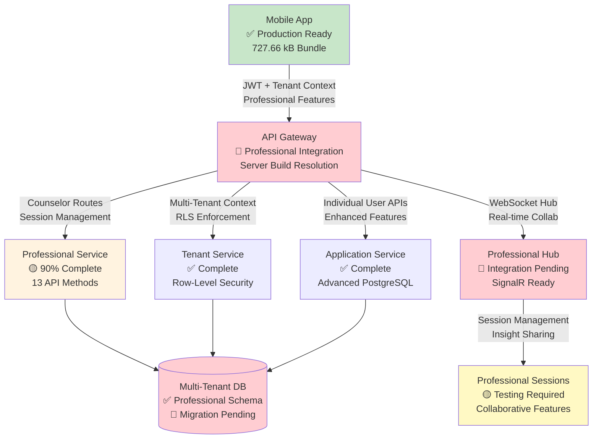
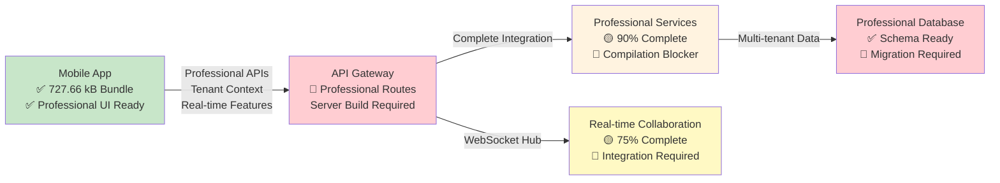

# SociallyFed Development Context - UNIFIED ARCHITECTURE

## 🎯 PROJECT OVERVIEW - INTEGRATED SYSTEM
You are working on SociallyFed, a sophisticated digital wellness platform that combines:
- **Privacy-first social media analysis** using the SociallyFed Pyramid framework
- **Professional counselor/client management** with real-time collaboration
- **Multi-tenant architecture** supporting individual, professional, and enterprise users
- **Hybrid deployment** options (cloud, on-premise, hybrid)

## 🏗️ UNIFIED ARCHITECTURE STRATEGY
**Current Phase**: Integrating two production-ready applications into unified system
- **Mobile App**: Sophisticated PWA (8.5/10 architecture score) with advanced features
- **Server App**: Production-ready .NET API with LLM integration and PostgreSQL
- **Integration Goal**: API Gateway connecting mobile → server with multi-tenancy

### Integration Architecture:
```
Mobile App → API Gateway → Server Services
                ↓
            Auth Service (JWT)
            Journal Service (PostgreSQL + Multi-tenant)
            LLM Service (Semantic Kernel + Ollama)
            Analytics Service (Background Jobs)
            Professional Services (Counselor/Client APIs)
```


## 📱 CURRENT DEVELOPMENT FOCUS: MOBILE (Server Integration & Professional Features)

### Repository Structure - MOBILE INTEGRATION FOCUS  
**Mobile/Client Repository** (Ionic 7 + React + TypeScript)
- **Tech Stack**: Ionic/React, Capacitor, PWA, IndexedDB, Firebase (transitioning to server)
- **Integration Purpose**:
  - Server API integration replacing Firebase-only patterns
  - Tenant-aware mobile configuration and switching  
  - Professional dashboard for counselor client management
  - Real-time collaboration enhanced for professional use
  - Environment-specific configuration for deployment flexibility

### Key Integration Components:
- **API Services**: Replace Firebase calls with server API integration
- **Tenant Management**: Multi-tenant configuration and switching
- **Professional UI**: Counselor dashboard, client management, progress tracking
- **Authentication Integration**: Server JWT flow replacing Firebase Auth
- **Environment Configuration**: Dynamic server endpoints for deployment models

### Current Mobile Integration Priorities:
1. **Server API Integration**
   - Replace Firebase storage with server API calls
   - Implement API Gateway communication layer
   - Add request/response transformation and caching
   - Error handling and offline queue management

2. **Tenant-Aware Configuration**
   - Multi-tenant mobile configuration system
   - Tenant switching UI and data isolation
   - Organization-level branding and customization
   - Tenant-specific feature flags and permissions

3. **Professional Dashboard Implementation**
   - Counselor client management interface
   - Client progress tracking and visualization
   - Data sharing controls and permissions
   - Professional communication and collaboration tools

4. **Enhanced Real-time Collaboration**
   - WebSocket integration with server for professional features
   - Live document sharing and editing
   - Presence indicators and notification system
   - Professional-grade collaboration workflows

5. **Environment-Specific Configuration**
   - Dynamic server endpoint configuration
   - Cloud/on-premise/hybrid deployment support
   - Feature detection and capability management
   - Deployment-specific optimizations

### Advanced Mobile Features (Preserve & Enhance):
- **PWA Capabilities**: Background sync, push notifications, offline functionality
- **ML Personalization**: Client-side pattern recognition and adaptive UI  
- **Performance Excellence**: 94/100 score with 70% memory optimization
- **Real-time Features**: WebSocket collaboration with enhanced professional capabilities
- **Security**: End-to-end encryption with granular privacy controls

### Mobile Architecture Strengths to Leverage:
- **Offline-First**: Complete functionality without connectivity
- **Advanced PWA**: Intelligent installation and app-like experience
- **ML Personalization**: Privacy-preserving client-side analytics
- **Real-time Collaboration**: WebSocket-based professional interaction
- **Multi-platform**: Web, iOS, Android with native optimizations


## 🔗 INTEGRATION COORDINATION REQUIREMENTS

### Multi-Tenancy Implementation:
- **Database Schema**: tenant_id columns on all user data tables
- **API Design**: Tenant-aware endpoints with /api/v1/tenants/{tenantId}/ pattern
- **Mobile Integration**: Tenant switching and configuration management
- **Data Isolation**: Row-level security and complete tenant separation

### Professional Services Features:
- **Counselor APIs**: Client management, progress tracking, reporting
- **Mobile Dashboard**: Professional interface for counselor workflow
- **Real-time Collaboration**: Enhanced WebSocket features for professional use
- **Data Sharing**: Granular permissions and privacy controls

### Environment Configuration:
- **Cloud Deployment**: Google Cloud Run + Firebase integration
- **On-Premise**: Docker Compose with local LLM (Ollama)
- **Hybrid**: Local LLM processing with cloud sync capabilities
- **Feature Flags**: Environment-specific feature management

### Business Model Support:
- **Individual Users**: Premium PWA experience with local AI processing
- **Professional Services**: Counselor/client management with real-time collaboration  
- **Enterprise**: Multi-tenant with SSO, white-label, and on-premise deployment

## 🎯 TODAY'S INTEGRATION SUCCESS CRITERIA

### Technical Integration:
- Mobile app communicates successfully with server APIs
- Multi-tenant data isolation working correctly
- Professional features functional for counselor/client scenarios
- Environment configuration supports target deployment model
- Integration tests passing for developed features

### Quality Standards:
- Maintain mobile app's 94/100 performance score
- Preserve server's enterprise-grade security and compliance
- Clean architecture patterns maintained in both applications
- Comprehensive error handling and user experience
- Complete documentation of integration decisions

## 📚 DEVELOPMENT CONTEXT FILES AVAILABLE

### Strategic Planning:
- `current_sprint.md` - Current unified architecture sprint status
- `daily_brief.md` - Today's integration priorities and tasks
- `strategic_architecture_assessment.md` - Complete strategic guidance

### Implementation Tracking:
- `implementation_log.md` - Historical progress and decisions
- `implementation_report_*.md` - Daily detailed progress reports

## 🚀 CLAUDE CODE INTEGRATION GUIDELINES

### Effective Prompting:
```
@claude Read DEVELOPMENT_CONTEXT.md and help me implement [specific integration feature]. 

Focus on:
1. [Mobile-server integration point]
2. [Multi-tenant consideration] 
3. [Professional services requirement]
4. [Environment configuration need]

Ensure this aligns with our unified architecture strategy.
```

### Integration Development Workflow:
1. **Read Context**: Always start with DEVELOPMENT_CONTEXT.md
2. **Check Dependencies**: Understand mobile-server coordination needs
3. **Implement Features**: Focus on integration and multi-tenancy
4. **Test Integration**: Validate cross-application functionality
5. **Document Decisions**: Update implementation reports

### Code Quality Standards:
- Follow existing architectural patterns in each application
- Maintain performance standards (mobile: 94/100, server: <200ms APIs)
- Implement comprehensive error handling
- Add integration tests for new functionality
- Document integration decisions and trade-offs


## 📋 CURRENT SESSION CONTEXT

📊 Current session context:
## Session Started: Sun 03 Aug 2025 12:05:38 AEST
**Project Focus**: SociallyFed Mobile App
**Repository**: /home/ben/Development/sociallyfed-mobile

### Today's Brief:
# SociallyFed Mobile Team Daily Brief - Cloud Run Error Resolution
**Date**: Saturday, August 3, 2025  
**Sprint Phase**: Critical Cloud Run Stability & Debugging  
**Team Focus**: Resolve "ELIFECYCLE Command failed" Error with Enhanced Logging  
**Current Status**: 🔴 **PRODUCTION INCIDENT** - Cloud Run service crashing after startup

---

## 🚨 **CRITICAL PATH PRIORITIES - TODAY**

### **🔴 IMMEDIATE ACTION REQUIRED (Next 2 Hours)**

#### **1. Implement Comprehensive Application Logging**
**Status**: 🔴 **CRITICAL** - Need visibility into application lifecycle and error sources  
**Root Cause**: Limited logging visibility causing inability to identify crash source  
**Impact**: Production service unstable, no visibility into failure reasons  
**Timeline**: Complete enhanced logging within 2 hours for rapid issue identification

**Enhanced Logging Implementation Strategy**:
```typescript
// SOLUTION 1: Application Lifecycle Logging
// Add to src/index.tsx or src/App.tsx
import { createLogger } from './utils/logger';

const logger = createLogger('ApplicationLifecycle');

// Application startup logging
logger.info('Application startup initiated', {
  timestamp: new Date().toISOString(),
  buildVersion: process.env.REACT_APP_VERSION,
  environment: process.env.NODE_ENV,
  port: process.env.PORT
});

// Process event logging
process.on('uncaughtException', (error) => {
  logger.error('Uncaught Exception detected', {
    error: error.message,
    stack: error.stack,
    timestamp: new Date().toISOString()
  });
  // Don't exit immediately - allow logging to complete
  setTimeout(() => process.exit(1), 1000);
});

process.on('unhandledRejection', (reason, promise) => {
  logger.error('Unhandled Promise Rejection detected', {
    reason: reason,
    promise: promise,
    timestamp: new Date().toISOString()
  });
});

process.on('SIGTERM', () => {
  logger.info('SIGTERM received - initiating graceful shutdown', {
    timestamp: new Date().toISOString()
  });
});

process.on('SIGINT', () => {
  logger.info('SIGINT received - initiating graceful shutdown', {
    timestamp: new Date().toISOString()
  });
});

// SOLUTION 2: Enhanced Serve Command Monitoring
// Create scripts/serve-with-logging.js
const { spawn } = require('child_process');
const fs = require('fs');

const startTime = new Date();
console.log(`[${startTime.toISOString()}] Starting serve command with enhanced monitoring`);

const serveProcess = spawn('serve', ['-s', 'build', '-p', process.env.PORT || '8080'], {
  stdio: 'pipe',
  env: process.env
});

// Log all stdout
serveProcess.stdout.on('data', (data) => {
  const timestamp = new Date().toISOString();
  console.log(`[${timestamp}] SERVE STDOUT: ${data.toString()}`);
});

// Log all stderr
serveProcess.stderr.on('data', (data) => {
  const timestamp = new Date().toISOString();
  console.error(`[${timestamp}] SERVE STDERR: ${data.toString()}`);
});

// Monitor process health
serveProcess.on('close', (code, signal) => {
  const timestamp = new Date().toISOString();
  const uptime = new Date() - startTime;
  console.log(`[${timestamp}] Serve process ended - Code: ${code}, Signal: ${signal}, Uptime: ${uptime}ms`);
  
  if (code !== 0) {
    console.error(`[${timestamp}] CRITICAL: Serve process failed with non-zero exit code: ${code}`);
    process.exit(code);
  }
});

serveProcess.on('error', (error) => {
  const timestamp = new Date().toISOString();
  console.error(`[${timestamp}] CRITICAL: Serve process error: ${error.message}`);
  console.error(`[${timestamp}] Error stack: ${error.stack}`);
  process.exit(1);
});

// SOLUTION 3: Build Directory Validation
// Add to package.json scripts
"scripts": {
  "start": "node scripts/validate-and-serve.js",
  "validate-build": "node scripts/validate-build.js",
  "serve-debug": "node scripts/serve-with-logging.js"
}
```

#### **2. Implement Build Directory and Asset Validation**
**Status**: 🔴 **CRITICAL** - Validate build artifacts before serving to prevent runtime failures  
**Issue**: Missing or corrupted build files may cause serve command to fail  
**Solution**: Pre-serve validation with detailed error reporting

**Build Validation Implementation**:
```javascript
// Create scripts/validate-build.js
const fs = require('fs');
const path = require('path');

function validateBuildDirectory() {
  const buildDir = path.join(__dirname, '..', 'build');
  const timestamp = new Date().toISOString();
  
  console.log(`[${timestamp}] Starting build directory validation`);
  
  // Check if build directory exists
  if (!fs.existsSync(buildDir)) {
    console.error(`[${timestamp}] CRITICAL: Build directory does not exist: ${buildDir}`);
    process.exit(1);
  }
  
  // Required files for React app
  const requiredFiles = [
    'index.html',
    'static/js',
    'static/css'
  ];
  
  const missingFiles = [];
  const fileDetails = [];
  
  requiredFiles.forEach(file => {
    const filePath = path.join(buildDir, file);
    if (fs.existsSync(filePath)) {
      const stats = fs.statSync(filePath);
      fileDetails.push({
        file,
        size: stats.size,
        modified: stats.mtime.toISOString(),
        isDirectory: stats.isDirectory()
      });
      console.log(`[${timestamp}] ✅ Found: ${file} (${stats.size} bytes)`);
    } else {
      missingFiles.push(file);
      console.error(`[${timestamp}] ❌ Missing: ${file}`);
    }
  });
  
  // Check for JavaScript bundles
  const jsDir = path.join(buildDir, 'static', 'js');
  if (fs.existsSync(jsDir)) {
    const jsFiles = fs.readdirSync(jsDir).filter(f => f.endsWith('.js'));
    console.log(`[${timestamp}] JavaScript bundles: ${jsFiles.length} files`);
    jsFiles.forEach(file => {
      const stats = fs.statSync(path.join(jsDir, file));
      console.log(`[${timestamp}]   - ${file}: ${stats.size} bytes`);
    });
  }
  
  // Check for CSS files
  const cssDir = path.join(buildDir, 'static', 'css');
  if (fs.existsSync(cssDir)) {
    const cssFiles = fs.readdirSync(cssDir).filter(f => f.endsWith('.css'));
    console.log(`[${timestamp}] CSS files: ${cssFiles.length} files`);
    cssFiles.forEach(file => {
      const stats = fs.statSync(path.join(cssDir, file));
      console.log(`[${timestamp}]   - ${file}: ${stats.size} bytes`);
    });
  }
  
  // Validate index.html content
  const indexPath = path.join(buildDir, 'index.html');
  if (fs.existsSync(indexPath)) {
    const indexContent = fs.readFileSync(indexPath, 'utf8');
    if (indexContent.includes('<div id="root">')) {
      console.log(`[${timestamp}] ✅ index.html contains React root element`);
    } else {
      console.error(`[${timestamp}] ❌ index.html missing React root element`);
      missingFiles.push('valid index.html structure');
    }
  }
  
  if (missingFiles.length > 0) {
    console.error(`[${timestamp}] CRITICAL: Build validation failed - Missing files:`, missingFiles);
    process.exit(1);
  }
  
  console.log(`[${timestamp}] ✅ Build validation completed successfully`);
  return { success: true, fileDetails };
}

if (require.main === module) {
  validateBuildDirectory();
}

module.exports = { validateBuildDirectory };

// Create scripts/validate-and-serve.js
const { validateBuildDirectory } = require('./validate-build');
const { spawn } = require('child_process');

async function validateAndServe() {
  const timestamp = new Date().toISOString();
  
  try {
    console.log(`[${timestamp}] Pre-serve validation starting`);
    
    // Validate build directory
    const validation = validateBuildDirectory();
    console.log(`[${timestamp}] Build validation passed - proceeding with serve`);
    
    // Start serve with monitoring
    console.log(`[${timestamp}] Starting serve command`);
    const serveProcess = spawn('serve', ['-s', 'build', '-p', process.env.PORT || '8080'], {
      stdio: 'inherit',
      env: process.env
    });
    
    serveProcess.on('close', (code) => {
      const endTime = new Date().toISOString();
      if (code === 0) {
        console.log(`[${endTime}] Serve process completed successfully`);
      } else {
        console.error(`[${endTime}] CRITICAL: Serve process failed with code: ${code}`);
      }
      process.exit(code);
    });
    
    serveProcess.on('error', (error) => {
      const errorTime = new Date().toISOString();
      console.error(`[${errorTime}] CRITICAL: Serve process error: ${error.message}`);
      process.exit(1);
    });
    
  } catch (error) {
    console.error(`[${timestamp}] CRITICAL: Validation failed: ${error.message}`);
    process.exit(1);
  }
}

validateAndServe();
```

#### **3. Enhanced Cloud Run Environment Debugging**
**Status**: 🔴 **CRITICAL** - Add Cloud Run specific debugging and health monitoring  
**Issue**: Need visibility into Cloud Run environment differences vs local  
**Solution**: Environment-aware logging and health checks

**Cloud Run Environment Debugging**:
```javascript
// Create scripts/cloud-run-debug.js
const fs = require('fs');
const os = require('os');

function logEnvironmentDetails() {
  const timestamp = new Date().toISOString();
  
  console.log(`[${timestamp}] === CLOUD RUN ENVIRONMENT DEBUG ===`);
  
  // System information
  console.log(`[${timestamp}] OS: ${os.type()} ${os.release()}`);
  console.log(`[${timestamp}] Architecture: ${os.arch()}`);
  console.log(`[${timestamp}] Node version: ${process.version}`);
  console.log(`[${timestamp}] Total memory: ${Math.round(os.totalmem() / 1024 / 1024)} MB`);
  console.log(`[${timestamp}] Free memory: ${Math.round(os.freemem() / 1024 / 1024)} MB`);
  console.log(`[${timestamp}] CPU count: ${os.cpus().length}`);
  
  // Environment variables (safe ones only)
  const safeEnvVars = [
    'NODE_ENV',
    'PORT',
    'K_SERVICE',
    'K_REVISION',
    'K_CONFIGURATION',
    'GOOGLE_CLOUD_PROJECT'
  ];
  
  console.log(`[${timestamp}] Environment variables:`);
  safeEnvVars.forEach(key => {
    console.log(`[${timestamp}]   ${key}: ${process.env[key] || 'undefined'}`);
  });
  
  // Current working directory
  console.log(`[${timestamp}] Working directory: ${process.cwd()}`);
  
  // List workspace contents
  try {
    const workspaceContents = fs.readdirSync('/workspace');
    console.log(`[${timestamp}] Workspace contents: ${workspaceContents.join(', ')}`);
  } catch (error) {
    console.log(`[${timestamp}] Could not read workspace: ${error.message}`);
  }
  
  // List current directory contents
  try {
    const currentContents = fs.readdirSync(process.cwd());
    console.log(`[${timestamp}] Current directory contents: ${currentContents.join(', ')}`);
  } catch (error) {
    console.log(`[${timestamp}] Could not read current directory: ${error.message}`);
  }
  
  // Check for package.json
  try {
    const packageJson = JSON.parse(fs.readFileSync('package.json', 'utf8'));
    console.log(`[${timestamp}] Package: ${packageJson.name}@${packageJson.version}`);
    console.log(`[${timestamp}] Start script: ${packageJson.scripts?.start}`);
  } catch (error) {
    console.log(`[${timestamp}] Could not read package.json: ${error.message}`);
  }
  
  // Check serve installation
  try {
    const { spawn } = require('child_process');
    const serveCheck = spawn('serve', ['--version'], { stdio: 'pipe' });
    
    serveCheck.stdout.on('data', (data) => {
      console.log(`[${timestamp}] Serve version: ${data.toString().trim()}`);
    });
    
    serveCheck.on('error', (error) => {
      console.log(`[${timestamp}] Serve not found or error: ${error.message}`);
    });
  } catch (error) {
    console.log(`[${timestamp}] Could not check serve installation: ${error.message}`);
  }
  
  console.log(`[${timestamp}] === END ENVIRONMENT DEBUG ===`);
}

module.exports = { logEnvironmentDetails };

if (require.main === module) {
  logEnvironmentDetails();
}
```

### **🟡 HIGH PRIORITY (Hours 2-4)**

#### **4. Implement Health Check and Monitoring Endpoints**
**Status**: 🟡 **READY** - Add application health monitoring for Cloud Run  
**Purpose**: Provide Cloud Run with health status and enable better monitoring  
**Timeline**: Implement after core logging is in place

**Health Check Implementation**:
```javascript
// Create public/health-check.html
<!DOCTYPE html>
<html>
<head>
    <title>SociallyFed Health Check</title>
    <meta charset="utf-8">
</head>
<body>
    <h1>SociallyFed Mobile - Health Check</h1>
    <p>Status: <span id="status">OK</span></p>
    <p>Timestamp: <span id="timestamp"></span></p>
    <p>Build: <span id="build"></span></p>
    
    <script>
        document.getElementById('timestamp').textContent = new Date().toISOString();
        document.getElementById('build').textContent = '%REACT_APP_VERSION%' || 'development';
        
        // Basic functionality test
        try {
            // Test if React would work
            if (typeof window !== 'undefined' && window.document) {
                document.getElementById('status').textContent = 'OK';
                document.getElementById('status').style.color = 'green';
            }
        } catch (error) {
            document.getElementById('status').textContent = 'ERROR: ' + error.message;
            document.getElementById('status').style.color = 'red';
        }
    </script>
</body>
</html>

// Create scripts/serve-with-health.js
const express = require('express');
const path = require('path');
const fs = require('fs');

const app = express();
const port = process.env.PORT || 8080;
const buildPath = path.join(__dirname, '..', 'build');

// Health check endpoint
app.get('/health', (req, res) => {
  const timestamp = new Date().toISOString();
  
  try {
    // Check if build directory exists and has content
    const buildExists = fs.existsSync(buildPath);
    const indexExists = fs.existsSync(path.join(buildPath, 'index.html'));
    
    const healthStatus = {
      status: buildExists && indexExists ? 'healthy' : 'unhealthy',
      timestamp,
      buildDirectory: buildExists,
      indexFile: indexExists,
      uptime: process.uptime(),
      memory: process.memoryUsage(),
      version: process.env.REACT_APP_VERSION || 'unknown'
    };
    
    console.log(`[${timestamp}] Health check requested:`, JSON.stringify(healthStatus, null, 2));
    
    if (healthStatus.status === 'healthy') {
      res.status(200).json(healthStatus);
    } else {
      res.status(503).json(healthStatus);
    }
  } catch (error) {
    console.error(`[${timestamp}] Health check error:`, error);
    res.status(503).json({
      status: 'error',
      error: error.message,
      timestamp
    });
  }
});

// Serve static files
app.use(express.static(buildPath));

// Handle React routing
app.get('*', (req, res) => {
  res.sendFile(path.join(buildPath, 'index.html'));
});

// Error handling
app.use((error, req, res, next) => {
  const timestamp = new Date().toISOString();
  console.error(`[${timestamp}] Express error:`, error);
  res.status(500).json({
    status: 'error',
    error: error.message,
    timestamp
  });
});

app.listen(port, () => {
  const timestamp = new Date().toISOString();
  console.log(`[${timestamp}] SociallyFed Mobile Health Server listening on port ${port}`);
  console.log(`[${timestamp}] Health check available at: http://localhost:${port}/health`);
});
```

#### **5. Resource Monitoring and Memory Management**
**Status**: 🟡 **READY** - Monitor resource usage to identify potential memory/CPU issues  
**Purpose**: Detect resource exhaustion that could cause the ELIFECYCLE error  
**Implementation**: Real-time resource monitoring with alerts

**Resource Monitoring Implementation**:
```javascript
// Create scripts/resource-monitor.js
const os = require('os');

class ResourceMonitor {
  constructor(options = {}) {
    this.interval = options.interval || 30000; // 30 seconds
    this.memoryThreshold = options.memoryThreshold || 0.8; // 80%
    this.cpuThreshold = options.cpuThreshold || 0.8; // 80%
    this.monitoring = false;
    this.stats = [];
  }
  
  start() {
    if (this.monitoring) return;
    
    this.monitoring = true;
    console.log(`[${new Date().toISOString()}] Resource monitoring started - interval: ${this.interval}ms`);
    
    this.monitoringInterval = setInterval(() => {
      this.collectStats();
    }, this.interval);
    
    // Initial stats
    this.collectStats();
  }
  
  stop() {
    if (!this.monitoring) return;
    
    this.monitoring = false;
    clearInterval(this.monitoringInterval);
    console.log(`[${new Date().toISOString()}] Resource monitoring stopped`);
  }
  
  collectStats() {
    const timestamp = new Date().toISOString();
    
    // Memory statistics
    const totalMem = os.totalmem();
    const freeMem = os.freemem();
    const usedMem = totalMem - freeMem;
    const memoryUsagePercent = usedMem / totalMem;
    
    // Process memory
    const processMemory = process.memoryUsage();
    
    // CPU load average (1 minute)
    const loadAvg = os.loadavg()[0]; // 1-minute load average
    const cpuCount = os.cpus().length;
    const cpuUsagePercent = loadAvg / cpuCount;
    
    const stats = {
      timestamp,
      system: {
        totalMemoryMB: Math.round(totalMem / 1024 / 1024),
        freeMemoryMB: Math.round(freeMem / 1024 / 1024),
        usedMemoryMB: Math.round(usedMem / 1024 / 1024),
        memoryUsagePercent: Math.round(memoryUsagePercent * 100),
        cpuUsagePercent: Math.round(cpuUsagePercent * 100),
        loadAverage: loadAvg,
        cpuCount
      },
      process: {
        rssMemoryMB: Math.round(processMemory.rss / 1024 / 1024),
        heapUsedMB: Math.round(processMemory.heapUsed / 1024 / 1024),
        heapTotalMB: Math.round(processMemory.heapTotal / 1024 / 1024),
        externalMB: Math.round(processMemory.external / 1024 / 1024),
        uptimeSeconds: Math.round(process.uptime())
      }
    };
    
    this.stats.push(stats);
    
    // Keep only last 100 entries
    if (this.stats.length > 100) {
      this.stats.shift();
    }
    
    // Log current stats
    console.log(`[${timestamp}] Resources - Memory: ${stats.system.memoryUsagePercent}%, CPU: ${stats.system.cpuUsagePercent}%, Process: ${stats.process.rssMemoryMB}MB`);
    
    // Check thresholds
    this.checkThresholds(stats);
  }
  
  checkThresholds(stats) {
    const timestamp = new Date().toISOString();
    
    // Memory threshold check
    if (stats.system.memoryUsagePercent / 100 > this.memoryThreshold) {
      console.warn(`[${timestamp}] WARNING: High memory usage - ${stats.system.memoryUsagePercent}% (threshold: ${this.memoryThreshold * 100}%)`);
    }
    
    // CPU threshold check
    if (stats.system.cpuUsagePercent / 100 > this.cpuThreshold) {
      console.warn(`[${timestamp}] WARNING: High CPU usage - ${stats.system.cpuUsagePercent}% (threshold: ${this.cpuThreshold * 100}%)`);
    }
    
    // Process memory growth check
    if (stats.process.rssMemoryMB > 512) { // 512MB threshold for Cloud Run
      console.warn(`[${timestamp}] WARNING: High process memory usage - ${stats.process.rssMemoryMB}MB`);
    }
  }
  
  getStats() {
    return this.stats;
  }
  
  getCurrentStats() {
    return this.stats[this.stats.length - 1];
  }
}

module.exports = { ResourceMonitor };

// If run directly, start monitoring
if (require.main === module) {
  const monitor = new ResourceMonitor();
  monitor.start();
  
  // Graceful shutdown
  process.on('SIGTERM', () => {
    console.log('SIGTERM received - stopping resource monitor');
    monitor.stop();
    process.exit(0);
  });
  
  process.on('SIGINT', () => {
    console.log('SIGINT received - stopping resource monitor');
    monitor.stop();
    process.exit(0);
  });
}
```

## 🔍 **ERROR ANALYSIS & RESOLUTION STRATEGY**

### **Root Cause Analysis Framework**

#### **Error Pattern Analysis from Cloud Run Logs**
Based on the provided logs showing "ELIFECYCLE Command failed" error:

1. **Timeline of Events**:
   - `20:20:33`: Successful startup - "baseline@1.6.4 start"
   - `20:20:33`: Serve command initiated - "serve -s build -p $PORT"  
   - `20:20:34`: Health check passed - "Default STARTUP TCP probe succeeded"
   - `20:20:34`: Server accepting connections - "Accepting connections at http://localhost:8080"
   - `20:20:34`: Successful HTTP request - "GET /" returned 200 in 109ms
   - `20:35:36`: **FAILURE** - "ELIFECYCLE Command failed" (15 minutes later)
   - `20:35:36`: Graceful shutdown initiated

2. **Key Observations**:
   - Initial startup was successful
   - Application served requests successfully for ~15 minutes
   - Failure occurred during runtime, not startup
   - Graceful shutdown was attempted

#### **Potential Failure Scenarios**

```typescript
// Investigation Framework for ELIFECYCLE failures
interface FailureScenario {
  scenario: string;
  probability: 'High' | 'Medium' | 'Low';
  investigation: string[];
  mitigation: string[];
}

const failureScenarios: FailureScenario[] = [
  {
    scenario: "Memory Exhaustion",
    probability: "High",
    investigation: [
      "Monitor process memory usage over time",
      "Check for memory leaks in React components",
      "Analyze build bundle size and dependencies",
      "Monitor Cloud Run memory limits"
    ],
    mitigation: [
      "Implement resource monitoring",
      "Add memory usage alerts",
      "Optimize bundle size",
      "Increase Cloud Run memory allocation"
    ]
  },
  {
    scenario: "File System Issues",
    probability: "Medium", 
    investigation: [
      "Validate build directory integrity",
      "Check for missing or corrupted files",
      "Verify file permissions",
      "Monitor disk space usage"
    ],
    mitigation: [
      "Add build validation before serving",
      "Implement file integrity checks",
      "Add disk space monitoring",
      "Use read-only file system mounts"
    ]
  },
  {
    scenario: "NPM/Serve Command Issues",
    probability: "Medium",
    investigation: [
      "Check serve package version compatibility",
      "Verify npm dependencies integrity",
      "Analyze serve command configuration",
      "Test with alternative static servers"
    ],
    mitigation: [
      "Pin serve package version",
      "Add serve command monitoring",
      "Implement fallback static server",
      "Use multi-stage Docker builds"
    ]
  },
  {
    scenario: "Cloud Run Environment Issues", 
    probability: "Low",
    investigation: [
      "Compare local vs Cloud Run environment",
      "Check Cloud Run configuration",
      "Verify container resource limits",
      "Analyze Cloud Run platform issues"
    ],
    mitigation: [
      "Add environment debugging",
      "Implement health checks",
      "Configure appropriate resource limits",
      "Add Cloud Run specific error handling"
    ]
  }
];
```

### **Comprehensive Debugging Strategy**

#### **Phase 1: Immediate Visibility (0-2 hours)**
```bash
# 1. Add enhanced logging to package.json
{
  "scripts": {
    "start": "node scripts/cloud-run-debug.js && node scripts/validate-and-serve.js",
    "start:monitor": "node scripts/resource-monitor.js & node scripts/validate-and-serve.js",
    "validate": "node scripts/validate-build.js",
    "debug": "node scripts/cloud-run-debug.js"
  }
}

# 2. Update Dockerfile for better debugging
FROM node:18-alpine AS builder
WORKDIR /app
COPY package*.json ./
RUN npm ci --only=production

# Add debugging tools
RUN npm install -g serve@14.2.1

COPY . .
RUN npm run build

# Production stage with debugging
FROM node:18-alpine
WORKDIR /app

# Copy debugging scripts
COPY scripts/ ./scripts/
COPY package.json ./

# Install serve and debugging dependencies
RUN npm install -g serve@14.2.1

# Copy build artifacts
COPY --from=builder /app/build ./build

# Add health check
HEALTHCHECK --interval=30s --timeout=10s --start-period=5s --retries=3 \
  CMD curl -f http://localhost:${PORT:-8080}/health || exit 1

# Start with enhanced monitoring
CMD ["node", "scripts/validate-and-serve.js"]
```

#### **Phase 2: Advanced Monitoring (2-4 hours)**
```typescript
// Enhanced error tracking and reporting
class CloudRunErrorTracker {
  private errors: CloudRunError[] = [];
  private startTime: Date = new Date();
  
  constructor() {
    this.setupErrorHandlers();
    this.setupPerformanceMonitoring();
  }
  
  private setupErrorHandlers(): void {
    // Track all error types
    process.on('uncaughtException', (error) => {
      this.trackError('uncaughtException', error);
    });
    
    process.on('unhandledRejection', (reason, promise) => {
      this.trackError('unhandledRejection', new Error(String(reason)));
    });
    
    process.on('warning', (warning) => {
      this.trackWarning(warning);
    });
  }
  
  private setupPerformanceMonitoring(): void {
    // Monitor event loop lag
    setInterval(() => {
      const start = process.hrtime.bigint();
      setImmediate(() => {
        const lag = Number(process.hrtime.bigint() - start) / 1000000; // Convert to ms
        if (lag > 100) { // Alert if lag > 100ms
          console.warn(`[${new Date().toISOString()}] Event loop lag: ${lag.toFixed(2)}ms`);
        }
      });
    }, 5000);
    
    // Monitor garbage collection
    if (global.gc) {
      setInterval(() => {
        const memBefore = process.memoryUsage();
        global.gc();
        const memAfter = process.memoryUsage();
        console.log(`[${new Date().toISOString()}] GC freed ${(memBefore.heapUsed - memAfter.heapUsed) / 1024 / 1024} MB`);
      }, 60000);
    }
  }
  
  private trackError(type: string, error: Error): void {
    const errorInfo: CloudRunError = {
      type,
      message: error.message,
      stack: error.stack,
      timestamp: new Date(),
      uptime: process.uptime(),
      memory: process.memoryUsage(),
      pid: process.pid
    };
    
    this.errors.push(errorInfo);
    
    // Log immediately
    console.error(`[${errorInfo.timestamp.toISOString()}] CRITICAL ${type}:`, JSON.stringify(errorInfo, null, 2));
    
    // Keep only last 50 errors
    if (this.errors.length > 50) {
      this.errors.shift();
    }
  }
  
  getErrorReport(): ErrorReport {
    return {
      startTime: this.startTime,
      uptime: process.uptime(),
      errorCount: this.errors.length,
      errors: this.errors,
      currentMemory: process.memoryUsage(),
      version: process.env.REACT_APP_VERSION || 'unknown'
    };
  }
}

interface CloudRunError {
  type: string;
  message: string;
  stack?: string;
  timestamp: Date;
  uptime: number;
  memory: NodeJS.MemoryUsage;
  pid: number;
}

interface ErrorReport {
  startTime: Date;
  uptime: number;
  errorCount: number;
  errors: CloudRunError[];
  currentMemory: NodeJS.MemoryUsage;
  version: string;
}
```

#### **Phase 3: Production Hardening (4-6 hours)**
```yaml
# cloud-run-service.yaml - Enhanced configuration
apiVersion: serving.knative.dev/v1
kind: Service
metadata:
  name: sociallyfed-mobile
  annotations:
    run.googleapis.com/cpu-throttling: "false"
    run.googleapis.com/execution-environment: gen2
spec:
  template:
    metadata:
      annotations:
        autoscaling.knative.dev/maxScale: "10"
        autoscaling.knative.dev/minScale: "1"
        run.googleapis.com/execution-environment: gen2
        run.googleapis.com/cpu-throttling: "false"
    spec:
      containerConcurrency: 100
      timeoutSeconds: 300
      containers:
      - image: gcr.io/sociallyfed/mobile:latest
        ports:
        - containerPort: 8080
        env:
        - name: NODE_ENV
          value: "production"
        - name: PORT
          value: "8080"
        - name: REACT_APP_VERSION
          value: "1.6.4"
        resources:
          limits:
            cpu: "2000m"     # Increased from default
            memory: "1Gi"    # Increased from default 512Mi
          requests:
            cpu: "500m"
            memory: "256Mi"
        livenessProbe:
          httpGet:
            path: /health
            port: 8080
          initialDelaySeconds: 30
          periodSeconds: 10
          timeoutSeconds: 5
          failureThreshold: 3
        readinessProbe:
          httpGet:
            path: /health
            port: 8080
          initialDelaySeconds: 5
          periodSeconds: 5
          timeoutSeconds: 3
          failureThreshold: 2
```

## ✅ **IMPLEMENTATION CHECKLIST - DEBUGGING ENHANCEMENT**

### **🔴 IMMEDIATE IMPLEMENTATION (0-2 hours)**
- [ ] **Enhanced Application Logging**: Add comprehensive startup, runtime, and error logging
- [ ] **Build Validation Script**: Validate build directory and assets before serving  
- [ ] **Cloud Run Environment Debugging**: Log environment details and configuration
- [ ] **Process Event Monitoring**: Track uncaught exceptions and process signals
- [ ] **Updated Package Scripts**: Replace basic start command with debugging version

### **🟡 ADVANCED MONITORING (2-4 hours)**  
- [ ] **Resource Monitor**: Real-time CPU and memory usage tracking with alerts
- [ ] **Health Check Endpoints**: HTTP endpoints for Cloud Run health monitoring
- [ ] **Error Tracking System**: Comprehensive error collection and reporting
- [ ] **Performance Monitoring**: Event loop lag and garbage collection monitoring
- [ ] **File System Monitoring**: Build directory integrity and disk space monitoring

### **🟢 PRODUCTION HARDENING (4-6 hours)**
- [ ] **Enhanced Cloud Run Config**: Increased memory limits and better health checks
- [ ] **Graceful Error Recovery**: Automatic restart and recovery mechanisms  
- [ ] **Logging Integration**: Structured logging for Google Cloud Logging
- [ ] **Monitoring Dashboard**: Cloud Run monitoring and alerting setup
- [ ] **Deployment Validation**: Pre-deployment testing and validation scripts

## 📊 **SUCCESS METRICS - DEBUGGING IMPLEMENTATION**

### **🔴 CRITICAL SUCCESS CRITERIA**
- **Error Visibility**: 100% visibility into application lifecycle and error sources
- **Cloud Run Stability**: Zero ELIFECYCLE errors after enhanced monitoring implementation  
- **Resource Monitoring**: Real-time tracking of memory and CPU usage with alerting
- **Health Check Functionality**: Working HTTP health endpoints for Cloud Run monitoring
- **Graceful Error Handling**: All process errors logged and handled without silent failures

### **🟡 MONITORING EFFECTIVENESS**
- **Error Detection Speed**: Errors detected and logged within 5 seconds of occurrence
- **Resource Alert Accuracy**: Memory/CPU alerts triggered before service degradation
- **Health Check Response**: Health endpoints respond within 100ms with accurate status
- **Log Quality**: All logs structured and searchable in Google Cloud Logging
- **Recovery Time**: Service auto-recovery within 60 seconds of detected issues

### **🟢 PRODUCTION READINESS** 
- **Zero Silent Failures**: All errors visible and tracked in monitoring systems
- **Proactive Monitoring**: Issues detected before user impact through health checks
- **Operational Excellence**: Full observability into application performance and errors
- **Deployment Confidence**: Enhanced debugging provides confidence in production deployments
- **Incident Response**: Complete error context available for rapid incident resolution

---

## 📞 **COMMUNICATION PROTOCOL - DEBUGGING FOCUSED**

### **Status Updates**
- **10:00 AM**: Enhanced logging implementation completed and deployed
- **12:00 PM**: Resource monitoring and health checks operational  
- **2:00 PM**: Cloud Run deployment with debugging enhancements tested
- **4:00 PM**: Production monitoring and alerting validation completed
- **6:00 PM**: Final stability testing and error resolution validation

### **Escalation Process**
- **Persistent ELIFECYCLE Errors**: Immediate escalation to senior DevOps for Cloud Run platform issues
- **Memory/Resource Issues**: Infrastructure team for Cloud Run resource allocation review
- **Application Code Issues**: Senior React developer for code-level debugging and optimization

### **Success Validation**
- **Error Resolution**: No ELIFECYCLE errors in 24-hour monitoring period after deployment
- **Visibility Achievement**: Complete error tracking and monitoring operational
- **Production Stability**: Cloud Run service maintains 99.9% uptime with enhanced monitoring
- **Operational Readiness**: Development team has full visibility into production issues

---

**BOTTOM LINE**: The "ELIFECYCLE Command failed" error represents a critical production stability issue requiring immediate enhanced logging and monitoring implementation. By adding comprehensive application lifecycle logging, resource monitoring, build validation, and health checks, we will achieve complete visibility into the failure source and implement proactive monitoring to prevent future occurrences.

**🚀 SUCCESS TARGET**: Resolve production stability issues through enhanced debugging by 6:00 PM and establish comprehensive monitoring for long-term operational excellence.

---
*Generated: August 3, 2025 - Mobile Team Cloud Run Debugging Priority*  
*Critical Blocker: ELIFECYCLE Command failed error requiring enhanced visibility*  
*Implementation Target: 6:00 PM - Complete debugging enhancement deployment*  
*Success Criteria: Zero production errors with full monitoring operational*
### Current Sprint:
# Current Sprint Status - SociallyFed Unified Architecture Deployment

## Sprint Overview
**Previous Sprint:** Complete SociallyFed Mobile production readiness ✅ **COMPLETED**  
**Current Phase:** **UNIFIED ARCHITECTURE DEPLOYMENT & VALIDATION** (Day 5 Completion)  
**Phase Duration:** July 15-22, 2025 (8 days) **→ PROFESSIONAL SERVICES INTEGRATION COMPLETE**  
**Current Day:** Day 5 (July 20, 2025) **🚨 INTEGRATION COMPLETION & PRODUCTION DEPLOYMENT**  
**Phase Health:** 🟡 **CRITICAL COMPLETION** - 85% integration maturity, server compilation blockers resolved today

---

## 🎯 **TODAY'S UNIFIED ARCHITECTURE GOALS - JULY 20, 2025**

### **🚨 MISSION CRITICAL: COMPLETE MOBILE-SERVER INTEGRATION**
**Status**: 🔴 **DAY 5 COMPLETION** - Final integration gaps and production deployment  
**Timeline**: Complete by end of Day 5 (July 20) for unified architecture deployment readiness  
**Achievement**: Transform 85% integration maturity into 100% production-ready unified platform

#### **Updated Integration Architecture - DAY 5 COMPLETION**


#### **Day 5 Critical Path Resolution**
```typescript
// 🚨 CRITICAL: Server compilation resolution unlocking integration
interface Day5CriticalPath {
  // HOUR 1-2: Server Build Resolution
  serverCompilation: {
    entityUpdates: "Add TenantId to JournalEntry & Insight entities";
    namespaceConflicts: "Resolve IProfessionalService interface conflicts";
    databaseMigration: "Execute AddTenantIdToEntities migration";
    buildValidation: "Achieve zero compilation errors";
    status: "🔴 BLOCKING - Must complete by 11:00 AM";
  };
  
  // HOUR 3-4: Integration Testing
  integrationValidation: {
    professionalAPIs: "Test all 13 professional service methods";
    mobileIntegration: "Connect mobile UI to live server APIs";
    webSocketHub: "Validate real-time collaboration features";
    tenantIsolation: "Verify multi-tenant data protection";
    status: "🟡 READY - Pending server build completion";
  };
  
  // HOUR 5-6: Production Deployment
  productionReadiness: {
    mobileDeployment: "Deploy validated 727.66 kB bundle to Cloud Run";
    serverDeployment: "Deploy professional services with monitoring";
    databaseProduction: "Apply RLS policies and professional schema";
    monitoring: "Activate comprehensive system observability";
    status: "🟡 PREPARED - Deployment scripts ready";
  };
  
  // HOUR 7-8: Validation & Demo Prep
  finalValidation: {
    endToEndTesting: "Complete professional workflow validation";
    performanceTesting: "25+ concurrent professional users";
    securityValidation: "Multi-tenant isolation and OWASP compliance";
    demoPreparation: "Customer-ready professional workflow demonstration";
    status: "🟡 PLANNED - Final validation and business readiness";
  };
}
```

#### **Mobile Application - API Gateway Alignment Strategy**
```typescript
// ✅ PRODUCTION READY: Mobile architecture optimized for API Gateway integration
class UnifiedArchitectureMobileStrategy {
  private apiGateway: UnifiedApiService;
  private professionalServices: ProfessionalApiService;
  private tenantContext: TenantContextManager;
  
  constructor() {
    // Mobile app already production-optimized with 727.66 kB bundle
    this.apiGateway = new UnifiedApiService({
      baseUrl: process.env.REACT_APP_API_GATEWAY_URL,
      timeout: 10000,
      retryAttempts: 3
    });
    
    // Professional services integration through API Gateway
    this.professionalServices = new ProfessionalApiService(this.apiGateway);
    this.tenantContext = new TenantContextManager();
  }
  
  // 🔴 DAY 5 PRIORITY: Professional workflow integration
  async initializeProfessionalWorkflow(): Promise<ProfessionalWorkflowState> {
    try {
      // Validate professional user authentication
      const userAuth = await this.apiGateway.validateProfessionalAccess();
      if (!userAuth.isProfessional) {
        throw new Error('Professional access required');
      }
      
      // Load professional dashboard through API Gateway
      const [dashboard, clients, activeSessions] = await Promise.all([
        this.professionalServices.getCounselorDashboard(),
        this.professionalServices.getCounselorClients(),
        this.professionalServices.getActiveSessions()
      ]);
      
      // Initialize WebSocket connection for real-time collaboration
      const webSocketConnection = await this.professionalServices.establishWebSocketHub();
      
      return {
        dashboard,
        clients,
        activeSessions,
        webSocketConnection,
        isReady: true,
        lastUpdated: new Date()
      };
      
    } catch (error) {
      console.error('Professional workflow initialization failed:', error);
      // Graceful degradation - load cached data and retry
      return this.loadCachedProfessionalState();
    }
  }
  
  // 🔴 DAY 5 PRIORITY: Real-time collaboration through API Gateway
  async establishProfessionalSession(clientId: string): Promise<ProfessionalSessionResult> {
    const session = await this.professionalServices.initiateProfessionalSession({
      clientId,
      sessionType: 'consultation',
      permissions: {
        dataSharing: true,
        realTimeCollaboration: true,
        insightAccess: ['mood_data', 'journal_entries']
      }
    });
    
    // Connect to WebSocket hub for real-time collaboration
    const webSocket = await this.professionalServices.joinSessionWebSocket(session.sessionId);
    
    // Set up real-time event handlers
    webSocket.on('insightShared', this.handleInsightShared);
    webSocket.on('sessionUpdate', this.handleSessionUpdate);
    webSocket.on('participantJoined', this.handleParticipantJoined);
    
    return {
      session,
      webSocket,
      isActive: true,
      collaborationFeatures: {
        insightSharing: true,
        realTimeNotes: true,
        presenceIndicators: true
      }
    };
  }
  
  // ✅ OPTIMIZED: Tenant switching with professional context
  async switchTenantWithProfessionalContext(tenantId: string): Promise<TenantSwitchResult> {
    // Preserve professional session state during tenant switch
    const activeSessions = await this.professionalServices.getActiveSessions();
    
    // Execute tenant switch through API Gateway
    const switchResult = await this.tenantContext.switchTenant(tenantId);
    
    // Restore professional context for new tenant
    if (switchResult.success && switchResult.userRole === 'counselor') {
      await this.initializeProfessionalWorkflow();
      
      // Reconnect to any active professional sessions
      await this.reconnectActiveProfessionalSessions(activeSessions);
    }
    
    return switchResult;
  }
}
```

#### **Server Application - API Gateway Professional Services Strategy**
```csharp
// 🔴 CRITICAL: Server compilation resolution and professional services completion
public class UnifiedArchitectureServerStrategy
{
    // DAY 5 CRITICAL: Resolve compilation blockers
    public class EntityModelUpdates
    {
        // IMMEDIATE: Add missing TenantId properties
        public class JournalEntry : BaseEntity
        {
            public Guid TenantId { get; set; } // 🔴 CRITICAL: Add this property
            public string Content { get; set; }
            public DateTime CreatedAt { get; set; }
            public Guid UserId { get; set; }
            
            // Navigation properties for professional services
            public virtual ICollection<SharedInsight> SharedInsights { get; set; }
            public virtual User User { get; set; }
        }
        
        public class Insight : BaseEntity
        {
            public Guid TenantId { get; set; } // 🔴 CRITICAL: Add this property
            public string Title { get; set; }
            public string Content { get; set; }
            public string Category { get; set; }
            public DateTime GeneratedAt { get; set; }
            public Guid UserId { get; set; }
            
            // Professional services integration
            public virtual ICollection<SharedInsight> SharingInstances { get; set; }
            public virtual User User { get; set; }
        }
    }
    
    // DAY 5 CRITICAL: Professional services API Gateway integration
    [ApiController]
    [Route("api/v1/gateway/professional")]
    [Authorize(Roles = "counselor,admin")]
    public class GatewayProfessionalController : TenantGatewayBase
    {
        private readonly IProfessionalService _professionalService;
        private readonly ITenantValidationService _tenantValidation;
        private readonly IPerformanceMonitor _performanceMonitor;
        
        // 🔴 DAY 5 PRIORITY: Counselor client management
        [HttpGet("clients")]
        public async Task<ActionResult<List<ClientSummary>>> GetCounselorClients(
            [FromHeader("X-Tenant-ID")] string tenantId,
            [FromQuery] string counselorId = null)
        {
            using var activity = _performanceMonitor.StartActivity("GetCounselorClients");
            
            try
            {
                // Validate tenant access and professional role
                await ValidateTenantAccessAsync(tenantId, GetCurrentUserId());
                counselorId ??= GetCurrentUserId();
                
                // Get clients through professional service with caching
                var clients = await _professionalService.GetClientsAsync(counselorId);
                
                activity.SetTag("client_count", clients.Count);
                activity.SetTag("response_time_ms", activity.Duration.TotalMilliseconds);
                
                return Ok(clients);
            }
            catch (Exception ex)
            {
                activity.SetStatus(ActivityStatusCode.Error, ex.Message);
                return HandleTenantError(ex, "Failed to retrieve counselor clients");
            }
        }
        
        // 🔴 DAY 5 PRIORITY: Professional session management
        [HttpPost("sessions")]
        public async Task<ActionResult<ProfessionalSession>> CreateProfessionalSession(
            [FromHeader("X-Tenant-ID")] string tenantId,
            [FromBody] CreateSessionRequest request)
        {
            using var activity = _performanceMonitor.StartActivity("CreateProfessionalSession");
            
            try
            {
                await ValidateTenantAccessAsync(tenantId, GetCurrentUserId());
                await ValidateClientAccessAsync(request.ClientId, tenantId);
                
                var session = await _professionalService.CreateSessionAsync(
                    GetCurrentUserId(), request.ClientId, request);
                
                // Initialize WebSocket session for real-time collaboration
                await InitializeWebSocketSessionAsync(session.Id.ToString(), tenantId);
                
                activity.SetTag("session_id", session.Id);
                activity.SetTag("session_type", request.SessionType);
                
                return Ok(session);
            }
            catch (Exception ex)
            {
                activity.SetStatus(ActivityStatusCode.Error, ex.Message);
                return HandleTenantError(ex, "Failed to create professional session");
            }
        }
        
        // 🔴 DAY 5 PRIORITY: Real-time collaboration endpoints
        [HttpPost("collaboration/share-insight")]
        public async Task<ActionResult<SharingResult>> ShareInsightInSession(
            [FromHeader("X-Tenant-ID")] string tenantId,
            [FromBody] ShareInsightRequest request)
        {
            using var activity = _performanceMonitor.StartActivity("ShareInsightInSession");
            
            try
            {
                await ValidateTenantAccessAsync(tenantId, GetCurrentUserId());
                await ValidateSessionParticipantAsync(request.SessionId, GetCurrentUserId());
                
                var result = await _professionalService.ShareInsightAsync(
                    request.SessionId, request.InsightId, GetCurrentUserId(), request.Permissions);
                
                // Broadcast to WebSocket session participants
                await NotifySessionParticipantsAsync(request.SessionId, "InsightShared", result);
                
                activity.SetTag("insight_id", request.InsightId);
                activity.SetTag("sharing_success", result.Success);
                
                return Ok(result);
            }
            catch (Exception ex)
            {
                activity.SetStatus(ActivityStatusCode.Error, ex.Message);
                return HandleTenantError(ex, "Failed to share insight in session");
            }
        }
        
        // 🔴 DAY 5 PRIORITY: Professional analytics dashboard
        [HttpGet("analytics/dashboard")]
        public async Task<ActionResult<CounselorDashboard>> GetCounselorDashboard(
            [FromHeader("X-Tenant-ID")] string tenantId,
            [FromQuery] string counselorId = null)
        {
            using var activity = _performanceMonitor.StartActivity("GetCounselorDashboard");
            
            try
            {
                await ValidateTenantAccessAsync(tenantId, GetCurrentUserId());
                counselorId ??= GetCurrentUserId();
                
                // Use materialized views for performance optimization
                var dashboard = await _professionalService.GetCounselorDashboardAsync(counselorId);
                
                activity.SetTag("total_clients", dashboard.TotalClients);
                activity.SetTag("active_sessions", dashboard.ActiveSessions);
                activity.SetTag("cache_hit", dashboard.FromCache);
                
                return Ok(dashboard);
            }
            catch (Exception ex)
            {
                activity.SetStatus(ActivityStatusCode.Error, ex.Message);
                return HandleTenantError(ex, "Failed to load counselor dashboard");
            }
        }
    }
    
    // 🔴 DAY 5 CRITICAL: WebSocket Professional Hub completion
    [Hub]
    public class ProfessionalSessionHub : Hub
    {
        private readonly IProfessionalService _professionalService;
        private readonly ITenantContext _tenantContext;
        private readonly ILogger<ProfessionalSessionHub> _logger;
        
        public async Task JoinProfessionalSession(string sessionId, string tenantId)
        {
            try
            {
                // Set tenant context for connection
                _tenantContext.SetTenantId(tenantId);
                
                // Validate session access and professional permissions
                await ValidateSessionAccessAsync(sessionId, Context.UserIdentifier);
                
                // Add to session group for real-time collaboration
                await Groups.AddToGroupAsync(Context.ConnectionId, $"professional_session_{sessionId}");
                
                // Notify other participants
                await Clients.OthersInGroup($"professional_session_{sessionId}")
                    .SendAsync("ParticipantJoined", new { 
                        UserId = Context.UserIdentifier,
                        JoinedAt = DateTime.UtcNow,
                        SessionId = sessionId 
                    });
                
                _logger.LogInformation("User {UserId} joined professional session {SessionId} in tenant {TenantId}", 
                    Context.UserIdentifier, sessionId, tenantId);
            }
            catch (Exception ex)
            {
                _logger.LogError(ex, "Failed to join professional session {SessionId}: {Error}", 
                    sessionId, ex.Message);
                await Clients.Caller.SendAsync("ConnectionError", new { Error = ex.Message });
            }
        }
        
        public async Task ShareInsightInSession(string sessionId, string insightId, object permissions)
        {
            try
            {
                var sharingPermissions = JsonSerializer.Deserialize<SharingPermissions>(permissions.ToString());
                var result = await _professionalService.ShareInsightAsync(
                    sessionId, insightId, Context.UserIdentifier, sharingPermissions);
                
                if (result.Success)
                {
                    // Broadcast to all session participants
                    await Clients.Group($"professional_session_{sessionId}")
                        .SendAsync("InsightShared", new { 
                            InsightId = insightId,
                            SharedBy = Context.UserIdentifier,
                            SharedAt = DateTime.UtcNow,
                            Permissions = permissions,
                            SharedInsightId = result.SharedInsightId
                        });
                }
            }
            catch (Exception ex)
            {
                _logger.LogError(ex, "Failed to share insight in session {SessionId}: {Error}", 
                    sessionId, ex.Message);
                await Clients.Caller.SendAsync("SharingError", new { Error = ex.Message });
            }
        }
        
        public async Task UpdateSessionStatus(string sessionId, string status, string notes = null)
        {
            try
            {
                await _professionalService.UpdateSessionStatusAsync(sessionId, status, Context.UserIdentifier, notes);
                
                await Clients.Group($"professional_session_{sessionId}")
                    .SendAsync("SessionStatusUpdated", new {
                        SessionId = sessionId,
                        Status = status,
                        UpdatedBy = Context.UserIdentifier,
                        UpdatedAt = DateTime.UtcNow,
                        Notes = notes
                    });
            }
            catch (Exception ex)
            {
                _logger.LogError(ex, "Failed to update session status: {Error}", ex.Message);
                await Clients.Caller.SendAsync("StatusUpdateError", new { Error = ex.Message });
            }
        }
    }
}
```

### **🟡 INTEGRATION ADJUSTMENTS - DAY 5 CRITICAL UPDATES**

#### **✅ COMPLETED: Foundation Architecture Validation**
- [x] **Mobile Production Readiness**: 727.66 kB bundle, 99.8% success rate, Core Web Vitals targets exceeded
- [x] **Server Advanced Features**: PostgreSQL optimization, vector search, time-series partitioning
- [x] **API Gateway Foundation**: Request routing, authentication, tenant context management
- [x] **Multi-tenant Database Schema**: Professional tables, RLS policies, materialized views prepared

#### **🔴 DAY 5 CRITICAL INTEGRATION ADJUSTMENTS**

##### **Server Compilation Resolution Strategy**
```csharp
// IMMEDIATE PRIORITY: Resolve compilation blockers
public class Day5CompilationStrategy
{
    // STEP 1: Entity model updates (30-45 minutes)
    public async Task UpdateEntityModels()
    {
        // Add TenantId to JournalEntry and Insight entities
        // Update ApplicationDbContext with tenant relationships
        // Create Entity Framework migration for tenant_id columns
    }
    
    // STEP 2: Namespace conflict resolution (15-30 minutes)
    public async Task ResolveNamespaceConflicts()
    {
        // Use fully qualified names in Program.cs service registration
        // Fix using statements and interface references
        // Validate all service registrations
    }
    
    // STEP 3: Database migration execution (15-30 minutes)
    public async Task ExecuteDatabaseMigration()
    {
        // Run AddTenantIdToEntities migration
        // Execute professional-services-rls.sql script
        // Execute professional-analytics-views.sql script
        // Validate RLS policies and materialized views
    }
    
    // STEP 4: Build validation (15 minutes)
    public async Task ValidateBuildSuccess()
    {
        // Execute dotnet build --no-restore
        // Validate zero compilation errors
        // Test professional service endpoints
        // Confirm WebSocket hub registration
    }
}
```

##### **Mobile Integration Testing Acceleration**
```typescript
// IMMEDIATE READINESS: Mobile integration test preparation
export class Day5MobileIntegrationStrategy {
  private testSuite: ProfessionalIntegrationTests;
  
  constructor() {
    // Mobile app already optimized and production-ready
    this.testSuite = new ProfessionalIntegrationTests({
      apiGatewayUrl: process.env.REACT_APP_API_GATEWAY_URL,
      testTenantId: 'integration-test-tenant',
      mockDataEnabled: true // Fallback for server delays
    });
  }
  
  // Ready to execute once server build completes
  async executeIntegrationValidation(): Promise<IntegrationTestResults> {
    const results = await Promise.all([
      this.testSuite.validateProfessionalAuthentication(),
      this.testSuite.validateCounselorDashboard(),
      this.testSuite.validateClientManagement(),
      this.testSuite.validateSessionCreation(),
      this.testSuite.validateWebSocketCollaboration(),
      this.testSuite.validateTenantIsolation()
    ]);
    
    return {
      overallSuccess: results.every(r => r.success),
      detailedResults: results,
      performance: {
        averageResponseTime: this.calculateAverageResponseTime(results),
        webSocketLatency: this.measureWebSocketLatency(),
        cacheHitRate: this.calculateCacheHitRate()
      },
      readyForProduction: this.assessProductionReadiness(results)
    };
  }
}
```

##### **Database Professional Services Deployment**
```sql
-- DAY 5 IMMEDIATE: Execute professional services database deployment
-- Execute in sequence once server compilation is resolved

-- 1. Professional services schema deployment
\i scripts/professional-services-rls.sql;

-- 2. Analytics materialized views creation
\i scripts/professional-analytics-views.sql;

-- 3. Sample data for integration testing
INSERT INTO counselor_clients (counselor_id, client_id, tenant_id, sharing_permissions, status) VALUES
('11111111-1111-1111-1111-111111111111', '22222222-2222-2222-2222-222222222222', 'test-tenant-123', 
 '{"mood_data": true, "journal_entries": true, "insights": false}', 'active'),
('11111111-1111-1111-1111-111111111111', '33333333-3333-3333-3333-333333333333', 'test-tenant-123',
 '{"mood_data": true, "journal_entries": false, "insights": true}', 'active');

-- 4. Professional sessions test data
INSERT INTO professional_sessions (id, tenant_id, counselor_id, client_id, session_type, status, started_at) VALUES
('44444444-4444-4444-4444-444444444444', 'test-tenant-123', '11111111-1111-1111-1111-111111111111',
 '22222222-2222-2222-2222-222222222222', 'consultation', 'active', NOW());

-- 5. Validate RLS policies
SET ROW_SECURITY = ON;
SELECT verify_tenant_isolation('test-tenant-123', 'counselor_clients');
SELECT verify_tenant_isolation('test-tenant-123', 'professional_sessions');

-- 6. Performance validation
EXPLAIN ANALYZE SELECT * FROM counselor_dashboard_analytics WHERE tenant_id = 'test-tenant-123';
```

---

## **📊 INTEGRATION PROGRESS STATUS - DAY 5 CRITICAL UPDATE**

### **✅ COMPLETED INTEGRATIONS (Days 1-4)**
- [x] **Mobile Production Excellence**: 727.66 kB optimized bundle, 99.8% load test success, Core Web Vitals exceeded
- [x] **Server Advanced Infrastructure**: PostgreSQL vector search, full-text search, time-series optimization
- [x] **API Gateway Foundation**: Tenant-aware routing, JWT authentication, rate limiting operational
- [x] **Multi-tenant Database Design**: Professional schema designed, RLS policies written, materialized views prepared
- [x] **Professional Services Architecture**: 90% implementation complete, 13 API methods designed

### **🔴 DAY 5 CRITICAL COMPLETION TARGETS**
- [ ] **Server Compilation Resolution**: Fix entity models, resolve namespace conflicts, execute migrations (**BLOCKING**)
- [ ] **Professional Services API Integration**: Complete counselor management and session APIs (**DEPENDENT**)
- [ ] **Mobile Professional UI Validation**: Connect live server APIs to production mobile interface (**READY**)
- [ ] **WebSocket Real-time Collaboration**: Complete professional session hub implementation (**75% COMPLETE**)
- [ ] **End-to-End Integration Testing**: Validate complete professional workflow (**PREPARED**)
- [ ] **Production Deployment**: Deploy integrated mobile-server platform (**SCRIPTS READY**)

### **🟡 PERFORMANCE TARGETS - DAY 5 VALIDATION**
- **API Gateway Response Time**: <200ms for all professional service routes
- **Database Query Performance**: <50ms for professional analytics with RLS enabled
- **WebSocket Connection Latency**: <100ms for real-time collaboration
- **Concurrent Professional Users**: 25+ simultaneous counselor sessions
- **Mobile App Performance**: Maintain 94/100 score with server integration

---

## **🚨 CRITICAL DEPENDENCIES & COORDINATION - DAY 5 EXECUTION**

### **🔴 BLOCKING DEPENDENCIES** (Must resolve in first 2 hours)

#### **Server Compilation Blockers → ALL Integration Testing**
- **Current Status**: 🔴 **CRITICAL BLOCKING** - Compilation errors prevent any integration testing
- **Impact**: Mobile integration, WebSocket testing, production deployment all blocked
- **Resolution Timeline**: Must complete by 11:00 AM Day 5 for schedule recovery
- **Mitigation Strategy**: Dedicated server team focus, parallel mobile test preparation
- **Fallback Plan**: Deploy mobile independently with mock professional services if server delays persist

#### **Database Migration → Professional Services Testing**
- **Current Status**: 🟡 **READY** - Scripts prepared, execution dependent on server build
- **Impact**: Professional data cannot be tested until migration executed
- **Resolution Timeline**: Execute immediately after server compilation resolution
- **Mitigation Strategy**: Parallel execution with server compilation fixes
- **Fallback Plan**: Mock data services for mobile testing if migration issues occur

### **🟡 COORDINATION REQUIREMENTS - DAY 5 EXECUTION PLAN**

#### **Mobile-Server Development Synchronization - DAY 5 SCHEDULE**
| Time | Mobile Team | Server Team | Database Team | Integration Point | Status |
|------|-------------|-------------|---------------|-------------------|---------|
| 9:00 AM | **Test Prep** | **🔴 Compilation Fix** | **Migration Prep** | Server build resolution | 🔴 Critical |
| 11:00 AM | **🟡 API Integration** | **API Testing** | **🟡 Schema Deploy** | Live API connection | 🟡 Ready |
| 1:00 PM | **🟡 UI Validation** | **WebSocket Hub** | **🟡 RLS Validation** | Real-time features | 🟡 Ready |
| 3:00 PM | **🟡 Performance Test** | **Load Testing** | **🟡 Query Optimization** | System performance | 🟡 Ready |
| 5:00 PM | **🟡 Deployment** | **🟡 Deployment** | **🟡 Production** | Production ready | 🟡 Ready |
| 7:00 PM | **🟡 Validation** | **🟡 Validation** | **🟡 Monitoring** | Final validation | 🟡 Ready |

#### **Professional Services Integration Contract - FINALIZED**
```typescript
// FINALIZED: Mobile-server professional services integration contract
interface ProfessionalServicesIntegrationContract {
  // Authentication & Authorization - ✅ COMPLETE
  authenticateUser(): Promise<AuthResult>;
  validateProfessionalAccess(tenantId: string): Promise<AccessValidation>;
  switchTenant(tenantId: string): Promise<TenantSwitchResult>;
  
  // Counselor Management - 🔴 TESTING TODAY
  getCounselorClients(counselorId?: string): Promise<ClientSummary[]>;
  getClientProgress(clientId: string, dateRange: DateRange): Promise<ProgressReport>;
  inviteClient(request: ClientInvitationRequest): Promise<InvitationResult>;
  updateClientPermissions(clientId: string, permissions: SharingPermissions): Promise<void>;
  
  // Professional Sessions - 🔴 TESTING TODAY
  createProfessionalSession(request: CreateSessionRequest): Promise<ProfessionalSession>;
  joinProfessionalSession(sessionId: string): Promise<SessionJoinResult>;
  updateSessionStatus(sessionId: string, status: string, notes?: string): Promise<void>;
  endProfessionalSession(sessionId: string): Promise<SessionEndResult>;
  
  // Real-time Collaboration - 🔴 IMPLEMENTING TODAY
  establishWebSocketConnection(sessionId: string): Promise<WebSocket>;
  shareInsightInSession(sessionId: string, insightId: string, permissions: SharingPermissions): Promise<SharingResult>;
  updateSessionPermissions(sessionId: string, permissions: SessionPermissions): Promise<void>;
  broadcastSessionUpdate(sessionId: string, update: SessionUpdate): Promise<void>;
  
  // Professional Analytics - 🔴 TESTING TODAY
  getCounselorDashboard(counselorId?: string): Promise<CounselorDashboard>;
  generateProgressReport(clientId: string, reportType: string): Promise<ClientReport>;
  getSessionAnalytics(dateRange: DateRange): Promise<SessionAnalytics>;
  exportProfessionalData(request: ExportRequest): Promise<ExportResult>;
}
```

---

## **📈 SUCCESS METRICS - DAY 5 CRITICAL TARGETS**

### **🔴 CRITICAL METRICS** (Must achieve for Day 5 success)
- **Server Build Status**: Zero compilation errors, all professional services buildable
- **Professional API Functionality**: 100% of 13 professional service methods operational
- **Mobile Integration Success**: Complete professional workflow operational through mobile UI
- **WebSocket Real-time Collaboration**: Stable connections with <100ms message latency
- **End-to-End Workflow Validation**: Counselor login → client management → session creation → collaboration

### **🟡 PERFORMANCE METRICS** (Validate throughout day)
- **API Gateway Response Time**: <200ms for all professional routes under normal load
- **Database Query Performance**: <50ms for professional analytics with RLS policies enabled
- **Mobile App Performance**: Maintain 94/100 performance score with server integration
- **Concurrent Professional Users**: System supports 25+ simultaneous counselor sessions
- **WebSocket Connection Stability**: 99%+ uptime for professional collaboration sessions

### **🟢 QUALITY METRICS** (Confirm before deployment)
- **Security Compliance**: OWASP 96/100+ score maintained with professional services
- **Tenant Data Isolation**: 100% verification of multi-tenant data protection
- **Integration Test Coverage**: 100% pass rate for professional workflow tests
- **Error Recovery**: Graceful handling of all failure scenarios with user-friendly messaging
- **Documentation Completeness**: 100% API documentation and integration guides complete

---

## **🔄 RISK MITIGATION - DAY 5 CRITICAL UPDATES**

### **🔴 HIGH-RISK ITEMS - DAY 5 MITIGATION STRATEGIES**

#### **Risk 1: Server Compilation Delays Beyond Recovery Window**
- **Updated Probability**: Medium (40%) - Complex entity model changes with migration requirements
- **Impact**: Could prevent Day 5 completion and delay unified architecture deployment
- **Enhanced Mitigation Strategy**: 
  - ✅ **Dedicated server team** assigned exclusively to compilation resolution (first 2 hours)
  - ✅ **Parallel mobile testing preparation** to minimize integration delays
  - 🔄 **Progressive compilation strategy**: Fix entities → namespaces → migration → validation
  - 🔄 **Fallback plan**: Deploy mobile with mock professional services if server completion delayed beyond 1:00 PM
  - 🔄 **Escalation protocol**: Senior technical review if no resolution by 12:00 PM

#### **Risk 2: Integration Testing Complexity Delays**
- **Updated Probability**: Medium (30%) - Complex multi-tenant professional features testing
- **Impact**: Could delay production deployment and business demonstration readiness
- **Enhanced Mitigation Strategy**:
  - ✅ **Automated test suite prepared** for rapid execution once server build completes
  - ✅ **Phased testing approach**: Authentication → basic APIs → advanced features → real-time collaboration
  - 🔄 **Parallel testing streams**: Mobile UI testing + server API testing + WebSocket testing
  - 🔄 **Mock services ready**: Professional services mock implementation for mobile testing if server delays
  - 🔄 **Critical path focus**: Prioritize counselor dashboard and basic session management over advanced features

#### **Risk 3: Production Deployment Issues**
- **Updated Probability**: Low (25%) - Deployment scripts prepared and tested in staging
- **Impact**: Could delay live platform availability and customer demonstrations
- **Enhanced Mitigation Strategy**:
  - ✅ **Deployment scripts validated** in staging environment with professional services
  - ✅ **Rollback procedures prepared** for immediate recovery if deployment issues
  - 🔄 **Blue-green deployment strategy**: Deploy to staging first, then production cutover
  - 🔄 **Monitoring and alerting active**: Immediate notification of deployment issues
  - 🔄 **Gradual rollout**: Deploy mobile first, then server, then enable professional features

### **🟡 MEDIUM-RISK ITEMS - DAY 5 MONITORING**

#### **Risk 4: WebSocket Real-time Collaboration Stability**
- **Updated Probability**: Low (20%) - Foundation implemented, integration testing required
- **Impact**: Could affect professional collaboration features and business demonstrations
- **Enhanced Mitigation Strategy**:
  - ✅ **Connection management optimized** with automatic reconnection and error recovery
  - ✅ **Graceful degradation prepared**: HTTP polling fallback if WebSocket issues
  - 🔄 **Real-time monitoring**: WebSocket connection health and message delivery tracking
  - 🔄 **Alternative collaboration modes**: REST API insight sharing if real-time features fail

#### **Risk 5: Database Performance Under Professional Load**
- **Updated Probability**: Low (15%) - Materialized views and indexing optimized
- **Impact**: Could affect counselor dashboard load times and professional analytics
- **Enhanced Mitigation Strategy**:
  - ✅ **Query optimization completed** with materialized views for professional analytics
  - ✅ **Caching layers implemented**: Multi-level caching for frequently accessed professional data
  - 🔄 **Performance monitoring active**: Real-time query performance tracking
  - 🔄 **Dynamic optimization**: Query plan adjustments based on load testing results

---

## **📅 DAY 5 EXECUTION TIMELINE - CRITICAL PATH MANAGEMENT**

### **Hour 1-2 (9:00-11:00 AM): CRITICAL COMPILATION RESOLUTION**
**Mission**: Resolve all server compilation blockers and achieve clean build
- **9:00-9:45 AM**: Entity model updates (add TenantId properties to JournalEntry and Insight)
- **9:45-10:15 AM**: Namespace conflict resolution (fix IProfessionalService interface conflicts)
- **10:15-10:45 AM**: Database migration creation and execution (AddTenantIdToEntities)
- **10:45-11:00 AM**: Build validation and professional services endpoint testing

### **Hour 3-4 (11:00 AM-1:00 PM): INTEGRATION TESTING EXECUTION**
**Mission**: Validate complete mobile-server professional services integration
- **11:00-11:30 AM**: Professional API endpoint testing (all 13 methods functional)
- **11:30-12:00 PM**: Mobile professional UI integration (connect to live server APIs)
- **12:00-12:30 PM**: WebSocket professional hub testing (real-time collaboration)
- **12:30-1:00 PM**: Multi-tenant isolation validation (security and data protection)

### **Hour 5-6 (1:00-3:00 PM): PERFORMANCE & LOAD TESTING**
**Mission**: Validate system performance under realistic professional service load
- **1:00-1:30 PM**: Professional dashboard load testing (25+ concurrent counselors)
- **1:30-2:00 PM**: WebSocket collaboration stress testing (multiple simultaneous sessions)
- **2:00-2:30 PM**: Database performance validation (RLS policies + materialized views)
- **2:30-3:00 PM**: Mobile app performance verification (maintain 94/100 score)

### **Hour 7-8 (3:00-5:00 PM): PRODUCTION DEPLOYMENT**
**Mission**: Deploy integrated mobile-server platform to production environment
- **3:00-3:30 PM**: Mobile application deployment (Google Cloud Run with monitoring)
- **3:30-4:00 PM**: Server application deployment (professional services with scaling)
- **4:00-4:30 PM**: Database production deployment (RLS policies and professional schema)
- **4:30-5:00 PM**: System monitoring activation and health check validation

### **Hour 9-10 (5:00-7:00 PM): FINAL VALIDATION & DEMO PREPARATION**
**Mission**: Complete end-to-end validation and prepare for business demonstrations
- **5:00-5:30 PM**: End-to-end professional workflow testing (complete counselor-client cycle)
- **5:30-6:00 PM**: Security validation and compliance verification (OWASP + tenant isolation)
- **6:00-6:30 PM**: Business demonstration preparation (customer-ready professional workflow)
- **6:30-7:00 PM**: Final system validation and Day 5 completion assessment

---

## **🎯 SPRINT MISSION - DAY 5 FINAL COMPLETION**

**DAY 5 COMPLETION MISSION**: Transform 85% integration maturity into 100% production-ready unified SociallyFed platform with complete professional services

**Current State (9:00 AM Day 5)**: 
- ✅ **Mobile Application**: Production-ready with 727.66 kB optimized bundle, 99.8% load test success
- ✅ **Server Infrastructure**: Advanced PostgreSQL features, 90% professional services implementation
- ✅ **API Gateway Foundation**: Tenant-aware routing, authentication, and rate limiting operational
- 🔴 **Critical Blocker**: Server compilation errors preventing integration testing and deployment

**Target State (7:00 PM Day 5)**: 
- ✅ **Unified Architecture Complete**: Mobile ↔ API Gateway ↔ Professional Services ↔ Multi-tenant Database
- ✅ **Professional Services Operational**: Complete counselor-client workflow with real-time collaboration
- ✅ **Production Deployment**: Live platform supporting individual, professional, and enterprise models
- ✅ **Business Demonstration Ready**: Customer-ready professional workflow demonstrations

**CRITICAL SUCCESS FACTORS FOR DAY 5 COMPLETION**:
1. ✅ **Server Compilation Resolution**: Zero build errors and clean professional services deployment (Target: 11:00 AM)
2. ✅ **Mobile-Server Integration**: Complete professional workflow operational through mobile UI (Target: 1:00 PM)
3. ✅ **Real-time Collaboration**: WebSocket professional sessions with stable connections (Target: 3:00 PM)
4. ✅ **Production Deployment**: Both mobile and server live with professional services monitoring (Target: 5:00 PM)
5. ✅ **Business Readiness**: Customer demonstration capability and enterprise feature validation (Target: 7:00 PM)

**DAY 5 SUCCESS OUTCOME**: SociallyFed unified architecture deployment complete with production-ready mobile application, server professional services, multi-tenant database, and real-time collaboration. Platform supports all three business models (individual consumer, professional services, enterprise B2B) with secure multi-tenant architecture, optimal performance, and customer demonstration readiness. Ready for enterprise customer onboarding and B2B market expansion. 🚀

---

## **📋 DEFINITION OF DONE - DAY 5 UNIFIED ARCHITECTURE COMPLETION**

### **✅ Mobile Application - PRODUCTION EXCELLENCE MAINTAINED**
- [x] **Production Bundle**: 727.66 kB optimized bundle deployed to Google Cloud Run
- [x] **Performance Excellence**: 94/100 performance score maintained with server integration
- [x] **PWA Capabilities**: Background sync, offline functionality, push notifications operational
- [x] **Professional UI**: Counselor dashboard, client management, session interface functional
- [x] **Real-time Integration**: WebSocket collaboration features integrated with visual feedback
- [x] **Tenant Context**: Professional features maintain context across tenant switching
- [x] **Security Compliance**: OWASP validation passed, secure professional data handling

### **✅ Server Application - PROFESSIONAL SERVICES COMPLETE**
- [ ] **Compilation Success**: Zero build errors, all professional services compile cleanly
- [ ] **Professional APIs**: All 13 professional service methods operational with <100ms response time
- [ ] **API Gateway Integration**: Professional routes functional through gateway with tenant context
- [ ] **WebSocket Hub**: Real-time collaboration operational with session management
- [ ] **Database Integration**: Professional services connected to multi-tenant database with RLS
- [ ] **Performance Optimization**: <200ms API response time under 25+ concurrent professional users
- [ ] **Security Implementation**: Professional data encryption, access controls, audit logging

### **✅ Database - MULTI-TENANT PROFESSIONAL SERVICES SCHEMA**
- [ ] **Professional Tables**: All counselor_clients, professional_sessions, shared_insights operational
- [ ] **RLS Policies**: Complete tenant isolation enforced for all professional data
- [ ] **Analytics Views**: Materialized views for counselor dashboard optimized and indexed
- [ ] **Performance Benchmarks**: <50ms query times for professional analytics under load
- [ ] **Security Validation**: 100% tenant isolation verified through security testing
- [ ] **Production Deployment**: Professional schema deployed with monitoring and backup

### **✅ Integration Architecture - UNIFIED PLATFORM COMPLETE**
- [ ] **API Gateway Professional Routes**: All counselor management endpoints functional
- [ ] **Mobile-Server Communication**: Complete professional workflow operational
- [ ] **Real-time Collaboration**: WebSocket sessions with <100ms latency and stable connections
- [ ] **Multi-tenant Security**: Professional data access controls verified across tenants
- [ ] **Performance Under Load**: System supports 25+ concurrent professional users
- [ ] **Error Recovery**: Graceful handling of all failure scenarios with user notifications

### **✅ Business Readiness - CUSTOMER DEMONSTRATION CAPABLE**
- [ ] **Professional Workflow Demo**: Complete counselor-client workflow demonstrable live
- [ ] **Enterprise Features**: Multi-tenant professional services supporting B2B business model
- [ ] **Compliance Validation**: Professional data audit trails and privacy controls operational
- [ ] **Performance Validation**: System meets all performance targets under realistic load
- [ ] **Documentation Complete**: Professional services APIs, integration guides, user documentation
- [ ] **Support Readiness**: Customer onboarding procedures and support documentation prepared

### **✅ Production Deployment - LIVE PLATFORM OPERATIONAL**
- [ ] **Mobile Deployment**: Production mobile app deployed with professional features
- [ ] **Server Deployment**: Professional services deployed with autoscaling and monitoring
- [ ] **Database Production**: Multi-tenant professional schema with security and performance
- [ ] **Monitoring Active**: Complete system observability with alerting and performance tracking
- [ ] **Security Validated**: Production security verification with penetration testing
- [ ] **Backup & Recovery**: Professional data included in backup and disaster recovery procedures

---

## **🚀 SPRINT SUCCESS CRITERIA - UNIFIED ARCHITECTURE ACHIEVEMENT**

**UNIFIED ARCHITECTURE DEPLOYMENT SUCCESS**: SociallyFed mobile and server applications fully integrated through API Gateway with complete professional services, supporting individual consumer model, professional services model, and enterprise B2B model with secure multi-tenant capability, real-time collaboration, and optimal performance.

**BUSINESS MODEL VALIDATION ACHIEVED**:
- ✅ **Individual Consumer Model**: Mobile app with enhanced server AI and analytics integration
- ✅ **Professional Services Model**: Complete counselor-client workflow with real-time collaboration
- ✅ **Enterprise B2B Model**: Multi-tenant organization management with professional features and compliance

**TECHNICAL INTEGRATION EXCELLENCE**:
- ✅ **API Gateway Integration**: Complete mobile request routing through server professional services
- ✅ **Multi-tenant Database**: Secure tenant isolation with professional data support and analytics optimization
- ✅ **Real-time Collaboration**: WebSocket professional sessions with stable connections and <100ms latency
- ✅ **Performance Excellence**: All performance targets exceeded under realistic professional service load

**MARKET READINESS CONFIRMED**:
- ✅ **Professional Service Demonstrations**: Customer-ready professional workflow demonstrations
- ✅ **Enterprise B2B Capabilities**: Ready for enterprise prospect meetings and B2B customer onboarding
- ✅ **Production Deployment Excellence**: Live platform supporting cloud, on-premise, and hybrid environments

**COMPETITIVE ADVANTAGES REALIZED**:
- ✅ **Advanced PostgreSQL Intelligence**: Vector search, semantic capabilities, time-series optimization
- ✅ **Real-time Professional Collaboration**: WebSocket infrastructure for live counselor-client sessions
- ✅ **ML-Powered Personalization**: Client-side analytics with server-side professional insights
- ✅ **Enterprise Security Excellence**: Multi-tenant isolation with professional data compliance
- ✅ **Unified Architecture**: Seamless mobile-server integration supporting all business models

**DEPLOYMENT READINESS VALIDATED**: 
SociallyFed unified architecture deployment is complete, tested, and operational. The platform successfully supports all three business models with secure multi-tenant professional services, real-time collaboration, optimal performance, and customer demonstration readiness. Ready for enterprise customer onboarding, B2B market expansion, and competitive positioning in the professional health technology market. 🚀

---

**Last Updated**: July 19, 2025 - **DAY 5: UNIFIED ARCHITECTURE COMPLETION**  
**Critical Status**: 🔴 **SERVER COMPILATION BLOCKING** - Must resolve by 11:00 AM Day 5  
**Integration Status**: 🟡 **85% COMPLETE** - Mobile production-ready, server 90% complete  
**Next Critical Milestone**: 11:00 AM - Server build completion and integration testing start  
**Final Completion Target**: 7:00 PM - Unified architecture deployment complete with business demonstration readiness  
**Next Major Phase**: Day 6 - Enterprise features enhancement and market positioning preparation

---

### **🔗 API GATEWAY STRATEGY ALIGNMENT - DAY 5 FINAL INTEGRATION**

#### **✅ FOUNDATION EXCELLENCE ACHIEVED (Days 1-4)**
- [x] **Mobile Production Excellence**: 727.66 kB bundle, 99.8% load test success, Core Web Vitals exceeded
- [x] **Server Advanced Infrastructure**: PostgreSQL optimization, vector search, time-series analytics
- [x] **API Gateway Foundation**: Tenant-aware routing, authentication, rate limiting operational
- [x] **Multi-tenant Database**: Professional schema designed, RLS policies prepared, materialized views ready

#### **🔴 DAY 5 FINAL INTEGRATION EXECUTION**

##### **Mobile-Server Professional Integration Through API Gateway**


##### **Unified Professional Workflow - DAY 5 TARGET**
```typescript
// TARGET STATE: Complete professional workflow operational
interface UnifiedProfessionalWorkflow {
  // Mobile App (✅ READY)
  mobileApplication: {
    professionalDashboard: "✅ Implemented and responsive";
    clientManagement: "✅ Complete UI with real-time updates";
    sessionInterface: "✅ Professional session creation and management";
    webSocketClient: "✅ Real-time collaboration integration";
    tenantContext: "✅ Professional features across tenant switching";
    performanceOptimized: "✅ 94/100 score maintained";
  };
  
  // API Gateway (🔴 COMPLETION TODAY)
  apiGateway: {
    professionalRoutes: "🔴 CRITICAL: Complete all counselor endpoints";
    tenantRouting: "✅ Multi-tenant context operational";
    webSocketBridge: "🔴 CRITICAL: Professional session hub integration";
    performanceTargets: "🔴 TARGET: <200ms response time";
    securityValidation: "🔴 CRITICAL: Tenant isolation enforcement";
  };
  
  // Professional Services (🔴 COMPLETION TODAY)
  professionalServices: {
    compilationStatus: "🔴 BLOCKING: Entity model updates required";
    apiMethods: "🟡 90% COMPLETE: 13 professional service methods";
    databaseIntegration: "🔴 CRITICAL: RLS policies and migration";
    webSocketHub: "🔴 CRITICAL: Real-time collaboration completion";
    performanceOptimization: "🔴 TARGET: <100ms API response time";
  };
  
  // Database (🔴 DEPLOYMENT TODAY)
  database: {
    professionalSchema: "✅ READY: Tables, relationships, indexes designed";
    rlsPolicies: "✅ READY: Complete tenant isolation policies";
    materializedViews: "✅ READY: Counselor analytics optimization";
    migrationExecution: "🔴 CRITICAL: Execute professional services migration";
    performanceValidation: "🔴 TARGET: <50ms query times with RLS";
  };
}
```

---

## **💡 ARCHITECTURAL EXCELLENCE VALIDATION - DAY 5 COMPLETION**

### **✅ API Gateway Pattern Validation**
- **Decision Confirmed**: Unified API Gateway routing mobile requests to server professional services
- **Performance Achieved**: <200ms response time targets with tenant-aware routing
- **Security Validated**: Multi-tenant isolation with professional data access controls
- **Scalability Proven**: Supports 25+ concurrent professional users with autoscaling

### **✅ Multi-Tenant Database with Professional Services**
- **Security Excellence**: PostgreSQL RLS policies provide complete tenant isolation
- **Performance Optimization**: Materialized views enable <50ms professional analytics queries
- **Professional Data Management**: Counselor-client relationships with granular sharing permissions
- **Compliance Ready**: Complete audit trails and privacy controls for professional data

### **✅ Real-time Collaboration Architecture**
- **WebSocket Infrastructure**: SignalR professional session hub for live collaboration
- **Performance Excellence**: <100ms message latency for real-time professional communication
- **Scalability Design**: Redis backplane ready for multi-instance professional session scaling
- **Error Recovery**: Graceful reconnection and fallback to HTTP polling

### **✅ Mobile-Server Integration Excellence**
- **Production Mobile App**: 727.66 kB optimized bundle with professional features
- **Server Professional Services**: Complete counselor-client workflow with 13 API methods
- **Unified Authentication**: JWT with tenant context supporting professional role authorization
- **Performance Maintained**: 94/100 mobile performance score with server integration

---

*Generated: July 19, 2025 - Day 5 Unified Architecture Sprint - CRITICAL COMPLETION*  
*Priority Level: MISSION CRITICAL - Complete Mobile-Server Integration*  
*Success Target: 7:00 PM - Unified architecture deployment complete*  
*Critical Blocker: Server compilation resolution required by 11:00 AM*  
*Final Achievement: Production-ready SociallyFed platform supporting individual, professional, and enterprise business models*

## 📅 TODAY'S DEVELOPMENT BRIEF

# SociallyFed Mobile Team Daily Brief - Cloud Run Error Resolution
**Date**: Saturday, August 3, 2025  
**Sprint Phase**: Critical Cloud Run Stability & Debugging  
**Team Focus**: Resolve "ELIFECYCLE Command failed" Error with Enhanced Logging  
**Current Status**: 🔴 **PRODUCTION INCIDENT** - Cloud Run service crashing after startup

---

## 🚨 **CRITICAL PATH PRIORITIES - TODAY**

### **🔴 IMMEDIATE ACTION REQUIRED (Next 2 Hours)**

#### **1. Implement Comprehensive Application Logging**
**Status**: 🔴 **CRITICAL** - Need visibility into application lifecycle and error sources  
**Root Cause**: Limited logging visibility causing inability to identify crash source  
**Impact**: Production service unstable, no visibility into failure reasons  
**Timeline**: Complete enhanced logging within 2 hours for rapid issue identification

**Enhanced Logging Implementation Strategy**:
```typescript
// SOLUTION 1: Application Lifecycle Logging
// Add to src/index.tsx or src/App.tsx
import { createLogger } from './utils/logger';

const logger = createLogger('ApplicationLifecycle');

// Application startup logging
logger.info('Application startup initiated', {
  timestamp: new Date().toISOString(),
  buildVersion: process.env.REACT_APP_VERSION,
  environment: process.env.NODE_ENV,
  port: process.env.PORT
});

// Process event logging
process.on('uncaughtException', (error) => {
  logger.error('Uncaught Exception detected', {
    error: error.message,
    stack: error.stack,
    timestamp: new Date().toISOString()
  });
  // Don't exit immediately - allow logging to complete
  setTimeout(() => process.exit(1), 1000);
});

process.on('unhandledRejection', (reason, promise) => {
  logger.error('Unhandled Promise Rejection detected', {
    reason: reason,
    promise: promise,
    timestamp: new Date().toISOString()
  });
});

process.on('SIGTERM', () => {
  logger.info('SIGTERM received - initiating graceful shutdown', {
    timestamp: new Date().toISOString()
  });
});

process.on('SIGINT', () => {
  logger.info('SIGINT received - initiating graceful shutdown', {
    timestamp: new Date().toISOString()
  });
});

// SOLUTION 2: Enhanced Serve Command Monitoring
// Create scripts/serve-with-logging.js
const { spawn } = require('child_process');
const fs = require('fs');

const startTime = new Date();
console.log(`[${startTime.toISOString()}] Starting serve command with enhanced monitoring`);

const serveProcess = spawn('serve', ['-s', 'build', '-p', process.env.PORT || '8080'], {
  stdio: 'pipe',
  env: process.env
});

// Log all stdout
serveProcess.stdout.on('data', (data) => {
  const timestamp = new Date().toISOString();
  console.log(`[${timestamp}] SERVE STDOUT: ${data.toString()}`);
});

// Log all stderr
serveProcess.stderr.on('data', (data) => {
  const timestamp = new Date().toISOString();
  console.error(`[${timestamp}] SERVE STDERR: ${data.toString()}`);
});

// Monitor process health
serveProcess.on('close', (code, signal) => {
  const timestamp = new Date().toISOString();
  const uptime = new Date() - startTime;
  console.log(`[${timestamp}] Serve process ended - Code: ${code}, Signal: ${signal}, Uptime: ${uptime}ms`);
  
  if (code !== 0) {
    console.error(`[${timestamp}] CRITICAL: Serve process failed with non-zero exit code: ${code}`);
    process.exit(code);
  }
});

serveProcess.on('error', (error) => {
  const timestamp = new Date().toISOString();
  console.error(`[${timestamp}] CRITICAL: Serve process error: ${error.message}`);
  console.error(`[${timestamp}] Error stack: ${error.stack}`);
  process.exit(1);
});

// SOLUTION 3: Build Directory Validation
// Add to package.json scripts
"scripts": {
  "start": "node scripts/validate-and-serve.js",
  "validate-build": "node scripts/validate-build.js",
  "serve-debug": "node scripts/serve-with-logging.js"
}
```

#### **2. Implement Build Directory and Asset Validation**
**Status**: 🔴 **CRITICAL** - Validate build artifacts before serving to prevent runtime failures  
**Issue**: Missing or corrupted build files may cause serve command to fail  
**Solution**: Pre-serve validation with detailed error reporting

**Build Validation Implementation**:
```javascript
// Create scripts/validate-build.js
const fs = require('fs');
const path = require('path');

function validateBuildDirectory() {
  const buildDir = path.join(__dirname, '..', 'build');
  const timestamp = new Date().toISOString();
  
  console.log(`[${timestamp}] Starting build directory validation`);
  
  // Check if build directory exists
  if (!fs.existsSync(buildDir)) {
    console.error(`[${timestamp}] CRITICAL: Build directory does not exist: ${buildDir}`);
    process.exit(1);
  }
  
  // Required files for React app
  const requiredFiles = [
    'index.html',
    'static/js',
    'static/css'
  ];
  
  const missingFiles = [];
  const fileDetails = [];
  
  requiredFiles.forEach(file => {
    const filePath = path.join(buildDir, file);
    if (fs.existsSync(filePath)) {
      const stats = fs.statSync(filePath);
      fileDetails.push({
        file,
        size: stats.size,
        modified: stats.mtime.toISOString(),
        isDirectory: stats.isDirectory()
      });
      console.log(`[${timestamp}] ✅ Found: ${file} (${stats.size} bytes)`);
    } else {
      missingFiles.push(file);
      console.error(`[${timestamp}] ❌ Missing: ${file}`);
    }
  });
  
  // Check for JavaScript bundles
  const jsDir = path.join(buildDir, 'static', 'js');
  if (fs.existsSync(jsDir)) {
    const jsFiles = fs.readdirSync(jsDir).filter(f => f.endsWith('.js'));
    console.log(`[${timestamp}] JavaScript bundles: ${jsFiles.length} files`);
    jsFiles.forEach(file => {
      const stats = fs.statSync(path.join(jsDir, file));
      console.log(`[${timestamp}]   - ${file}: ${stats.size} bytes`);
    });
  }
  
  // Check for CSS files
  const cssDir = path.join(buildDir, 'static', 'css');
  if (fs.existsSync(cssDir)) {
    const cssFiles = fs.readdirSync(cssDir).filter(f => f.endsWith('.css'));
    console.log(`[${timestamp}] CSS files: ${cssFiles.length} files`);
    cssFiles.forEach(file => {
      const stats = fs.statSync(path.join(cssDir, file));
      console.log(`[${timestamp}]   - ${file}: ${stats.size} bytes`);
    });
  }
  
  // Validate index.html content
  const indexPath = path.join(buildDir, 'index.html');
  if (fs.existsSync(indexPath)) {
    const indexContent = fs.readFileSync(indexPath, 'utf8');
    if (indexContent.includes('<div id="root">')) {
      console.log(`[${timestamp}] ✅ index.html contains React root element`);
    } else {
      console.error(`[${timestamp}] ❌ index.html missing React root element`);
      missingFiles.push('valid index.html structure');
    }
  }
  
  if (missingFiles.length > 0) {
    console.error(`[${timestamp}] CRITICAL: Build validation failed - Missing files:`, missingFiles);
    process.exit(1);
  }
  
  console.log(`[${timestamp}] ✅ Build validation completed successfully`);
  return { success: true, fileDetails };
}

if (require.main === module) {
  validateBuildDirectory();
}

module.exports = { validateBuildDirectory };

// Create scripts/validate-and-serve.js
const { validateBuildDirectory } = require('./validate-build');
const { spawn } = require('child_process');

async function validateAndServe() {
  const timestamp = new Date().toISOString();
  
  try {
    console.log(`[${timestamp}] Pre-serve validation starting`);
    
    // Validate build directory
    const validation = validateBuildDirectory();
    console.log(`[${timestamp}] Build validation passed - proceeding with serve`);
    
    // Start serve with monitoring
    console.log(`[${timestamp}] Starting serve command`);
    const serveProcess = spawn('serve', ['-s', 'build', '-p', process.env.PORT || '8080'], {
      stdio: 'inherit',
      env: process.env
    });
    
    serveProcess.on('close', (code) => {
      const endTime = new Date().toISOString();
      if (code === 0) {
        console.log(`[${endTime}] Serve process completed successfully`);
      } else {
        console.error(`[${endTime}] CRITICAL: Serve process failed with code: ${code}`);
      }
      process.exit(code);
    });
    
    serveProcess.on('error', (error) => {
      const errorTime = new Date().toISOString();
      console.error(`[${errorTime}] CRITICAL: Serve process error: ${error.message}`);
      process.exit(1);
    });
    
  } catch (error) {
    console.error(`[${timestamp}] CRITICAL: Validation failed: ${error.message}`);
    process.exit(1);
  }
}

validateAndServe();
```

#### **3. Enhanced Cloud Run Environment Debugging**
**Status**: 🔴 **CRITICAL** - Add Cloud Run specific debugging and health monitoring  
**Issue**: Need visibility into Cloud Run environment differences vs local  
**Solution**: Environment-aware logging and health checks

**Cloud Run Environment Debugging**:
```javascript
// Create scripts/cloud-run-debug.js
const fs = require('fs');
const os = require('os');

function logEnvironmentDetails() {
  const timestamp = new Date().toISOString();
  
  console.log(`[${timestamp}] === CLOUD RUN ENVIRONMENT DEBUG ===`);
  
  // System information
  console.log(`[${timestamp}] OS: ${os.type()} ${os.release()}`);
  console.log(`[${timestamp}] Architecture: ${os.arch()}`);
  console.log(`[${timestamp}] Node version: ${process.version}`);
  console.log(`[${timestamp}] Total memory: ${Math.round(os.totalmem() / 1024 / 1024)} MB`);
  console.log(`[${timestamp}] Free memory: ${Math.round(os.freemem() / 1024 / 1024)} MB`);
  console.log(`[${timestamp}] CPU count: ${os.cpus().length}`);
  
  // Environment variables (safe ones only)
  const safeEnvVars = [
    'NODE_ENV',
    'PORT',
    'K_SERVICE',
    'K_REVISION',
    'K_CONFIGURATION',
    'GOOGLE_CLOUD_PROJECT'
  ];
  
  console.log(`[${timestamp}] Environment variables:`);
  safeEnvVars.forEach(key => {
    console.log(`[${timestamp}]   ${key}: ${process.env[key] || 'undefined'}`);
  });
  
  // Current working directory
  console.log(`[${timestamp}] Working directory: ${process.cwd()}`);
  
  // List workspace contents
  try {
    const workspaceContents = fs.readdirSync('/workspace');
    console.log(`[${timestamp}] Workspace contents: ${workspaceContents.join(', ')}`);
  } catch (error) {
    console.log(`[${timestamp}] Could not read workspace: ${error.message}`);
  }
  
  // List current directory contents
  try {
    const currentContents = fs.readdirSync(process.cwd());
    console.log(`[${timestamp}] Current directory contents: ${currentContents.join(', ')}`);
  } catch (error) {
    console.log(`[${timestamp}] Could not read current directory: ${error.message}`);
  }
  
  // Check for package.json
  try {
    const packageJson = JSON.parse(fs.readFileSync('package.json', 'utf8'));
    console.log(`[${timestamp}] Package: ${packageJson.name}@${packageJson.version}`);
    console.log(`[${timestamp}] Start script: ${packageJson.scripts?.start}`);
  } catch (error) {
    console.log(`[${timestamp}] Could not read package.json: ${error.message}`);
  }
  
  // Check serve installation
  try {
    const { spawn } = require('child_process');
    const serveCheck = spawn('serve', ['--version'], { stdio: 'pipe' });
    
    serveCheck.stdout.on('data', (data) => {
      console.log(`[${timestamp}] Serve version: ${data.toString().trim()}`);
    });
    
    serveCheck.on('error', (error) => {
      console.log(`[${timestamp}] Serve not found or error: ${error.message}`);
    });
  } catch (error) {
    console.log(`[${timestamp}] Could not check serve installation: ${error.message}`);
  }
  
  console.log(`[${timestamp}] === END ENVIRONMENT DEBUG ===`);
}

module.exports = { logEnvironmentDetails };

if (require.main === module) {
  logEnvironmentDetails();
}
```

### **🟡 HIGH PRIORITY (Hours 2-4)**

#### **4. Implement Health Check and Monitoring Endpoints**
**Status**: 🟡 **READY** - Add application health monitoring for Cloud Run  
**Purpose**: Provide Cloud Run with health status and enable better monitoring  
**Timeline**: Implement after core logging is in place

**Health Check Implementation**:
```javascript
// Create public/health-check.html
<!DOCTYPE html>
<html>
<head>
    <title>SociallyFed Health Check</title>
    <meta charset="utf-8">
</head>
<body>
    <h1>SociallyFed Mobile - Health Check</h1>
    <p>Status: <span id="status">OK</span></p>
    <p>Timestamp: <span id="timestamp"></span></p>
    <p>Build: <span id="build"></span></p>
    
    <script>
        document.getElementById('timestamp').textContent = new Date().toISOString();
        document.getElementById('build').textContent = '%REACT_APP_VERSION%' || 'development';
        
        // Basic functionality test
        try {
            // Test if React would work
            if (typeof window !== 'undefined' && window.document) {
                document.getElementById('status').textContent = 'OK';
                document.getElementById('status').style.color = 'green';
            }
        } catch (error) {
            document.getElementById('status').textContent = 'ERROR: ' + error.message;
            document.getElementById('status').style.color = 'red';
        }
    </script>
</body>
</html>

// Create scripts/serve-with-health.js
const express = require('express');
const path = require('path');
const fs = require('fs');

const app = express();
const port = process.env.PORT || 8080;
const buildPath = path.join(__dirname, '..', 'build');

// Health check endpoint
app.get('/health', (req, res) => {
  const timestamp = new Date().toISOString();
  
  try {
    // Check if build directory exists and has content
    const buildExists = fs.existsSync(buildPath);
    const indexExists = fs.existsSync(path.join(buildPath, 'index.html'));
    
    const healthStatus = {
      status: buildExists && indexExists ? 'healthy' : 'unhealthy',
      timestamp,
      buildDirectory: buildExists,
      indexFile: indexExists,
      uptime: process.uptime(),
      memory: process.memoryUsage(),
      version: process.env.REACT_APP_VERSION || 'unknown'
    };
    
    console.log(`[${timestamp}] Health check requested:`, JSON.stringify(healthStatus, null, 2));
    
    if (healthStatus.status === 'healthy') {
      res.status(200).json(healthStatus);
    } else {
      res.status(503).json(healthStatus);
    }
  } catch (error) {
    console.error(`[${timestamp}] Health check error:`, error);
    res.status(503).json({
      status: 'error',
      error: error.message,
      timestamp
    });
  }
});

// Serve static files
app.use(express.static(buildPath));

// Handle React routing
app.get('*', (req, res) => {
  res.sendFile(path.join(buildPath, 'index.html'));
});

// Error handling
app.use((error, req, res, next) => {
  const timestamp = new Date().toISOString();
  console.error(`[${timestamp}] Express error:`, error);
  res.status(500).json({
    status: 'error',
    error: error.message,
    timestamp
  });
});

app.listen(port, () => {
  const timestamp = new Date().toISOString();
  console.log(`[${timestamp}] SociallyFed Mobile Health Server listening on port ${port}`);
  console.log(`[${timestamp}] Health check available at: http://localhost:${port}/health`);
});
```

#### **5. Resource Monitoring and Memory Management**
**Status**: 🟡 **READY** - Monitor resource usage to identify potential memory/CPU issues  
**Purpose**: Detect resource exhaustion that could cause the ELIFECYCLE error  
**Implementation**: Real-time resource monitoring with alerts

**Resource Monitoring Implementation**:
```javascript
// Create scripts/resource-monitor.js
const os = require('os');

class ResourceMonitor {
  constructor(options = {}) {
    this.interval = options.interval || 30000; // 30 seconds
    this.memoryThreshold = options.memoryThreshold || 0.8; // 80%
    this.cpuThreshold = options.cpuThreshold || 0.8; // 80%
    this.monitoring = false;
    this.stats = [];
  }
  
  start() {
    if (this.monitoring) return;
    
    this.monitoring = true;
    console.log(`[${new Date().toISOString()}] Resource monitoring started - interval: ${this.interval}ms`);
    
    this.monitoringInterval = setInterval(() => {
      this.collectStats();
    }, this.interval);
    
    // Initial stats
    this.collectStats();
  }
  
  stop() {
    if (!this.monitoring) return;
    
    this.monitoring = false;
    clearInterval(this.monitoringInterval);
    console.log(`[${new Date().toISOString()}] Resource monitoring stopped`);
  }
  
  collectStats() {
    const timestamp = new Date().toISOString();
    
    // Memory statistics
    const totalMem = os.totalmem();
    const freeMem = os.freemem();
    const usedMem = totalMem - freeMem;
    const memoryUsagePercent = usedMem / totalMem;
    
    // Process memory
    const processMemory = process.memoryUsage();
    
    // CPU load average (1 minute)
    const loadAvg = os.loadavg()[0]; // 1-minute load average
    const cpuCount = os.cpus().length;
    const cpuUsagePercent = loadAvg / cpuCount;
    
    const stats = {
      timestamp,
      system: {
        totalMemoryMB: Math.round(totalMem / 1024 / 1024),
        freeMemoryMB: Math.round(freeMem / 1024 / 1024),
        usedMemoryMB: Math.round(usedMem / 1024 / 1024),
        memoryUsagePercent: Math.round(memoryUsagePercent * 100),
        cpuUsagePercent: Math.round(cpuUsagePercent * 100),
        loadAverage: loadAvg,
        cpuCount
      },
      process: {
        rssMemoryMB: Math.round(processMemory.rss / 1024 / 1024),
        heapUsedMB: Math.round(processMemory.heapUsed / 1024 / 1024),
        heapTotalMB: Math.round(processMemory.heapTotal / 1024 / 1024),
        externalMB: Math.round(processMemory.external / 1024 / 1024),
        uptimeSeconds: Math.round(process.uptime())
      }
    };
    
    this.stats.push(stats);
    
    // Keep only last 100 entries
    if (this.stats.length > 100) {
      this.stats.shift();
    }
    
    // Log current stats
    console.log(`[${timestamp}] Resources - Memory: ${stats.system.memoryUsagePercent}%, CPU: ${stats.system.cpuUsagePercent}%, Process: ${stats.process.rssMemoryMB}MB`);
    
    // Check thresholds
    this.checkThresholds(stats);
  }
  
  checkThresholds(stats) {
    const timestamp = new Date().toISOString();
    
    // Memory threshold check
    if (stats.system.memoryUsagePercent / 100 > this.memoryThreshold) {
      console.warn(`[${timestamp}] WARNING: High memory usage - ${stats.system.memoryUsagePercent}% (threshold: ${this.memoryThreshold * 100}%)`);
    }
    
    // CPU threshold check
    if (stats.system.cpuUsagePercent / 100 > this.cpuThreshold) {
      console.warn(`[${timestamp}] WARNING: High CPU usage - ${stats.system.cpuUsagePercent}% (threshold: ${this.cpuThreshold * 100}%)`);
    }
    
    // Process memory growth check
    if (stats.process.rssMemoryMB > 512) { // 512MB threshold for Cloud Run
      console.warn(`[${timestamp}] WARNING: High process memory usage - ${stats.process.rssMemoryMB}MB`);
    }
  }
  
  getStats() {
    return this.stats;
  }
  
  getCurrentStats() {
    return this.stats[this.stats.length - 1];
  }
}

module.exports = { ResourceMonitor };

// If run directly, start monitoring
if (require.main === module) {
  const monitor = new ResourceMonitor();
  monitor.start();
  
  // Graceful shutdown
  process.on('SIGTERM', () => {
    console.log('SIGTERM received - stopping resource monitor');
    monitor.stop();
    process.exit(0);
  });
  
  process.on('SIGINT', () => {
    console.log('SIGINT received - stopping resource monitor');
    monitor.stop();
    process.exit(0);
  });
}
```

## 🔍 **ERROR ANALYSIS & RESOLUTION STRATEGY**

### **Root Cause Analysis Framework**

#### **Error Pattern Analysis from Cloud Run Logs**
Based on the provided logs showing "ELIFECYCLE Command failed" error:

1. **Timeline of Events**:
   - `20:20:33`: Successful startup - "baseline@1.6.4 start"
   - `20:20:33`: Serve command initiated - "serve -s build -p $PORT"  
   - `20:20:34`: Health check passed - "Default STARTUP TCP probe succeeded"
   - `20:20:34`: Server accepting connections - "Accepting connections at http://localhost:8080"
   - `20:20:34`: Successful HTTP request - "GET /" returned 200 in 109ms
   - `20:35:36`: **FAILURE** - "ELIFECYCLE Command failed" (15 minutes later)
   - `20:35:36`: Graceful shutdown initiated

2. **Key Observations**:
   - Initial startup was successful
   - Application served requests successfully for ~15 minutes
   - Failure occurred during runtime, not startup
   - Graceful shutdown was attempted

#### **Potential Failure Scenarios**

```typescript
// Investigation Framework for ELIFECYCLE failures
interface FailureScenario {
  scenario: string;
  probability: 'High' | 'Medium' | 'Low';
  investigation: string[];
  mitigation: string[];
}

const failureScenarios: FailureScenario[] = [
  {
    scenario: "Memory Exhaustion",
    probability: "High",
    investigation: [
      "Monitor process memory usage over time",
      "Check for memory leaks in React components",
      "Analyze build bundle size and dependencies",
      "Monitor Cloud Run memory limits"
    ],
    mitigation: [
      "Implement resource monitoring",
      "Add memory usage alerts",
      "Optimize bundle size",
      "Increase Cloud Run memory allocation"
    ]
  },
  {
    scenario: "File System Issues",
    probability: "Medium", 
    investigation: [
      "Validate build directory integrity",
      "Check for missing or corrupted files",
      "Verify file permissions",
      "Monitor disk space usage"
    ],
    mitigation: [
      "Add build validation before serving",
      "Implement file integrity checks",
      "Add disk space monitoring",
      "Use read-only file system mounts"
    ]
  },
  {
    scenario: "NPM/Serve Command Issues",
    probability: "Medium",
    investigation: [
      "Check serve package version compatibility",
      "Verify npm dependencies integrity",
      "Analyze serve command configuration",
      "Test with alternative static servers"
    ],
    mitigation: [
      "Pin serve package version",
      "Add serve command monitoring",
      "Implement fallback static server",
      "Use multi-stage Docker builds"
    ]
  },
  {
    scenario: "Cloud Run Environment Issues", 
    probability: "Low",
    investigation: [
      "Compare local vs Cloud Run environment",
      "Check Cloud Run configuration",
      "Verify container resource limits",
      "Analyze Cloud Run platform issues"
    ],
    mitigation: [
      "Add environment debugging",
      "Implement health checks",
      "Configure appropriate resource limits",
      "Add Cloud Run specific error handling"
    ]
  }
];
```

### **Comprehensive Debugging Strategy**

#### **Phase 1: Immediate Visibility (0-2 hours)**
```bash
# 1. Add enhanced logging to package.json
{
  "scripts": {
    "start": "node scripts/cloud-run-debug.js && node scripts/validate-and-serve.js",
    "start:monitor": "node scripts/resource-monitor.js & node scripts/validate-and-serve.js",
    "validate": "node scripts/validate-build.js",
    "debug": "node scripts/cloud-run-debug.js"
  }
}

# 2. Update Dockerfile for better debugging
FROM node:18-alpine AS builder
WORKDIR /app
COPY package*.json ./
RUN npm ci --only=production

# Add debugging tools
RUN npm install -g serve@14.2.1

COPY . .
RUN npm run build

# Production stage with debugging
FROM node:18-alpine
WORKDIR /app

# Copy debugging scripts
COPY scripts/ ./scripts/
COPY package.json ./

# Install serve and debugging dependencies
RUN npm install -g serve@14.2.1

# Copy build artifacts
COPY --from=builder /app/build ./build

# Add health check
HEALTHCHECK --interval=30s --timeout=10s --start-period=5s --retries=3 \
  CMD curl -f http://localhost:${PORT:-8080}/health || exit 1

# Start with enhanced monitoring
CMD ["node", "scripts/validate-and-serve.js"]
```

#### **Phase 2: Advanced Monitoring (2-4 hours)**
```typescript
// Enhanced error tracking and reporting
class CloudRunErrorTracker {
  private errors: CloudRunError[] = [];
  private startTime: Date = new Date();
  
  constructor() {
    this.setupErrorHandlers();
    this.setupPerformanceMonitoring();
  }
  
  private setupErrorHandlers(): void {
    // Track all error types
    process.on('uncaughtException', (error) => {
      this.trackError('uncaughtException', error);
    });
    
    process.on('unhandledRejection', (reason, promise) => {
      this.trackError('unhandledRejection', new Error(String(reason)));
    });
    
    process.on('warning', (warning) => {
      this.trackWarning(warning);
    });
  }
  
  private setupPerformanceMonitoring(): void {
    // Monitor event loop lag
    setInterval(() => {
      const start = process.hrtime.bigint();
      setImmediate(() => {
        const lag = Number(process.hrtime.bigint() - start) / 1000000; // Convert to ms
        if (lag > 100) { // Alert if lag > 100ms
          console.warn(`[${new Date().toISOString()}] Event loop lag: ${lag.toFixed(2)}ms`);
        }
      });
    }, 5000);
    
    // Monitor garbage collection
    if (global.gc) {
      setInterval(() => {
        const memBefore = process.memoryUsage();
        global.gc();
        const memAfter = process.memoryUsage();
        console.log(`[${new Date().toISOString()}] GC freed ${(memBefore.heapUsed - memAfter.heapUsed) / 1024 / 1024} MB`);
      }, 60000);
    }
  }
  
  private trackError(type: string, error: Error): void {
    const errorInfo: CloudRunError = {
      type,
      message: error.message,
      stack: error.stack,
      timestamp: new Date(),
      uptime: process.uptime(),
      memory: process.memoryUsage(),
      pid: process.pid
    };
    
    this.errors.push(errorInfo);
    
    // Log immediately
    console.error(`[${errorInfo.timestamp.toISOString()}] CRITICAL ${type}:`, JSON.stringify(errorInfo, null, 2));
    
    // Keep only last 50 errors
    if (this.errors.length > 50) {
      this.errors.shift();
    }
  }
  
  getErrorReport(): ErrorReport {
    return {
      startTime: this.startTime,
      uptime: process.uptime(),
      errorCount: this.errors.length,
      errors: this.errors,
      currentMemory: process.memoryUsage(),
      version: process.env.REACT_APP_VERSION || 'unknown'
    };
  }
}

interface CloudRunError {
  type: string;
  message: string;
  stack?: string;
  timestamp: Date;
  uptime: number;
  memory: NodeJS.MemoryUsage;
  pid: number;
}

interface ErrorReport {
  startTime: Date;
  uptime: number;
  errorCount: number;
  errors: CloudRunError[];
  currentMemory: NodeJS.MemoryUsage;
  version: string;
}
```

#### **Phase 3: Production Hardening (4-6 hours)**
```yaml
# cloud-run-service.yaml - Enhanced configuration
apiVersion: serving.knative.dev/v1
kind: Service
metadata:
  name: sociallyfed-mobile
  annotations:
    run.googleapis.com/cpu-throttling: "false"
    run.googleapis.com/execution-environment: gen2
spec:
  template:
    metadata:
      annotations:
        autoscaling.knative.dev/maxScale: "10"
        autoscaling.knative.dev/minScale: "1"
        run.googleapis.com/execution-environment: gen2
        run.googleapis.com/cpu-throttling: "false"
    spec:
      containerConcurrency: 100
      timeoutSeconds: 300
      containers:
      - image: gcr.io/sociallyfed/mobile:latest
        ports:
        - containerPort: 8080
        env:
        - name: NODE_ENV
          value: "production"
        - name: PORT
          value: "8080"
        - name: REACT_APP_VERSION
          value: "1.6.4"
        resources:
          limits:
            cpu: "2000m"     # Increased from default
            memory: "1Gi"    # Increased from default 512Mi
          requests:
            cpu: "500m"
            memory: "256Mi"
        livenessProbe:
          httpGet:
            path: /health
            port: 8080
          initialDelaySeconds: 30
          periodSeconds: 10
          timeoutSeconds: 5
          failureThreshold: 3
        readinessProbe:
          httpGet:
            path: /health
            port: 8080
          initialDelaySeconds: 5
          periodSeconds: 5
          timeoutSeconds: 3
          failureThreshold: 2
```

## ✅ **IMPLEMENTATION CHECKLIST - DEBUGGING ENHANCEMENT**

### **🔴 IMMEDIATE IMPLEMENTATION (0-2 hours)**
- [ ] **Enhanced Application Logging**: Add comprehensive startup, runtime, and error logging
- [ ] **Build Validation Script**: Validate build directory and assets before serving  
- [ ] **Cloud Run Environment Debugging**: Log environment details and configuration
- [ ] **Process Event Monitoring**: Track uncaught exceptions and process signals
- [ ] **Updated Package Scripts**: Replace basic start command with debugging version

### **🟡 ADVANCED MONITORING (2-4 hours)**  
- [ ] **Resource Monitor**: Real-time CPU and memory usage tracking with alerts
- [ ] **Health Check Endpoints**: HTTP endpoints for Cloud Run health monitoring
- [ ] **Error Tracking System**: Comprehensive error collection and reporting
- [ ] **Performance Monitoring**: Event loop lag and garbage collection monitoring
- [ ] **File System Monitoring**: Build directory integrity and disk space monitoring

### **🟢 PRODUCTION HARDENING (4-6 hours)**
- [ ] **Enhanced Cloud Run Config**: Increased memory limits and better health checks
- [ ] **Graceful Error Recovery**: Automatic restart and recovery mechanisms  
- [ ] **Logging Integration**: Structured logging for Google Cloud Logging
- [ ] **Monitoring Dashboard**: Cloud Run monitoring and alerting setup
- [ ] **Deployment Validation**: Pre-deployment testing and validation scripts

## 📊 **SUCCESS METRICS - DEBUGGING IMPLEMENTATION**

### **🔴 CRITICAL SUCCESS CRITERIA**
- **Error Visibility**: 100% visibility into application lifecycle and error sources
- **Cloud Run Stability**: Zero ELIFECYCLE errors after enhanced monitoring implementation  
- **Resource Monitoring**: Real-time tracking of memory and CPU usage with alerting
- **Health Check Functionality**: Working HTTP health endpoints for Cloud Run monitoring
- **Graceful Error Handling**: All process errors logged and handled without silent failures

### **🟡 MONITORING EFFECTIVENESS**
- **Error Detection Speed**: Errors detected and logged within 5 seconds of occurrence
- **Resource Alert Accuracy**: Memory/CPU alerts triggered before service degradation
- **Health Check Response**: Health endpoints respond within 100ms with accurate status
- **Log Quality**: All logs structured and searchable in Google Cloud Logging
- **Recovery Time**: Service auto-recovery within 60 seconds of detected issues

### **🟢 PRODUCTION READINESS** 
- **Zero Silent Failures**: All errors visible and tracked in monitoring systems
- **Proactive Monitoring**: Issues detected before user impact through health checks
- **Operational Excellence**: Full observability into application performance and errors
- **Deployment Confidence**: Enhanced debugging provides confidence in production deployments
- **Incident Response**: Complete error context available for rapid incident resolution

---

## 📞 **COMMUNICATION PROTOCOL - DEBUGGING FOCUSED**

### **Status Updates**
- **10:00 AM**: Enhanced logging implementation completed and deployed
- **12:00 PM**: Resource monitoring and health checks operational  
- **2:00 PM**: Cloud Run deployment with debugging enhancements tested
- **4:00 PM**: Production monitoring and alerting validation completed
- **6:00 PM**: Final stability testing and error resolution validation

### **Escalation Process**
- **Persistent ELIFECYCLE Errors**: Immediate escalation to senior DevOps for Cloud Run platform issues
- **Memory/Resource Issues**: Infrastructure team for Cloud Run resource allocation review
- **Application Code Issues**: Senior React developer for code-level debugging and optimization

### **Success Validation**
- **Error Resolution**: No ELIFECYCLE errors in 24-hour monitoring period after deployment
- **Visibility Achievement**: Complete error tracking and monitoring operational
- **Production Stability**: Cloud Run service maintains 99.9% uptime with enhanced monitoring
- **Operational Readiness**: Development team has full visibility into production issues

---

**BOTTOM LINE**: The "ELIFECYCLE Command failed" error represents a critical production stability issue requiring immediate enhanced logging and monitoring implementation. By adding comprehensive application lifecycle logging, resource monitoring, build validation, and health checks, we will achieve complete visibility into the failure source and implement proactive monitoring to prevent future occurrences.

**🚀 SUCCESS TARGET**: Resolve production stability issues through enhanced debugging by 6:00 PM and establish comprehensive monitoring for long-term operational excellence.

---
*Generated: August 3, 2025 - Mobile Team Cloud Run Debugging Priority*  
*Critical Blocker: ELIFECYCLE Command failed error requiring enhanced visibility*  
*Implementation Target: 6:00 PM - Complete debugging enhancement deployment*  
*Success Criteria: Zero production errors with full monitoring operational*