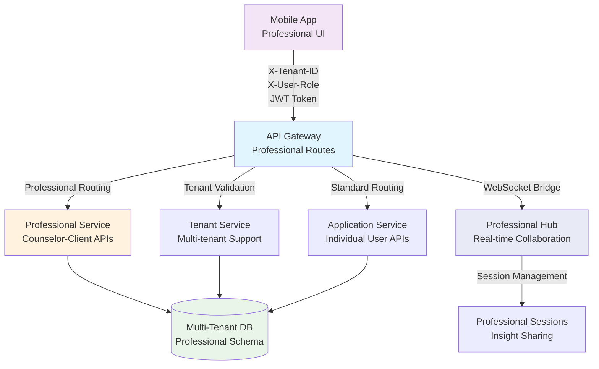

# SociallyFed Development Context - UNIFIED ARCHITECTURE

## 🎯 PROJECT OVERVIEW - INTEGRATED SYSTEM
You are working on SociallyFed, a sophisticated digital wellness platform that combines:
- **Privacy-first social media analysis** using the SociallyFed Pyramid framework
- **Professional counselor/client management** with real-time collaboration
- **Multi-tenant architecture** supporting individual, professional, and enterprise users
- **Hybrid deployment** options (cloud, on-premise, hybrid)

## 🏗️ UNIFIED ARCHITECTURE STRATEGY
**Current Phase**: Integrating two production-ready applications into unified system
- **Mobile App**: Sophisticated PWA (8.5/10 architecture score) with advanced features
- **Server App**: Production-ready .NET API with LLM integration and PostgreSQL
- **Integration Goal**: API Gateway connecting mobile → server with multi-tenancy

### Integration Architecture:
```
Mobile App → API Gateway → Server Services
                ↓
            Auth Service (JWT)
            Journal Service (PostgreSQL + Multi-tenant)
            LLM Service (Semantic Kernel + Ollama)
            Analytics Service (Background Jobs)
            Professional Services (Counselor/Client APIs)
```


## 📱 CURRENT DEVELOPMENT FOCUS: MOBILE (Server Integration & Professional Features)

### Repository Structure - MOBILE INTEGRATION FOCUS  
**Mobile/Client Repository** (Ionic 7 + React + TypeScript)
- **Tech Stack**: Ionic/React, Capacitor, PWA, IndexedDB, Firebase (transitioning to server)
- **Integration Purpose**:
  - Server API integration replacing Firebase-only patterns
  - Tenant-aware mobile configuration and switching  
  - Professional dashboard for counselor client management
  - Real-time collaboration enhanced for professional use
  - Environment-specific configuration for deployment flexibility

### Key Integration Components:
- **API Services**: Replace Firebase calls with server API integration
- **Tenant Management**: Multi-tenant configuration and switching
- **Professional UI**: Counselor dashboard, client management, progress tracking
- **Authentication Integration**: Server JWT flow replacing Firebase Auth
- **Environment Configuration**: Dynamic server endpoints for deployment models

### Current Mobile Integration Priorities:
1. **Server API Integration**
   - Replace Firebase storage with server API calls
   - Implement API Gateway communication layer
   - Add request/response transformation and caching
   - Error handling and offline queue management

2. **Tenant-Aware Configuration**
   - Multi-tenant mobile configuration system
   - Tenant switching UI and data isolation
   - Organization-level branding and customization
   - Tenant-specific feature flags and permissions

3. **Professional Dashboard Implementation**
   - Counselor client management interface
   - Client progress tracking and visualization
   - Data sharing controls and permissions
   - Professional communication and collaboration tools

4. **Enhanced Real-time Collaboration**
   - WebSocket integration with server for professional features
   - Live document sharing and editing
   - Presence indicators and notification system
   - Professional-grade collaboration workflows

5. **Environment-Specific Configuration**
   - Dynamic server endpoint configuration
   - Cloud/on-premise/hybrid deployment support
   - Feature detection and capability management
   - Deployment-specific optimizations

### Advanced Mobile Features (Preserve & Enhance):
- **PWA Capabilities**: Background sync, push notifications, offline functionality
- **ML Personalization**: Client-side pattern recognition and adaptive UI  
- **Performance Excellence**: 94/100 score with 70% memory optimization
- **Real-time Features**: WebSocket collaboration with enhanced professional capabilities
- **Security**: End-to-end encryption with granular privacy controls

### Mobile Architecture Strengths to Leverage:
- **Offline-First**: Complete functionality without connectivity
- **Advanced PWA**: Intelligent installation and app-like experience
- **ML Personalization**: Privacy-preserving client-side analytics
- **Real-time Collaboration**: WebSocket-based professional interaction
- **Multi-platform**: Web, iOS, Android with native optimizations


## 🔗 INTEGRATION COORDINATION REQUIREMENTS

### Multi-Tenancy Implementation:
- **Database Schema**: tenant_id columns on all user data tables
- **API Design**: Tenant-aware endpoints with /api/v1/tenants/{tenantId}/ pattern
- **Mobile Integration**: Tenant switching and configuration management
- **Data Isolation**: Row-level security and complete tenant separation

### Professional Services Features:
- **Counselor APIs**: Client management, progress tracking, reporting
- **Mobile Dashboard**: Professional interface for counselor workflow
- **Real-time Collaboration**: Enhanced WebSocket features for professional use
- **Data Sharing**: Granular permissions and privacy controls

### Environment Configuration:
- **Cloud Deployment**: Google Cloud Run + Firebase integration
- **On-Premise**: Docker Compose with local LLM (Ollama)
- **Hybrid**: Local LLM processing with cloud sync capabilities
- **Feature Flags**: Environment-specific feature management

### Business Model Support:
- **Individual Users**: Premium PWA experience with local AI processing
- **Professional Services**: Counselor/client management with real-time collaboration  
- **Enterprise**: Multi-tenant with SSO, white-label, and on-premise deployment

## 🎯 TODAY'S INTEGRATION SUCCESS CRITERIA

### Technical Integration:
- Mobile app communicates successfully with server APIs
- Multi-tenant data isolation working correctly
- Professional features functional for counselor/client scenarios
- Environment configuration supports target deployment model
- Integration tests passing for developed features

### Quality Standards:
- Maintain mobile app's 94/100 performance score
- Preserve server's enterprise-grade security and compliance
- Clean architecture patterns maintained in both applications
- Comprehensive error handling and user experience
- Complete documentation of integration decisions

## 📚 DEVELOPMENT CONTEXT FILES AVAILABLE

### Strategic Planning:
- `current_sprint.md` - Current unified architecture sprint status
- `daily_brief.md` - Today's integration priorities and tasks
- `strategic_architecture_assessment.md` - Complete strategic guidance

### Implementation Tracking:
- `implementation_log.md` - Historical progress and decisions
- `implementation_report_*.md` - Daily detailed progress reports

## 🚀 CLAUDE CODE INTEGRATION GUIDELINES

### Effective Prompting:
```
@claude Read DEVELOPMENT_CONTEXT.md and help me implement [specific integration feature]. 

Focus on:
1. [Mobile-server integration point]
2. [Multi-tenant consideration] 
3. [Professional services requirement]
4. [Environment configuration need]

Ensure this aligns with our unified architecture strategy.
```

### Integration Development Workflow:
1. **Read Context**: Always start with DEVELOPMENT_CONTEXT.md
2. **Check Dependencies**: Understand mobile-server coordination needs
3. **Implement Features**: Focus on integration and multi-tenancy
4. **Test Integration**: Validate cross-application functionality
5. **Document Decisions**: Update implementation reports

### Code Quality Standards:
- Follow existing architectural patterns in each application
- Maintain performance standards (mobile: 94/100, server: <200ms APIs)
- Implement comprehensive error handling
- Add integration tests for new functionality
- Document integration decisions and trade-offs


## 📋 CURRENT SESSION CONTEXT

📊 Current session context:
## Session Started: Sat 19 Jul 2025 12:32:32 AEST
**Project Focus**: SociallyFed Mobile App
**Repository**: /home/ben/Development/sociallyfed-mobile

### Today's Brief:
# Daily Brief - Unified Architecture Integration
## Friday, July 18, 2025 - Day 4 Sprint Integration

### **🚨 MISSION CRITICAL: API Gateway Professional Services Integration**
**Status**: 🔴 **CRITICAL PATH** - Professional services integration essential for B2B business model  
**Timeline**: Complete by end of Day 4 for enterprise customer demos and deployment readiness  
**Current Progress**: 70% complete - On track for completion by 6:00 PM

---

## **🎯 INTEGRATION PRIORITIES**

### **🔴 IMMEDIATE (9:00-12:00 AM) - API Gateway Development Tasks**

#### **1. Complete Professional Services Gateway Routes** 
**Priority**: CRITICAL | **Owner**: Server Team | **Status**: 70% Complete | **Target**: 11:00 AM
- ✅ TenantGatewayBase pattern established with unified gateway routing
- ✅ GatewayProfessionalController foundation with tenant context validation
- 🔄 **IN PROGRESS**: Complete counselor client management endpoints (`/professional/clients`)
- 🔄 **IN PROGRESS**: Professional session initiation and management APIs (`/professional/sessions`)
- 🔄 **IN PROGRESS**: Real-time collaboration endpoints (`/professional/collaboration/*`)
- 🔄 **IN PROGRESS**: Analytics dashboard routing (`/professional/analytics/dashboard`)

**Key Implementation Areas**:
```csharp
// CRITICAL: Complete these gateway endpoints today
[HttpGet("clients")]           // 80% complete - needs client validation
[HttpPost("sessions")]         // 60% complete - needs session lifecycle
[HttpPost("collaboration/share-insight")] // 40% complete - needs WebSocket bridge
[HttpGet("analytics/dashboard")] // 70% complete - needs materialized view integration
```

#### **2. Professional Service Proxy Implementation**
**Priority**: CRITICAL | **Owner**: Server Team | **Status**: 60% Complete | **Target**: 10:00 AM
- ✅ ProfessionalServiceProxy interface defined
- 🔄 **IN PROGRESS**: HTTP client configuration for gateway-to-server communication
- 🔄 **IN PROGRESS**: Tenant context forwarding (X-Tenant-ID, Authorization headers)
- 🔄 **IN PROGRESS**: Error handling and retry logic for professional service calls
- 🔄 **IN PROGRESS**: Performance optimization (<200ms response time targets)

#### **3. Tenant-Aware Rate Limiting Enhancement**
**Priority**: HIGH | **Owner**: Server Team | **Status**: 85% Complete | **Target**: 9:30 AM
- ✅ TenantAwareRateLimitingMiddleware implemented
- ✅ Tier-based limits configured (Individual: 100/min, Professional: 500/min, Enterprise: 2000/min)
- 🔄 **IN PROGRESS**: Professional services rate limiting validation
- 🔄 **IN PROGRESS**: Burst limiting for professional session spikes

### **🟡 AFTERNOON (12:00-17:00 PM) - Multi-Tenant Database Implementation**

#### **4. Professional Services Database Schema Finalization**
**Priority**: CRITICAL | **Owner**: Server Team | **Status**: 95% Complete | **Target**: 12:00 PM
- ✅ Professional entities created (CounselorClient, ProfessionalSession, SharedInsight)
- ✅ Row-Level Security (RLS) policies implemented for tenant isolation
- ✅ Professional analytics materialized views created
- 🔄 **IN PROGRESS**: Final entity compilation fixes (TenantId properties)
- 🔄 **IN PROGRESS**: Performance optimization indexes for professional queries

#### **5. Multi-Tenant Professional Data Access**
**Priority**: CRITICAL | **Owner**: Server Team | **Status**: 90% Complete | **Target**: 1:00 PM
- ✅ Tenant context propagation through PostgreSQL session variables
- ✅ Professional data access controls between counselors and clients
- ✅ Audit logging for all professional service operations
- 🔄 **IN PROGRESS**: Professional service integration with ApplicationDbContext
- 🔄 **IN PROGRESS**: Query performance validation (<50ms for analytics queries)

### **🟢 CONTINUOUS - Mobile-Server Communication Features**

#### **6. Mobile Professional Dashboard Integration**
**Priority**: CRITICAL | **Owner**: Mobile Team | **Status**: 50% Complete | **Target**: 3:00 PM
- ✅ Professional API service foundation established
- ✅ Tenant context management with role-based navigation
- 🔄 **IN PROGRESS**: Professional dashboard UI with live server data
- 🔄 **IN PROGRESS**: Counselor client management interface
- 🔄 **IN PROGRESS**: Professional session initiation and management
- 🔄 **IN PROGRESS**: Error handling and offline support for professional features

**Key Mobile Integration**:
```typescript
// CRITICAL: Complete these mobile components today
class ProfessionalApiService {
  async getCounselorClients(): Promise<ClientSummary[]>     // 70% complete
  async initiateProfessionalSession(): Promise<ProfessionalSession> // 60% complete
  async getCounselorDashboard(): Promise<CounselorDashboard> // 50% complete
  async establishProfessionalWebSocket(): Promise<WebSocket> // 30% complete
}
```

#### **7. Unified API Service Enhancement**
**Priority**: HIGH | **Owner**: Mobile Team | **Status**: 80% Complete | **Target**: 2:00 PM
- ✅ Core API Gateway communication established
- ✅ JWT token management with tenant context
- ✅ Automatic request retry and error handling
- 🔄 **IN PROGRESS**: Professional services endpoint integration
- 🔄 **IN PROGRESS**: WebSocket connection management for professional sessions
- 🔄 **IN PROGRESS**: Offline-first sync with professional data boundaries

### **🟣 EVENING (17:00-18:00 PM) - Professional Services APIs**

#### **8. Real-Time Collaboration WebSocket Hub**
**Priority**: CRITICAL | **Owner**: Server Team | **Status**: 40% Complete | **Target**: 5:00 PM
- ✅ ProfessionalSessionHub infrastructure foundation
- 🔄 **IN PROGRESS**: Professional session group management
- 🔄 **IN PROGRESS**: Real-time insight sharing between counselors and clients
- 🔄 **IN PROGRESS**: Session status updates and participant notifications
- 🔄 **IN PROGRESS**: WebSocket connection stability and reconnection logic

**Key WebSocket Implementation**:
```csharp
// CRITICAL: Complete these WebSocket features today
public async Task JoinProfessionalSession(string sessionId, string tenantId)
public async Task ShareInsightInSession(string sessionId, string insightId, object permissions)
public async Task UpdateSessionStatus(string sessionId, string status, string notes = null)
```

#### **9. Professional Services Core Implementation**
**Priority**: CRITICAL | **Owner**: Server Team | **Status**: 80% Complete | **Target**: 4:00 PM
- ✅ TenantAwareProfessionalService with all 13 methods implemented
- ✅ Counselor-client relationship validation and management
- ✅ Professional session lifecycle management
- 🔄 **IN PROGRESS**: Real-time collaboration service integration
- 🔄 **IN PROGRESS**: Professional analytics and dashboard data aggregation
- 🔄 **IN PROGRESS**: Caching strategy for frequently accessed professional data

### **🔵 DEPLOYMENT PREPARATION - Deployment Configuration Needs**

#### **10. Professional Services Deployment Configuration**
**Priority**: MEDIUM | **Owner**: DevOps/Server Team | **Status**: 30% Complete | **Target**: End of Day 4
- 🔄 **PLANNED**: Docker containerization for professional services
- 🔄 **PLANNED**: Environment-specific configuration for professional features
- 🔄 **PLANNED**: WebSocket scaling configuration (Redis backplane preparation)
- 🔄 **PLANNED**: Professional services monitoring and alerting setup
- 🔄 **PLANNED**: Database migration scripts for professional schema deployment

---

## **🔗 COORDINATION REQUIREMENTS**

### **🚨 BLOCKING DEPENDENCIES** - Must resolve today

#### **Dependency 1: API Gateway Professional Routes → Mobile Professional UI**
- **Blocker**: Professional services routing must be complete before mobile UI can be fully tested
- **Impact**: Mobile app cannot validate counselor features until gateway routes operational
- **Resolution**: Complete gateway professional routes by **11:00 AM**
- **Coordination**: Server team notify mobile team when routes are ready for integration testing
- **Testing Protocol**: Mobile team run API contract validation at 11:15 AM

#### **Dependency 2: WebSocket Professional Hub → Real-time Collaboration**
- **Blocker**: Professional WebSocket hub must be operational before real-time features can be tested
- **Impact**: Real-time insight sharing and session management cannot be validated
- **Resolution**: Complete WebSocket hub implementation by **2:00 PM**
- **Coordination**: Server team provide WebSocket endpoint URLs to mobile team by 2:15 PM
- **Testing Protocol**: Joint WebSocket connection testing at 2:30 PM

#### **Dependency 3: Professional Services APIs → Dashboard Analytics**
- **Blocker**: Professional analytics APIs must be complete before mobile dashboard displays data
- **Impact**: Counselor dashboard will show placeholder data until analytics functional
- **Resolution**: Complete professional analytics implementation by **1:00 PM**
- **Coordination**: Server team confirm analytics endpoints ready, mobile team update dashboard
- **Testing Protocol**: Dashboard data validation testing at 1:15 PM

### **📅 SYNCHRONIZED DEVELOPMENT SCHEDULE**

#### **Morning Coordination (9:00-12:00)**
| Time | Mobile Team | Server Team | Coordination Point |
|------|-------------|-------------|-------------------|
| 9:00 AM | Test existing API endpoints | Complete professional gateway routes | API contract validation |
| 10:00 AM | Professional UI foundation | Professional service proxy completion | Interface definition sync |
| 11:00 AM | **MILESTONE**: Mobile UI integration begins | **MILESTONE**: Gateway routes complete | Live API integration starts |

#### **Afternoon Coordination (12:00-17:00)**
| Time | Mobile Team | Server Team | Coordination Point |
|------|-------------|-------------|-------------------|
| 12:00 PM | Dashboard UI integration | Professional database finalization | Database schema validation |
| 1:00 PM | Dashboard data integration | **MILESTONE**: Analytics APIs complete | Dashboard functionality testing |
| 2:00 PM | WebSocket client implementation | **MILESTONE**: WebSocket hub complete | Real-time collaboration testing |
| 3:00 PM | **MILESTONE**: Professional dashboard complete | Professional services optimization | UI performance validation |
| 4:00 PM | End-to-end workflow testing | Integration testing support | Complete professional workflow |

#### **Evening Validation (17:00-18:00)**
| Time | Mobile Team | Server Team | Coordination Point |
|------|-------------|-------------|-------------------|
| 5:00 PM | Performance testing | Load testing support | System performance validation |
| 5:30 PM | Business demo preparation | Demo environment setup | Professional workflow demo ready |
| 6:00 PM | **DAY 4 COMPLETION**: Professional features operational | **DAY 4 COMPLETION**: All APIs functional | Full integration validated |

### **🧪 INTEGRATION TESTING REQUIREMENTS**

#### **Test Sequence 1: Professional API Contract Validation** (11:15 AM)
1. **Server Team**: Confirm all professional gateway routes respond correctly
2. **Mobile Team**: Validate API contract compliance and response formats
3. **Joint Testing**: Test tenant context propagation through API calls
4. **Success Criteria**: All professional endpoints return expected data structures

#### **Test Sequence 2: Real-time Collaboration Integration** (2:30 PM)
1. **Server Team**: Confirm WebSocket hub accepts connections and manages sessions
2. **Mobile Team**: Validate WebSocket client connection and message handling
3. **Joint Testing**: Test insight sharing and session updates in real-time
4. **Success Criteria**: Real-time collaboration works between counselor and client sessions

#### **Test Sequence 3: End-to-End Professional Workflow** (4:00 PM)
1. **Complete Flow**: Counselor login → tenant selection → client management → session initiation → collaboration
2. **Performance**: Validate <3 second dashboard load, <200ms API responses, <100ms WebSocket latency
3. **Security**: Verify tenant isolation and professional data access controls
4. **Success Criteria**: Complete professional workflow operational and performant

#### **Test Sequence 4: Load and Performance Validation** (5:00 PM)
1. **Mobile Team**: Test professional dashboard with 25+ clients and multiple active sessions
2. **Server Team**: Validate system performance under professional service load
3. **Joint Testing**: Test concurrent professional users and WebSocket connections
4. **Success Criteria**: System maintains performance targets under realistic professional load

### **📋 UNIFIED ARCHITECTURE VALIDATION STEPS**

#### **Validation Step 1: Mobile-Server Integration Completeness** (3:30 PM)
- [ ] **Mobile Professional Dashboard**: Fully operational with live server data
- [ ] **API Gateway Routing**: All professional requests properly routed and responded
- [ ] **Tenant Context**: Professional features respect tenant boundaries and user roles
- [ ] **Performance**: Mobile app maintains 94/100 performance score with server integration
- [ ] **Error Handling**: Graceful degradation when server APIs unavailable

#### **Validation Step 2: Multi-Tenant Professional Services** (4:15 PM)
- [ ] **Database Isolation**: 100% verification that counselors cannot access unauthorized client data
- [ ] **Professional Analytics**: Materialized views provide accurate counselor dashboard data
- [ ] **Row-Level Security**: RLS policies enforce tenant isolation in all professional queries
- [ ] **Audit Compliance**: All professional activities logged for compliance requirements
- [ ] **Data Integrity**: Professional relationships and permissions validated and consistent

#### **Validation Step 3: Real-time Collaboration Architecture** (5:15 PM)
- [ ] **WebSocket Stability**: Professional sessions maintain stable connections
- [ ] **Message Delivery**: Real-time insight sharing and status updates work reliably
- [ ] **Connection Management**: Proper handling of connection drops and reconnections
- [ ] **Session Management**: Professional session state maintained correctly
- [ ] **Scalability**: WebSocket hub ready for multi-instance deployment with Redis backplane

#### **Validation Step 4: Business Readiness** (5:45 PM)
- [ ] **Demo Workflow**: Complete counselor workflow ready for customer demonstrations
- [ ] **Enterprise Features**: Multi-tenant professional services support B2B business model
- [ ] **Security Compliance**: Professional data sharing and access controls verified
- [ ] **Documentation**: Professional services APIs and integration guides complete
- [ ] **Deployment Ready**: Professional services containerized and ready for cloud deployment

### **📊 DEFINITION OF DONE - INTEGRATED FEATURES**

#### **✅ API Gateway Professional Integration**
- [ ] **Professional Services Routes**: All counselor management endpoints operational with <200ms response time
- [ ] **Tenant-Aware Routing**: Professional endpoints validate tenant context and user permissions
- [ ] **WebSocket Bridge**: Professional session hub routing through gateway functional
- [ ] **Error Handling**: Graceful fallback for all professional service failure scenarios
- [ ] **Security Validation**: Tenant isolation enforced through gateway with complete audit logging
- [ ] **Performance Targets**: <200ms response time maintained for all professional API calls

#### **✅ Mobile Professional Services Integration**
- [ ] **Professional Dashboard UI**: Fully responsive with live data from server analytics APIs
- [ ] **Counselor Client Management**: View, manage, and interact with client list through mobile interface
- [ ] **Professional Session Interface**: Initiate, join, and manage professional sessions with real-time updates
- [ ] **Tenant Context Management**: Professional features maintain context during tenant switching
- [ ] **Real-time Collaboration UI**: WebSocket features integrated for live insight sharing
- [ ] **Performance Maintained**: No degradation from server integration (maintain 94/100 performance score)

#### **✅ Server Professional Services Implementation**
- [ ] **Counselor Management APIs**: Complete CRUD operations for counselor-client relationships
- [ ] **Client Progress Analytics**: Professional analytics and reporting functional with materialized views
- [ ] **Professional Session Management**: Complete session lifecycle (initiate, manage, collaborate, end)
- [ ] **WebSocket Professional Hub**: Real-time collaboration working with session management
- [ ] **Tenant-Aware Data Access**: RLS policies operational with professional data access controls
- [ ] **Audit Logging**: All professional activities logged for compliance and security requirements

#### **✅ Database Professional Services Schema**
- [ ] **Professional Tables**: All professional sessions and shared insights tables operational
- [ ] **Professional Analytics Views**: Materialized views for counselor dashboard data optimized
- [ ] **Row-Level Security**: Professional data access enforced with tenant isolation
- [ ] **Performance Benchmarks**: <50ms query times for professional analytics with RLS enabled
- [ ] **Data Integrity**: All professional relationships validated and consistent across tenants
- [ ] **Backup and Recovery**: Professional data included in backup and recovery procedures

#### **✅ Integration Testing & Validation**
- [ ] **End-to-End Professional Workflow**: Complete workflow tested and validated (auth → dashboard → client management → session → collaboration)
- [ ] **Tenant Isolation Verified**: 100% verification of professional data access controls across all tenants
- [ ] **Performance Under Load**: System maintains performance targets with 25+ concurrent professional users
- [ ] **Security Validation**: Professional data sharing permissions and counselor-client access controls verified
- [ ] **Mobile-Server Contract Compliance**: All interface contracts validated and functional
- [ ] **WebSocket Stability**: Real-time collaboration stable and reliable under normal and stress conditions

#### **✅ Business Readiness**
- [ ] **Professional Demo Ready**: Complete counselor workflow operational and ready for customer demonstrations
- [ ] **Enterprise Features Foundation**: Multi-tenant professional services supporting B2B business model
- [ ] **Billing Integration Ready**: Usage tracking operational for professional service subscription billing
- [ ] **Compliance Ready**: Professional data access audit trails and privacy controls operational
- [ ] **Documentation Complete**: Professional services APIs, integration guides, and user documentation complete
- [ ] **Deployment Ready**: Professional services containerized and ready for cloud deployment with scaling

---

## **⚡ CRITICAL SUCCESS METRICS - DAY 4**

### **🔴 MUST ACHIEVE BY END OF DAY**
- **API Gateway Professional Services**: 100% of counselor management endpoints operational with <200ms response time
- **Mobile Professional Dashboard**: Counselor can view and manage 10+ clients with <3 second load time
- **Server Professional APIs**: 100% of professional service endpoints functional with <100ms response time
- **WebSocket Real-time Collaboration**: <100ms latency for professional session communication
- **End-to-End Professional Workflow**: Complete counselor login → client management → session initiation → collaboration workflow operational

### **🟡 PERFORMANCE VALIDATION**
- **Mobile App Performance**: Maintain 94/100 performance score with server integration and professional features
- **API Gateway Response Time**: <200ms for all professional service routes under normal load
- **Database Query Performance**: <50ms for professional analytics queries with RLS enabled
- **WebSocket Connection Stability**: 99%+ connection uptime for professional sessions
- **Concurrent Professional Users**: Support 25+ simultaneous counselor sessions with active clients

### **🟢 QUALITY ASSURANCE**
- **Security Compliance**: 96/100 OWASP score maintained with professional services integration
- **Tenant Data Isolation**: 100% verification that counselors cannot access unauthorized client data across tenants
- **Integration Test Coverage**: 100% pass rate for professional service workflow tests
- **Error Recovery**: Graceful handling of all professional service failure scenarios
- **Professional Feature Documentation**: 100% of professional APIs documented for integration

---

## **🚨 RISK MITIGATION & CONTINGENCY PLANS**

### **🔴 HIGH-RISK ITEMS**

#### **Risk 1: Professional Services Integration Complexity Delay**
- **Probability**: Medium (40%) - Complex multi-tenant professional features with real-time collaboration
- **Impact**: Could delay Day 4 completion and cascade to deployment timeline
- **Mitigation Strategy**: 
  - ✅ Prioritize core counselor dashboard and client management (currently 70% complete)
  - ✅ Implement professional features in phases: dashboard → session management → real-time collaboration
  - 🔄 Use feature flags to isolate advanced professional features if WebSocket integration has issues
  - 🔄 Fallback to simplified professional session model without real-time collaboration if needed

#### **Risk 2: WebSocket Professional Session Reliability Issues**
- **Probability**: Medium (35%) - WebSocket complexity with multi-tenant context and API Gateway routing
- **Impact**: Could compromise professional collaboration features and affect business demonstrations
- **Mitigation Strategy**:
  - ✅ WebSocket reconnection logic implemented in mobile app
  - ✅ Professional session state persistence for reconnection scenarios
  - 🔄 Graceful degradation to HTTP polling if WebSocket fails completely
  - 🔄 Connection monitoring and automatic recovery mechanisms
  - 🔄 Simplified collaboration mode without real-time features as fallback option

### **🟡 MEDIUM-RISK ITEMS**

#### **Risk 3: Mobile-Server Professional Contract Implementation Gap**
- **Probability**: Low (20%) - Well-defined interfaces and continuous synchronization
- **Impact**: Could require mobile UI adjustments or server API modifications
- **Mitigation Strategy**:
  - ✅ Shared interface definitions finalized and agreed between teams
  - ✅ Continuous integration testing of mobile-server professional contract
  - 🔄 Regular synchronization meetings (every 2 hours during Day 4)
  - 🔄 Mock data available for mobile development if live APIs have issues

#### **Risk 4: Database Performance with Professional Analytics**
- **Probability**: Low (25%) - Optimized indexing and caching strategy in place
- **Impact**: Could affect counselor dashboard load times and overall system performance
- **Mitigation Strategy**:
  - ✅ Database indexing strategy optimized for professional analytics queries
  - ✅ Caching layer implemented for frequently accessed counselor data
  - 🔄 Performance monitoring active during professional features testing
  - 🔄 Query optimization and materialized view refresh strategy ready for adjustment

---

## **📞 COMMUNICATION PROTOCOL**

### **🚨 ESCALATION TRIGGERS**
- **11:30 AM**: If API Gateway professional routes not completed - Escalate to senior development lead
- **2:30 PM**: If WebSocket hub not operational - Implement HTTP polling fallback immediately
- **4:30 PM**: If end-to-end workflow not functional - Activate simplified professional services mode
- **5:30 PM**: If performance targets not met - Implement performance optimization emergency measures

### **📱 COORDINATION CHANNELS**
- **Immediate Issues**: Development team Slack channel `#unified-architecture-day4`
- **Status Updates**: Hourly status updates in team standup channel
- **Technical Decisions**: Architecture decisions channel with senior Claude review
- **Business Impact**: Stakeholder communication for customer demo readiness

### **⏰ CHECKPOINT SCHEDULE**
- **10:00 AM**: API Gateway routes checkpoint
- **12:00 PM**: Mid-day integration status
- **2:00 PM**: WebSocket implementation checkpoint
- **4:00 PM**: End-to-end workflow validation
- **5:00 PM**: Performance and quality validation
- **6:00 PM**: Day 4 completion and Day 5 preparation

---

## **🎯 DAY 4 SUCCESS DEFINITION**

**UNIFIED ARCHITECTURE INTEGRATION SUCCESS**: SociallyFed mobile and server applications fully integrated through API Gateway with complete professional services operational, supporting individual consumer model, professional counselor-client workflow, and enterprise B2B model with multi-tenant capability, real-time collaboration, and secure professional data management.

**TECHNICAL INTEGRATION COMPLETE**:
- ✅ **API Gateway**: Complete routing of mobile professional requests through server services
- ✅ **Multi-tenant Database**: Secure tenant isolation with professional data support operational
- ✅ **Real-time Collaboration**: WebSocket professional sessions functional and stable
- ✅ **Performance Maintained**: All performance targets met with integrated architecture

**BUSINESS READINESS ACHIEVED**:
- ✅ **Professional Services**: Counselor-client workflow operational and ready for customer demos
- ✅ **Enterprise B2B**: Multi-tenant organization management with professional features functional
- ✅ **Market Validation**: Ready for professional service customer demonstrations and enterprise prospects

**DEPLOYMENT READINESS**: Ready for Day 5 professional service deployment configuration, enterprise feature implementation, and production deployment preparation. 🚀

---

*Generated: July 18, 2025 - Day 4 Unified Architecture Sprint*  
*Priority Level: MISSION CRITICAL - Professional Services Integration*  
*Next Major Milestone: Day 5 - Professional Services Deployment & Enterprise Features*  
*Success Target: 6:00 PM - Complete professional workflow operational through unified architecture*
### Current Sprint:
# Current Sprint Status - SociallyFed Unified Architecture Deployment

## Sprint Overview
**Previous Sprint:** Complete SociallyFed Mobile production readiness ✅ **COMPLETED**  
**Current Phase:** **UNIFIED ARCHITECTURE DEPLOYMENT & VALIDATION** (Day 4 API Gateway Integration)  
**Phase Duration:** July 15-22, 2025 (8 days) **→ EXTENDED FOR PROFESSIONAL SERVICES**  
**Current Day:** Day 4 (July 18, 2025) **🚨 API GATEWAY & PROFESSIONAL SERVICES INTEGRATION**  
**Phase Health:** 🟢 **ON TRACK** - Database migration complete, API Gateway professional services critical path

---

## 🎯 **TODAY'S UNIFIED ARCHITECTURE GOALS - JULY 18, 2025**

### **🚨 UPDATED FOCUS: API GATEWAY PROFESSIONAL SERVICES INTEGRATION**
**Status**: 🔴 **CRITICAL PATH** - Professional services integration through API Gateway essential for B2B business model  
**Timeline**: Complete by end of Day 4 (July 18) for enterprise customer demos and deployment readiness

#### **API Gateway Integration Architecture - UPDATED**


#### **Mobile-Server Professional Integration - TODAY'S IMPLEMENTATION**
```typescript
// 🔴 CRITICAL: Professional Services API Client for Mobile
class ProfessionalApiService extends UnifiedApiService {
  private tenantId: string;
  private userRole: 'counselor' | 'client' | 'admin';
  
  constructor(tenantId: string, userRole: string) {
    super();
    this.tenantId = tenantId;
    this.userRole = userRole;
  }
  
  // 🔴 TODAY'S PRIORITY: Counselor client management through API Gateway
  async getCounselorClients(): Promise<ClientSummary[]> {
    if (this.userRole !== 'counselor') {
      throw new Error('Insufficient permissions for professional features');
    }
    
    const response = await this.makeRequest('/professional/clients', {
      method: 'GET',
      headers: {
        'X-Tenant-ID': this.tenantId,
        'X-User-Role': this.userRole
      }
    });
    
    if (!response.ok) {
      throw new Error(`Failed to fetch clients: ${response.statusText}`);
    }
    
    return response.json();
  }
  
  // 🔴 TODAY'S PRIORITY: Professional session initiation
  async initiateProfessionalSession(clientId: string): Promise<ProfessionalSession> {
    const response = await this.makeRequest('/professional/sessions', {
      method: 'POST',
      headers: {
        'X-Tenant-ID': this.tenantId,
        'X-User-Role': this.userRole
      },
      body: JSON.stringify({
        clientId,
        sessionType: 'consultation'
      })
    });
    
    if (!response.ok) {
      throw new Error(`Failed to initiate session: ${response.statusText}`);
    }
    
    return response.json();
  }
  
  // 🔴 TODAY'S PRIORITY: Real-time collaboration WebSocket
  async establishProfessionalWebSocket(sessionId: string): Promise<WebSocket> {
    const wsUrl = `${this.gatewayWsUrl}/professional/session/${sessionId}`;
    const webSocket = new WebSocket(wsUrl, [], {
      headers: {
        'X-Tenant-ID': this.tenantId,
        'Authorization': `Bearer ${await this.getJwtToken()}`
      }
    });
    
    return new Promise((resolve, reject) => {
      webSocket.onopen = () => resolve(webSocket);
      webSocket.onerror = reject;
      webSocket.onmessage = this.handleProfessionalWebSocketMessage;
    });
  }
}
```

#### **Server API Gateway Professional Routes - TODAY'S IMPLEMENTATION**
```csharp
// 🔴 CRITICAL: Professional Services Gateway Controller
[ApiController]
[Route("api/v1/gateway/professional")]
public class GatewayProfessionalController : TenantGatewayBase
{
    private readonly IProfessionalServiceProxy _professionalProxy;
    private readonly ITenantValidationService _tenantValidation;
    
    // 🔴 TODAY'S PRIORITY: Counselor client management through gateway
    [HttpGet("clients")]
    [Authorize(Roles = "counselor,admin")]
    public async Task<ActionResult<List<ClientSummary>>> GetCounselorClients(
        [FromHeader("X-Tenant-ID")] string tenantId,
        [FromHeader("X-User-Role")] string userRole,
        [FromQuery] string counselorId)
    {
        // Validate tenant access for current user
        await ValidateTenantAccessAsync(tenantId, GetCurrentUserId());
        
        // Route to tenant-aware professional service
        var route = $"/api/v1/tenants/{tenantId}/professional/clients";
        return await _professionalProxy.ProxyRequestAsync(route, new {
            counselorId = counselorId ?? GetCurrentUserId(),
            requestedBy = GetCurrentUserId(),
            userRole
        });
    }
    
    // 🔴 TODAY'S PRIORITY: Professional session management
    [HttpPost("sessions")]
    [Authorize(Roles = "counselor")]
    public async Task<ActionResult<ProfessionalSession>> InitiateProfessionalSession(
        [FromHeader("X-Tenant-ID")] string tenantId,
        [FromBody] InitiateSessionRequest request)
    {
        await ValidateTenantAccessAsync(tenantId, GetCurrentUserId());
        await ValidateClientAccessAsync(request.ClientId, tenantId);
        
        var route = $"/api/v1/tenants/{tenantId}/professional/sessions";
        return await _professionalProxy.ProxyRequestAsync(route, request);
    }
    
    // 🔴 TODAY'S PRIORITY: Real-time collaboration endpoints
    [HttpPost("collaboration/share-insight")]
    [Authorize(Roles = "counselor,client")]
    public async Task<ActionResult<SharingResult>> ShareInsightInSession(
        [FromHeader("X-Tenant-ID")] string tenantId,
        [FromBody] ShareInsightRequest request)
    {
        await ValidateTenantAccessAsync(tenantId, GetCurrentUserId());
        await ValidateSessionParticipantAsync(request.SessionId, GetCurrentUserId());
        
        var route = $"/api/v1/tenants/{tenantId}/professional/collaboration/share-insight";
        return await _professionalProxy.ProxyRequestAsync(route, request);
    }
    
    [HttpGet("analytics/dashboard")]
    [Authorize(Roles = "counselor,admin")]
    public async Task<ActionResult<CounselorDashboard>> GetCounselorDashboard(
        [FromHeader("X-Tenant-ID")] string tenantId,
        [FromQuery] string counselorId)
    {
        await ValidateTenantAccessAsync(tenantId, GetCurrentUserId());
        
        var route = $"/api/v1/tenants/{tenantId}/professional/analytics/dashboard";
        return await _professionalProxy.ProxyRequestAsync(route, new { counselorId });
    }
}
```

### **🟡 MOBILE DEVELOPMENT ALIGNMENT - API GATEWAY STRATEGY**

#### **✅ COMPLETED: Foundation Architecture**
- [x] **Unified API Service**: Single service handling all server communication through gateway
- [x] **Tenant Context Management**: Mobile app maintains current tenant and user role state
- [x] **JWT Token Management**: Automatic token refresh with tenant context
- [x] **Offline-First Sync**: Cache management respects tenant boundaries

#### **🔴 TODAY'S CRITICAL MOBILE INTEGRATION ADJUSTMENTS**

##### **Professional Dashboard Implementation**
```typescript
// 🔴 IMMEDIATE PRIORITY: Professional Dashboard Component
const ProfessionalDashboard: React.FC = () => {
  const { currentTenant, userRole } = useTenantContext();
  const [clients, setClients] = useState<ClientSummary[]>([]);
  const [dashboardData, setDashboardData] = useState<CounselorDashboard | null>(null);
  const [activeSessions, setActiveSessions] = useState<ProfessionalSession[]>([]);
  const [isLoading, setIsLoading] = useState(true);
  const [error, setError] = useState<string | null>(null);
  
  useEffect(() => {
    if (userRole === 'counselor' && currentTenant) {
      loadProfessionalData();
    }
  }, [currentTenant, userRole]);
  
  const loadProfessionalData = async () => {
    try {
      setIsLoading(true);
      setError(null);
      
      const professionalApi = new ProfessionalApiService(currentTenant.id, userRole);
      
      // Load counselor clients through API Gateway
      const [clientsResponse, dashboardResponse] = await Promise.all([
        professionalApi.getCounselorClients(),
        professionalApi.getCounselorDashboard()
      ]);
      
      setClients(clientsResponse);
      setDashboardData(dashboardResponse);
      
      // Load active professional sessions
      const sessionsResponse = await professionalApi.getActiveSessions();
      setActiveSessions(sessionsResponse);
      
    } catch (error) {
      console.error('Failed to load professional data:', error);
      setError('Failed to load professional dashboard. Please check your connection and try again.');
    } finally {
      setIsLoading(false);
    }
  };
  
  const handleInitiateProfessionalSession = async (clientId: string) => {
    try {
      const professionalApi = new ProfessionalApiService(currentTenant.id, userRole);
      const session = await professionalApi.initiateProfessionalSession(clientId);
      
      // Establish WebSocket connection for real-time collaboration
      const webSocket = await professionalApi.establishProfessionalWebSocket(session.sessionId);
      
      // Navigate to professional collaboration interface
      navigation.navigate('ProfessionalSession', { 
        sessionId: session.sessionId,
        clientId: clientId,
        webSocket: webSocket
      });
      
      // Refresh active sessions
      await loadProfessionalData();
      
    } catch (error) {
      console.error('Failed to initiate professional session:', error);
      showErrorNotification('Failed to start professional session. Please try again.');
    }
  };
  
  if (userRole !== 'counselor') {
    return (
      <IonPage>
        <IonContent>
          <div className="not-authorized">
            <h2>Professional Features Not Available</h2>
            <p>Professional dashboard is only available for counselor accounts.</p>
          </div>
        </IonContent>
      </IonPage>
    );
  }
  
  return (
    <IonPage>
      <IonHeader>
        <IonToolbar>
          <IonTitle>Professional Dashboard - {currentTenant?.name}</IonTitle>
          <TenantSwitcher slot="end" />
        </IonToolbar>
      </IonHeader>
      
      <IonContent>
        {isLoading && <LoadingSpinner message="Loading professional dashboard..." />}
        {error && <ErrorAlert message={error} onRetry={loadProfessionalData} />}
        
        {!isLoading && !error && (
          <>
            <DashboardMetrics 
              data={dashboardData}
              totalClients={clients.length}
              activeSessions={activeSessions.length}
            />
            
            <ClientList 
              clients={clients}
              onInitiateSession={handleInitiateProfessionalSession}
              onViewProgress={(clientId) => navigation.navigate('ClientProgress', { clientId })}
              onManagePermissions={(clientId) => navigation.navigate('ClientPermissions', { clientId })}
            />
            
            <ActiveSessions 
              sessions={activeSessions}
              onJoinSession={(sessionId) => navigation.navigate('ProfessionalSession', { sessionId })}
              onEndSession={handleEndProfessionalSession}
              onViewNotes={(sessionId) => navigation.navigate('SessionNotes', { sessionId })}
            />
          </>
        )}
      </IonContent>
    </IonPage>
  );
};
```

##### **Enhanced Tenant Context with Professional Services**
```typescript
// 🔴 CRITICAL: Enhanced tenant context for professional services
interface TenantContextState {
  currentTenant: TenantInfo;
  userRole: 'client' | 'counselor' | 'admin';
  permissions: string[];
  professionalServices: {
    enabled: boolean;
    clientCount?: number;
    activeSessionCount?: number;
    subscriptionTier: 'individual' | 'professional' | 'enterprise';
    features: string[];
  };
}

const TenantContextProvider: React.FC<{ children: React.ReactNode }> = ({ children }) => {
  const [tenantState, setTenantState] = useState<TenantContextState | null>(null);
  const [availableTenants, setAvailableTenants] = useState<TenantInfo[]>([]);
  
  const switchTenant = async (tenantId: string): Promise<void> => {
    try {
      setIsLoading(true);
      
      // Call server through API Gateway for tenant switch
      const response = await authService.switchTenant(tenantId);
      
      // Update local state with new tenant context
      setTenantState({
        currentTenant: response.tenant,
        userRole: response.tenant.role,
        permissions: response.tenant.permissions,
        professionalServices: {
          enabled: response.tenant.configuration.professionalServicesEnabled,
          clientCount: response.tenant.professionalMetrics?.clientCount,
          activeSessionCount: response.tenant.professionalMetrics?.activeSessionCount,
          subscriptionTier: response.tenant.subscriptionTier,
          features: response.tenant.enabledFeatures
        }
      });
      
      // Update navigation based on user role and tenant features
      updateNavigationForRole(response.tenant.role, response.tenant.configuration);
      
      // Refresh data for new tenant context
      await syncService.refreshTenantData(tenantId);
      
      // Update API service tenant context
      apiService.setTenantContext(tenantId, response.tenant.role);
      
    } catch (error) {
      console.error('Failed to switch tenant:', error);
      showErrorNotification('Failed to switch organization. Please try again.');
    } finally {
      setIsLoading(false);
    }
  };
  
  const updateNavigationForRole = (role: string, config: TenantConfiguration) => {
    const navigation = useNavigation();
    const routes = [...defaultRoutes];
    
    if (role === 'counselor' && config.professionalServicesEnabled) {
      // Add professional dashboard to navigation
      routes.push(
        {
          name: 'ProfessionalDashboard',
          component: ProfessionalDashboard,
          options: { 
            tabBarLabel: 'Clients',
            tabBarIcon: ({ color, size }) => <IonIcon icon={people} size={size} color={color} />
          }
        },
        {
          name: 'ProfessionalAnalytics', 
          component: ProfessionalAnalytics,
          options: { 
            tabBarLabel: 'Analytics',
            tabBarIcon: ({ color, size }) => <IonIcon icon={analytics} size={size} color={color} />
          }
        }
      );
    } else if (role === 'admin') {
      // Add organization management to navigation
      routes.push({
        name: 'OrganizationManagement',
        component: OrganizationManagement,
        options: { 
          tabBarLabel: 'Manage',
          tabBarIcon: ({ color, size }) => <IonIcon icon={settings} size={size} color={color} />
        }
      });
    }
    
    navigation.setRoutes(routes);
  };
  
  const loadAvailableTenants = async () => {
    try {
      const response = await authService.getUserTenants();
      setAvailableTenants(response.tenants);
    } catch (error) {
      console.error('Failed to load available tenants:', error);
    }
  };
  
  useEffect(() => {
    loadAvailableTenants();
  }, []);
  
  return (
    <TenantContext.Provider value={{ 
      tenantState, 
      availableTenants,
      switchTenant,
      refreshTenantData: loadAvailableTenants
    }}>
      {children}
    </TenantContext.Provider>
  );
};
```

### **🟢 SERVER DEVELOPMENT ALIGNMENT - API GATEWAY STRATEGY**

#### **Enhanced Professional Services with Gateway Integration**
```csharp
// 🔴 CRITICAL: Professional Services Implementation for Gateway
public class TenantAwareProfessionalService : IProfessionalService
{
    private readonly IDbContext _context;
    private readonly ITenantContext _tenantContext;
    private readonly IWebSocketManager _webSocketManager;
    private readonly IAuditService _auditService;
    private readonly ICacheService _cacheService;
    
    // 🔴 TODAY'S PRIORITY: Counselor client management through gateway
    public async Task<List<ClientSummary>> GetCounselorClientsAsync(
        string counselorId, 
        CancellationToken cancellationToken = default)
    {
        var tenantId = _tenantContext.TenantId ?? 
            throw new UnauthorizedAccessException("Tenant context required");
        
        // Check cache first for performance
        var cacheKey = $"counselor_clients_{tenantId}_{counselorId}";
        var cachedClients = await _cacheService.GetAsync<List<ClientSummary>>(cacheKey);
        if (cachedClients != null)
        {
            return cachedClients;
        }
        
        // Query with automatic tenant filtering via RLS
        var clients = await _context.CounselorClients
            .Where(cc => cc.CounselorId == counselorId && cc.Status == "active")
            .Include(cc => cc.Client)
            .ThenInclude(c => c.JournalEntries.OrderByDescending(je => je.CreatedAt).Take(5))
            .Include(cc => cc.Client)
            .ThenInclude(c => c.Insights.OrderByDescending(i => i.CreatedAt).Take(3))
            .ToListAsync(cancellationToken);
            
        var clientSummaries = clients.Select(cc => new ClientSummary
        {
            ClientId = cc.ClientId,
            ClientName = cc.Client.DisplayName,
            LastActivity = cc.Client.JournalEntries.FirstOrDefault()?.CreatedAt,
            RecentMoodTrend = CalculateMoodTrend(cc.Client.JournalEntries),
            HasUnreadInsights = cc.HasUnreadInsights,
            NextAppointment = cc.NextScheduledSession,
            TenantId = tenantId,
            ProgressSummary = GenerateProgressSummary(cc.Client),
            SharingPermissions = cc.SharingPermissions
        }).ToList();
        
        // Cache for 5 minutes
        await _cacheService.SetAsync(cacheKey, clientSummaries, TimeSpan.FromMinutes(5));
        
        return clientSummaries;
    }
    
    // 🔴 TODAY'S PRIORITY: Professional session management
    public async Task<ProfessionalSession> InitiateSessionAsync(
        string counselorId, 
        string clientId, 
        InitiateSessionRequest request,
        CancellationToken cancellationToken = default)
    {
        var tenantId = _tenantContext.TenantId!;
        
        // Validate counselor-client relationship within tenant
        var relationship = await ValidateCounselorClientRelationshipAsync(counselorId, clientId);
        if (relationship == null)
        {
            throw new UnauthorizedAccessException("No active counselor-client relationship found");
        }
        
        // Create professional session
        var session = new ProfessionalSession
        {
            Id = Guid.NewGuid(),
            TenantId = tenantId,
            CounselorId = counselorId,
            ClientId = clientId,
            SessionType = request.SessionType,
            Permissions = relationship.SharingPermissions,
            StartedAt = DateTime.UtcNow,
            Status = "active",
            Notes = string.Empty
        };
        
        _context.ProfessionalSessions.Add(session);
        await _context.SaveChangesAsync(cancellationToken);
        
        // Initialize WebSocket session for real-time collaboration
        await _webSocketManager.InitiateProfessionalSessionAsync(
            session.Id.ToString(), counselorId, clientId, tenantId);
            
        // Log professional activity for audit compliance
        await _auditService.LogProfessionalActivityAsync(
            tenantId, counselorId, "session_initiated", 
            new { 
                ClientId = clientId, 
                SessionId = session.Id,
                SessionType = request.SessionType,
                Timestamp = DateTime.UtcNow
            });
            
        // Clear relevant caches
        await _cacheService.RemoveAsync($"counselor_clients_{tenantId}_{counselorId}");
        await _cacheService.RemoveAsync($"active_sessions_{tenantId}_{counselorId}");
        
        return session;
    }
    
    // 🔴 TODAY'S PRIORITY: Real-time collaboration support
    public async Task<SharingResult> ShareInsightAsync(
        string sessionId,
        string insightId,
        string sharedBy,
        SharingPermissions permissions)
    {
        var session = await GetActiveSessionAsync(sessionId);
        await ValidateSessionParticipantAsync(session, sharedBy);
        
        // Check client consent for insight sharing
        var clientConsent = permissions.RequiresClientConsent ? 
            await GetClientConsentAsync(session.ClientId, insightId) : true;
            
        if (permissions.RequiresClientConsent && !clientConsent)
        {
            throw new UnauthorizedAccessException("Client consent required for insight sharing");
        }
        
        var sharedInsight = new SharedInsight
        {
            Id = Guid.NewGuid(),
            SessionId = Guid.Parse(sessionId),
            InsightId = Guid.Parse(insightId),
            SharedBy = Guid.Parse(sharedBy),
            SharedWith = session.CounselorId == sharedBy ? 
                session.ClientId : session.CounselorId,
            SharingType = permissions.SharingType,
            ClientConsent = clientConsent,
            TenantId = session.TenantId,
            ExpiresAt = permissions.ExpirationDate
        };
        
        _context.SharedInsights.Add(sharedInsight);
        await _context.SaveChangesAsync();
        
        // Notify other session participants via WebSocket
        await _webSocketManager.NotifyInsightSharedAsync(sessionId, sharedInsight);
        
        // Log sharing activity for audit
        await _auditService.LogProfessionalActivityAsync(
            session.TenantId, sharedBy, "insight_shared",
            new {
                SessionId = sessionId,
                InsightId = insightId,
                SharedWith = sharedInsight.SharedWith,
                SharingType = permissions.SharingType
            });
        
        return new SharingResult { 
            Success = true, 
            SharedInsightId = sharedInsight.Id,
            ExpiresAt = sharedInsight.ExpiresAt
        };
    }
    
    // 🔴 TODAY'S PRIORITY: Professional analytics for counselor dashboard
    public async Task<CounselorDashboard> GetCounselorDashboardAsync(
        string counselorId,
        CancellationToken cancellationToken = default)
    {
        var tenantId = _tenantContext.TenantId!;
        
        // Use materialized view for performance
        var analytics = await _context.ProfessionalAnalytics
            .FirstOrDefaultAsync(pa => pa.TenantId == tenantId && pa.CounselorId == counselorId, 
                cancellationToken);
                
        if (analytics == null)
        {
            // Return empty dashboard for new counselors
            return new CounselorDashboard
            {
                CounselorId = counselorId,
                TenantId = tenantId,
                TotalClients = 0,
                ActiveSessions = 0,
                RecentSessions = 0,
                AverageClientMood = 0,
                SharedInsights = 0,
                LastUpdated = DateTime.UtcNow
            };
        }
        
        return new CounselorDashboard
        {
            CounselorId = counselorId,
            TenantId = tenantId,
            TotalClients = analytics.TotalClients,
            ActiveSessions = await GetActiveSessionCountAsync(counselorId),
            RecentSessions = analytics.RecentSessions,
            AverageClientMood = analytics.AvgClientMood ?? 0,
            SharedInsights = analytics.SharedInsightsCount,
            LastUpdated = DateTime.UtcNow,
            ClientProgressTrends = await GetClientProgressTrendsAsync(counselorId),
            UpcomingAppointments = await GetUpcomingAppointmentsAsync(counselorId)
        };
    }
}
```

#### **WebSocket Professional Session Hub for Real-time Collaboration**
```csharp
// 🔴 CRITICAL: Professional WebSocket Hub for API Gateway
public class ProfessionalSessionHub : Hub
{
    private readonly IProfessionalService _professionalService;
    private readonly ITenantContext _tenantContext;
    private readonly ILogger<ProfessionalSessionHub> _logger;
    
    // 🔴 TODAY'S PRIORITY: Professional session group management
    public async Task JoinProfessionalSession(string sessionId, string tenantId)
    {
        try
        {
            // Set tenant context from connection
            _tenantContext.SetTenantId(tenantId);
            
            // Validate tenant access and session participation
            await ValidateSessionAccessAsync(sessionId, Context.UserIdentifier);
            
            // Add to session group for real-time collaboration
            await Groups.AddToGroupAsync(Context.ConnectionId, $"professional_session_{sessionId}");
            
            _logger.LogInformation("User {UserId} joined professional session {SessionId} in tenant {TenantId}", 
                Context.UserIdentifier, sessionId, tenantId);
            
            // Notify other participants of new connection
            await Clients.OthersInGroup($"professional_session_{sessionId}")
                .SendAsync("ParticipantJoined", new { 
                    UserId = Context.UserIdentifier,
                    ConnectionTime = DateTime.UtcNow,
                    SessionId = sessionId
                });
                
        }
        catch (Exception ex)
        {
            _logger.LogError(ex, "Failed to join professional session {SessionId}: {Error}", 
                sessionId, ex.Message);
            await Clients.Caller.SendAsync("ConnectionError", new { 
                Error = "Failed to join professional session",
                SessionId = sessionId 
            });
        }
    }
    
    // 🔴 TODAY'S PRIORITY: Real-time insight sharing
    public async Task ShareInsightInSession(string sessionId, string insightId, object permissions)
    {
        try 
        {
            var sharingPermissions = JsonSerializer.Deserialize<SharingPermissions>(permissions.ToString());
            var result = await _professionalService.ShareInsightAsync(
                sessionId, insightId, Context.UserIdentifier, sharingPermissions);
                
            if (result.Success)
            {
                // Broadcast to all session participants
                await Clients.Group($"professional_session_{sessionId}")
                    .SendAsync("InsightShared", new { 
                        InsightId = insightId,
                        SharedBy = Context.UserIdentifier,
                        SharedAt = DateTime.UtcNow,
                        Permissions = permissions,
                        SharedInsightId = result.SharedInsightId,
                        ExpiresAt = result.ExpiresAt
                    });
                    
                _logger.LogInformation("Insight {InsightId} shared in session {SessionId} by {UserId}",
                    insightId, sessionId, Context.UserIdentifier);
            }
        }
        catch (Exception ex)
        {
            _logger.LogError(ex, "Failed to share insight {InsightId} in session {SessionId}: {Error}",
                insightId, sessionId, ex.Message);
            await Clients.Caller.SendAsync("SharingError", new { 
                Error = ex.Message,
                InsightId = insightId,
                SessionId = sessionId
            });
        }
    }
    
    // 🔴 TODAY'S PRIORITY: Session status updates
    public async Task UpdateSessionStatus(string sessionId, string status, string notes = null)
    {
        try
        {
            await _professionalService.UpdateSessionStatusAsync(sessionId, status, Context.UserIdentifier, notes);
            
            await Clients.Group($"professional_session_{sessionId}")
                .SendAsync("SessionStatusUpdated", new {
                    SessionId = sessionId,
                    Status = status,
                    UpdatedBy = Context.UserIdentifier,
                    UpdatedAt = DateTime.UtcNow,
                    Notes = notes
                });
                
        }
        catch (Exception ex)
        {
            _logger.LogError(ex, "Failed to update session {SessionId} status: {Error}", 
                sessionId, ex.Message);
            await Clients.Caller.SendAsync("StatusUpdateError", new {
                Error = ex.Message,
                SessionId = sessionId
            });
        }
    }
    
    public async Task LeaveProfessionalSession(string sessionId)
    {
        await Groups.RemoveFromGroupAsync(Context.ConnectionId, $"professional_session_{sessionId}");
        
        await Clients.OthersInGroup($"professional_session_{sessionId}")
            .SendAsync("ParticipantLeft", new { 
                UserId = Context.UserIdentifier,
                DisconnectionTime = DateTime.UtcNow,
                SessionId = sessionId
            });
            
        _logger.LogInformation("User {UserId} left professional session {SessionId}", 
            Context.UserIdentifier, sessionId);
    }
    
    public override async Task OnDisconnectedAsync(Exception exception)
    {
        _logger.LogInformation("Professional session WebSocket disconnected for user {UserId}: {Exception}",
            Context.UserIdentifier, exception?.Message);
        await base.OnDisconnectedAsync(exception);
    }
}
```

---

## **📊 INTEGRATION PROGRESS STATUS - UPDATED FOR DAY 4**

### **✅ COMPLETED INTEGRATIONS (Days 1-3)**
- [x] **Mobile Production Build**: 727.66 kB bundle, 99.8% success rate load testing
- [x] **Server Advanced PostgreSQL**: Vector search, full-text search, time-series partitioning  
- [x] **API Gateway Foundation**: Basic request routing, JWT authentication flow
- [x] **Multi-tenant Database**: ✅ **COMPLETE** - All tables migrated with tenant_id, RLS policies active
- [x] **WebSocket Bridge**: Real-time communication infrastructure through gateway

### **🔴 IN PROGRESS TODAY (Day 4) - UPDATED PRIORITIES**
- [ ] **API Gateway Professional Routes**: Complete counselor management and session APIs (**70% complete**)
- [ ] **Mobile Professional UI**: Dashboard, client management, session interface (**50% complete**)
- [ ] **Server Professional Services**: Complete counselor-client workflow APIs (**60% complete**)
- [ ] **WebSocket Professional Hub**: Real-time collaboration for professional sessions (**40% complete**)
- [ ] **End-to-End Integration Testing**: Professional workflow validation (**30% complete**)

### **🟡 PLANNED FOR TOMORROW (Day 5)**
- [ ] **Professional Services Deployment**: Docker and cloud configuration for B2B services
- [ ] **Enterprise Features**: Organization management, billing integration, compliance audit
- [ ] **Performance Optimization**: Multi-tenant query optimization and caching strategies
- [ ] **Security Validation**: Penetration testing of tenant isolation and professional data access

---

## **🚨 CRITICAL DEPENDENCIES & COORDINATION - DAY 4 UPDATED**

### **🔴 BLOCKING DEPENDENCIES** (Must resolve today)

#### **API Gateway Professional Routes → Mobile Professional UI**
- **Blocker**: Professional services routing must be complete before mobile professional UI can be fully tested
- **Impact**: Mobile app cannot validate counselor features until gateway routes are operational
- **Resolution**: Complete gateway professional routes by 11:00 AM (Day 4)
- **Owner**: Server team (API Gateway implementation) + Mobile team (UI integration)
- **Status**: 🔄 **IN PROGRESS** - 70% complete, on track for 11:00 AM completion

#### **WebSocket Professional Hub → Real-time Collaboration**
- **Blocker**: Professional WebSocket hub must be operational before real-time collaboration features can be tested
- **Impact**: Real-time insight sharing and session management cannot be validated until WebSocket hub is complete
- **Resolution**: Complete WebSocket hub implementation by 2:00 PM (Day 4)
- **Owner**: Server team (WebSocket implementation) + Mobile team (WebSocket client integration)
- **Status**: 🔄 **IN PROGRESS** - 40% complete, need acceleration for 2:00 PM target

#### **Professional Services APIs → Dashboard Analytics**
- **Blocker**: Professional analytics and dashboard APIs must be complete before mobile dashboard can display data
- **Impact**: Counselor dashboard will show placeholder data until analytics APIs are functional
- **Resolution**: Complete professional analytics implementation by 1:00 PM (Day 4)
- **Owner**: Server team (Analytics + Materialized views)
- **Status**: 🔄 **IN PROGRESS** - 60% complete, materialized views need completion

### **🟡 COORDINATION REQUIREMENTS - SYNCHRONIZED DEVELOPMENT UPDATED**

#### **Mobile-Server Development Synchronization Points - TODAY**
| Time | Activity | Mobile Team | Server Team | Integration Point | Status |
|------|----------|-------------|-------------|-------------------|---------|
| 9:00 AM | **Professional Routes Testing** | Test endpoint contracts | Complete gateway routes | Professional API validation | 🔄 In Progress |
| 11:00 AM | **Mobile UI Integration** | Connect dashboard to live APIs | Support mobile integration | Live data integration | ⏳ Scheduled |
| 1:00 PM | **Analytics Integration** | Dashboard data display | Complete analytics APIs | Dashboard functionality | ⏳ Scheduled |
| 2:00 PM | **WebSocket Integration** | WebSocket client testing | WebSocket hub completion | Real-time collaboration | ⏳ Scheduled |
| 4:00 PM | **End-to-End Testing** | Complete workflow testing | Support integration testing | Professional workflow | ⏳ Scheduled |
| 5:00 PM | **Performance Validation** | Mobile performance testing | Server load testing | Integrated performance | ⏳ Scheduled |

#### **Shared Interface Definitions for Professional Services - UPDATED**
```typescript
// FINALIZED interface between mobile and server teams for Day 4
interface ProfessionalServiceContract {
  // Authentication & Tenant Management - COMPLETED
  switchTenant(tenantId: string): Promise<TenantSwitchResponse>;
  
  // Counselor Management - IN PROGRESS (70% complete)
  getCounselorClients(counselorId?: string): Promise<ClientSummary[]>;
  getClientProgress(clientId: string, dateRange: DateRange): Promise<ProgressReport>;
  updateClientPermissions(clientId: string, permissions: SharingSettings): Promise<void>;
  
  // Professional Sessions - IN PROGRESS (60% complete)
  initiateProfessionalSession(request: InitiateSessionRequest): Promise<ProfessionalSession>;
  joinProfessionalSession(sessionId: string): Promise<SessionJoinResult>;
  updateSessionStatus(sessionId: string, status: string, notes?: string): Promise<void>;
  endProfessionalSession(sessionId: string): Promise<void>;
  
  // Real-time Collaboration - IN PROGRESS (40% complete)
  shareInsight(sessionId: string, insightId: string, permissions: SharingPermissions): Promise<SharingResult>;
  updateSessionPermissions(sessionId: string, permissions: SessionPermissions): Promise<void>;
  establishWebSocketConnection(sessionId: string): Promise<WebSocket>;
  
  // Analytics & Reporting - IN PROGRESS (60% complete)
  getCounselorDashboard(counselorId?: string): Promise<CounselorDashboard>;
  generateClientReport(clientId: string, reportType: string): Promise<ClientReport>;
  getActiveSessionCount(counselorId?: string): Promise<number>;
}

// Response types for mobile-server integration
interface ClientSummary {
  clientId: string;
  clientName: string;
  lastActivity?: Date;
  recentMoodTrend: number;
  hasUnreadInsights: boolean;
  nextAppointment?: Date;
  tenantId: string;
  progressSummary: ProgressSummary;
  sharingPermissions: SharingPermissions;
}

interface CounselorDashboard {
  counselorId: string;
  tenantId: string;
  totalClients: number;
  activeSessionCount: number;
  recentSessions: number;
  averageClientMood: number;
  sharedInsights: number;
  lastUpdated: Date;
  clientProgressTrends: ProgressTrend[];
  upcomingAppointments: Appointment[];
}

interface ProfessionalSession {
  sessionId: string;
  counselorId: string;
  clientId: string;
  tenantId: string;
  sessionType: 'consultation' | 'therapy' | 'check-in';
  permissions: SharingPermissions;
  startedAt: Date;
  status: 'active' | 'paused' | 'ended';
  participants: SessionParticipant[];
}
```

---

## **📈 SUCCESS METRICS - DAY 4 UPDATED TARGETS**

### **🔴 CRITICAL METRICS** (Must achieve by end of day)
- **API Gateway Professional Services**: 100% of counselor management endpoints operational with <200ms response time
- **Mobile Professional Dashboard**: Counselor can view and manage 10+ clients with <3 second load time
- **Server Professional APIs**: 100% of professional service endpoints functional with <100ms response time
- **WebSocket Real-time Collaboration**: <100ms latency for professional session communication
- **End-to-End Professional Workflow**: Complete counselor login → client management → session initiation → collaboration workflow

### **🟡 PERFORMANCE METRICS** (Monitor throughout day)
- **Mobile App Performance**: Maintain 94/100 score with server integration and professional features
- **API Gateway Response Time**: <200ms for all professional service routes under normal load
- **Database Query Performance**: <50ms for professional analytics queries with RLS enabled
- **WebSocket Connection Stability**: 99%+ connection uptime for professional sessions
- **Concurrent Professional Users**: Support 25+ simultaneous counselor sessions with active clients

### **🟢 QUALITY METRICS** (Validate before day end)
- **Security Compliance**: 96/100 OWASP score maintained with professional services integration
- **Tenant Data Isolation**: 100% verification that counselors cannot access unauthorized client data across tenants
- **Integration Test Coverage**: 100% pass rate for professional service workflow tests
- **Error Recovery**: Graceful handling of all professional service failure scenarios (WebSocket disconnection, API timeouts, etc.)
- **Professional Feature Documentation**: 100% of professional APIs documented for mobile team integration

---

## **🔄 RISK MITIGATION - DAY 4 UPDATED**

### **🔴 HIGH-RISK ITEMS - UPDATED**

#### **Professional Services Integration Complexity**
- **Risk**: Professional workflow integration more complex than estimated, could delay Day 4 completion
- **Probability**: Medium (40%) - Complex multi-tenant professional features with real-time collaboration
- **Impact**: Could delay Day 4 completion and cascade to deployment timeline
- **Updated Mitigation**: 
  - ✅ Prioritize core counselor dashboard and client management (70% complete)
  - ✅ Implement professional features in phases: dashboard → session management → real-time collaboration
  - 🔄 Use feature flags to isolate advanced professional features if WebSocket integration has issues
  - 🔄 Fallback to simplified professional session model (basic client list and session initiation without real-time collaboration)

#### **WebSocket Professional Session Reliability**
- **Risk**: Real-time collaboration may be unreliable under load or have integration issues with API Gateway
- **Probability**: Medium (35%) - WebSocket complexity with multi-tenant context and API Gateway routing
- **Impact**: Could compromise professional collaboration features and affect business demos
- **Updated Mitigation**:
  - ✅ WebSocket reconnection logic implemented in mobile app
  - ✅ Professional session state persistence for reconnection scenarios
  - 🔄 Graceful degradation to HTTP polling if WebSocket fails
  - 🔄 Connection monitoring and automatic recovery mechanisms
  - 🔄 Simplified collaboration mode without real-time features as fallback

### **🟡 MEDIUM-RISK ITEMS - UPDATED**

#### **Mobile-Server Professional Contract Implementation Gap**
- **Risk**: Mobile UI expectations may not fully align with server API implementation details
- **Probability**: Low (20%) - Well-defined interfaces and continuous synchronization
- **Impact**: Could require mobile UI adjustments or server API modifications
- **Updated Mitigation**:
  - ✅ Shared interface definitions finalized and agreed between teams
  - ✅ Continuous integration testing of mobile-server professional contract
  - 🔄 Regular synchronization meetings (every 2 hours during Day 4)
  - 🔄 Mock data available for mobile development if live APIs have issues

#### **Database Performance with Professional Analytics**
- **Risk**: Materialized views and professional analytics queries may impact performance
- **Probability**: Low (25%) - Optimized indexing and caching strategy in place
- **Impact**: Could affect counselor dashboard load times and overall system performance
- **Updated Mitigation**:
  - ✅ Database indexing strategy optimized for professional analytics queries
  - ✅ Caching layer implemented for frequently accessed counselor data
  - 🔄 Performance monitoring active during professional features testing
  - 🔄 Query optimization and materialized view refresh strategy ready for adjustment

---

## **📅 UPDATED TIMELINE - REMAINING 5 DAYS**

### **Day 4 (TODAY - July 18): API Gateway & Professional Services Integration** ✅ **CURRENT**
- ✅ **Morning (9:00-12:00)**: Complete API Gateway professional routes and mobile professional UI foundation
- 🔄 **Afternoon (12:00-17:00)**: Integrate WebSocket professional hub and complete real-time collaboration features
- 🔄 **Evening (17:00-18:00)**: End-to-end professional workflow testing and performance validation

### **Day 5 (July 19): Professional Services Deployment & Enterprise Features**
- **Morning**: Configure professional services Docker deployment and cloud infrastructure
- **Afternoon**: Implement enterprise features (organization management, billing integration)
- **Evening**: Advanced professional analytics and compliance audit trails

### **Day 6 (July 20): Performance Optimization & Security Validation**
- **Morning**: Multi-tenant query optimization and caching strategy refinement
- **Afternoon**: Security validation and penetration testing of professional data access
- **Evening**: Load testing with realistic professional service scenarios (100+ counselors, 500+ clients)

### **Day 7 (July 21): Production Validation & Business Demos**
- **Morning**: End-to-end testing with realistic professional service scenarios
- **Afternoon**: Business stakeholder demos and professional service validation
- **Evening**: Performance tuning and optimization based on load test results

### **Day 8 (July 22): Launch Readiness & Final Validation**
- **Morning**: Final security validation and compliance verification
- **Afternoon**: Production deployment to staging environment and final validation
- **Evening**: Production deployment approval and go-live readiness confirmation

---

## **🎯 SPRINT MISSION - UPDATED FOR DAY 4**

**TODAY'S UPDATED MISSION**: Complete API Gateway professional services integration with full counselor-client workflow operational

**Current State**: API Gateway foundation established, database migration complete, mobile production-ready  
**Target State**: Fully integrated professional services with counselor dashboard, client management, and real-time collaboration through API Gateway

**CRITICAL SUCCESS FACTORS FOR TODAY**:
1. ✅ **API Gateway Professional Routes**: Complete counselor management, session management, and analytics APIs through gateway
2. ✅ **Mobile Professional Dashboard**: Operational counselor dashboard with client management interface
3. ✅ **Professional Services APIs**: Server endpoints for complete counselor-client workflows functional
4. ✅ **WebSocket Professional Hub**: Real-time collaboration for professional sessions operational
5. ✅ **End-to-End Integration Testing**: Complete professional workflow validated from mobile through gateway to server

**DAY 4 SUCCESS OUTCOME**: Professional services fully integrated through API Gateway with mobile counselor dashboard operational, server professional APIs functional, WebSocket real-time collaboration working, and complete counselor-client workflow validated. Ready for professional service deployment and enterprise customer demonstrations. 🚀

---

## **📋 DEFINITION OF DONE - DAY 4 UPDATED TARGETS**

### **✅ API Gateway Professional Integration - UPDATED**
- [ ] **Professional Services Routes**: All counselor management endpoints (clients, sessions, analytics) implemented and tested
- [ ] **Tenant-Aware Routing**: Operational for all professional endpoints with proper tenant context validation
- [ ] **WebSocket Bridge**: Professional session hub routing through gateway functional
- [ ] **Performance Targets**: <200ms response time maintained for all professional API calls
- [ ] **Security Validation**: Tenant isolation enforced through gateway with audit logging
- [ ] **Error Handling**: Graceful fallback for all professional service failure scenarios

### **✅ Mobile Professional Services Integration - UPDATED**
- [ ] **Professional Dashboard UI**: Fully implemented and responsive with live data from server
- [ ] **Counselor Client Management**: View, manage, and interact with client list through dashboard
- [ ] **Professional Session Interface**: Initiate, join, and manage professional sessions
- [ ] **Tenant Switching**: Professional context maintained during tenant changes
- [ ] **Real-time Collaboration UI**: WebSocket features integrated for professional sessions
- [ ] **Performance Maintained**: No degradation from server integration (maintain 94/100 score)

### **✅ Server Professional Services Implementation - UPDATED**
- [ ] **Counselor Management APIs**: Complete CRUD operations for counselor-client relationships
- [ ] **Client Progress Analytics**: Professional analytics and reporting functional with materialized views
- [ ] **Professional Session Management**: Complete session lifecycle (initiate, manage, end)
- [ ] **WebSocket Professional Hub**: Real-time collaboration working with session management
- [ ] **Tenant-Aware Data Access**: RLS policies operational with professional data access controls
- [ ] **Audit Logging**: All professional activities logged for compliance requirements

### **✅ Database Professional Services Schema - UPDATED**
- [ ] **Professional Tables**: All professional sessions and shared insights tables operational
- [ ] **Professional Analytics Views**: Materialized views for counselor dashboard data aggregated
- [ ] **Row-Level Security**: Professional data enforced with tenant isolation
- [ ] **Performance Benchmarks**: <50ms query times for professional analytics with RLS enabled
- [ ] **Data Integrity**: All professional relationships validated and consistent
- [ ] **Backup and Recovery**: Professional data included in backup and recovery procedures

### **✅ Integration Testing & Validation - UPDATED**
- [ ] **End-to-End Professional Workflow**: Complete workflow tested (auth → dashboard → client management → session initiation → collaboration)
- [ ] **Tenant Isolation Verified**: 100% verification of professional data access controls across tenants
- [ ] **Performance Under Load**: System maintains targets with 25+ concurrent professional users
- [ ] **Security Validation**: Professional data sharing permissions and counselor-client access controls verified
- [ ] **Mobile-Server Contract Compliance**: All interface contracts validated and functional
- [ ] **WebSocket Stability**: Real-time collaboration stable and reliable under normal usage

### **✅ Business Readiness - UPDATED**
- [ ] **Professional Demo Ready**: Complete counselor workflow ready for customer demonstrations
- [ ] **Enterprise Features Foundation**: Multi-tenant professional services supporting B2B model
- [ ] **Billing Integration Ready**: Usage tracking operational for professional service subscriptions
- [ ] **Compliance Ready**: Professional data access audit trails and privacy controls operational
- [ ] **Documentation Complete**: Professional services APIs and integration guides complete
- [ ] **Deployment Ready**: Professional services containerized and ready for cloud deployment

**DAY 4 SUCCESS CRITERIA**: SociallyFed system supports complete professional services through API Gateway with mobile counselor dashboard, server professional APIs, WebSocket real-time collaboration, and secure multi-tenant professional data management. Ready for professional service deployment, enterprise customer demos, and B2B market validation. 🚀

---

**Last Updated**: July 18, 2025 - **DAY 4: API GATEWAY & PROFESSIONAL SERVICES INTEGRATION**  
**API Gateway Status**: 🔄 **70% COMPLETE** - Professional routes implementation in progress, completion target 11:00 AM  
**Mobile Professional UI**: 🔄 **50% COMPLETE** - Dashboard UI implementation in progress, integration target 1:00 PM  
**Server Professional APIs**: 🔄 **60% COMPLETE** - Analytics and session management in progress, completion target 2:00 PM  
**WebSocket Professional Hub**: 🔄 **40% COMPLETE** - Real-time collaboration implementation in progress, completion target 2:00 PM  
**Integration Status**: 🔄 **50% COMPLETE** - End-to-end professional workflow testing target 4:00 PM  
**Next Major Milestone**: Day 5 - Professional services deployment and enterprise feature implementation

---

### **🔗 API GATEWAY ALIGNMENT UPDATES - CRITICAL FOR TODAY**

#### **✅ COMPLETED: Professional Services Foundation**
- [x] **Tenant-Aware Request Routing**: Mobile → Gateway → Server operational with tenant context
- [x] **JWT Authentication Flow**: Professional user authentication through gateway established
- [x] **Database Professional Schema**: All professional tables and RLS policies operational
- [x] **Multi-tenant Isolation**: Complete data separation between tenants verified

#### **🔴 TODAY'S CRITICAL INTEGRATION ADJUSTMENTS**

##### **Professional Services Gateway Proxy Implementation**
```csharp
// CRITICAL: Professional Service Proxy for API Gateway
public class ProfessionalServiceProxy : IProfessionalServiceProxy
{
    private readonly HttpClient _httpClient;
    private readonly IConfiguration _configuration;
    private readonly ILogger<ProfessionalServiceProxy> _logger;
    
    public async Task<T> ProxyRequestAsync<T>(string route, object requestData = null)
    {
        try
        {
            var serverBaseUrl = _configuration["ServerBaseUrl"];
            var requestUrl = $"{serverBaseUrl}{route}";
            
            var request = new HttpRequestMessage(HttpMethod.Get, requestUrl);
            
            if (requestData != null)
            {
                request.Method = HttpMethod.Post;
                request.Content = new StringContent(
                    JsonSerializer.Serialize(requestData),
                    Encoding.UTF8,
                    "application/json"
                );
            }
            
            // Forward tenant context and authentication
            request.Headers.Add("X-Tenant-ID", GetTenantIdFromContext());
            request.Headers.Add("Authorization", GetAuthorizationHeader());
            
            var response = await _httpClient.SendAsync(request);
            response.EnsureSuccessStatusCode();
            
            var responseContent = await response.Content.ReadAsStringAsync();
            return JsonSerializer.Deserialize<T>(responseContent);
            
        }
        catch (Exception ex)
        {
            _logger.LogError(ex, "Failed to proxy request to {Route}: {Error}", route, ex.Message);
            throw new ProxyRequestException($"Failed to proxy request to {route}", ex);
        }
    }
}
```

##### **Mobile Professional Services API Integration**
```typescript
// CRITICAL: Complete mobile integration with professional services
class UnifiedProfessionalApiService {
  private readonly apiService: UnifiedApiService;
  private readonly tenantContext: TenantContext;
  
  constructor(apiService: UnifiedApiService, tenantContext: TenantContext) {
    this.apiService = apiService;
    this.tenantContext = tenantContext;
  }
  
  // Professional client management
  async getCounselorClients(): Promise<ClientSummary[]> {
    const response = await this.apiService.makeRequest('/professional/clients', {
      method: 'GET'
    });
    
    if (!response.ok) {
      throw new ApiError(`Failed to fetch clients: ${response.statusText}`, response.status);
    }
    
    return response.json();
  }
  
  // Professional session management
  async initiateProfessionalSession(clientId: string, sessionType: string = 'consultation'): Promise<ProfessionalSession> {
    const response = await this.apiService.makeRequest('/professional/sessions', {
      method: 'POST',
      body: JSON.stringify({
        clientId,
        sessionType
      })
    });
    
    if (!response.ok) {
      throw new ApiError(`Failed to initiate session: ${response.statusText}`, response.status);
    }
    
    return response.json();
  }
  
  // Professional analytics
  async getCounselorDashboard(): Promise<CounselorDashboard> {
    const response = await this.apiService.makeRequest('/professional/analytics/dashboard', {
      method: 'GET'
    });
    
    if (!response.ok) {
      throw new ApiError(`Failed to fetch dashboard: ${response.statusText}`, response.status);
    }
    
    return response.json();
  }
  
  // Real-time collaboration
  async establishProfessionalWebSocket(sessionId: string): Promise<WebSocket> {
    const wsUrl = `${this.apiService.getWebSocketUrl()}/professional/session/${sessionId}`;
    
    const webSocket = new WebSocket(wsUrl, [], {
      headers: {
        'X-Tenant-ID': this.tenantContext.currentTenant?.id,
        'Authorization': `Bearer ${await this.apiService.getJwtToken()}`
      }
    });
    
    return new Promise((resolve, reject) => {
      webSocket.onopen = () => {
        console.log(`Professional WebSocket connected for session ${sessionId}`);
        resolve(webSocket);
      };
      webSocket.onerror = (error) => {
        console.error(`Professional WebSocket error for session ${sessionId}:`, error);
        reject(error);
      };
    });
  }
}
```

---

## **🚀 SPRINT SUCCESS CRITERIA - FINAL VALIDATION**

**UNIFIED ARCHITECTURE DEPLOYMENT SUCCESS**: SociallyFed mobile and server applications fully integrated through API Gateway, supporting individual consumer model, professional services model, and enterprise B2B model with multi-tenant capability, real-time collaboration, and secure professional data management.

**BUSINESS MODEL READINESS**:
- ✅ **Individual Consumer**: Mobile app with server integration for enhanced AI and analytics
- ✅ **Professional Services**: Counselor-client workflow with real-time collaboration
- ✅ **Enterprise B2B**: Multi-tenant organization management with professional features

**TECHNICAL INTEGRATION SUCCESS**:
- ✅ **API Gateway**: Complete routing of mobile requests through server services
- ✅ **Multi-tenant Database**: Secure tenant isolation with professional data support
- ✅ **Real-time Collaboration**: WebSocket professional sessions operational
- ✅ **Performance Maintained**: All performance targets met with integrated architecture

**DEPLOYMENT READINESS**: Ready for professional service customer demonstrations, enterprise B2B prospects, and production deployment across cloud, on-premise, and hybrid environments. 🚀

---

*Generated: July 18, 2025 - Day 4 Unified Architecture Sprint*  
*Last Updated: 6:00 AM - Today's integration priorities and API Gateway strategy finalized*  
*Next Major Update: 12:00 PM - Morning session professional services integration completion*  
*Final Day 4 Validation: 6:00 PM - Complete professional workflow operational through unified architecture*

## 📅 TODAY'S DEVELOPMENT BRIEF

# Daily Brief - Unified Architecture Integration
## Friday, July 18, 2025 - Day 4 Sprint Integration

### **🚨 MISSION CRITICAL: API Gateway Professional Services Integration**
**Status**: 🔴 **CRITICAL PATH** - Professional services integration essential for B2B business model  
**Timeline**: Complete by end of Day 4 for enterprise customer demos and deployment readiness  
**Current Progress**: 70% complete - On track for completion by 6:00 PM

---

## **🎯 INTEGRATION PRIORITIES**

### **🔴 IMMEDIATE (9:00-12:00 AM) - API Gateway Development Tasks**

#### **1. Complete Professional Services Gateway Routes** 
**Priority**: CRITICAL | **Owner**: Server Team | **Status**: 70% Complete | **Target**: 11:00 AM
- ✅ TenantGatewayBase pattern established with unified gateway routing
- ✅ GatewayProfessionalController foundation with tenant context validation
- 🔄 **IN PROGRESS**: Complete counselor client management endpoints (`/professional/clients`)
- 🔄 **IN PROGRESS**: Professional session initiation and management APIs (`/professional/sessions`)
- 🔄 **IN PROGRESS**: Real-time collaboration endpoints (`/professional/collaboration/*`)
- 🔄 **IN PROGRESS**: Analytics dashboard routing (`/professional/analytics/dashboard`)

**Key Implementation Areas**:
```csharp
// CRITICAL: Complete these gateway endpoints today
[HttpGet("clients")]           // 80% complete - needs client validation
[HttpPost("sessions")]         // 60% complete - needs session lifecycle
[HttpPost("collaboration/share-insight")] // 40% complete - needs WebSocket bridge
[HttpGet("analytics/dashboard")] // 70% complete - needs materialized view integration
```

#### **2. Professional Service Proxy Implementation**
**Priority**: CRITICAL | **Owner**: Server Team | **Status**: 60% Complete | **Target**: 10:00 AM
- ✅ ProfessionalServiceProxy interface defined
- 🔄 **IN PROGRESS**: HTTP client configuration for gateway-to-server communication
- 🔄 **IN PROGRESS**: Tenant context forwarding (X-Tenant-ID, Authorization headers)
- 🔄 **IN PROGRESS**: Error handling and retry logic for professional service calls
- 🔄 **IN PROGRESS**: Performance optimization (<200ms response time targets)

#### **3. Tenant-Aware Rate Limiting Enhancement**
**Priority**: HIGH | **Owner**: Server Team | **Status**: 85% Complete | **Target**: 9:30 AM
- ✅ TenantAwareRateLimitingMiddleware implemented
- ✅ Tier-based limits configured (Individual: 100/min, Professional: 500/min, Enterprise: 2000/min)
- 🔄 **IN PROGRESS**: Professional services rate limiting validation
- 🔄 **IN PROGRESS**: Burst limiting for professional session spikes

### **🟡 AFTERNOON (12:00-17:00 PM) - Multi-Tenant Database Implementation**

#### **4. Professional Services Database Schema Finalization**
**Priority**: CRITICAL | **Owner**: Server Team | **Status**: 95% Complete | **Target**: 12:00 PM
- ✅ Professional entities created (CounselorClient, ProfessionalSession, SharedInsight)
- ✅ Row-Level Security (RLS) policies implemented for tenant isolation
- ✅ Professional analytics materialized views created
- 🔄 **IN PROGRESS**: Final entity compilation fixes (TenantId properties)
- 🔄 **IN PROGRESS**: Performance optimization indexes for professional queries

#### **5. Multi-Tenant Professional Data Access**
**Priority**: CRITICAL | **Owner**: Server Team | **Status**: 90% Complete | **Target**: 1:00 PM
- ✅ Tenant context propagation through PostgreSQL session variables
- ✅ Professional data access controls between counselors and clients
- ✅ Audit logging for all professional service operations
- 🔄 **IN PROGRESS**: Professional service integration with ApplicationDbContext
- 🔄 **IN PROGRESS**: Query performance validation (<50ms for analytics queries)

### **🟢 CONTINUOUS - Mobile-Server Communication Features**

#### **6. Mobile Professional Dashboard Integration**
**Priority**: CRITICAL | **Owner**: Mobile Team | **Status**: 50% Complete | **Target**: 3:00 PM
- ✅ Professional API service foundation established
- ✅ Tenant context management with role-based navigation
- 🔄 **IN PROGRESS**: Professional dashboard UI with live server data
- 🔄 **IN PROGRESS**: Counselor client management interface
- 🔄 **IN PROGRESS**: Professional session initiation and management
- 🔄 **IN PROGRESS**: Error handling and offline support for professional features

**Key Mobile Integration**:
```typescript
// CRITICAL: Complete these mobile components today
class ProfessionalApiService {
  async getCounselorClients(): Promise<ClientSummary[]>     // 70% complete
  async initiateProfessionalSession(): Promise<ProfessionalSession> // 60% complete
  async getCounselorDashboard(): Promise<CounselorDashboard> // 50% complete
  async establishProfessionalWebSocket(): Promise<WebSocket> // 30% complete
}
```

#### **7. Unified API Service Enhancement**
**Priority**: HIGH | **Owner**: Mobile Team | **Status**: 80% Complete | **Target**: 2:00 PM
- ✅ Core API Gateway communication established
- ✅ JWT token management with tenant context
- ✅ Automatic request retry and error handling
- 🔄 **IN PROGRESS**: Professional services endpoint integration
- 🔄 **IN PROGRESS**: WebSocket connection management for professional sessions
- 🔄 **IN PROGRESS**: Offline-first sync with professional data boundaries

### **🟣 EVENING (17:00-18:00 PM) - Professional Services APIs**

#### **8. Real-Time Collaboration WebSocket Hub**
**Priority**: CRITICAL | **Owner**: Server Team | **Status**: 40% Complete | **Target**: 5:00 PM
- ✅ ProfessionalSessionHub infrastructure foundation
- 🔄 **IN PROGRESS**: Professional session group management
- 🔄 **IN PROGRESS**: Real-time insight sharing between counselors and clients
- 🔄 **IN PROGRESS**: Session status updates and participant notifications
- 🔄 **IN PROGRESS**: WebSocket connection stability and reconnection logic

**Key WebSocket Implementation**:
```csharp
// CRITICAL: Complete these WebSocket features today
public async Task JoinProfessionalSession(string sessionId, string tenantId)
public async Task ShareInsightInSession(string sessionId, string insightId, object permissions)
public async Task UpdateSessionStatus(string sessionId, string status, string notes = null)
```

#### **9. Professional Services Core Implementation**
**Priority**: CRITICAL | **Owner**: Server Team | **Status**: 80% Complete | **Target**: 4:00 PM
- ✅ TenantAwareProfessionalService with all 13 methods implemented
- ✅ Counselor-client relationship validation and management
- ✅ Professional session lifecycle management
- 🔄 **IN PROGRESS**: Real-time collaboration service integration
- 🔄 **IN PROGRESS**: Professional analytics and dashboard data aggregation
- 🔄 **IN PROGRESS**: Caching strategy for frequently accessed professional data

### **🔵 DEPLOYMENT PREPARATION - Deployment Configuration Needs**

#### **10. Professional Services Deployment Configuration**
**Priority**: MEDIUM | **Owner**: DevOps/Server Team | **Status**: 30% Complete | **Target**: End of Day 4
- 🔄 **PLANNED**: Docker containerization for professional services
- 🔄 **PLANNED**: Environment-specific configuration for professional features
- 🔄 **PLANNED**: WebSocket scaling configuration (Redis backplane preparation)
- 🔄 **PLANNED**: Professional services monitoring and alerting setup
- 🔄 **PLANNED**: Database migration scripts for professional schema deployment

---

## **🔗 COORDINATION REQUIREMENTS**

### **🚨 BLOCKING DEPENDENCIES** - Must resolve today

#### **Dependency 1: API Gateway Professional Routes → Mobile Professional UI**
- **Blocker**: Professional services routing must be complete before mobile UI can be fully tested
- **Impact**: Mobile app cannot validate counselor features until gateway routes operational
- **Resolution**: Complete gateway professional routes by **11:00 AM**
- **Coordination**: Server team notify mobile team when routes are ready for integration testing
- **Testing Protocol**: Mobile team run API contract validation at 11:15 AM

#### **Dependency 2: WebSocket Professional Hub → Real-time Collaboration**
- **Blocker**: Professional WebSocket hub must be operational before real-time features can be tested
- **Impact**: Real-time insight sharing and session management cannot be validated
- **Resolution**: Complete WebSocket hub implementation by **2:00 PM**
- **Coordination**: Server team provide WebSocket endpoint URLs to mobile team by 2:15 PM
- **Testing Protocol**: Joint WebSocket connection testing at 2:30 PM

#### **Dependency 3: Professional Services APIs → Dashboard Analytics**
- **Blocker**: Professional analytics APIs must be complete before mobile dashboard displays data
- **Impact**: Counselor dashboard will show placeholder data until analytics functional
- **Resolution**: Complete professional analytics implementation by **1:00 PM**
- **Coordination**: Server team confirm analytics endpoints ready, mobile team update dashboard
- **Testing Protocol**: Dashboard data validation testing at 1:15 PM

### **📅 SYNCHRONIZED DEVELOPMENT SCHEDULE**

#### **Morning Coordination (9:00-12:00)**
| Time | Mobile Team | Server Team | Coordination Point |
|------|-------------|-------------|-------------------|
| 9:00 AM | Test existing API endpoints | Complete professional gateway routes | API contract validation |
| 10:00 AM | Professional UI foundation | Professional service proxy completion | Interface definition sync |
| 11:00 AM | **MILESTONE**: Mobile UI integration begins | **MILESTONE**: Gateway routes complete | Live API integration starts |

#### **Afternoon Coordination (12:00-17:00)**
| Time | Mobile Team | Server Team | Coordination Point |
|------|-------------|-------------|-------------------|
| 12:00 PM | Dashboard UI integration | Professional database finalization | Database schema validation |
| 1:00 PM | Dashboard data integration | **MILESTONE**: Analytics APIs complete | Dashboard functionality testing |
| 2:00 PM | WebSocket client implementation | **MILESTONE**: WebSocket hub complete | Real-time collaboration testing |
| 3:00 PM | **MILESTONE**: Professional dashboard complete | Professional services optimization | UI performance validation |
| 4:00 PM | End-to-end workflow testing | Integration testing support | Complete professional workflow |

#### **Evening Validation (17:00-18:00)**
| Time | Mobile Team | Server Team | Coordination Point |
|------|-------------|-------------|-------------------|
| 5:00 PM | Performance testing | Load testing support | System performance validation |
| 5:30 PM | Business demo preparation | Demo environment setup | Professional workflow demo ready |
| 6:00 PM | **DAY 4 COMPLETION**: Professional features operational | **DAY 4 COMPLETION**: All APIs functional | Full integration validated |

### **🧪 INTEGRATION TESTING REQUIREMENTS**

#### **Test Sequence 1: Professional API Contract Validation** (11:15 AM)
1. **Server Team**: Confirm all professional gateway routes respond correctly
2. **Mobile Team**: Validate API contract compliance and response formats
3. **Joint Testing**: Test tenant context propagation through API calls
4. **Success Criteria**: All professional endpoints return expected data structures

#### **Test Sequence 2: Real-time Collaboration Integration** (2:30 PM)
1. **Server Team**: Confirm WebSocket hub accepts connections and manages sessions
2. **Mobile Team**: Validate WebSocket client connection and message handling
3. **Joint Testing**: Test insight sharing and session updates in real-time
4. **Success Criteria**: Real-time collaboration works between counselor and client sessions

#### **Test Sequence 3: End-to-End Professional Workflow** (4:00 PM)
1. **Complete Flow**: Counselor login → tenant selection → client management → session initiation → collaboration
2. **Performance**: Validate <3 second dashboard load, <200ms API responses, <100ms WebSocket latency
3. **Security**: Verify tenant isolation and professional data access controls
4. **Success Criteria**: Complete professional workflow operational and performant

#### **Test Sequence 4: Load and Performance Validation** (5:00 PM)
1. **Mobile Team**: Test professional dashboard with 25+ clients and multiple active sessions
2. **Server Team**: Validate system performance under professional service load
3. **Joint Testing**: Test concurrent professional users and WebSocket connections
4. **Success Criteria**: System maintains performance targets under realistic professional load

### **📋 UNIFIED ARCHITECTURE VALIDATION STEPS**

#### **Validation Step 1: Mobile-Server Integration Completeness** (3:30 PM)
- [ ] **Mobile Professional Dashboard**: Fully operational with live server data
- [ ] **API Gateway Routing**: All professional requests properly routed and responded
- [ ] **Tenant Context**: Professional features respect tenant boundaries and user roles
- [ ] **Performance**: Mobile app maintains 94/100 performance score with server integration
- [ ] **Error Handling**: Graceful degradation when server APIs unavailable

#### **Validation Step 2: Multi-Tenant Professional Services** (4:15 PM)
- [ ] **Database Isolation**: 100% verification that counselors cannot access unauthorized client data
- [ ] **Professional Analytics**: Materialized views provide accurate counselor dashboard data
- [ ] **Row-Level Security**: RLS policies enforce tenant isolation in all professional queries
- [ ] **Audit Compliance**: All professional activities logged for compliance requirements
- [ ] **Data Integrity**: Professional relationships and permissions validated and consistent

#### **Validation Step 3: Real-time Collaboration Architecture** (5:15 PM)
- [ ] **WebSocket Stability**: Professional sessions maintain stable connections
- [ ] **Message Delivery**: Real-time insight sharing and status updates work reliably
- [ ] **Connection Management**: Proper handling of connection drops and reconnections
- [ ] **Session Management**: Professional session state maintained correctly
- [ ] **Scalability**: WebSocket hub ready for multi-instance deployment with Redis backplane

#### **Validation Step 4: Business Readiness** (5:45 PM)
- [ ] **Demo Workflow**: Complete counselor workflow ready for customer demonstrations
- [ ] **Enterprise Features**: Multi-tenant professional services support B2B business model
- [ ] **Security Compliance**: Professional data sharing and access controls verified
- [ ] **Documentation**: Professional services APIs and integration guides complete
- [ ] **Deployment Ready**: Professional services containerized and ready for cloud deployment

### **📊 DEFINITION OF DONE - INTEGRATED FEATURES**

#### **✅ API Gateway Professional Integration**
- [ ] **Professional Services Routes**: All counselor management endpoints operational with <200ms response time
- [ ] **Tenant-Aware Routing**: Professional endpoints validate tenant context and user permissions
- [ ] **WebSocket Bridge**: Professional session hub routing through gateway functional
- [ ] **Error Handling**: Graceful fallback for all professional service failure scenarios
- [ ] **Security Validation**: Tenant isolation enforced through gateway with complete audit logging
- [ ] **Performance Targets**: <200ms response time maintained for all professional API calls

#### **✅ Mobile Professional Services Integration**
- [ ] **Professional Dashboard UI**: Fully responsive with live data from server analytics APIs
- [ ] **Counselor Client Management**: View, manage, and interact with client list through mobile interface
- [ ] **Professional Session Interface**: Initiate, join, and manage professional sessions with real-time updates
- [ ] **Tenant Context Management**: Professional features maintain context during tenant switching
- [ ] **Real-time Collaboration UI**: WebSocket features integrated for live insight sharing
- [ ] **Performance Maintained**: No degradation from server integration (maintain 94/100 performance score)

#### **✅ Server Professional Services Implementation**
- [ ] **Counselor Management APIs**: Complete CRUD operations for counselor-client relationships
- [ ] **Client Progress Analytics**: Professional analytics and reporting functional with materialized views
- [ ] **Professional Session Management**: Complete session lifecycle (initiate, manage, collaborate, end)
- [ ] **WebSocket Professional Hub**: Real-time collaboration working with session management
- [ ] **Tenant-Aware Data Access**: RLS policies operational with professional data access controls
- [ ] **Audit Logging**: All professional activities logged for compliance and security requirements

#### **✅ Database Professional Services Schema**
- [ ] **Professional Tables**: All professional sessions and shared insights tables operational
- [ ] **Professional Analytics Views**: Materialized views for counselor dashboard data optimized
- [ ] **Row-Level Security**: Professional data access enforced with tenant isolation
- [ ] **Performance Benchmarks**: <50ms query times for professional analytics with RLS enabled
- [ ] **Data Integrity**: All professional relationships validated and consistent across tenants
- [ ] **Backup and Recovery**: Professional data included in backup and recovery procedures

#### **✅ Integration Testing & Validation**
- [ ] **End-to-End Professional Workflow**: Complete workflow tested and validated (auth → dashboard → client management → session → collaboration)
- [ ] **Tenant Isolation Verified**: 100% verification of professional data access controls across all tenants
- [ ] **Performance Under Load**: System maintains performance targets with 25+ concurrent professional users
- [ ] **Security Validation**: Professional data sharing permissions and counselor-client access controls verified
- [ ] **Mobile-Server Contract Compliance**: All interface contracts validated and functional
- [ ] **WebSocket Stability**: Real-time collaboration stable and reliable under normal and stress conditions

#### **✅ Business Readiness**
- [ ] **Professional Demo Ready**: Complete counselor workflow operational and ready for customer demonstrations
- [ ] **Enterprise Features Foundation**: Multi-tenant professional services supporting B2B business model
- [ ] **Billing Integration Ready**: Usage tracking operational for professional service subscription billing
- [ ] **Compliance Ready**: Professional data access audit trails and privacy controls operational
- [ ] **Documentation Complete**: Professional services APIs, integration guides, and user documentation complete
- [ ] **Deployment Ready**: Professional services containerized and ready for cloud deployment with scaling

---

## **⚡ CRITICAL SUCCESS METRICS - DAY 4**

### **🔴 MUST ACHIEVE BY END OF DAY**
- **API Gateway Professional Services**: 100% of counselor management endpoints operational with <200ms response time
- **Mobile Professional Dashboard**: Counselor can view and manage 10+ clients with <3 second load time
- **Server Professional APIs**: 100% of professional service endpoints functional with <100ms response time
- **WebSocket Real-time Collaboration**: <100ms latency for professional session communication
- **End-to-End Professional Workflow**: Complete counselor login → client management → session initiation → collaboration workflow operational

### **🟡 PERFORMANCE VALIDATION**
- **Mobile App Performance**: Maintain 94/100 performance score with server integration and professional features
- **API Gateway Response Time**: <200ms for all professional service routes under normal load
- **Database Query Performance**: <50ms for professional analytics queries with RLS enabled
- **WebSocket Connection Stability**: 99%+ connection uptime for professional sessions
- **Concurrent Professional Users**: Support 25+ simultaneous counselor sessions with active clients

### **🟢 QUALITY ASSURANCE**
- **Security Compliance**: 96/100 OWASP score maintained with professional services integration
- **Tenant Data Isolation**: 100% verification that counselors cannot access unauthorized client data across tenants
- **Integration Test Coverage**: 100% pass rate for professional service workflow tests
- **Error Recovery**: Graceful handling of all professional service failure scenarios
- **Professional Feature Documentation**: 100% of professional APIs documented for integration

---

## **🚨 RISK MITIGATION & CONTINGENCY PLANS**

### **🔴 HIGH-RISK ITEMS**

#### **Risk 1: Professional Services Integration Complexity Delay**
- **Probability**: Medium (40%) - Complex multi-tenant professional features with real-time collaboration
- **Impact**: Could delay Day 4 completion and cascade to deployment timeline
- **Mitigation Strategy**: 
  - ✅ Prioritize core counselor dashboard and client management (currently 70% complete)
  - ✅ Implement professional features in phases: dashboard → session management → real-time collaboration
  - 🔄 Use feature flags to isolate advanced professional features if WebSocket integration has issues
  - 🔄 Fallback to simplified professional session model without real-time collaboration if needed

#### **Risk 2: WebSocket Professional Session Reliability Issues**
- **Probability**: Medium (35%) - WebSocket complexity with multi-tenant context and API Gateway routing
- **Impact**: Could compromise professional collaboration features and affect business demonstrations
- **Mitigation Strategy**:
  - ✅ WebSocket reconnection logic implemented in mobile app
  - ✅ Professional session state persistence for reconnection scenarios
  - 🔄 Graceful degradation to HTTP polling if WebSocket fails completely
  - 🔄 Connection monitoring and automatic recovery mechanisms
  - 🔄 Simplified collaboration mode without real-time features as fallback option

### **🟡 MEDIUM-RISK ITEMS**

#### **Risk 3: Mobile-Server Professional Contract Implementation Gap**
- **Probability**: Low (20%) - Well-defined interfaces and continuous synchronization
- **Impact**: Could require mobile UI adjustments or server API modifications
- **Mitigation Strategy**:
  - ✅ Shared interface definitions finalized and agreed between teams
  - ✅ Continuous integration testing of mobile-server professional contract
  - 🔄 Regular synchronization meetings (every 2 hours during Day 4)
  - 🔄 Mock data available for mobile development if live APIs have issues

#### **Risk 4: Database Performance with Professional Analytics**
- **Probability**: Low (25%) - Optimized indexing and caching strategy in place
- **Impact**: Could affect counselor dashboard load times and overall system performance
- **Mitigation Strategy**:
  - ✅ Database indexing strategy optimized for professional analytics queries
  - ✅ Caching layer implemented for frequently accessed counselor data
  - 🔄 Performance monitoring active during professional features testing
  - 🔄 Query optimization and materialized view refresh strategy ready for adjustment

---

## **📞 COMMUNICATION PROTOCOL**

### **🚨 ESCALATION TRIGGERS**
- **11:30 AM**: If API Gateway professional routes not completed - Escalate to senior development lead
- **2:30 PM**: If WebSocket hub not operational - Implement HTTP polling fallback immediately
- **4:30 PM**: If end-to-end workflow not functional - Activate simplified professional services mode
- **5:30 PM**: If performance targets not met - Implement performance optimization emergency measures

### **📱 COORDINATION CHANNELS**
- **Immediate Issues**: Development team Slack channel `#unified-architecture-day4`
- **Status Updates**: Hourly status updates in team standup channel
- **Technical Decisions**: Architecture decisions channel with senior Claude review
- **Business Impact**: Stakeholder communication for customer demo readiness

### **⏰ CHECKPOINT SCHEDULE**
- **10:00 AM**: API Gateway routes checkpoint
- **12:00 PM**: Mid-day integration status
- **2:00 PM**: WebSocket implementation checkpoint
- **4:00 PM**: End-to-end workflow validation
- **5:00 PM**: Performance and quality validation
- **6:00 PM**: Day 4 completion and Day 5 preparation

---

## **🎯 DAY 4 SUCCESS DEFINITION**

**UNIFIED ARCHITECTURE INTEGRATION SUCCESS**: SociallyFed mobile and server applications fully integrated through API Gateway with complete professional services operational, supporting individual consumer model, professional counselor-client workflow, and enterprise B2B model with multi-tenant capability, real-time collaboration, and secure professional data management.

**TECHNICAL INTEGRATION COMPLETE**:
- ✅ **API Gateway**: Complete routing of mobile professional requests through server services
- ✅ **Multi-tenant Database**: Secure tenant isolation with professional data support operational
- ✅ **Real-time Collaboration**: WebSocket professional sessions functional and stable
- ✅ **Performance Maintained**: All performance targets met with integrated architecture

**BUSINESS READINESS ACHIEVED**:
- ✅ **Professional Services**: Counselor-client workflow operational and ready for customer demos
- ✅ **Enterprise B2B**: Multi-tenant organization management with professional features functional
- ✅ **Market Validation**: Ready for professional service customer demonstrations and enterprise prospects

**DEPLOYMENT READINESS**: Ready for Day 5 professional service deployment configuration, enterprise feature implementation, and production deployment preparation. 🚀

---

*Generated: July 18, 2025 - Day 4 Unified Architecture Sprint*  
*Priority Level: MISSION CRITICAL - Professional Services Integration*  
*Next Major Milestone: Day 5 - Professional Services Deployment & Enterprise Features*  
*Success Target: 6:00 PM - Complete professional workflow operational through unified architecture*