# SociallyFed Development Context - UNIFIED ARCHITECTURE

## 🎯 PROJECT OVERVIEW - INTEGRATED SYSTEM
You are working on SociallyFed, a sophisticated digital wellness platform that combines:
- **Privacy-first social media analysis** using the SociallyFed Pyramid framework
- **Professional counselor/client management** with real-time collaboration
- **Multi-tenant architecture** supporting individual, professional, and enterprise users
- **Hybrid deployment** options (cloud, on-premise, hybrid)

## 🏗️ UNIFIED ARCHITECTURE STRATEGY
**Current Phase**: Integrating two production-ready applications into unified system
- **Mobile App**: Sophisticated PWA (8.5/10 architecture score) with advanced features
- **Server App**: Production-ready .NET API with LLM integration and PostgreSQL
- **Integration Goal**: API Gateway connecting mobile → server with multi-tenancy

### Integration Architecture:
```
Mobile App → API Gateway → Server Services
                ↓
            Auth Service (JWT)
            Journal Service (PostgreSQL + Multi-tenant)
            LLM Service (Semantic Kernel + Ollama)
            Analytics Service (Background Jobs)
            Professional Services (Counselor/Client APIs)
```


## 📱 CURRENT DEVELOPMENT FOCUS: MOBILE (Server Integration & Professional Features)

### Repository Structure - MOBILE INTEGRATION FOCUS  
**Mobile/Client Repository** (Ionic 7 + React + TypeScript)
- **Tech Stack**: Ionic/React, Capacitor, PWA, IndexedDB, Firebase (transitioning to server)
- **Integration Purpose**:
  - Server API integration replacing Firebase-only patterns
  - Tenant-aware mobile configuration and switching  
  - Professional dashboard for counselor client management
  - Real-time collaboration enhanced for professional use
  - Environment-specific configuration for deployment flexibility

### Key Integration Components:
- **API Services**: Replace Firebase calls with server API integration
- **Tenant Management**: Multi-tenant configuration and switching
- **Professional UI**: Counselor dashboard, client management, progress tracking
- **Authentication Integration**: Server JWT flow replacing Firebase Auth
- **Environment Configuration**: Dynamic server endpoints for deployment models

### Current Mobile Integration Priorities:
1. **Server API Integration**
   - Replace Firebase storage with server API calls
   - Implement API Gateway communication layer
   - Add request/response transformation and caching
   - Error handling and offline queue management

2. **Tenant-Aware Configuration**
   - Multi-tenant mobile configuration system
   - Tenant switching UI and data isolation
   - Organization-level branding and customization
   - Tenant-specific feature flags and permissions

3. **Professional Dashboard Implementation**
   - Counselor client management interface
   - Client progress tracking and visualization
   - Data sharing controls and permissions
   - Professional communication and collaboration tools

4. **Enhanced Real-time Collaboration**
   - WebSocket integration with server for professional features
   - Live document sharing and editing
   - Presence indicators and notification system
   - Professional-grade collaboration workflows

5. **Environment-Specific Configuration**
   - Dynamic server endpoint configuration
   - Cloud/on-premise/hybrid deployment support
   - Feature detection and capability management
   - Deployment-specific optimizations

### Advanced Mobile Features (Preserve & Enhance):
- **PWA Capabilities**: Background sync, push notifications, offline functionality
- **ML Personalization**: Client-side pattern recognition and adaptive UI  
- **Performance Excellence**: 94/100 score with 70% memory optimization
- **Real-time Features**: WebSocket collaboration with enhanced professional capabilities
- **Security**: End-to-end encryption with granular privacy controls

### Mobile Architecture Strengths to Leverage:
- **Offline-First**: Complete functionality without connectivity
- **Advanced PWA**: Intelligent installation and app-like experience
- **ML Personalization**: Privacy-preserving client-side analytics
- **Real-time Collaboration**: WebSocket-based professional interaction
- **Multi-platform**: Web, iOS, Android with native optimizations


## 🔗 INTEGRATION COORDINATION REQUIREMENTS

### Multi-Tenancy Implementation:
- **Database Schema**: tenant_id columns on all user data tables
- **API Design**: Tenant-aware endpoints with /api/v1/tenants/{tenantId}/ pattern
- **Mobile Integration**: Tenant switching and configuration management
- **Data Isolation**: Row-level security and complete tenant separation

### Professional Services Features:
- **Counselor APIs**: Client management, progress tracking, reporting
- **Mobile Dashboard**: Professional interface for counselor workflow
- **Real-time Collaboration**: Enhanced WebSocket features for professional use
- **Data Sharing**: Granular permissions and privacy controls

### Environment Configuration:
- **Cloud Deployment**: Google Cloud Run + Firebase integration
- **On-Premise**: Docker Compose with local LLM (Ollama)
- **Hybrid**: Local LLM processing with cloud sync capabilities
- **Feature Flags**: Environment-specific feature management

### Business Model Support:
- **Individual Users**: Premium PWA experience with local AI processing
- **Professional Services**: Counselor/client management with real-time collaboration  
- **Enterprise**: Multi-tenant with SSO, white-label, and on-premise deployment

## 🎯 TODAY'S INTEGRATION SUCCESS CRITERIA

### Technical Integration:
- Mobile app communicates successfully with server APIs
- Multi-tenant data isolation working correctly
- Professional features functional for counselor/client scenarios
- Environment configuration supports target deployment model
- Integration tests passing for developed features

### Quality Standards:
- Maintain mobile app's 94/100 performance score
- Preserve server's enterprise-grade security and compliance
- Clean architecture patterns maintained in both applications
- Comprehensive error handling and user experience
- Complete documentation of integration decisions

## 📚 DEVELOPMENT CONTEXT FILES AVAILABLE

### Strategic Planning:
- `current_sprint.md` - Current unified architecture sprint status
- `daily_brief.md` - Today's integration priorities and tasks
- `strategic_architecture_assessment.md` - Complete strategic guidance

### Implementation Tracking:
- `implementation_log.md` - Historical progress and decisions
- `implementation_report_*.md` - Daily detailed progress reports

## 🚀 CLAUDE CODE INTEGRATION GUIDELINES

### Effective Prompting:
```
@claude Read DEVELOPMENT_CONTEXT.md and help me implement [specific integration feature]. 

Focus on:
1. [Mobile-server integration point]
2. [Multi-tenant consideration] 
3. [Professional services requirement]
4. [Environment configuration need]

Ensure this aligns with our unified architecture strategy.
```

### Integration Development Workflow:
1. **Read Context**: Always start with DEVELOPMENT_CONTEXT.md
2. **Check Dependencies**: Understand mobile-server coordination needs
3. **Implement Features**: Focus on integration and multi-tenancy
4. **Test Integration**: Validate cross-application functionality
5. **Document Decisions**: Update implementation reports

### Code Quality Standards:
- Follow existing architectural patterns in each application
- Maintain performance standards (mobile: 94/100, server: <200ms APIs)
- Implement comprehensive error handling
- Add integration tests for new functionality
- Document integration decisions and trade-offs


## 📋 CURRENT SESSION CONTEXT

📊 Current session context:
## Session Started: Thu 28 Aug 2025 15:12:42 AEST
**Project Focus**: SociallyFed Mobile App
**Repository**: /home/ben/Development/sociallyfed-mobile

### Today's Brief:
# SociallyFed Mobile - Import Path Fix Daily Brief
## Date: August 28, 2025
## Developer: Junior Developer
## Assigned by: Senior Developer
## Sprint Goal: Fix All Import Path Issues Blocking Build

---

## 🎯 Today's Implementation Priorities

**Mission Critical:** Find and fix all incorrect import paths that are preventing the app from building.

### Priority Order (Complete in this sequence):
1. **[P0 - URGENT]** Find all files with incorrect `../services/` imports
2. **[P0 - URGENT]** Update imports to correct relative paths
3. **[P1 - HIGH]** Verify TypeScript/JavaScript compatibility
4. **[P1 - HIGH]** Test build succeeds after fixes
5. **[P2 - MEDIUM]** Document import pattern for future reference

**Time Budget:** 2 hours
- 30 minutes finding all incorrect imports
- 45 minutes fixing import paths
- 30 minutes testing and verification
- 15 minutes documentation

---

## 🔍 Section 1: Find All Import Issues

### Step 1.1: Navigate to Project Directory
```bash
cd /home/ben/Development/sociallyfed-mobile/baseline
```

### Step 1.2: Create Import Audit Report
Run these commands IN ORDER to find all import issues:

```bash
# Create a temporary file to track our findings
echo "=== IMPORT PATH AUDIT REPORT ===" > import_audit.txt
echo "Generated: $(date)" >> import_audit.txt
echo "" >> import_audit.txt

# Find ALL imports of SociallyFedConfigService
echo "=== SociallyFedConfigService Imports ===" >> import_audit.txt
grep -rn "SociallyFedConfigService" src/ --include="*.tsx" --include="*.ts" --include="*.jsx" --include="*.js" >> import_audit.txt 2>/dev/null
echo "" >> import_audit.txt

# Find ALL imports using ../services pattern (PROBLEMATIC)
echo "=== Problematic ../services Imports ===" >> import_audit.txt
grep -rn "\.\.\/services" src/ --include="*.tsx" --include="*.ts" --include="*.jsx" --include="*.js" >> import_audit.txt 2>/dev/null
echo "" >> import_audit.txt

# Find ALL imports using ./services pattern (POTENTIALLY CORRECT)
echo "=== Current ./services Imports ===" >> import_audit.txt
grep -rn "\.\/services" src/ --include="*.tsx" --include="*.ts" --include="*.jsx" --include="*.js" >> import_audit.txt 2>/dev/null
echo "" >> import_audit.txt

# Find ALL imports of authService
echo "=== authService Imports ===" >> import_audit.txt
grep -rn "authService" src/ --include="*.tsx" --include="*.ts" --include="*.jsx" --include="*.js" >> import_audit.txt 2>/dev/null
echo "" >> import_audit.txt

# Find ALL imports of firebase
echo "=== Firebase Service Imports ===" >> import_audit.txt
grep -rn "\/firebase" src/ --include="*.tsx" --include="*.ts" --include="*.jsx" --include="*.js" | grep -v "firebase/auth" | grep -v "@firebase" >> import_audit.txt 2>/dev/null
echo "" >> import_audit.txt

# Find ALL imports using ../utils pattern
echo "=== Utils Imports ===" >> import_audit.txt
grep -rn "\.\.\/utils\|\.\/utils" src/ --include="*.tsx" --include="*.ts" --include="*.jsx" --include="*.js" >> import_audit.txt 2>/dev/null

# Display the report
cat import_audit.txt
```

### Step 1.3: Identify Problem Files
After running the above, you'll see a list like:
```
src/index.tsx:5:import '../services/SociallyFedConfigService';  ← WRONG
src/App.tsx:10:import authService from '../services/authService'; ← WRONG
src/components/Login.tsx:3:import '../utils/debug'; ← MAYBE WRONG
```

**Write down each file that needs fixing!**

---

## 🔧 Section 2: Fix Import Paths

### Understanding Correct Import Paths

**RULE**: The import path depends on WHERE the importing file is located:

```
File Location                   → Import Path for services/SociallyFedConfigService.js
─────────────────────────────────────────────────────────────────────────────────────
src/index.tsx                   → './services/SociallyFedConfigService'
src/App.tsx                     → './services/SociallyFedConfigService'  
src/pages/Login.tsx             → '../services/SociallyFedConfigService'
src/components/Button.tsx       → '../services/SociallyFedConfigService'
src/components/auth/Login.tsx   → '../../services/SociallyFedConfigService'
```

### Step 2.1: Fix Each File Manually

For EACH file found in Step 1.3, open it and fix the imports:

```bash
# Example for src/index.tsx
nano src/index.tsx
# or use your preferred editor
code src/index.tsx
```

#### Fix Pattern for `src/index.tsx`:
```typescript
// ❌ WRONG - Don't use these:
import '../services/SociallyFedConfigService';
import SociallyFedConfigService from '../services/SociallyFedConfigService';

// ✅ CORRECT - Use these:
import './services/SociallyFedConfigService';
import './services/authService';
import './services/firebase';
import './utils/debug';
import './utils/platformDetection';
```

#### Fix Pattern for `src/App.tsx`:
```typescript
// ❌ WRONG:
import '../services/authService';

// ✅ CORRECT:
import authService from './services/authService';
import { PlatformDetection } from './utils/platformDetection';
```

#### Fix Pattern for files in `src/components/`:
```typescript
// For a file like src/components/Login.tsx

// ❌ WRONG:
import '../../services/authService';
import './services/authService';

// ✅ CORRECT:
import authService from '../services/authService';
```

#### Fix Pattern for files in `src/pages/`:
```typescript
// For a file like src/pages/HomePage.tsx

// ❌ WRONG:
import '../../services/SociallyFedConfigService';

// ✅ CORRECT:
import '../services/SociallyFedConfigService';
```

### Step 2.2: Automated Fix Script

If you have many files to fix, use this script:

```bash
#!/bin/bash
# Save this as fix_imports.sh and run it

cd /home/ben/Development/sociallyfed-mobile/baseline

echo "🔧 Starting import fix process..."

# Fix imports in src/index.tsx or src/index.ts
for index_file in src/index.tsx src/index.ts src/index.jsx src/index.js; do
    if [ -f "$index_file" ]; then
        echo "Fixing $index_file..."
        # Change ../services to ./services
        sed -i 's/\.\.\/services/\.\/services/g' "$index_file"
        # Change ../utils to ./utils
        sed -i 's/\.\.\/utils/\.\/utils/g' "$index_file"
        echo "✅ Fixed $index_file"
    fi
done

# Fix imports in src/App.tsx or src/App.ts
for app_file in src/App.tsx src/App.ts src/App.jsx src/App.js; do
    if [ -f "$app_file" ]; then
        echo "Fixing $app_file..."
        # Change ../services to ./services
        sed -i 's/\.\.\/services/\.\/services/g' "$app_file"
        # Change ../utils to ./utils
        sed -i 's/\.\.\/utils/\.\/utils/g' "$app_file"
        echo "✅ Fixed $app_file"
    fi
done

# For components and pages (they need ../ to go up one level)
find src/components src/pages -type f \( -name "*.tsx" -o -name "*.ts" -o -name "*.jsx" -o -name "*.js" \) 2>/dev/null | while read file; do
    # Count how many directories deep the file is
    depth=$(echo "$file" | tr -cd '/' | wc -c)
    
    if [ $depth -eq 2 ]; then
        # Files directly in components/ or pages/ need ../
        echo "Checking $file (depth $depth)..."
        # Make sure it uses ../ not ./ or ../../
        sed -i 's/\.\.\.\/services/\.\.\/services/g' "$file"
        sed -i 's/\.\/services/\.\.\/services/g' "$file"
    elif [ $depth -eq 3 ]; then
        # Files in subdirectories need ../../
        echo "Checking $file (depth $depth)..."
        sed -i 's/\.\.\/services/\.\.\/\.\.\/services/g' "$file"
        sed -i 's/\.\/services/\.\.\/\.\.\/services/g' "$file"
    fi
done

echo "🎯 Import fix complete!"
```

Run it:
```bash
chmod +x fix_imports.sh
./fix_imports.sh
```

---

## 🔬 Section 3: TypeScript/JavaScript Compatibility

### Issue: Mixing .js and .ts Files

Your project is TypeScript but the new services are JavaScript. This can cause issues.

### Step 3.1: Check Project Type
```bash
# Check if tsconfig.json exists
if [ -f "tsconfig.json" ]; then
    echo "✅ This is a TypeScript project"
    
    # Check if it allows JS files
    grep -i "allowjs" tsconfig.json
else
    echo "❌ No tsconfig.json found"
fi
```

### Step 3.2: Option A - Allow JavaScript in TypeScript Project

Edit `tsconfig.json`:
```json
{
  "compilerOptions": {
    "allowJs": true,           // ← Add this line
    "checkJs": false,          // ← Add this line
    // ... other options
  }
}
```

### Step 3.3: Option B - Convert Files to TypeScript

```bash
# Convert all .js files to .ts
cd /home/ben/Development/sociallyfed-mobile/baseline

# Convert service files
for file in src/services/*.js; do
    if [ -f "$file" ]; then
        # Create TypeScript version with 'any' types for now
        echo "Converting $file to TypeScript..."
        
        # Add TypeScript annotations (basic)
        cat "$file" | sed 's/function /function /g' > "${file%.js}.ts"
        
        # Add export statements if missing
        if ! grep -q "export" "${file%.js}.ts"; then
            echo "" >> "${file%.js}.ts"
            echo "export default $(basename ${file%.js});" >> "${file%.js}.ts"
        fi
        
        # Remove old .js file
        rm "$file"
        echo "✅ Converted to ${file%.js}.ts"
    fi
done

# Convert util files
for file in src/utils/*.js; do
    if [ -f "$file" ]; then
        mv "$file" "${file%.js}.ts"
        echo "✅ Converted $file to TypeScript"
    fi
done
```

### Step 3.4: Option C - Use .js Extension in Imports

If keeping JavaScript files, update imports to include `.js`:

```typescript
// In TypeScript files importing JavaScript
import './services/SociallyFedConfigService.js';  // Note the .js extension
import authService from './services/authService.js';
import { PlatformDetection } from './utils/platformDetection.js';
```

---

## 🧪 Section 4: Testing and Verification

### Step 4.1: Verify All Files Are Present
```bash
echo "=== Verifying file locations ==="

# Check services
for service in SociallyFedConfigService authService firebase; do
    if ls src/services/${service}.* 2>/dev/null; then
        echo "✅ Found $service"
    else
        echo "❌ Missing $service"
    fi
done

# Check utils
for util in platformDetection debug; do
    if ls src/utils/${util}.* 2>/dev/null; then
        echo "✅ Found $util"
    else
        echo "❌ Missing $util"
    fi
done
```

### Step 4.2: Verify No Bad Imports Remain
```bash
echo "=== Checking for problematic imports ==="

# This should return NOTHING if all imports are fixed
problematic=$(grep -r "\.\.\/services\|\.\.\/utils" src/index.tsx src/App.tsx 2>/dev/null)

if [ -z "$problematic" ]; then
    echo "✅ No problematic imports found in main files!"
else
    echo "❌ Still have issues:"
    echo "$problematic"
fi
```

### Step 4.3: Clean Build Test
```bash
# Clear all caches
rm -rf node_modules/.cache
rm -rf build
rm -rf .parcel-cache

# Install dependencies (just to be sure)
npm ci

# Try development build first (faster)
echo "Testing development build..."
npm run build

if [ $? -eq 0 ]; then
    echo "✅ Development build successful!"
    
    # Now try production build
    echo "Testing production build..."
    npm run build:production
    
    if [ $? -eq 0 ]; then
        echo "✅ Production build successful!"
    else
        echo "❌ Production build failed - check errors above"
    fi
else
    echo "❌ Development build failed - fix errors before trying production"
fi
```

---

## ✅ Definition of Done

### Checklist - ALL must pass:

#### 1. **Import Audit Clean**
```bash
# This should show NO results
grep -r "\.\.\/services" src/index.tsx src/App.tsx
# Should return nothing (no ../services in main files)
```

#### 2. **Build Succeeds**
```bash
npm run build:production
# Should complete without errors
```

#### 3. **No Module Not Found Errors**
The build output should NOT contain:
- `Module not found: Error: You attempted to import`
- `which falls outside of the project src/ directory`

#### 4. **Files in Correct Location**
```bash
ls -la src/services/ | grep -E "SociallyFedConfigService|authService|firebase"
ls -la src/utils/ | grep -E "platformDetection|debug"
# All files should be listed
```

#### 5. **Docker Build Works** (if applicable)
```bash
docker build -t sociallyfed-mobile .
# Should complete successfully
```

---

## 🚨 Troubleshooting Guide

### Problem 1: "Module not found" after fixing imports

**Diagnosis:**
```bash
# Check exact error message
npm run build 2>&1 | grep -A 5 "Module not found"
```

**Solution:**
The error message tells you EXACTLY which file has the problem. Fix that specific file.

### Problem 2: "Cannot find module './services/SociallyFedConfigService'"

**Diagnosis:**
```bash
# File might not exist or have wrong extension
ls -la src/services/SociallyFed*
```

**Solutions:**
1. If file is `.js` but import doesn't have extension:
   ```typescript
   import './services/SociallyFedConfigService.js';  // Add .js
   ```

2. If file doesn't exist:
   ```bash
   # Might still be in wrong location
   find . -name "SociallyFedConfigService*" 2>/dev/null
   ```

### Problem 3: TypeScript errors about JavaScript files

**Solution:**
Add to `tsconfig.json`:
```json
{
  "compilerOptions": {
    "allowJs": true,
    "checkJs": false
  }
}
```

### Problem 4: Import works in dev but not in build

**Diagnosis:**
```bash
# Compare what works
npm start  # If this works
npm run build  # But this doesn't
```

**Solution:**
Create React App has stricter rules for production builds. Ensure:
1. No imports outside `src/`
2. All relative paths are correct
3. File extensions match (`.js` vs `.ts`)

---

## 📊 Import Rules Reference Table

### Quick Reference for Import Paths

| Your File Location | Importing From services/ | Importing From utils/ |
|-------------------|------------------------|---------------------|
| `src/index.tsx` | `'./services/...'` | `'./utils/...'` |
| `src/App.tsx` | `'./services/...'` | `'./utils/...'` |
| `src/pages/Home.tsx` | `'../services/...'` | `'../utils/...'` |
| `src/components/Nav.tsx` | `'../services/...'` | `'../utils/...'` |
| `src/components/auth/Login.tsx` | `'../../services/...'` | `'../../utils/...'` |
| `src/features/user/Profile.tsx` | `'../../services/...'` | `'../../utils/...'` |

### How to Count Directory Levels

```
src/
├── index.tsx (current dir = src, use ./)
├── App.tsx (current dir = src, use ./)
├── services/
│   └── authService.js
├── utils/
│   └── debug.js
├── pages/
│   └── Home.tsx (current dir = pages, use ../ to get to src)
└── components/
    ├── Nav.tsx (current dir = components, use ../ to get to src)
    └── auth/
        └── Login.tsx (current dir = auth, use ../../ to get to src)
```

---

## 📝 Final Verification Script

Save this as `verify_build.sh`:

```bash
#!/bin/bash
echo "🔍 Final Build Verification"
echo "=========================="

cd /home/ben/Development/sociallyfed-mobile/baseline

# 1. Check no bad imports
echo -n "Checking for bad imports... "
if grep -r "\.\.\/services\|\.\.\/utils" src/index.tsx src/App.tsx 2>/dev/null; then
    echo "❌ FAILED - Fix the above imports"
    exit 1
else
    echo "✅ PASSED"
fi

# 2. Check files exist
echo -n "Checking all files exist... "
missing=0
for file in services/SociallyFedConfigService services/authService services/firebase utils/platformDetection utils/debug; do
    if ! ls src/${file}.* >/dev/null 2>&1; then
        echo "❌ Missing: src/$file"
        missing=1
    fi
done
if [ $missing -eq 0 ]; then
    echo "✅ PASSED"
else
    exit 1
fi

# 3. Try build
echo "Running build test... "
npm run build:production

if [ $? -eq 0 ]; then
    echo "✅ BUILD SUCCESSFUL!"
    echo "You can now deploy with: npm run deploy"
else
    echo "❌ BUILD FAILED - Review errors above"
    exit 1
fi
```

Run it:
```bash
chmod +x verify_build.sh
./verify_build.sh
```

---

## 🎯 Success Criteria

You're done when:
1. `npm run build:production` completes with no errors
2. No "Module not found" errors appear
3. The build creates a `build/` directory with your app
4. Running `./verify_build.sh` shows all green checkmarks

Remember: The computer is very literal - if it says `../services` is wrong, it means that EXACT path is wrong. Find it, fix it, and the build will work!
### Current Sprint:
# Current Sprint Status - Terra API Integration & Professional Services Enhancement

## Sprint Overview
**Previous Sprint:** Unified Architecture Deployment ✅ **COMPLETED**  
**Current Phase:** **TERRA API INTEGRATION & WELLNESS PROFESSIONAL FEATURES** (Week 1)  
**Phase Duration:** January 13-19, 2025 (7 days)  
**Current Day:** Day 2 (January 14, 2025) **🔧 INTEGRATION & BUILD FIX DAY**  
**Phase Health:** 🟡 **CRITICAL ISSUES** - Server build blocked, mobile ready to integrate

---

## 📊 **DAY 1 PROGRESS SUMMARY**

### **✅ Mobile Achievements (100% Day 1-2 Objectives)**
- Terra Service implementation with OAuth flow complete
- PWA-compatible widget integration supporting 11+ providers
- Health data caching with 5-minute TTL implemented
- Terra Health Widget component (full and compact views)
- Database migration to v2 with Terra tables
- 100% test coverage on new Terra code
- OAuth success/error pages implemented

### **⚠️ Server Progress (85% Complete, Build Blocked)**
- Terra webhook controller implemented with HMAC validation
- Database schema migration executed successfully
- Redis caching configured with intelligent TTL
- Professional service interface extended (8 methods pending implementation)
- Hangfire background processing integrated
- AI correlation engine built (Pearson only)
- **BLOCKING ISSUE**: Build compilation errors preventing deployment

---

## 🎯 **DAY 2 OBJECTIVES - JANUARY 14, 2025**

### **🔴 CRITICAL PATH (Must Complete by 12:00)**

#### **Server Team - Fix Build Issues**
```csharp
// IMMEDIATE FIXES REQUIRED:
1. Type ambiguity: Use fully qualified Models.Terra.HealthCorrelation
2. Implement 8 missing ProfessionalService methods
3. Add missing using statements for Hangfire
4. Configure Terra API environment variables
5. Commit all code changes to prevent loss
```

#### **Mobile Team - API Gateway Integration**
```typescript
// BLOCKED UNTIL SERVER BUILD FIXED:
1. Create TerraAPIGateway service class
2. Implement webhook registration flow
3. Configure health data sync with retry logic
4. Set up error handling and offline queue
5. Add telemetry for API monitoring
```

### **📱 Mobile Integration Priorities**

#### **1. API Gateway Development** (After Server Fix)
- [ ] TerraAPIGateway service implementation
- [ ] Webhook registration on Terra connection
- [ ] Health data sync with exponential backoff
- [ ] Professional route authentication
- [ ] Request/response interceptors

#### **2. Multi-Tenant Database** (In Progress)
- [ ] Migrate to IndexedDB v3 with tenant support
- [ ] Add ClientCoachMapping table
- [ ] Implement data partitioning
- [ ] Create coach permission checks
- [ ] Add HIPAA consent tracking

#### **3. WebSocket Integration** (Afternoon)
- [ ] SignalR client for health updates
- [ ] Real-time event handlers
- [ ] Connection state management
- [ ] Offline message queue
- [ ] Health alert notifications

#### **4. Journal Enhancement** (In Progress)
- [ ] Integrate TerraHealthWidget into FinishJournal
- [ ] Add health context to mood submissions
- [ ] Create opt-in/opt-out toggle
- [ ] Display health-mood correlations
- [ ] Test data submission flow

### **🖥️ Server Priorities**

#### **1. Build Fix** (CRITICAL - Morning)
- [ ] Resolve type ambiguity issues
- [ ] Implement 8 ProfessionalService methods
- [ ] Add missing using statements
- [ ] Achieve clean compilation
- [ ] Run integration tests

#### **2. Smart Correlation** (ENHANCED - Afternoon)
- [ ] Implement Spearman correlation alongside Pearson
- [ ] Create SmartCorrelation class
- [ ] Add pattern detection logic
- [ ] Generate user-friendly interpretations
- [ ] Integrate with health analysis

#### **3. Environment Configuration** (HIGH)
- [ ] Configure Terra API credentials
- [ ] Set up Redis connection
- [ ] Configure Hangfire queues
- [ ] Set rate limiting parameters
- [ ] Update CORS settings

#### **4. Integration Testing** (Afternoon)
- [ ] End-to-end webhook flow
- [ ] Professional access validation
- [ ] Correlation calculation tests
- [ ] Performance benchmarks
- [ ] Security validation

---

## 🔄 **COORDINATION TIMELINE - DAY 2**

```mermaid
gantt
    title Day 2 Integration Timeline
    dateFormat HH:mm
    axisFormat %H:%M
    
    section Server
    Fix Build Issues        :crit, s1, 09:00, 2h
    Professional Methods    :crit, s2, after s1, 1h
    Environment Config      :s3, 11:00, 30m
    Smart Correlation       :s4, 13:00, 2h
    Integration Tests       :s5, 15:00, 1h
    
    section Mobile
    Wait for Server Fix     :crit, m1, 09:00, 2h
    API Gateway Setup       :crit, m2, after m1, 1h
    WebSocket Integration   :m3, 13:00, 2h
    Journal Enhancement     :m4, 14:00, 1h
    E2E Testing            :m5, 15:00, 1h
    
    section Joint
    Integration Sync        :milestone, 11:00, 0h
    API Testing            :j1, 14:00, 1h
    Performance Validation  :j2, 16:00, 30m
    Deployment Prep        :j3, 16:30, 30m
```



---

## ✅ **DEFINITION OF DONE - DAY 2**

### **Critical Requirements** (MUST HAVE by 17:00)
- [x] **Server Build**: Clean compilation achieved
- [ ] **Professional Methods**: All 8 methods implemented
- [ ] **Webhook Processing**: End-to-end test successful
- [ ] **Mobile Integration**: API Gateway connected
- [ ] **Journal Enhancement**: Health context working
- [ ] **Database Migration**: v3 with tenant support
- [ ] **Code Committed**: All changes in version control

### **Quality Gates** (MUST PASS)
- [ ] **Performance**: <500ms webhook, <1s API responses
- [ ] **Security**: HMAC validation, RLS policies active
- [ ] **Testing**: >80% coverage on new code
- [ ] **Documentation**: API endpoints documented
- [ ] **Monitoring**: Logging configured

### **Enhanced Features** (SHOULD COMPLETE)
- [ ] **Smart Correlation**: Spearman + Pearson working
- [ ] **WebSocket**: Real-time updates functional
- [ ] **Caching**: Redis with intelligent invalidation
- [ ] **Offline Queue**: Mobile resilience implemented
- [ ] **Telemetry**: API monitoring active

---

## 📊 **WEEK 1 UPDATED METRICS**

### **Progress Tracking**
| Component | Day 1 Target | Day 1 Actual | Day 2 Target | Status |
|-----------|-------------|--------------|--------------|--------|
| Mobile Terra Service | 100% | 100% ✅ | API Integration | 🟢 On Track |
| Server Webhook | 100% | 85% ⚠️ | Fix + Complete | 🔴 Blocked |
| Database Schema | 100% | 100% ✅ | v3 Migration | 🟢 Ready |
| UI Components | 50% | 60% ✅ | Journal Integration | 🟢 Ahead |
| Professional APIs | 50% | 40% ⚠️ | 100% Complete | 🟡 At Risk |
| Testing | 50% | 80% ✅ | E2E Complete | 🟢 Ahead |

### **Risk Assessment Update**
| Risk | Level | Status | Mitigation |
|------|-------|--------|------------|
| Server Build Failure | 🔴 HIGH | Active | Pair programming, 2-hour timebox |
| API Integration Delay | 🟡 MEDIUM | Pending | Mobile using mock data temporarily |
| Terra API Limits | 🟢 LOW | Monitored | Rate limiting implemented |
| Data Security | 🟢 LOW | Controlled | Encryption verified |

### **Performance Metrics**
- **Mobile Bundle**: +47KB (under 50KB target ✅)
- **API Response**: Pending (server build blocked)
- **Webhook Processing**: Pending (needs testing)
- **Cache Hit Rate**: Not measured yet
- **Test Coverage**: 92% mobile, pending server

---

## 🚨 **BLOCKING ISSUES & RESOLUTIONS**

### **Issue #1: Server Build Compilation Errors**
**Impact**: Blocks all server testing and deployment  
**Resolution**: 
1. Fix type ambiguity with fully qualified names (30 min)
2. Implement 8 ProfessionalService methods (90 min)
3. Add missing using statements (15 min)
**Owner**: Server team  
**Deadline**: 11:00 AM

### **Issue #2: Mobile-Server Integration Blocked**
**Impact**: Mobile cannot test real API integration  
**Resolution**: 
1. Use mock data until server fixed (temporary)
2. Prepare integration tests for quick validation
3. Have fallback to sandbox environment
**Owner**: Mobile team  
**Deadline**: Unblocked by 11:00 AM

### **Issue #3: Uncommitted Code Risk**
**Impact**: Potential code loss from both teams  
**Resolution**: 
1. Immediate commit of all changes
2. Create feature branches for WIP
3. Set up hourly auto-commit reminder
**Owner**: Both teams  
**Deadline**: IMMEDIATE

---

## 📈 **EXPECTED DAY 2 OUTCOMES**

### **By Noon (12:00)**
- ✅ Server build compiling cleanly
- ✅ Professional methods implemented
- ✅ Mobile API Gateway ready
- ✅ Initial integration test passing

### **By Close of Business (17:00)**
- ✅ End-to-end Terra flow functional
- ✅ Journal entries with health context
- ✅ Coach dashboard with basic health view
- ✅ Smart correlation (Pearson + Spearman)
- ✅ All code committed and documented

### **Stretch Goals (If Time Permits)**
- 🎯 WebSocket real-time updates
- 🎯 Advanced correlation visualizations
- 🎯 Offline queue implementation
- 🎯 Performance optimizations
- 🎯 Staging deployment

---

## 🔮 **WEEK 1 REMAINING SCHEDULE**

### **Day 3-4: UI Polish & Professional Features (Jan 15-16)**
- Complete coach dashboard enhancements
- Implement correlation visualizations
- Add health trend analysis
- Create wellness plan generation
- Implement alert system

### **Day 5: Advanced Integration (Jan 17)**
- Group analytics for coaches
- Bulk client operations
- Export functionality
- Advanced AI insights
- Performance optimization

### **Day 6-7: Testing & Deployment (Jan 18-19)**
- Comprehensive E2E testing
- Load testing with 100+ users
- Security audit
- Production deployment
- Beta user onboarding

---

**Last Updated**: January 14, 2025 06:00 AM - **DAY 2: INTEGRATION & BUILD FIX**  
**Sprint Health**: 🟡 **CRITICAL** - Server build blocking progress  
**Critical Path**: Fix build → Complete APIs → Integration testing → Coach features  
**Day 2 Target**: Unblock server, complete integration, test E2E flow  
**Business Impact**: On track for wellness professional MVP if issues resolved by noon

---

*Generated: January 14, 2025 - Terra API Integration Sprint - Day 2*  
*Priority Level: CRITICAL - Build issues must be resolved*  
*Success Probability: 85% - Clear path once build fixed*  
*Architecture Leverage: Still achieving 95% infrastructure reuse*  
*Beta Readiness: Friday target achievable with focused execution*

## 📅 TODAY'S DEVELOPMENT BRIEF

# SociallyFed Mobile - Import Path Fix Daily Brief
## Date: August 28, 2025
## Developer: Junior Developer
## Assigned by: Senior Developer
## Sprint Goal: Fix All Import Path Issues Blocking Build

---

## 🎯 Today's Implementation Priorities

**Mission Critical:** Find and fix all incorrect import paths that are preventing the app from building.

### Priority Order (Complete in this sequence):
1. **[P0 - URGENT]** Find all files with incorrect `../services/` imports
2. **[P0 - URGENT]** Update imports to correct relative paths
3. **[P1 - HIGH]** Verify TypeScript/JavaScript compatibility
4. **[P1 - HIGH]** Test build succeeds after fixes
5. **[P2 - MEDIUM]** Document import pattern for future reference

**Time Budget:** 2 hours
- 30 minutes finding all incorrect imports
- 45 minutes fixing import paths
- 30 minutes testing and verification
- 15 minutes documentation

---

## 🔍 Section 1: Find All Import Issues

### Step 1.1: Navigate to Project Directory
```bash
cd /home/ben/Development/sociallyfed-mobile/baseline
```

### Step 1.2: Create Import Audit Report
Run these commands IN ORDER to find all import issues:

```bash
# Create a temporary file to track our findings
echo "=== IMPORT PATH AUDIT REPORT ===" > import_audit.txt
echo "Generated: $(date)" >> import_audit.txt
echo "" >> import_audit.txt

# Find ALL imports of SociallyFedConfigService
echo "=== SociallyFedConfigService Imports ===" >> import_audit.txt
grep -rn "SociallyFedConfigService" src/ --include="*.tsx" --include="*.ts" --include="*.jsx" --include="*.js" >> import_audit.txt 2>/dev/null
echo "" >> import_audit.txt

# Find ALL imports using ../services pattern (PROBLEMATIC)
echo "=== Problematic ../services Imports ===" >> import_audit.txt
grep -rn "\.\.\/services" src/ --include="*.tsx" --include="*.ts" --include="*.jsx" --include="*.js" >> import_audit.txt 2>/dev/null
echo "" >> import_audit.txt

# Find ALL imports using ./services pattern (POTENTIALLY CORRECT)
echo "=== Current ./services Imports ===" >> import_audit.txt
grep -rn "\.\/services" src/ --include="*.tsx" --include="*.ts" --include="*.jsx" --include="*.js" >> import_audit.txt 2>/dev/null
echo "" >> import_audit.txt

# Find ALL imports of authService
echo "=== authService Imports ===" >> import_audit.txt
grep -rn "authService" src/ --include="*.tsx" --include="*.ts" --include="*.jsx" --include="*.js" >> import_audit.txt 2>/dev/null
echo "" >> import_audit.txt

# Find ALL imports of firebase
echo "=== Firebase Service Imports ===" >> import_audit.txt
grep -rn "\/firebase" src/ --include="*.tsx" --include="*.ts" --include="*.jsx" --include="*.js" | grep -v "firebase/auth" | grep -v "@firebase" >> import_audit.txt 2>/dev/null
echo "" >> import_audit.txt

# Find ALL imports using ../utils pattern
echo "=== Utils Imports ===" >> import_audit.txt
grep -rn "\.\.\/utils\|\.\/utils" src/ --include="*.tsx" --include="*.ts" --include="*.jsx" --include="*.js" >> import_audit.txt 2>/dev/null

# Display the report
cat import_audit.txt
```

### Step 1.3: Identify Problem Files
After running the above, you'll see a list like:
```
src/index.tsx:5:import '../services/SociallyFedConfigService';  ← WRONG
src/App.tsx:10:import authService from '../services/authService'; ← WRONG
src/components/Login.tsx:3:import '../utils/debug'; ← MAYBE WRONG
```

**Write down each file that needs fixing!**

---

## 🔧 Section 2: Fix Import Paths

### Understanding Correct Import Paths

**RULE**: The import path depends on WHERE the importing file is located:

```
File Location                   → Import Path for services/SociallyFedConfigService.js
─────────────────────────────────────────────────────────────────────────────────────
src/index.tsx                   → './services/SociallyFedConfigService'
src/App.tsx                     → './services/SociallyFedConfigService'  
src/pages/Login.tsx             → '../services/SociallyFedConfigService'
src/components/Button.tsx       → '../services/SociallyFedConfigService'
src/components/auth/Login.tsx   → '../../services/SociallyFedConfigService'
```

### Step 2.1: Fix Each File Manually

For EACH file found in Step 1.3, open it and fix the imports:

```bash
# Example for src/index.tsx
nano src/index.tsx
# or use your preferred editor
code src/index.tsx
```

#### Fix Pattern for `src/index.tsx`:
```typescript
// ❌ WRONG - Don't use these:
import '../services/SociallyFedConfigService';
import SociallyFedConfigService from '../services/SociallyFedConfigService';

// ✅ CORRECT - Use these:
import './services/SociallyFedConfigService';
import './services/authService';
import './services/firebase';
import './utils/debug';
import './utils/platformDetection';
```

#### Fix Pattern for `src/App.tsx`:
```typescript
// ❌ WRONG:
import '../services/authService';

// ✅ CORRECT:
import authService from './services/authService';
import { PlatformDetection } from './utils/platformDetection';
```

#### Fix Pattern for files in `src/components/`:
```typescript
// For a file like src/components/Login.tsx

// ❌ WRONG:
import '../../services/authService';
import './services/authService';

// ✅ CORRECT:
import authService from '../services/authService';
```

#### Fix Pattern for files in `src/pages/`:
```typescript
// For a file like src/pages/HomePage.tsx

// ❌ WRONG:
import '../../services/SociallyFedConfigService';

// ✅ CORRECT:
import '../services/SociallyFedConfigService';
```

### Step 2.2: Automated Fix Script

If you have many files to fix, use this script:

```bash
#!/bin/bash
# Save this as fix_imports.sh and run it

cd /home/ben/Development/sociallyfed-mobile/baseline

echo "🔧 Starting import fix process..."

# Fix imports in src/index.tsx or src/index.ts
for index_file in src/index.tsx src/index.ts src/index.jsx src/index.js; do
    if [ -f "$index_file" ]; then
        echo "Fixing $index_file..."
        # Change ../services to ./services
        sed -i 's/\.\.\/services/\.\/services/g' "$index_file"
        # Change ../utils to ./utils
        sed -i 's/\.\.\/utils/\.\/utils/g' "$index_file"
        echo "✅ Fixed $index_file"
    fi
done

# Fix imports in src/App.tsx or src/App.ts
for app_file in src/App.tsx src/App.ts src/App.jsx src/App.js; do
    if [ -f "$app_file" ]; then
        echo "Fixing $app_file..."
        # Change ../services to ./services
        sed -i 's/\.\.\/services/\.\/services/g' "$app_file"
        # Change ../utils to ./utils
        sed -i 's/\.\.\/utils/\.\/utils/g' "$app_file"
        echo "✅ Fixed $app_file"
    fi
done

# For components and pages (they need ../ to go up one level)
find src/components src/pages -type f \( -name "*.tsx" -o -name "*.ts" -o -name "*.jsx" -o -name "*.js" \) 2>/dev/null | while read file; do
    # Count how many directories deep the file is
    depth=$(echo "$file" | tr -cd '/' | wc -c)
    
    if [ $depth -eq 2 ]; then
        # Files directly in components/ or pages/ need ../
        echo "Checking $file (depth $depth)..."
        # Make sure it uses ../ not ./ or ../../
        sed -i 's/\.\.\.\/services/\.\.\/services/g' "$file"
        sed -i 's/\.\/services/\.\.\/services/g' "$file"
    elif [ $depth -eq 3 ]; then
        # Files in subdirectories need ../../
        echo "Checking $file (depth $depth)..."
        sed -i 's/\.\.\/services/\.\.\/\.\.\/services/g' "$file"
        sed -i 's/\.\/services/\.\.\/\.\.\/services/g' "$file"
    fi
done

echo "🎯 Import fix complete!"
```

Run it:
```bash
chmod +x fix_imports.sh
./fix_imports.sh
```

---

## 🔬 Section 3: TypeScript/JavaScript Compatibility

### Issue: Mixing .js and .ts Files

Your project is TypeScript but the new services are JavaScript. This can cause issues.

### Step 3.1: Check Project Type
```bash
# Check if tsconfig.json exists
if [ -f "tsconfig.json" ]; then
    echo "✅ This is a TypeScript project"
    
    # Check if it allows JS files
    grep -i "allowjs" tsconfig.json
else
    echo "❌ No tsconfig.json found"
fi
```

### Step 3.2: Option A - Allow JavaScript in TypeScript Project

Edit `tsconfig.json`:
```json
{
  "compilerOptions": {
    "allowJs": true,           // ← Add this line
    "checkJs": false,          // ← Add this line
    // ... other options
  }
}
```

### Step 3.3: Option B - Convert Files to TypeScript

```bash
# Convert all .js files to .ts
cd /home/ben/Development/sociallyfed-mobile/baseline

# Convert service files
for file in src/services/*.js; do
    if [ -f "$file" ]; then
        # Create TypeScript version with 'any' types for now
        echo "Converting $file to TypeScript..."
        
        # Add TypeScript annotations (basic)
        cat "$file" | sed 's/function /function /g' > "${file%.js}.ts"
        
        # Add export statements if missing
        if ! grep -q "export" "${file%.js}.ts"; then
            echo "" >> "${file%.js}.ts"
            echo "export default $(basename ${file%.js});" >> "${file%.js}.ts"
        fi
        
        # Remove old .js file
        rm "$file"
        echo "✅ Converted to ${file%.js}.ts"
    fi
done

# Convert util files
for file in src/utils/*.js; do
    if [ -f "$file" ]; then
        mv "$file" "${file%.js}.ts"
        echo "✅ Converted $file to TypeScript"
    fi
done
```

### Step 3.4: Option C - Use .js Extension in Imports

If keeping JavaScript files, update imports to include `.js`:

```typescript
// In TypeScript files importing JavaScript
import './services/SociallyFedConfigService.js';  // Note the .js extension
import authService from './services/authService.js';
import { PlatformDetection } from './utils/platformDetection.js';
```

---

## 🧪 Section 4: Testing and Verification

### Step 4.1: Verify All Files Are Present
```bash
echo "=== Verifying file locations ==="

# Check services
for service in SociallyFedConfigService authService firebase; do
    if ls src/services/${service}.* 2>/dev/null; then
        echo "✅ Found $service"
    else
        echo "❌ Missing $service"
    fi
done

# Check utils
for util in platformDetection debug; do
    if ls src/utils/${util}.* 2>/dev/null; then
        echo "✅ Found $util"
    else
        echo "❌ Missing $util"
    fi
done
```

### Step 4.2: Verify No Bad Imports Remain
```bash
echo "=== Checking for problematic imports ==="

# This should return NOTHING if all imports are fixed
problematic=$(grep -r "\.\.\/services\|\.\.\/utils" src/index.tsx src/App.tsx 2>/dev/null)

if [ -z "$problematic" ]; then
    echo "✅ No problematic imports found in main files!"
else
    echo "❌ Still have issues:"
    echo "$problematic"
fi
```

### Step 4.3: Clean Build Test
```bash
# Clear all caches
rm -rf node_modules/.cache
rm -rf build
rm -rf .parcel-cache

# Install dependencies (just to be sure)
npm ci

# Try development build first (faster)
echo "Testing development build..."
npm run build

if [ $? -eq 0 ]; then
    echo "✅ Development build successful!"
    
    # Now try production build
    echo "Testing production build..."
    npm run build:production
    
    if [ $? -eq 0 ]; then
        echo "✅ Production build successful!"
    else
        echo "❌ Production build failed - check errors above"
    fi
else
    echo "❌ Development build failed - fix errors before trying production"
fi
```

---

## ✅ Definition of Done

### Checklist - ALL must pass:

#### 1. **Import Audit Clean**
```bash
# This should show NO results
grep -r "\.\.\/services" src/index.tsx src/App.tsx
# Should return nothing (no ../services in main files)
```

#### 2. **Build Succeeds**
```bash
npm run build:production
# Should complete without errors
```

#### 3. **No Module Not Found Errors**
The build output should NOT contain:
- `Module not found: Error: You attempted to import`
- `which falls outside of the project src/ directory`

#### 4. **Files in Correct Location**
```bash
ls -la src/services/ | grep -E "SociallyFedConfigService|authService|firebase"
ls -la src/utils/ | grep -E "platformDetection|debug"
# All files should be listed
```

#### 5. **Docker Build Works** (if applicable)
```bash
docker build -t sociallyfed-mobile .
# Should complete successfully
```

---

## 🚨 Troubleshooting Guide

### Problem 1: "Module not found" after fixing imports

**Diagnosis:**
```bash
# Check exact error message
npm run build 2>&1 | grep -A 5 "Module not found"
```

**Solution:**
The error message tells you EXACTLY which file has the problem. Fix that specific file.

### Problem 2: "Cannot find module './services/SociallyFedConfigService'"

**Diagnosis:**
```bash
# File might not exist or have wrong extension
ls -la src/services/SociallyFed*
```

**Solutions:**
1. If file is `.js` but import doesn't have extension:
   ```typescript
   import './services/SociallyFedConfigService.js';  // Add .js
   ```

2. If file doesn't exist:
   ```bash
   # Might still be in wrong location
   find . -name "SociallyFedConfigService*" 2>/dev/null
   ```

### Problem 3: TypeScript errors about JavaScript files

**Solution:**
Add to `tsconfig.json`:
```json
{
  "compilerOptions": {
    "allowJs": true,
    "checkJs": false
  }
}
```

### Problem 4: Import works in dev but not in build

**Diagnosis:**
```bash
# Compare what works
npm start  # If this works
npm run build  # But this doesn't
```

**Solution:**
Create React App has stricter rules for production builds. Ensure:
1. No imports outside `src/`
2. All relative paths are correct
3. File extensions match (`.js` vs `.ts`)

---

## 📊 Import Rules Reference Table

### Quick Reference for Import Paths

| Your File Location | Importing From services/ | Importing From utils/ |
|-------------------|------------------------|---------------------|
| `src/index.tsx` | `'./services/...'` | `'./utils/...'` |
| `src/App.tsx` | `'./services/...'` | `'./utils/...'` |
| `src/pages/Home.tsx` | `'../services/...'` | `'../utils/...'` |
| `src/components/Nav.tsx` | `'../services/...'` | `'../utils/...'` |
| `src/components/auth/Login.tsx` | `'../../services/...'` | `'../../utils/...'` |
| `src/features/user/Profile.tsx` | `'../../services/...'` | `'../../utils/...'` |

### How to Count Directory Levels

```
src/
├── index.tsx (current dir = src, use ./)
├── App.tsx (current dir = src, use ./)
├── services/
│   └── authService.js
├── utils/
│   └── debug.js
├── pages/
│   └── Home.tsx (current dir = pages, use ../ to get to src)
└── components/
    ├── Nav.tsx (current dir = components, use ../ to get to src)
    └── auth/
        └── Login.tsx (current dir = auth, use ../../ to get to src)
```

---

## 📝 Final Verification Script

Save this as `verify_build.sh`:

```bash
#!/bin/bash
echo "🔍 Final Build Verification"
echo "=========================="

cd /home/ben/Development/sociallyfed-mobile/baseline

# 1. Check no bad imports
echo -n "Checking for bad imports... "
if grep -r "\.\.\/services\|\.\.\/utils" src/index.tsx src/App.tsx 2>/dev/null; then
    echo "❌ FAILED - Fix the above imports"
    exit 1
else
    echo "✅ PASSED"
fi

# 2. Check files exist
echo -n "Checking all files exist... "
missing=0
for file in services/SociallyFedConfigService services/authService services/firebase utils/platformDetection utils/debug; do
    if ! ls src/${file}.* >/dev/null 2>&1; then
        echo "❌ Missing: src/$file"
        missing=1
    fi
done
if [ $missing -eq 0 ]; then
    echo "✅ PASSED"
else
    exit 1
fi

# 3. Try build
echo "Running build test... "
npm run build:production

if [ $? -eq 0 ]; then
    echo "✅ BUILD SUCCESSFUL!"
    echo "You can now deploy with: npm run deploy"
else
    echo "❌ BUILD FAILED - Review errors above"
    exit 1
fi
```

Run it:
```bash
chmod +x verify_build.sh
./verify_build.sh
```

---

## 🎯 Success Criteria

You're done when:
1. `npm run build:production` completes with no errors
2. No "Module not found" errors appear
3. The build creates a `build/` directory with your app
4. Running `./verify_build.sh` shows all green checkmarks

Remember: The computer is very literal - if it says `../services` is wrong, it means that EXACT path is wrong. Find it, fix it, and the build will work!