# SociallyFed Development Context - UNIFIED ARCHITECTURE

## 🎯 PROJECT OVERVIEW - INTEGRATED SYSTEM
You are working on SociallyFed, a sophisticated digital wellness platform that combines:
- **Privacy-first social media analysis** using the SociallyFed Pyramid framework
- **Professional counselor/client management** with real-time collaboration
- **Multi-tenant architecture** supporting individual, professional, and enterprise users
- **Hybrid deployment** options (cloud, on-premise, hybrid)

## 🏗️ UNIFIED ARCHITECTURE STRATEGY
**Current Phase**: Integrating two production-ready applications into unified system
- **Mobile App**: Sophisticated PWA (8.5/10 architecture score) with advanced features
- **Server App**: Production-ready .NET API with LLM integration and PostgreSQL
- **Integration Goal**: API Gateway connecting mobile → server with multi-tenancy

### Integration Architecture:
```
Mobile App → API Gateway → Server Services
                ↓
            Auth Service (JWT)
            Journal Service (PostgreSQL + Multi-tenant)
            LLM Service (Semantic Kernel + Ollama)
            Analytics Service (Background Jobs)
            Professional Services (Counselor/Client APIs)
```


## 📱 CURRENT DEVELOPMENT FOCUS: MOBILE (Server Integration & Professional Features)

### Repository Structure - MOBILE INTEGRATION FOCUS  
**Mobile/Client Repository** (Ionic 7 + React + TypeScript)
- **Tech Stack**: Ionic/React, Capacitor, PWA, IndexedDB, Firebase (transitioning to server)
- **Integration Purpose**:
  - Server API integration replacing Firebase-only patterns
  - Tenant-aware mobile configuration and switching  
  - Professional dashboard for counselor client management
  - Real-time collaboration enhanced for professional use
  - Environment-specific configuration for deployment flexibility

### Key Integration Components:
- **API Services**: Replace Firebase calls with server API integration
- **Tenant Management**: Multi-tenant configuration and switching
- **Professional UI**: Counselor dashboard, client management, progress tracking
- **Authentication Integration**: Server JWT flow replacing Firebase Auth
- **Environment Configuration**: Dynamic server endpoints for deployment models

### Current Mobile Integration Priorities:
1. **Server API Integration**
   - Replace Firebase storage with server API calls
   - Implement API Gateway communication layer
   - Add request/response transformation and caching
   - Error handling and offline queue management

2. **Tenant-Aware Configuration**
   - Multi-tenant mobile configuration system
   - Tenant switching UI and data isolation
   - Organization-level branding and customization
   - Tenant-specific feature flags and permissions

3. **Professional Dashboard Implementation**
   - Counselor client management interface
   - Client progress tracking and visualization
   - Data sharing controls and permissions
   - Professional communication and collaboration tools

4. **Enhanced Real-time Collaboration**
   - WebSocket integration with server for professional features
   - Live document sharing and editing
   - Presence indicators and notification system
   - Professional-grade collaboration workflows

5. **Environment-Specific Configuration**
   - Dynamic server endpoint configuration
   - Cloud/on-premise/hybrid deployment support
   - Feature detection and capability management
   - Deployment-specific optimizations

### Advanced Mobile Features (Preserve & Enhance):
- **PWA Capabilities**: Background sync, push notifications, offline functionality
- **ML Personalization**: Client-side pattern recognition and adaptive UI  
- **Performance Excellence**: 94/100 score with 70% memory optimization
- **Real-time Features**: WebSocket collaboration with enhanced professional capabilities
- **Security**: End-to-end encryption with granular privacy controls

### Mobile Architecture Strengths to Leverage:
- **Offline-First**: Complete functionality without connectivity
- **Advanced PWA**: Intelligent installation and app-like experience
- **ML Personalization**: Privacy-preserving client-side analytics
- **Real-time Collaboration**: WebSocket-based professional interaction
- **Multi-platform**: Web, iOS, Android with native optimizations


## 🔗 INTEGRATION COORDINATION REQUIREMENTS

### Multi-Tenancy Implementation:
- **Database Schema**: tenant_id columns on all user data tables
- **API Design**: Tenant-aware endpoints with /api/v1/tenants/{tenantId}/ pattern
- **Mobile Integration**: Tenant switching and configuration management
- **Data Isolation**: Row-level security and complete tenant separation

### Professional Services Features:
- **Counselor APIs**: Client management, progress tracking, reporting
- **Mobile Dashboard**: Professional interface for counselor workflow
- **Real-time Collaboration**: Enhanced WebSocket features for professional use
- **Data Sharing**: Granular permissions and privacy controls

### Environment Configuration:
- **Cloud Deployment**: Google Cloud Run + Firebase integration
- **On-Premise**: Docker Compose with local LLM (Ollama)
- **Hybrid**: Local LLM processing with cloud sync capabilities
- **Feature Flags**: Environment-specific feature management

### Business Model Support:
- **Individual Users**: Premium PWA experience with local AI processing
- **Professional Services**: Counselor/client management with real-time collaboration  
- **Enterprise**: Multi-tenant with SSO, white-label, and on-premise deployment

## 🎯 TODAY'S INTEGRATION SUCCESS CRITERIA

### Technical Integration:
- Mobile app communicates successfully with server APIs
- Multi-tenant data isolation working correctly
- Professional features functional for counselor/client scenarios
- Environment configuration supports target deployment model
- Integration tests passing for developed features

### Quality Standards:
- Maintain mobile app's 94/100 performance score
- Preserve server's enterprise-grade security and compliance
- Clean architecture patterns maintained in both applications
- Comprehensive error handling and user experience
- Complete documentation of integration decisions

## 📚 DEVELOPMENT CONTEXT FILES AVAILABLE

### Strategic Planning:
- `current_sprint.md` - Current unified architecture sprint status
- `daily_brief.md` - Today's integration priorities and tasks
- `strategic_architecture_assessment.md` - Complete strategic guidance

### Implementation Tracking:
- `implementation_log.md` - Historical progress and decisions
- `implementation_report_*.md` - Daily detailed progress reports

## 🚀 CLAUDE CODE INTEGRATION GUIDELINES

### Effective Prompting:
```
@claude Read DEVELOPMENT_CONTEXT.md and help me implement [specific integration feature]. 

Focus on:
1. [Mobile-server integration point]
2. [Multi-tenant consideration] 
3. [Professional services requirement]
4. [Environment configuration need]

Ensure this aligns with our unified architecture strategy.
```

### Integration Development Workflow:
1. **Read Context**: Always start with DEVELOPMENT_CONTEXT.md
2. **Check Dependencies**: Understand mobile-server coordination needs
3. **Implement Features**: Focus on integration and multi-tenancy
4. **Test Integration**: Validate cross-application functionality
5. **Document Decisions**: Update implementation reports

### Code Quality Standards:
- Follow existing architectural patterns in each application
- Maintain performance standards (mobile: 94/100, server: <200ms APIs)
- Implement comprehensive error handling
- Add integration tests for new functionality
- Document integration decisions and trade-offs


## 📋 CURRENT SESSION CONTEXT

📊 Current session context:
## Session Started: Mon 18 Aug 2025 06:00:34 AEST
**Project Focus**: SociallyFed Mobile App
**Repository**: /home/ben/Development/sociallyfed-mobile

### Today's Brief:
# Daily Brief - Mobile Client Focus
**Date**: January 13, 2025  
**Sprint**: Terra API Integration & Wellness Professional Features  
**Day**: 1 of 7 (Week 1)  
**Focus**: Mobile Terra Service Implementation & API Gateway Integration

---

## 📱 **TODAY'S MOBILE PRIORITIES**

### **Primary Objective**
Implement Terra API integration foundation in mobile client with API Gateway routing for wellness professional features.

### **Critical Path Items** (Must Complete)
1. **Terra Service Implementation** (2-3 hours)
   - Create `src/services/TerraService.ts`
   - Implement widget session generation
   - Add encryption for Terra tokens using existing helpers
   - PWA-compatible OAuth flow (no native SDK)

2. **API Gateway Terra Routes** (1-2 hours)
   - Configure Terra endpoints in API Gateway
   - Add Terra webhook route with signature validation
   - Implement caching strategy for health data
   - Set up professional service health data access

3. **Database Schema Updates** (1 hour)
   - Add `terra_health_context` JSONB to logs table
   - Add `terra_user_id` to users table
   - Create `terra_health_data` history table
   - Apply migrations to development environment

4. **Environment Configuration** (30 min)
   - Add Terra API keys to `.env`
   - Configure webhook URL in Terra dashboard
   - Update `appsettings.json` with Terra config
   - Set up development webhook testing

---

## 🔗 **INTEGRATION PRIORITIES**

### **API Gateway Development Tasks**
```typescript
// Priority 1: Terra Widget Session Route
POST /api/gateway/terra/session
{
  userId: string,
  providers?: string[], // Default: PWA-compatible only
  returnUrl?: string
}
Response: { sessionUrl: string, sessionId: string }

// Priority 2: Terra Data Access Route  
GET /api/gateway/terra/health-data/{userId}
Headers: { Authorization: "Bearer {token}" }
Response: { 
  latest: TerraHealthData,
  history: TerraHealthData[],
  correlations: HealthCorrelations
}

// Priority 3: Professional Terra Access
GET /api/gateway/professional/client-health/{clientId}
Headers: { 
  Authorization: "Bearer {counselorToken}",
  "X-Tenant-ID": "tenantId"
}
Response: {
  healthMetrics: TerraHealthData,
  moodCorrelations: MoodHealthCorrelation,
  insights: string[]
}
```

### **Mobile-Server Communication Features**
```typescript
// Mobile Implementation Requirements
class TerraApiGatewayService {
  // 1. Session Management
  async initiateTerraConnection(): Promise<void> {
    const session = await this.apiGateway.post('/terra/session', {
      userId: this.currentUser.uid,
      providers: this.getPWACompatibleProviders()
    });
    
    // Open Terra widget in PWA-compatible window
    window.open(session.sessionUrl, 'terra-connect', 'width=500,height=700');
  }
  
  // 2. Health Data Synchronization
  async syncHealthData(): Promise<TerraHealthData> {
    // Check cache first (5-minute TTL)
    const cached = await this.getCachedHealthData();
    if (cached && !this.isStale(cached)) return cached.data;
    
    // Fetch from API Gateway
    const response = await this.apiGateway.get('/terra/health-data/' + this.currentUser.uid);
    
    // Store in IndexedDB with encryption
    await this.storeEncryptedData(response.latest);
    
    return response.latest;
  }
  
  // 3. Professional Context
  async getClientHealthAsCoach(clientId: string): Promise<ClientHealthView> {
    return this.apiGateway.get(`/professional/client-health/${clientId}`, {
      headers: { 'X-Tenant-ID': this.tenantContext.currentTenantId }
    });
  }
}
```

### **Professional Services APIs**
```csharp
// Server-side implementation priorities
[ApiController]
[Route("api/v1/gateway/terra")]
public class TerraGatewayController : ControllerBase
{
    // Priority 1: Webhook Handler (Backend only, no mobile involvement)
    [HttpPost("webhook")]
    [AllowAnonymous]
    public async Task<IActionResult> HandleTerraWebhook(
        [FromBody] TerraWebhookPayload payload,
        [FromHeader(Name = "terra-signature")] string signature)
    {
        // Validate signature
        // Process async with Hangfire
        // Generate AI insights
        // Cache in Redis
    }
    
    // Priority 2: Mobile Session Generation
    [HttpPost("session")]
    [Authorize]
    public async Task<IActionResult> GenerateTerraSession(
        [FromBody] TerraSessionRequest request)
    {
        // Call Terra API
        // Return session URL for mobile
        // Store session reference
    }
    
    // Priority 3: Health Data Retrieval
    [HttpGet("health-data/{userId}")]
    [Authorize]
    public async Task<IActionResult> GetHealthData(string userId)
    {
        // Check cache first
        // Return latest + history
        // Calculate correlations
    }
}
```

### **Deployment Configuration Needs**
```yaml
# Mobile Deployment Configuration
ENV_VARIABLES:
  REACT_APP_TERRA_API_KEY: ${TERRA_API_KEY}
  REACT_APP_TERRA_DEV_ID: ${TERRA_DEV_ID}
  REACT_APP_API_GATEWAY_URL: https://api.sociallyfed.com
  REACT_APP_TERRA_SUCCESS_URL: /terra-success
  REACT_APP_TERRA_ERROR_URL: /terra-error

# Server Deployment Configuration  
TERRA_CONFIG:
  ApiKey: ${TERRA_API_KEY}
  DevId: ${TERRA_DEV_ID}
  WebhookSecret: ${TERRA_WEBHOOK_SECRET}
  WebhookUrl: https://api.sociallyfed.com/api/terra/webhook
  CacheTTL: 300 # 5 minutes
  
# Database Migrations
MIGRATIONS:
  - 001_AddTerraHealthContext.sql
  - 002_CreateTerraHealthDataTable.sql
  - 003_AddTerraUserIdToUsers.sql
```

---

## 🤝 **COORDINATION REQUIREMENTS**

### **Dependencies Between Mobile and Server Work**

| Time | Mobile Team | Server Team | Dependency | Status |
|------|-------------|-------------|------------|--------|
| 9:00 AM | Terra Service class setup | Terra webhook controller | API contract agreement | 🟡 Ready |
| 10:00 AM | Widget session implementation | Session generation endpoint | Endpoint must be live | 🔴 Blocking |
| 11:00 AM | Health data sync UI | Health data retrieval API | API response format | 🟡 Ready |
| 12:00 PM | Local encryption setup | - | Independent | ✅ |
| 1:00 PM | Integration testing prep | Webhook testing | Test data needed | 🟡 Ready |
| 2:00 PM | Error handling | Error response formats | Unified error codes | 🟡 Ready |
| 3:00 PM | Cache implementation | Redis configuration | Cache key format | 🟡 Ready |
| 4:00 PM | **Integration Testing** | **Integration Testing** | **Joint Testing** | 🔴 Critical |

### **Integration Testing Requirements**
```typescript
// Mobile Integration Tests (Required Today)
describe('Terra Integration Day 1', () => {
  test('Generate Terra widget session', async () => {
    const session = await terraService.generateWidgetSession('test-user');
    expect(session.url).toContain('widget.tryterra.co');
    expect(session.url).toContain(TERRA_DEV_ID);
  });
  
  test('Store encrypted Terra token', async () => {
    const token = 'test-terra-token';
    await terraService.storeToken(token);
    const stored = localStorage.getItem('terra_token');
    expect(stored).toBeDefined();
    expect(decrypt(stored, testKeys)).toBe(token);
  });
  
  test('Handle Terra widget redirect', async () => {
    const mockRedirect = '/terra-success?user=123&resource=FITBIT';
    const result = await terraService.handleRedirect(mockRedirect);
    expect(result.success).toBe(true);
    expect(result.provider).toBe('FITBIT');
  });
  
  test('Sync health data from cache', async () => {
    // Mock cached data
    const cachedData = { hrv: 45, sleep: 80, timestamp: Date.now() };
    await ldb.terraData.put({ timestamp: Date.now(), data: encrypt(JSON.stringify(cachedData), keys) });
    
    const synced = await terraService.syncHealthData();
    expect(synced).toEqual(cachedData);
  });
});

// Server Integration Tests (Required Today)
[TestClass]
public class TerraIntegrationTests
{
    [TestMethod]
    public async Task GenerateSession_ReturnsValidUrl()
    {
        var response = await _client.PostAsync("/api/terra/session", 
            new { userId = "test-user" });
        var session = await response.Content.ReadAsAsync<TerraSession>();
        
        Assert.IsTrue(session.Url.Contains("widget.tryterra.co"));
        Assert.IsNotNull(session.SessionId);
    }
    
    [TestMethod]
    public async Task WebhookHandler_ValidatesSignature()
    {
        var payload = new TerraWebhookPayload { /* test data */ };
        var signature = GenerateValidSignature(payload);
        
        var response = await _client.PostAsync("/api/terra/webhook", 
            payload, 
            headers: new { "terra-signature" = signature });
            
        Assert.AreEqual(HttpStatusCode.OK, response.StatusCode);
    }
}
```

### **Unified Architecture Validation Steps**


**Validation Checkpoints:**
- [ ] ✅ Mobile can generate Terra session through API Gateway
- [ ] ✅ Terra widget opens and completes OAuth flow
- [ ] ✅ Server receives and validates webhook
- [ ] ✅ Health data is cached and encrypted
- [ ] ✅ Mobile can retrieve and display health data
- [ ] ✅ Professional service can access client health data
- [ ] ✅ All data remains encrypted at rest

---

## ✅ **DEFINITION OF DONE - DAY 1**

### **Mobile Client**
- [ ] `TerraService.ts` implemented with all core methods
- [ ] Terra token encryption using existing helpers
- [ ] Widget session generation functional
- [ ] Health data sync from cache/API working
- [ ] Error handling for Terra API failures
- [ ] Unit tests passing (4/4 required tests)

### **API Gateway**
- [ ] `/api/terra/session` endpoint operational
- [ ] `/api/terra/health-data/{userId}` endpoint functional
- [ ] Terra webhook route configured and validated
- [ ] Redis caching configured for Terra data
- [ ] Professional service health data access working
- [ ] Integration tests passing (2/2 required tests)

### **Database**
- [ ] Terra health context column added to logs
- [ ] Terra user ID column added to users
- [ ] Terra health data history table created
- [ ] Indexes applied for performance
- [ ] Migrations executed successfully

### **Configuration**
- [ ] Terra API keys in environment variables
- [ ] Webhook URL registered with Terra
- [ ] Development environment fully configured
- [ ] Staging environment prepared for testing

### **Integration**
- [ ] Mobile can connect to Terra through API Gateway
- [ ] Webhook data flows to database
- [ ] Health data accessible from mobile
- [ ] Encryption working end-to-end
- [ ] No performance degradation (maintain <200ms API response)

### **Documentation**
- [ ] API endpoints documented
- [ ] Terra integration flow documented
- [ ] Error codes and handling documented
- [ ] Configuration guide updated

---

## 🚨 **CRITICAL SUCCESS FACTORS**

### **Must Complete Today**
1. **Terra Service Foundation**: Core service class with encryption
2. **API Gateway Routes**: Session and health data endpoints
3. **Database Schema**: All Terra-related schema changes
4. **End-to-End Test**: One complete flow from widget to data display

### **Acceptable Delays**
- UI polish (can be refined Day 2)
- Advanced correlations (can be added Day 3)
- Performance optimizations (can be tuned Day 4)

### **Blockers to Resolve**
- **Terra API Keys**: Must be obtained and configured by 10 AM
- **Webhook URL**: Must be publicly accessible for testing by 11 AM
- **Database Migrations**: Must complete before integration testing at 4 PM

---

## 📊 **SUCCESS METRICS - DAY 1**

### **Quantitative**
- Terra session generation: <2 seconds response time ✅
- Webhook processing: <500ms from receipt to storage ✅
- Health data retrieval: <200ms with cache hit ✅
- Mobile bundle size increase: <50KB ✅
- Test coverage: 100% of new code ✅

### **Qualitative**
- Clean separation between Terra logic and existing code ✅
- Reuse of existing infrastructure (encryption, cache, auth) ✅
- No breaking changes to current functionality ✅
- Clear error messages for Terra connection issues ✅
- Smooth developer experience for testing ✅

---

## 🎯 **END OF DAY CHECKPOINT**

By 5:00 PM today, we should have:

1. **Working Terra Integration**
   - Mobile app can open Terra widget
   - Users can connect wearables
   - Server receives webhook data
   - Mobile can display health metrics

2. **Secure Data Flow**
   - All Terra tokens encrypted
   - Webhook signatures validated
   - Health data cached securely
   - Professional access controlled

3. **Foundation for Week**
   - Core services implemented
   - Database schema ready
   - API routes operational
   - Testing framework in place

**Tomorrow's Focus**: UI components and journal integration with Terra health context.

---

**Generated**: January 13, 2025 - Day 1/7 Terra Integration Sprint  
**Priority**: Mobile Terra Service & API Gateway Foundation  
**Critical Path**: Terra Service → API Routes → Database → Integration Test  
**Success Criteria**: End-to-end Terra connection flow operational  
**Risk Level**: Low - Leveraging existing architecture (95% reuse)
### Current Sprint:
# Current Sprint Status - Terra API Integration & Professional Services Enhancement

## Sprint Overview
**Previous Sprint:** Unified Architecture Deployment ✅ **COMPLETED**  
**Current Phase:** **TERRA API INTEGRATION & WELLNESS PROFESSIONAL FEATURES** (Week 1)  
**Phase Duration:** January 13-19, 2025 (7 days)  
**Current Day:** Day 1 (January 13, 2025) **🚀 TERRA INTEGRATION KICKOFF**  
**Phase Health:** 🟢 **OPTIMAL START** - Clear integration path with existing architecture

---

## 🎯 **WEEK 1 TERRA INTEGRATION GOALS - JANUARY 13-19, 2025**

### **🚀 MISSION: INTEGRATE TERRA API FOR WELLNESS PROFESSIONALS**
**Status**: 🟢 **WEEK 1 START** - Leverage existing architecture for rapid Terra integration  
**Timeline**: Complete core integration by end of Week 1 for wellness coach MVP  
**Achievement**: Transform existing platform into comprehensive wellness professional solution with wearable data

#### **Terra Integration Architecture - WEEK 1 IMPLEMENTATION**

```mermaid
graph TB
    M[Mobile App<br/>✅ 727.66 kB Bundle<br/>PWA Ready] -->|Terra Widget<br/>OAuth Flow| TW[Terra Connect<br/>🟢 90+ Wearables<br/>Web Compatible]
    M -->|Health Context<br/>Enhanced Journaling| G[API Gateway<br/>✅ Existing<br/>Professional Routes]
    
    TW -->|Webhook Data| TH[Terra Handler<br/>🔵 NEW<br/>.NET Integration]
    TH -->|Store & Process| DB[(Enhanced DB<br/>✅ Existing Schema<br/>+ Terra Tables)]
    
    G -->|Professional APIs<br/>Health-Enhanced| PS[Professional Service<br/>✅ Existing<br/>+ Terra Context]
    PS -->|AI Insights| LLM[LLM Service<br/>✅ Existing<br/>+ Health Context]
    
    G -->|Coach Dashboard<br/>Client Health View| CD[Coach Dashboard<br/>🔵 ENHANCED<br/>Wearable Metrics]
    CD -->|Real-time Data| WS[WebSocket Hub<br/>✅ Existing<br/>Health Updates]
    
    style M fill:#c8e6c9
    style TW fill:#bbdefb
    style TH fill:#bbdefb
    style DB fill:#c8e6c9
    style CD fill:#bbdefb
```


---

## **📅 WEEK 1 IMPLEMENTATION SCHEDULE**

### **Day 1-2: Terra Service & Basic Auth (Jan 13-14)**

#### **Mobile Terra Service Implementation**
```typescript
// src/services/TerraService.ts - NEW SERVICE
export class TerraService {
  private readonly API_KEY = process.env.REACT_APP_TERRA_API_KEY;
  private readonly DEV_ID = process.env.REACT_APP_TERRA_DEV_ID;
  private encryptedToken: string | null = null;
  
  async initialize(): Promise<boolean> {
    // Leverage existing encryption from helpers.tsx
    const keys = checkKeys();
    if (!keys) return false;
    
    // Check for existing Terra connection
    const storedToken = localStorage.getItem('terra_token');
    if (storedToken) {
      this.encryptedToken = storedToken;
      return true;
    }
    return false;
  }
  
  async connectDevice(): Promise<void> {
    // Generate Terra widget session
    const session = await this.generateWidgetSession(auth.currentUser.uid);
    
    // Open Terra widget (PWA compatible - no native SDK needed)
    window.open(session.url, '_blank', 'width=500,height=700');
  }
  
  async generateWidgetSession(userId: string): Promise<{ url: string }> {
    const response = await fetch('https://api.tryterra.co/v2/auth/generateWidgetSession', {
      method: 'POST',
      headers: {
        'dev-id': this.DEV_ID,
        'x-api-key': this.API_KEY,
        'content-type': 'application/json'
      },
      body: JSON.stringify({
        reference_id: userId, // Link to existing user
        providers: 'GARMIN,FITBIT,OURA,WHOOP,POLAR,WITHINGS', // PWA-compatible only
        language: 'en',
        auth_success_redirect_url: `${window.location.origin}/terra-success`,
        auth_failure_redirect_url: `${window.location.origin}/terra-error`
      })
    });
    
    return response.json();
  }
  
  async syncHealthData(): Promise<TerraHealthData | null> {
    // This will be called from backend webhook, not directly
    // Frontend just displays cached data
    const cachedData = await ldb.terraData
      .orderBy('timestamp')
      .reverse()
      .first();
      
    if (cachedData) {
      const keys = checkKeys();
      return JSON.parse(decrypt(cachedData.data, keys));
    }
    return null;
  }
}

export const terraService = new TerraService();
```

#### **Backend Terra Webhook Handler**
```csharp
// SociallyFedAPI/Controllers/TerraWebhookController.cs - NEW CONTROLLER
[ApiController]
[Route("api/terra")]
public class TerraWebhookController : ControllerBase
{
    private readonly IMediator _mediator;
    private readonly IDistributedCache _cache;
    private readonly IBackgroundJobClient _hangfire;
    private readonly string _terraSecret;
    
    public TerraWebhookController(
        IMediator mediator,
        IDistributedCache cache,
        IBackgroundJobClient hangfire,
        IConfiguration configuration)
    {
        _mediator = mediator;
        _cache = cache;
        _hangfire = hangfire;
        _terraSecret = configuration["Terra:WebhookSecret"];
    }
    
    [HttpPost("webhook")]
    [AllowAnonymous] // Terra sends without auth
    public async Task<IActionResult> HandleTerraWebhook(
        [FromBody] TerraWebhookPayload payload,
        [FromHeader(Name = "terra-signature")] string signature)
    {
        // Verify webhook signature
        if (!VerifyTerraSignature(Request.Body, signature))
            return Unauthorized();
        
        // Use existing Hangfire for async processing
        BackgroundJob.Enqueue(() => ProcessTerraData(payload));
        
        return Ok();
    }
    
    private async Task ProcessTerraData(TerraWebhookPayload payload)
    {
        // Store in existing cache infrastructure
        var cacheKey = $"terra_{payload.User.ReferenceId}_{payload.Type}";
        await _cache.SetAsync(cacheKey, JsonSerializer.SerializeToUtf8Bytes(payload.Data),
            new DistributedCacheEntryOptions
            {
                SlidingExpiration = TimeSpan.FromHours(1)
            });
        
        // Store in database for historical tracking
        var command = new StoreTerraDataCommand
        {
            UserId = payload.User.ReferenceId,
            TerraUserId = payload.User.UserId,
            DataType = payload.Type,
            Data = payload.Data,
            Timestamp = payload.Timestamp
        };
        
        await _mediator.Send(command);
        
        // Generate AI insights if sleep or daily data
        if (payload.Type == "sleep" || payload.Type == "daily")
        {
            await GenerateHealthInsight(payload);
        }
    }
    
    private async Task GenerateHealthInsight(TerraWebhookPayload payload)
    {
        // Leverage existing SemanticKernelLLMService
        var prompt = $@"
            Analyze this health data and provide wellness coaching insights:
            Type: {payload.Type}
            HRV: {payload.Data.Hrv?.Rmssd}
            Sleep Duration: {payload.Data.Sleep?.Duration}
            Sleep Efficiency: {payload.Data.Sleep?.Efficiency}
            Activity Level: {payload.Data.Activity?.Score}
            
            Provide actionable wellness recommendations.";
        
        var insight = await _llmService.GenerateResponseAsync(prompt);
        
        // Store using existing CreateInsightCommand
        await _mediator.Send(new CreateInsightCommand
        {
            UserId = payload.User.ReferenceId,
            Title = $"Health Insight - {DateTime.Now:MMM dd}",
            Content = insight,
            Category = "Terra Health",
            Metadata = new { Source = "Terra", DataType = payload.Type }
        });
    }
}
```

---

### **Day 3-4: UI Components & Journal Enhancement (Jan 15-16)**

#### **Terra Health Widget Component**
```tsx
// src/components/Terra/TerraHealthWidget.tsx - NEW COMPONENT
import React, { useEffect, useState } from 'react';
import { IonCard, IonCardContent, IonGrid, IonRow, IonCol, IonIcon, IonLabel, IonChip } from '@ionic/react';
import { heartOutline, bedOutline, flashOutline, walkOutline } from 'ionicons/icons';
import { terraService } from '@/services/TerraService';

interface TerraHealthData {
  hrv?: { rmssd: number; timestamp: string };
  sleep?: { score: number; duration: number; efficiency: number };
  activity?: { steps: number; calories: number; distance: number };
  recovery?: number;
}

export const TerraHealthWidget: React.FC<{ compact?: boolean }> = ({ compact = false }) => {
  const [healthData, setHealthData] = useState<TerraHealthData | null>(null);
  const [loading, setLoading] = useState(true);
  
  useEffect(() => {
    loadHealthData();
  }, []);
  
  const loadHealthData = async () => {
    try {
      const data = await terraService.syncHealthData();
      setHealthData(data);
    } catch (error) {
      console.error('Failed to load Terra data:', error);
    } finally {
      setLoading(false);
    }
  };
  
  if (loading || !healthData) return null;
  
  const getHRVColor = (hrv: number): string => {
    if (hrv > 50) return 'success';
    if (hrv > 30) return 'warning';
    return 'danger';
  };
  
  const getSleepColor = (score: number): string => {
    if (score > 80) return 'success';
    if (score > 60) return 'warning';
    return 'danger';
  };
  
  if (compact) {
    // Inline chips for journal view
    return (
      <div className="terra-health-chips">
        {healthData.hrv && (
          <IonChip color={getHRVColor(healthData.hrv.rmssd)}>
            <IonIcon icon={heartOutline} />
            <IonLabel>HRV: {healthData.hrv.rmssd}ms</IonLabel>
          </IonChip>
        )}
        {healthData.sleep && (
          <IonChip color={getSleepColor(healthData.sleep.score)}>
            <IonIcon icon={bedOutline} />
            <IonLabel>Sleep: {healthData.sleep.score}/100</IonLabel>
          </IonChip>
        )}
        {healthData.recovery !== undefined && (
          <IonChip color={healthData.recovery > 70 ? 'success' : 'warning'}>
            <IonIcon icon={flashOutline} />
            <IonLabel>Recovery: {healthData.recovery}%</IonLabel>
          </IonChip>
        )}
      </div>
    );
  }
  
  // Full card view for dashboard
  return (
    <IonCard>
      <IonCardContent>
        <h3>Today's Health Metrics</h3>
        <IonGrid>
          <IonRow>
            <IonCol size="6">
              <div className="metric-item">
                <IonIcon icon={heartOutline} color={getHRVColor(healthData.hrv?.rmssd || 0)} />
                <div className="metric-value">{healthData.hrv?.rmssd || '--'}ms</div>
                <div className="metric-label">HRV</div>
              </div>
            </IonCol>
            <IonCol size="6">
              <div className="metric-item">
                <IonIcon icon={bedOutline} color={getSleepColor(healthData.sleep?.score || 0)} />
                <div className="metric-value">{healthData.sleep?.score || '--'}/100</div>
                <div className="metric-label">Sleep Score</div>
              </div>
            </IonCol>
          </IonRow>
          <IonRow>
            <IonCol size="6">
              <div className="metric-item">
                <IonIcon icon={walkOutline} />
                <div className="metric-value">{healthData.activity?.steps?.toLocaleString() || '--'}</div>
                <div className="metric-label">Steps</div>
              </div>
            </IonCol>
            <IonCol size="6">
              <div className="metric-item">
                <IonIcon icon={flashOutline} color={healthData.recovery > 70 ? 'success' : 'warning'} />
                <div className="metric-value">{healthData.recovery || '--'}%</div>
                <div className="metric-label">Recovery</div>
              </div>
            </IonCol>
          </IonRow>
        </IonGrid>
      </IonCardContent>
    </IonCard>
  );
};
```

#### **Enhanced Journal Integration**
```tsx
// Modify src/components/Journal/FinishJournal.tsx
import { TerraHealthWidget } from '@/components/Terra/TerraHealthWidget';

const FinishJournal: React.FC<Props> = ({ mood, journal, average }) => {
  const [terraContext, setTerraContext] = useState<any>(null);
  const [includeHealthData, setIncludeHealthData] = useState(true);
  
  useEffect(() => {
    // Auto-load Terra context if available
    terraService.syncHealthData().then(setTerraContext);
  }, []);
  
  const handleSubmit = async () => {
    const formData = new FormData();
    // Existing fields...
    formData.append('mood', mood.toString());
    formData.append('journal', journal);
    formData.append('average', average);
    
    // Add Terra health context if available and enabled
    if (includeHealthData && terraContext) {
      formData.append('terraHealthContext', JSON.stringify({
        hrv: terraContext.hrv?.rmssd,
        sleepScore: terraContext.sleep?.score,
        sleepDuration: terraContext.sleep?.duration,
        activityLevel: terraContext.activity?.score,
        steps: terraContext.activity?.steps,
        recovery: terraContext.recovery,
        timestamp: new Date().toISOString()
      }));
    }
    
    // Use existing makeRequest helper
    await makeRequest('moodLog', user, formData);
  };
  
  return (
    <>
      {/* Existing journal UI */}
      
      {/* New: Terra health context section */}
      {terraContext && (
        <IonCard>
          <IonCardContent>
            <IonItem lines="none">
              <IonLabel>Include health data with entry</IonLabel>
              <IonToggle 
                checked={includeHealthData}
                onIonChange={e => setIncludeHealthData(e.detail.checked)}
              />
            </IonItem>
            {includeHealthData && (
              <TerraHealthWidget compact={true} />
            )}
          </IonCardContent>
        </IonCard>
      )}
      
      <IonButton expand="block" onClick={handleSubmit}>
        Save Journal Entry
      </IonButton>
    </>
  );
};
```

---

### **Day 5: Coach Dashboard Enhancement (Jan 17)**

#### **Coach Dashboard with Health Metrics**
```tsx
// src/components/Professional/CoachDashboard.tsx - ENHANCED
import { TerraHealthWidget } from '@/components/Terra/TerraHealthWidget';

export const CoachDashboard: React.FC = () => {
  const [clients, setClients] = useState<ClientSummary[]>([]);
  const [selectedClient, setSelectedClient] = useState<string | null>(null);
  const [clientHealthData, setClientHealthData] = useState<any>(null);
  
  const loadClientHealthData = async (clientId: string) => {
    try {
      // Fetch through existing professional service
      const response = await professionalService.getClientHealthData(clientId);
      setClientHealthData(response);
    } catch (error) {
      console.error('Failed to load client health data:', error);
    }
  };
  
  return (
    <IonPage>
      <IonHeader>
        <IonToolbar>
          <IonTitle>Wellness Coach Dashboard</IonTitle>
        </IonToolbar>
      </IonHeader>
      
      <IonContent>
        {/* Client list */}
        <IonList>
          {clients.map(client => (
            <IonItem 
              key={client.id} 
              button 
              onClick={() => {
                setSelectedClient(client.id);
                loadClientHealthData(client.id);
              }}
            >
              <IonAvatar slot="start">
                
              </IonAvatar>
              <IonLabel>
                <h2>{client.name}</h2>
                <p>Last session: {client.lastSession}</p>
                {client.hasWearable && (
                  <IonChip color="primary">
                    <IonIcon icon={watchOutline} />
                    <IonLabel>Wearable Connected</IonLabel>
                  </IonChip>
                )}
              </IonLabel>
              {client.healthAlert && (
                <IonNote slot="end" color="warning">
                  Health Alert
                </IonNote>
              )}
            </IonItem>
          ))}
        </IonList>
        
        {/* Selected client health view */}
        {selectedClient && clientHealthData && (
          <IonCard>
            <IonCardHeader>
              <IonCardTitle>Health Overview</IonCardTitle>
            </IonCardHeader>
            <IonCardContent>
              <TerraHealthWidget data={clientHealthData} />
              
              {/* Mood-health correlation */}
              <IonGrid>
                <IonRow>
                  <IonCol>
                    <div className="correlation-metric">
                      <IonLabel>Mood-Sleep Correlation</IonLabel>
                      <IonProgressBar 
                        value={clientHealthData.correlations.moodSleep / 100} 
                        color={clientHealthData.correlations.moodSleep > 50 ? 'success' : 'warning'}
                      />
                      <span>{clientHealthData.correlations.moodSleep}%</span>
                    </div>
                  </IonCol>
                </IonRow>
                <IonRow>
                  <IonCol>
                    <div className="correlation-metric">
                      <IonLabel>HRV Trend</IonLabel>
                      <IonChip color={clientHealthData.trends.hrv === 'improving' ? 'success' : 'warning'}>
                        {clientHealthData.trends.hrv}
                      </IonChip>
                    </div>
                  </IonCol>
                </IonRow>
              </IonGrid>
              
              {/* AI-generated insight */}
              {clientHealthData.latestInsight && (
                <IonCard color="light">
                  <IonCardContent>
                    <IonLabel color="primary">
                      <h3>Latest Health Insight</h3>
                    </IonLabel>
                    <p>{clientHealthData.latestInsight}</p>
                  </IonCardContent>
                </IonCard>
              )}
            </IonCardContent>
          </IonCard>
        )}
      </IonContent>
    </IonPage>
  );
};
```

---

### **Day 6-7: Testing & Optimization (Jan 18-19)**

#### **Integration Testing Suite**
```typescript
// src/tests/TerraIntegration.test.ts
describe('Terra API Integration', () => {
  let terraService: TerraService;
  
  beforeEach(() => {
    terraService = new TerraService();
  });
  
  test('Widget session generation', async () => {
    const session = await terraService.generateWidgetSession('test-user');
    expect(session.url).toBeDefined();
    expect(session.url).toContain('https://widget.tryterra.co');
  });
  
  test('Webhook signature verification', async () => {
    const payload = { /* test payload */ };
    const signature = generateTestSignature(payload);
    const isValid = terraService.verifyWebhookSignature(payload, signature);
    expect(isValid).toBe(true);
  });
  
  test('Health data correlation with mood', async () => {
    const moodEntry = { mood: 3, timestamp: Date.now() };
    const healthData = { hrv: { rmssd: 45 }, sleep: { score: 75 } };
    const correlation = calculateMoodHealthCorrelation(moodEntry, healthData);
    expect(correlation).toBeDefined();
  });
});
```

#### **Performance Optimization**
```typescript
// Caching strategy for Terra data
class TerraDataCache {
  private cache = new Map<string, { data: any; timestamp: number }>();
  private readonly TTL = 5 * 60 * 1000; // 5 minutes
  
  async get(userId: string): Promise<any> {
    const cached = this.cache.get(userId);
    if (cached && Date.now() - cached.timestamp < this.TTL) {
      return cached.data;
    }
    
    // Fetch from database if not cached
    const data = await this.fetchFromDatabase(userId);
    this.cache.set(userId, { data, timestamp: Date.now() });
    return data;
  }
}
```

---

## **📊 WEEK 1 SUCCESS METRICS**

### **Core Integration Targets**
- ✅ **Terra Authentication**: Widget integration supporting 90+ wearables (PWA-compatible)
- ✅ **Webhook Processing**: Real-time data reception with <500ms processing time
- ✅ **Data Storage**: Encrypted Terra data in existing database schema
- ✅ **UI Integration**: Health widgets in journal flow and coach dashboard
- ✅ **AI Enhancement**: LLM insights incorporating health context

### **Performance Metrics**
- **Widget Load Time**: <2 seconds for Terra Connect widget
- **Webhook Processing**: <500ms from receipt to storage
- **Dashboard Load**: <1 second for coach dashboard with health data
- **Mobile Performance**: Maintain 94/100 score with Terra features
- **Cache Hit Rate**: >80% for frequently accessed health data

### **User Experience Goals**
- **Seamless Connection**: One-click wearable connection through Terra widget
- **Automatic Context**: Health data auto-attached to journal entries
- **Coach Visibility**: Real-time client health metrics in professional dashboard
- **Actionable Insights**: AI-generated wellness recommendations daily
- **Privacy Maintained**: All Terra data encrypted using existing security

---

## **🔧 IMPLEMENTATION NOTES**

### **Configuration Updates**
```javascript
// .env additions
REACT_APP_TERRA_API_KEY=your_terra_api_key
REACT_APP_TERRA_DEV_ID=your_terra_dev_id

// appsettings.json additions
{
  "Terra": {
    "ApiKey": "${TERRA_API_KEY}",
    "DevId": "${TERRA_DEV_ID}",
    "WebhookSecret": "${TERRA_WEBHOOK_SECRET}",
    "WebhookUrl": "https://api.sociallyfed.com/api/terra/webhook"
  }
}
```

### **Database Schema Extension**
```sql
-- Add to existing schema (non-breaking changes)
ALTER TABLE logs ADD COLUMN terra_health_context JSONB;
ALTER TABLE users ADD COLUMN terra_user_id VARCHAR(255);
ALTER TABLE users ADD COLUMN wearable_connected BOOLEAN DEFAULT FALSE;

-- New table for Terra data history
CREATE TABLE terra_health_data (
  id UUID PRIMARY KEY DEFAULT gen_random_uuid(),
  user_id VARCHAR(255) REFERENCES users(id),
  terra_user_id VARCHAR(255),
  data_type VARCHAR(50),
  data JSONB,
  timestamp TIMESTAMP WITH TIME ZONE DEFAULT NOW(),
  created_at TIMESTAMP WITH TIME ZONE DEFAULT NOW()
);

CREATE INDEX idx_terra_data_user_timestamp ON terra_health_data(user_id, timestamp DESC);
```

### **Key Integration Points**
1. **Leverage Existing Auth**: Use Firebase auth tokens for Terra session generation
2. **Reuse Encryption**: Apply existing encryption helpers for Terra data
3. **Extend Professional Service**: Add health data methods to IProfessionalService
4. **Cache Strategy**: Use existing Redis cache for Terra data with 5-minute TTL
5. **WebSocket Updates**: Push health updates through existing SignalR hub

---

## **📈 EXPECTED OUTCOMES**

### **Week 1 Deliverables**
- ✅ Functional Terra integration supporting 90+ wearables (web-compatible only)
- ✅ Health data automatically attached to journal entries
- ✅ Coach dashboard showing client wearable metrics
- ✅ AI insights incorporating sleep, HRV, and activity data
- ✅ Production deployment with monitoring

### **Business Value**
- **Wellness Coaches**: Complete view of client health + mood patterns
- **Personal Trainers**: Track client recovery and readiness
- **Individual Users**: Understand health-mood correlations
- **Competitive Advantage**: First mood tracker with comprehensive wearable integration

### **Technical Achievements**
- **Minimal Code Changes**: <1000 lines of new code leveraging existing architecture
- **PWA Compatible**: No native app changes required for core wearables
- **Performance Maintained**: No degradation of existing 94/100 score
- **Security Preserved**: Terra data encrypted with existing infrastructure
- **Scalable Design**: Ready for 1000+ concurrent Terra users

---

## **🚀 NEXT STEPS (Week 2+)**

### **Advanced Features**
- Real-time BLE streaming (requires Capacitor for native features)
- Apple Health/Google Fit integration (native SDK required)
- Custom health scores and ML models
- Automated wellness alerts based on patterns
- Group coaching with aggregated health metrics

### **Business Expansion**
- Partnership with wellness coaching platforms
- Integration with corporate wellness programs
- White-label solution for fitness businesses
- Terra-powered premium subscription tier
- Health insurance integration opportunities

---

**Last Updated**: January 13, 2025 - **WEEK 1: TERRA API INTEGRATION START**  
**Sprint Health**: 🟢 **OPTIMAL** - Clear path leveraging existing architecture  
**Critical Path**: Terra service → Webhook handler → UI components → Coach dashboard  
**Week 1 Target**: Complete Terra integration with professional wellness features  
**Business Impact**: Transform platform into comprehensive wellness professional solution

---

*Generated: January 13, 2025 - Terra API Integration Sprint - Week 1*  
*Priority Level: HIGH - Wellness Professional MVP*  
*Success Target: End of Week - Complete Terra integration with coach features*  
*Architecture Leverage: 95% existing infrastructure reuse*  
*Business Readiness: Wellness coaches and personal trainers MVP ready*

## 📅 TODAY'S DEVELOPMENT BRIEF

# Daily Brief - Mobile Client Focus
**Date**: January 13, 2025  
**Sprint**: Terra API Integration & Wellness Professional Features  
**Day**: 1 of 7 (Week 1)  
**Focus**: Mobile Terra Service Implementation & API Gateway Integration

---

## 📱 **TODAY'S MOBILE PRIORITIES**

### **Primary Objective**
Implement Terra API integration foundation in mobile client with API Gateway routing for wellness professional features.

### **Critical Path Items** (Must Complete)
1. **Terra Service Implementation** (2-3 hours)
   - Create `src/services/TerraService.ts`
   - Implement widget session generation
   - Add encryption for Terra tokens using existing helpers
   - PWA-compatible OAuth flow (no native SDK)

2. **API Gateway Terra Routes** (1-2 hours)
   - Configure Terra endpoints in API Gateway
   - Add Terra webhook route with signature validation
   - Implement caching strategy for health data
   - Set up professional service health data access

3. **Database Schema Updates** (1 hour)
   - Add `terra_health_context` JSONB to logs table
   - Add `terra_user_id` to users table
   - Create `terra_health_data` history table
   - Apply migrations to development environment

4. **Environment Configuration** (30 min)
   - Add Terra API keys to `.env`
   - Configure webhook URL in Terra dashboard
   - Update `appsettings.json` with Terra config
   - Set up development webhook testing

---

## 🔗 **INTEGRATION PRIORITIES**

### **API Gateway Development Tasks**
```typescript
// Priority 1: Terra Widget Session Route
POST /api/gateway/terra/session
{
  userId: string,
  providers?: string[], // Default: PWA-compatible only
  returnUrl?: string
}
Response: { sessionUrl: string, sessionId: string }

// Priority 2: Terra Data Access Route  
GET /api/gateway/terra/health-data/{userId}
Headers: { Authorization: "Bearer {token}" }
Response: { 
  latest: TerraHealthData,
  history: TerraHealthData[],
  correlations: HealthCorrelations
}

// Priority 3: Professional Terra Access
GET /api/gateway/professional/client-health/{clientId}
Headers: { 
  Authorization: "Bearer {counselorToken}",
  "X-Tenant-ID": "tenantId"
}
Response: {
  healthMetrics: TerraHealthData,
  moodCorrelations: MoodHealthCorrelation,
  insights: string[]
}
```

### **Mobile-Server Communication Features**
```typescript
// Mobile Implementation Requirements
class TerraApiGatewayService {
  // 1. Session Management
  async initiateTerraConnection(): Promise<void> {
    const session = await this.apiGateway.post('/terra/session', {
      userId: this.currentUser.uid,
      providers: this.getPWACompatibleProviders()
    });
    
    // Open Terra widget in PWA-compatible window
    window.open(session.sessionUrl, 'terra-connect', 'width=500,height=700');
  }
  
  // 2. Health Data Synchronization
  async syncHealthData(): Promise<TerraHealthData> {
    // Check cache first (5-minute TTL)
    const cached = await this.getCachedHealthData();
    if (cached && !this.isStale(cached)) return cached.data;
    
    // Fetch from API Gateway
    const response = await this.apiGateway.get('/terra/health-data/' + this.currentUser.uid);
    
    // Store in IndexedDB with encryption
    await this.storeEncryptedData(response.latest);
    
    return response.latest;
  }
  
  // 3. Professional Context
  async getClientHealthAsCoach(clientId: string): Promise<ClientHealthView> {
    return this.apiGateway.get(`/professional/client-health/${clientId}`, {
      headers: { 'X-Tenant-ID': this.tenantContext.currentTenantId }
    });
  }
}
```

### **Professional Services APIs**
```csharp
// Server-side implementation priorities
[ApiController]
[Route("api/v1/gateway/terra")]
public class TerraGatewayController : ControllerBase
{
    // Priority 1: Webhook Handler (Backend only, no mobile involvement)
    [HttpPost("webhook")]
    [AllowAnonymous]
    public async Task<IActionResult> HandleTerraWebhook(
        [FromBody] TerraWebhookPayload payload,
        [FromHeader(Name = "terra-signature")] string signature)
    {
        // Validate signature
        // Process async with Hangfire
        // Generate AI insights
        // Cache in Redis
    }
    
    // Priority 2: Mobile Session Generation
    [HttpPost("session")]
    [Authorize]
    public async Task<IActionResult> GenerateTerraSession(
        [FromBody] TerraSessionRequest request)
    {
        // Call Terra API
        // Return session URL for mobile
        // Store session reference
    }
    
    // Priority 3: Health Data Retrieval
    [HttpGet("health-data/{userId}")]
    [Authorize]
    public async Task<IActionResult> GetHealthData(string userId)
    {
        // Check cache first
        // Return latest + history
        // Calculate correlations
    }
}
```

### **Deployment Configuration Needs**
```yaml
# Mobile Deployment Configuration
ENV_VARIABLES:
  REACT_APP_TERRA_API_KEY: ${TERRA_API_KEY}
  REACT_APP_TERRA_DEV_ID: ${TERRA_DEV_ID}
  REACT_APP_API_GATEWAY_URL: https://api.sociallyfed.com
  REACT_APP_TERRA_SUCCESS_URL: /terra-success
  REACT_APP_TERRA_ERROR_URL: /terra-error

# Server Deployment Configuration  
TERRA_CONFIG:
  ApiKey: ${TERRA_API_KEY}
  DevId: ${TERRA_DEV_ID}
  WebhookSecret: ${TERRA_WEBHOOK_SECRET}
  WebhookUrl: https://api.sociallyfed.com/api/terra/webhook
  CacheTTL: 300 # 5 minutes
  
# Database Migrations
MIGRATIONS:
  - 001_AddTerraHealthContext.sql
  - 002_CreateTerraHealthDataTable.sql
  - 003_AddTerraUserIdToUsers.sql
```

---

## 🤝 **COORDINATION REQUIREMENTS**

### **Dependencies Between Mobile and Server Work**

| Time | Mobile Team | Server Team | Dependency | Status |
|------|-------------|-------------|------------|--------|
| 9:00 AM | Terra Service class setup | Terra webhook controller | API contract agreement | 🟡 Ready |
| 10:00 AM | Widget session implementation | Session generation endpoint | Endpoint must be live | 🔴 Blocking |
| 11:00 AM | Health data sync UI | Health data retrieval API | API response format | 🟡 Ready |
| 12:00 PM | Local encryption setup | - | Independent | ✅ |
| 1:00 PM | Integration testing prep | Webhook testing | Test data needed | 🟡 Ready |
| 2:00 PM | Error handling | Error response formats | Unified error codes | 🟡 Ready |
| 3:00 PM | Cache implementation | Redis configuration | Cache key format | 🟡 Ready |
| 4:00 PM | **Integration Testing** | **Integration Testing** | **Joint Testing** | 🔴 Critical |

### **Integration Testing Requirements**
```typescript
// Mobile Integration Tests (Required Today)
describe('Terra Integration Day 1', () => {
  test('Generate Terra widget session', async () => {
    const session = await terraService.generateWidgetSession('test-user');
    expect(session.url).toContain('widget.tryterra.co');
    expect(session.url).toContain(TERRA_DEV_ID);
  });
  
  test('Store encrypted Terra token', async () => {
    const token = 'test-terra-token';
    await terraService.storeToken(token);
    const stored = localStorage.getItem('terra_token');
    expect(stored).toBeDefined();
    expect(decrypt(stored, testKeys)).toBe(token);
  });
  
  test('Handle Terra widget redirect', async () => {
    const mockRedirect = '/terra-success?user=123&resource=FITBIT';
    const result = await terraService.handleRedirect(mockRedirect);
    expect(result.success).toBe(true);
    expect(result.provider).toBe('FITBIT');
  });
  
  test('Sync health data from cache', async () => {
    // Mock cached data
    const cachedData = { hrv: 45, sleep: 80, timestamp: Date.now() };
    await ldb.terraData.put({ timestamp: Date.now(), data: encrypt(JSON.stringify(cachedData), keys) });
    
    const synced = await terraService.syncHealthData();
    expect(synced).toEqual(cachedData);
  });
});

// Server Integration Tests (Required Today)
[TestClass]
public class TerraIntegrationTests
{
    [TestMethod]
    public async Task GenerateSession_ReturnsValidUrl()
    {
        var response = await _client.PostAsync("/api/terra/session", 
            new { userId = "test-user" });
        var session = await response.Content.ReadAsAsync<TerraSession>();
        
        Assert.IsTrue(session.Url.Contains("widget.tryterra.co"));
        Assert.IsNotNull(session.SessionId);
    }
    
    [TestMethod]
    public async Task WebhookHandler_ValidatesSignature()
    {
        var payload = new TerraWebhookPayload { /* test data */ };
        var signature = GenerateValidSignature(payload);
        
        var response = await _client.PostAsync("/api/terra/webhook", 
            payload, 
            headers: new { "terra-signature" = signature });
            
        Assert.AreEqual(HttpStatusCode.OK, response.StatusCode);
    }
}
```

### **Unified Architecture Validation Steps**


**Validation Checkpoints:**
- [ ] ✅ Mobile can generate Terra session through API Gateway
- [ ] ✅ Terra widget opens and completes OAuth flow
- [ ] ✅ Server receives and validates webhook
- [ ] ✅ Health data is cached and encrypted
- [ ] ✅ Mobile can retrieve and display health data
- [ ] ✅ Professional service can access client health data
- [ ] ✅ All data remains encrypted at rest

---

## ✅ **DEFINITION OF DONE - DAY 1**

### **Mobile Client**
- [ ] `TerraService.ts` implemented with all core methods
- [ ] Terra token encryption using existing helpers
- [ ] Widget session generation functional
- [ ] Health data sync from cache/API working
- [ ] Error handling for Terra API failures
- [ ] Unit tests passing (4/4 required tests)

### **API Gateway**
- [ ] `/api/terra/session` endpoint operational
- [ ] `/api/terra/health-data/{userId}` endpoint functional
- [ ] Terra webhook route configured and validated
- [ ] Redis caching configured for Terra data
- [ ] Professional service health data access working
- [ ] Integration tests passing (2/2 required tests)

### **Database**
- [ ] Terra health context column added to logs
- [ ] Terra user ID column added to users
- [ ] Terra health data history table created
- [ ] Indexes applied for performance
- [ ] Migrations executed successfully

### **Configuration**
- [ ] Terra API keys in environment variables
- [ ] Webhook URL registered with Terra
- [ ] Development environment fully configured
- [ ] Staging environment prepared for testing

### **Integration**
- [ ] Mobile can connect to Terra through API Gateway
- [ ] Webhook data flows to database
- [ ] Health data accessible from mobile
- [ ] Encryption working end-to-end
- [ ] No performance degradation (maintain <200ms API response)

### **Documentation**
- [ ] API endpoints documented
- [ ] Terra integration flow documented
- [ ] Error codes and handling documented
- [ ] Configuration guide updated

---

## 🚨 **CRITICAL SUCCESS FACTORS**

### **Must Complete Today**
1. **Terra Service Foundation**: Core service class with encryption
2. **API Gateway Routes**: Session and health data endpoints
3. **Database Schema**: All Terra-related schema changes
4. **End-to-End Test**: One complete flow from widget to data display

### **Acceptable Delays**
- UI polish (can be refined Day 2)
- Advanced correlations (can be added Day 3)
- Performance optimizations (can be tuned Day 4)

### **Blockers to Resolve**
- **Terra API Keys**: Must be obtained and configured by 10 AM
- **Webhook URL**: Must be publicly accessible for testing by 11 AM
- **Database Migrations**: Must complete before integration testing at 4 PM

---

## 📊 **SUCCESS METRICS - DAY 1**

### **Quantitative**
- Terra session generation: <2 seconds response time ✅
- Webhook processing: <500ms from receipt to storage ✅
- Health data retrieval: <200ms with cache hit ✅
- Mobile bundle size increase: <50KB ✅
- Test coverage: 100% of new code ✅

### **Qualitative**
- Clean separation between Terra logic and existing code ✅
- Reuse of existing infrastructure (encryption, cache, auth) ✅
- No breaking changes to current functionality ✅
- Clear error messages for Terra connection issues ✅
- Smooth developer experience for testing ✅

---

## 🎯 **END OF DAY CHECKPOINT**

By 5:00 PM today, we should have:

1. **Working Terra Integration**
   - Mobile app can open Terra widget
   - Users can connect wearables
   - Server receives webhook data
   - Mobile can display health metrics

2. **Secure Data Flow**
   - All Terra tokens encrypted
   - Webhook signatures validated
   - Health data cached securely
   - Professional access controlled

3. **Foundation for Week**
   - Core services implemented
   - Database schema ready
   - API routes operational
   - Testing framework in place

**Tomorrow's Focus**: UI components and journal integration with Terra health context.

---

**Generated**: January 13, 2025 - Day 1/7 Terra Integration Sprint  
**Priority**: Mobile Terra Service & API Gateway Foundation  
**Critical Path**: Terra Service → API Routes → Database → Integration Test  
**Success Criteria**: End-to-end Terra connection flow operational  
**Risk Level**: Low - Leveraging existing architecture (95% reuse)