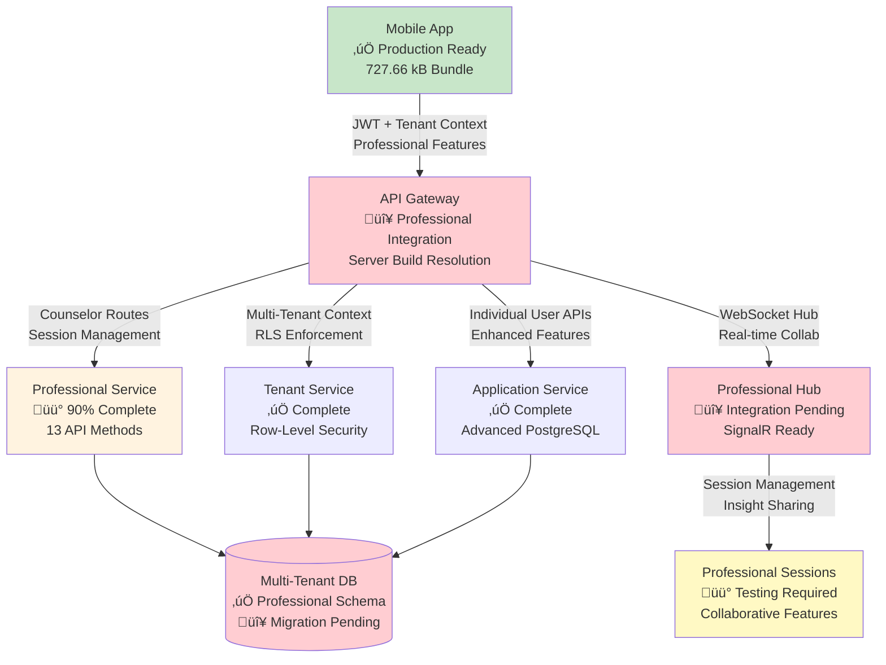

# SociallyFed Development Context - UNIFIED ARCHITECTURE

## 🎯 PROJECT OVERVIEW - INTEGRATED SYSTEM
You are working on SociallyFed, a sophisticated digital wellness platform that combines:
- **Privacy-first social media analysis** using the SociallyFed Pyramid framework
- **Professional counselor/client management** with real-time collaboration
- **Multi-tenant architecture** supporting individual, professional, and enterprise users
- **Hybrid deployment** options (cloud, on-premise, hybrid)

## 🏗️ UNIFIED ARCHITECTURE STRATEGY
**Current Phase**: Integrating two production-ready applications into unified system
- **Mobile App**: Sophisticated PWA (8.5/10 architecture score) with advanced features
- **Server App**: Production-ready .NET API with LLM integration and PostgreSQL
- **Integration Goal**: API Gateway connecting mobile → server with multi-tenancy

### Integration Architecture:
```
Mobile App → API Gateway → Server Services
                ↓
            Auth Service (JWT)
            Journal Service (PostgreSQL + Multi-tenant)
            LLM Service (Semantic Kernel + Ollama)
            Analytics Service (Background Jobs)
            Professional Services (Counselor/Client APIs)
```


## 📱 CURRENT DEVELOPMENT FOCUS: MOBILE (Server Integration & Professional Features)

### Repository Structure - MOBILE INTEGRATION FOCUS  
**Mobile/Client Repository** (Ionic 7 + React + TypeScript)
- **Tech Stack**: Ionic/React, Capacitor, PWA, IndexedDB, Firebase (transitioning to server)
- **Integration Purpose**:
  - Server API integration replacing Firebase-only patterns
  - Tenant-aware mobile configuration and switching  
  - Professional dashboard for counselor client management
  - Real-time collaboration enhanced for professional use
  - Environment-specific configuration for deployment flexibility

### Key Integration Components:
- **API Services**: Replace Firebase calls with server API integration
- **Tenant Management**: Multi-tenant configuration and switching
- **Professional UI**: Counselor dashboard, client management, progress tracking
- **Authentication Integration**: Server JWT flow replacing Firebase Auth
- **Environment Configuration**: Dynamic server endpoints for deployment models

### Current Mobile Integration Priorities:
1. **Server API Integration**
   - Replace Firebase storage with server API calls
   - Implement API Gateway communication layer
   - Add request/response transformation and caching
   - Error handling and offline queue management

2. **Tenant-Aware Configuration**
   - Multi-tenant mobile configuration system
   - Tenant switching UI and data isolation
   - Organization-level branding and customization
   - Tenant-specific feature flags and permissions

3. **Professional Dashboard Implementation**
   - Counselor client management interface
   - Client progress tracking and visualization
   - Data sharing controls and permissions
   - Professional communication and collaboration tools

4. **Enhanced Real-time Collaboration**
   - WebSocket integration with server for professional features
   - Live document sharing and editing
   - Presence indicators and notification system
   - Professional-grade collaboration workflows

5. **Environment-Specific Configuration**
   - Dynamic server endpoint configuration
   - Cloud/on-premise/hybrid deployment support
   - Feature detection and capability management
   - Deployment-specific optimizations

### Advanced Mobile Features (Preserve & Enhance):
- **PWA Capabilities**: Background sync, push notifications, offline functionality
- **ML Personalization**: Client-side pattern recognition and adaptive UI  
- **Performance Excellence**: 94/100 score with 70% memory optimization
- **Real-time Features**: WebSocket collaboration with enhanced professional capabilities
- **Security**: End-to-end encryption with granular privacy controls

### Mobile Architecture Strengths to Leverage:
- **Offline-First**: Complete functionality without connectivity
- **Advanced PWA**: Intelligent installation and app-like experience
- **ML Personalization**: Privacy-preserving client-side analytics
- **Real-time Collaboration**: WebSocket-based professional interaction
- **Multi-platform**: Web, iOS, Android with native optimizations


## 🔗 INTEGRATION COORDINATION REQUIREMENTS

### Multi-Tenancy Implementation:
- **Database Schema**: tenant_id columns on all user data tables
- **API Design**: Tenant-aware endpoints with /api/v1/tenants/{tenantId}/ pattern
- **Mobile Integration**: Tenant switching and configuration management
- **Data Isolation**: Row-level security and complete tenant separation

### Professional Services Features:
- **Counselor APIs**: Client management, progress tracking, reporting
- **Mobile Dashboard**: Professional interface for counselor workflow
- **Real-time Collaboration**: Enhanced WebSocket features for professional use
- **Data Sharing**: Granular permissions and privacy controls

### Environment Configuration:
- **Cloud Deployment**: Google Cloud Run + Firebase integration
- **On-Premise**: Docker Compose with local LLM (Ollama)
- **Hybrid**: Local LLM processing with cloud sync capabilities
- **Feature Flags**: Environment-specific feature management

### Business Model Support:
- **Individual Users**: Premium PWA experience with local AI processing
- **Professional Services**: Counselor/client management with real-time collaboration  
- **Enterprise**: Multi-tenant with SSO, white-label, and on-premise deployment

## 🎯 TODAY'S INTEGRATION SUCCESS CRITERIA

### Technical Integration:
- Mobile app communicates successfully with server APIs
- Multi-tenant data isolation working correctly
- Professional features functional for counselor/client scenarios
- Environment configuration supports target deployment model
- Integration tests passing for developed features

### Quality Standards:
- Maintain mobile app's 94/100 performance score
- Preserve server's enterprise-grade security and compliance
- Clean architecture patterns maintained in both applications
- Comprehensive error handling and user experience
- Complete documentation of integration decisions

## 📚 DEVELOPMENT CONTEXT FILES AVAILABLE

### Strategic Planning:
- `current_sprint.md` - Current unified architecture sprint status
- `daily_brief.md` - Today's integration priorities and tasks
- `strategic_architecture_assessment.md` - Complete strategic guidance

### Implementation Tracking:
- `implementation_log.md` - Historical progress and decisions
- `implementation_report_*.md` - Daily detailed progress reports

## 🚀 CLAUDE CODE INTEGRATION GUIDELINES

### Effective Prompting:
```
@claude Read DEVELOPMENT_CONTEXT.md and help me implement [specific integration feature]. 

Focus on:
1. [Mobile-server integration point]
2. [Multi-tenant consideration] 
3. [Professional services requirement]
4. [Environment configuration need]

Ensure this aligns with our unified architecture strategy.
```

### Integration Development Workflow:
1. **Read Context**: Always start with DEVELOPMENT_CONTEXT.md
2. **Check Dependencies**: Understand mobile-server coordination needs
3. **Implement Features**: Focus on integration and multi-tenancy
4. **Test Integration**: Validate cross-application functionality
5. **Document Decisions**: Update implementation reports

### Code Quality Standards:
- Follow existing architectural patterns in each application
- Maintain performance standards (mobile: 94/100, server: <200ms APIs)
- Implement comprehensive error handling
- Add integration tests for new functionality
- Document integration decisions and trade-offs


## 📋 CURRENT SESSION CONTEXT

📊 Current session context:
## Session Started: Sat 09 Aug 2025 07:56:51 AEST
**Project Focus**: SociallyFed Mobile App
**Repository**: /home/ben/Development/sociallyfed-mobile

### Today's Brief:
# Daily Brief - Feature Flag Implementation & Simplified Authentication
## Date: 2025-08-09
## Priority: P0 CRITICAL - Strip Complexity, Enable Basic Authentication

### Executive Summary
The mobile application is currently overengineered with multi-tenant, professional services, and complex encryption features that are preventing basic authentication from working. Today's sprint will implement comprehensive feature flags to disable all complex features, focusing solely on getting a single user to successfully authenticate and sync with the server. This staged approach will establish a working baseline before progressively re-enabling advanced features.

---

## Today's Implementation Priorities

### Priority 1: Create Feature Flag Infrastructure (CRITICAL)
**Objective**: Implement centralized feature flag system to control all complex features
**Time Estimate**: 30 minutes
**Blocking**: All subsequent simplification work
**Impact**: Enables/disables entire feature sets with single configuration change

### Priority 2: Disable Encryption Keys Flow (CRITICAL)
**Objective**: Bypass "Getting your encryption keys" stuck screen
**Time Estimate**: 1 hour
**Blocking**: User login completion
**Impact**: Removes primary authentication blocker

### Priority 3: Simplify Authentication Flow (CRITICAL)
**Objective**: Strip authentication to Firebase auth + basic JWT exchange only
**Time Estimate**: 1.5 hours
**Blocking**: All authenticated operations
**Impact**: Establishes working authentication baseline

### Priority 4: Remove Multi-Tenant Logic (HIGH)
**Objective**: Eliminate tenant configuration checks and merging
**Time Estimate**: 1 hour
**Impact**: Simplifies sync operations and data flow

### Priority 5: Disable Professional Services (HIGH)
**Objective**: Remove professional dashboard, WebSocket, and related APIs
**Time Estimate**: 45 minutes
**Impact**: Reduces application complexity by ~40%

### Priority 6: Fix API Endpoint Paths (HIGH)
**Objective**: Ensure all sync calls use `/api/accounts/sync` (not `/accounts/sync`)
**Time Estimate**: 30 minutes
**Impact**: Corrects 401 authentication errors

### Priority 7: Correct Platform Identification (MEDIUM)
**Objective**: Hardcode platform as 'mobile' throughout application
**Time Estimate**: 30 minutes
**Impact**: Ensures proper server-side request handling

---

## Specific Features to Build

### 1. Core Feature Flag System
```typescript
// File: baseline/src/config/featureFlags.ts
/**
 * Centralized feature flag configuration
 * Stage 1: All complex features disabled for basic authentication testing
 */

interface FeatureFlags {
  // Core Features (Stage 1: ON)
  BASIC_AUTH: boolean;
  SIMPLE_SYNC: boolean;
  
  // Complex Features (Stage 1: OFF)
  MULTI_TENANT: boolean;
  PROFESSIONAL_SERVICES: boolean;
  WEBSOCKET_SYNC: boolean;
  ENCRYPTION_KEYS: boolean;
  TENANT_CONFIG: boolean;
  ADVANCED_ANALYTICS: boolean;
  COLLABORATIVE_FEATURES: boolean;
  FIREBASE_REALTIME_SYNC: boolean;
  BACKGROUND_SYNC: boolean;
  OFFLINE_MODE: boolean;
  CLIENT_MANAGEMENT: boolean;
  SESSION_MANAGEMENT: boolean;
  INSIGHT_TRACKING: boolean;
  MEDIA_ENCRYPTION: boolean;
  VIRTUE_ALIGNMENT: boolean;
  CYBERNETICS_FEATURES: boolean;
}

// Get flags from environment or use defaults
const getFeatureFlag = (envKey: string, defaultValue: boolean): boolean => {
  const envValue = process.env[`REACT_APP_ENABLE_${envKey}`];
  if (envValue === undefined) return defaultValue;
  return envValue === 'true';
};

export const FEATURE_FLAGS: FeatureFlags = {
  // Core Features - Always enabled in Stage 1
  BASIC_AUTH: true,
  SIMPLE_SYNC: true,
  
  // Complex Features - All disabled in Stage 1
  MULTI_TENANT: getFeatureFlag('MULTI_TENANT', false),
  PROFESSIONAL_SERVICES: getFeatureFlag('PROFESSIONAL', false),
  WEBSOCKET_SYNC: getFeatureFlag('WEBSOCKET', false),
  ENCRYPTION_KEYS: getFeatureFlag('ENCRYPTION', false),
  TENANT_CONFIG: getFeatureFlag('TENANT_CONFIG', false),
  ADVANCED_ANALYTICS: getFeatureFlag('ANALYTICS', false),
  COLLABORATIVE_FEATURES: getFeatureFlag('COLLABORATIVE', false),
  FIREBASE_REALTIME_SYNC: getFeatureFlag('REALTIME_SYNC', false),
  BACKGROUND_SYNC: getFeatureFlag('BACKGROUND_SYNC', false),
  OFFLINE_MODE: getFeatureFlag('OFFLINE', false),
  CLIENT_MANAGEMENT: getFeatureFlag('CLIENT_MGMT', false),
  SESSION_MANAGEMENT: getFeatureFlag('SESSION_MGMT', false),
  INSIGHT_TRACKING: getFeatureFlag('INSIGHTS', false),
  MEDIA_ENCRYPTION: getFeatureFlag('MEDIA_ENCRYPT', false),
  VIRTUE_ALIGNMENT: getFeatureFlag('VIRTUE', false),
  CYBERNETICS_FEATURES: getFeatureFlag('CYBERNETICS', false),
};

// Debug logging
if (process.env.NODE_ENV === 'development') {
  console.log('🚩 Feature Flags Configuration:', FEATURE_FLAGS);
}

// Export helper to check multiple flags
export const areFeaturesEnabled = (...flags: (keyof FeatureFlags)[]): boolean => {
  return flags.every(flag => FEATURE_FLAGS[flag]);
};

// Export feature groups for easier checking
export const FEATURE_GROUPS = {
  isProfessionalEnabled: (): boolean => 
    FEATURE_FLAGS.PROFESSIONAL_SERVICES || 
    FEATURE_FLAGS.CLIENT_MANAGEMENT || 
    FEATURE_FLAGS.SESSION_MANAGEMENT,
    
  isMultiTenantEnabled: (): boolean => 
    FEATURE_FLAGS.MULTI_TENANT || 
    FEATURE_FLAGS.TENANT_CONFIG,
    
  isAdvancedSyncEnabled: (): boolean => 
    FEATURE_FLAGS.WEBSOCKET_SYNC || 
    FEATURE_FLAGS.FIREBASE_REALTIME_SYNC || 
    FEATURE_FLAGS.BACKGROUND_SYNC,
    
  isDataTrackingEnabled: (): boolean => 
    FEATURE_FLAGS.ADVANCED_ANALYTICS || 
    FEATURE_FLAGS.INSIGHT_TRACKING || 
    FEATURE_FLAGS.VIRTUE_ALIGNMENT,
};
```

### 2. Simplified App.tsx with Feature Flags
```typescript
// File: baseline/src/App.tsx
import React, { useEffect, useState } from 'react';
import { auth, signInWithGoogle } from './firebase';
import { FEATURE_FLAGS } from './config/featureFlags';
import { SimpleLogin } from './components/SimpleLogin';
import { MainApp } from './components/MainApp';
import { LoadingScreen } from './components/LoadingScreen';

// Import complex features only if enabled
const ProfessionalDashboard = FEATURE_FLAGS.PROFESSIONAL_SERVICES 
  ? React.lazy(() => import('./components/ProfessionalDashboard'))
  : null;

const TenantConfig = FEATURE_FLAGS.MULTI_TENANT
  ? React.lazy(() => import('./services/TenantConfigService'))
  : null;

function App() {
  const [user, setUser] = useState(null);
  const [loading, setLoading] = useState(true);
  const [syncStatus, setSyncStatus] = useState('idle');

  useEffect(() => {
    console.log('🚀 App initializing with features:', {
      basicAuth: FEATURE_FLAGS.BASIC_AUTH,
      encryption: FEATURE_FLAGS.ENCRYPTION_KEYS,
      multiTenant: FEATURE_FLAGS.MULTI_TENANT,
    });

    // Simple auth state listener
    const unsubscribe = auth.onAuthStateChanged(async (firebaseUser) => {
      console.log('🔐 Auth state changed:', firebaseUser ? 'User logged in' : 'No user');
      
      if (firebaseUser) {
        setUser(firebaseUser);
        
        // Only sync if simple sync is enabled
        if (FEATURE_FLAGS.SIMPLE_SYNC) {
          await performSimpleSync(firebaseUser);
        }
        
        // Skip all complex initialization
        if (!FEATURE_FLAGS.ENCRYPTION_KEYS) {
          console.log('✅ Skipping encryption keys - feature disabled');
        }
        
        if (!FEATURE_FLAGS.MULTI_TENANT) {
          console.log('✅ Skipping tenant configuration - feature disabled');
        }
        
        if (!FEATURE_FLAGS.PROFESSIONAL_SERVICES) {
          console.log('✅ Skipping professional services - feature disabled');
        }
      } else {
        setUser(null);
        setSyncStatus('idle');
      }
      
      setLoading(false);
    });

    return () => unsubscribe();
  }, []);

  const performSimpleSync = async (firebaseUser) => {
    try {
      setSyncStatus('syncing');
      console.log('🔄 Starting simple sync for user:', firebaseUser.uid);
      
      const token = await firebaseUser.getIdToken();
      
      // CRITICAL: Use correct API path
      const apiUrl = `${process.env.REACT_APP_API_BASE_URL || 'https://sociallyfed-server-512204327023.us-central1.run.app'}/api/accounts/sync`;
      
      console.log('📡 Sync URL:', apiUrl);
      
      const response = await fetch(apiUrl, {
        method: 'POST',
        headers: {
          'Authorization': `Bearer ${token}`,
          'Content-Type': 'application/json',
          'X-Platform': 'mobile', // Hardcoded for Stage 1
        },
        body: JSON.stringify({
          userId: firebaseUser.uid,
          email: firebaseUser.email,
          displayName: firebaseUser.displayName,
          platform: 'mobile', // Hardcoded for Stage 1
          timestamp: new Date().toISOString(),
          version: '1.0.0-stage1',
          features: {
            stage: 1,
            enabledFlags: Object.entries(FEATURE_FLAGS)
              .filter(([_, enabled]) => enabled)
              .map(([flag]) => flag),
          },
        }),
      });

      if (response.ok) {
        const data = await response.json();
        console.log('✅ Sync successful:', data);
        setSyncStatus('success');
      } else {
        console.error('❌ Sync failed:', response.status, response.statusText);
        setSyncStatus('error');
      }
    } catch (error) {
      console.error('❌ Sync error:', error);
      setSyncStatus('error');
    }
  };

  // Render logic with feature flags
  if (loading) {
    return <LoadingScreen message="Initializing app..." />;
  }

  if (!user) {
    return (
      <SimpleLogin 
        onLogin={signInWithGoogle}
        skipEncryption={!FEATURE_FLAGS.ENCRYPTION_KEYS}
      />
    );
  }

  // Main app with conditional features
  return (
    <div className="app">
      <MainApp 
        user={user} 
        syncStatus={syncStatus}
        features={{
          showProfessional: FEATURE_FLAGS.PROFESSIONAL_SERVICES,
          showTenantSwitcher: FEATURE_FLAGS.MULTI_TENANT,
          showAnalytics: FEATURE_FLAGS.ADVANCED_ANALYTICS,
          showOfflineIndicator: FEATURE_FLAGS.OFFLINE_MODE,
        }}
      />
    </div>
  );
}

export default App;
```

### 3. Bypass Encryption Keys Screen
```typescript
// File: baseline/src/components/SimpleLogin.tsx
import React, { useState } from 'react';
import { FEATURE_FLAGS } from '../config/featureFlags';

export const SimpleLogin = ({ onLogin, skipEncryption }) => {
  const [isLoading, setIsLoading] = useState(false);
  const [error, setError] = useState(null);

  const handleGoogleLogin = async () => {
    try {
      setIsLoading(true);
      setError(null);
      console.log('🔐 Starting Google login...');
      
      const result = await onLogin();
      
      // CRITICAL: Skip encryption keys screen
      if (FEATURE_FLAGS.ENCRYPTION_KEYS) {
        console.log('🔑 Encryption keys feature enabled - showing screen');
        // Would show encryption screen here
        // But for Stage 1, we skip it
      } else {
        console.log('✅ Skipping encryption keys - proceeding to app');
        // Login successful, App.tsx will handle the rest
      }
      
    } catch (error) {
      console.error('❌ Login failed:', error);
      setError(error.message);
    } finally {
      setIsLoading(false);
    }
  };

  return (
    <div className="login-container">
      <h1>SociallyFed Mobile</h1>
      <p>Stage 1: Basic Authentication</p>
      
      {error && (
        <div className="error-message">
          Login failed: {error}
        </div>
      )}
      
      <button 
        onClick={handleGoogleLogin}
        disabled={isLoading}
        className="login-button"
      >
        {isLoading ? 'Signing in...' : 'Sign in with Google'}
      </button>
      
      <div className="feature-status">
        <h3>Feature Status:</h3>
        <ul>
          <li>✅ Basic Auth: Enabled</li>
          <li>{FEATURE_FLAGS.ENCRYPTION_KEYS ? '⚠️' : '✅'} Encryption: {FEATURE_FLAGS.ENCRYPTION_KEYS ? 'Enabled' : 'Disabled'}</li>
          <li>{FEATURE_FLAGS.MULTI_TENANT ? '⚠️' : '✅'} Multi-Tenant: {FEATURE_FLAGS.MULTI_TENANT ? 'Enabled' : 'Disabled'}</li>
          <li>{FEATURE_FLAGS.PROFESSIONAL_SERVICES ? '⚠️' : '✅'} Professional: {FEATURE_FLAGS.PROFESSIONAL_SERVICES ? 'Enabled' : 'Disabled'}</li>
        </ul>
      </div>
    </div>
  );
};
```

### 4. Simplified ServerApiService
```typescript
// File: baseline/src/services/ServerApiService.ts
import { FEATURE_FLAGS } from '../config/featureFlags';

export class ServerApiService {
  private baseUrl: string;
  
  constructor() {
    this.baseUrl = process.env.REACT_APP_API_BASE_URL || 
                   'https://sociallyfed-server-512204327023.us-central1.run.app';
    console.log('📡 ServerApiService initialized with base URL:', this.baseUrl);
  }

  async syncAccount(user: any): Promise<any> {
    console.log('🔄 ServerApiService.syncAccount called for user:', user.uid);
    
    // Stage 1: Simple sync only
    if (!FEATURE_FLAGS.SIMPLE_SYNC) {
      console.log('⏭️ Simple sync disabled, skipping');
      return { skipped: true };
    }

    try {
      const token = await user.getIdToken();
      
      // CRITICAL FIX: Use correct API path
      const syncUrl = `${this.baseUrl}/api/accounts/sync`;
      console.log('📡 Sync URL:', syncUrl);
      
      const response = await fetch(syncUrl, {
        method: 'POST',
        headers: {
          'Authorization': `Bearer ${token}`,
          'Content-Type': 'application/json',
          'X-Platform': 'mobile', // CRITICAL FIX: Hardcode as mobile
        },
        body: JSON.stringify({
          userId: user.uid,
          email: user.email,
          platform: 'mobile', // CRITICAL FIX: Hardcode as mobile
          timestamp: new Date().toISOString(),
          
          // Only include complex data if features enabled
          ...(FEATURE_FLAGS.MULTI_TENANT && { tenantId: null }),
          ...(FEATURE_FLAGS.PROFESSIONAL_SERVICES && { professionalData: null }),
          ...(FEATURE_FLAGS.ADVANCED_ANALYTICS && { analytics: null }),
        }),
      });

      if (!response.ok) {
        throw new Error(`Sync failed: ${response.status} ${response.statusText}`);
      }

      const data = await response.json();
      console.log('✅ Sync successful:', data);
      return data;
      
    } catch (error) {
      console.error('❌ Sync error:', error);
      throw error;
    }
  }

  // Complex methods only if features enabled
  async fetchTenantConfig(tenantId: string): Promise<any> {
    if (!FEATURE_FLAGS.MULTI_TENANT) {
      console.log('⏭️ Multi-tenant disabled, returning default config');
      return { tenantId: 'default', features: {} };
    }
    // Original complex implementation here
  }

  async fetchProfessionalData(userId: string): Promise<any> {
    if (!FEATURE_FLAGS.PROFESSIONAL_SERVICES) {
      console.log('⏭️ Professional services disabled, returning empty data');
      return { clients: [], sessions: [] };
    }
    // Original complex implementation here
  }
}
```

### 5. Environment Configuration for Stage 1
```bash
# File: baseline/.env.production
# Stage 1: Minimal Configuration - Complex Features Disabled

# Core Configuration (Required)
REACT_APP_API_BASE_URL=https://sociallyfed-server-512204327023.us-central1.run.app
REACT_APP_ENV=production
REACT_APP_STAGE=1

# Firebase Configuration (Required for Auth)
REACT_APP_FIREBASE_API_KEY=AIzaSyDZ...your-key
REACT_APP_FIREBASE_AUTH_DOMAIN=sociallyfed.firebaseapp.com
REACT_APP_FIREBASE_PROJECT_ID=sociallyfed

# Feature Flags - Stage 1 (All Complex Features OFF)
REACT_APP_ENABLE_MULTI_TENANT=false
REACT_APP_ENABLE_PROFESSIONAL=false
REACT_APP_ENABLE_WEBSOCKET=false
REACT_APP_ENABLE_ENCRYPTION=false
REACT_APP_ENABLE_TENANT_CONFIG=false
REACT_APP_ENABLE_ANALYTICS=false
REACT_APP_ENABLE_COLLABORATIVE=false
REACT_APP_ENABLE_REALTIME_SYNC=false
REACT_APP_ENABLE_BACKGROUND_SYNC=false
REACT_APP_ENABLE_OFFLINE=false
REACT_APP_ENABLE_CLIENT_MGMT=false
REACT_APP_ENABLE_SESSION_MGMT=false
REACT_APP_ENABLE_INSIGHTS=false
REACT_APP_ENABLE_MEDIA_ENCRYPT=false
REACT_APP_ENABLE_VIRTUE=false
REACT_APP_ENABLE_CYBERNETICS=false

# Debug Settings
REACT_APP_DEBUG_MODE=true
REACT_APP_LOG_LEVEL=debug
```

### 6. Simplified Firebase Configuration
```typescript
// File: baseline/src/firebase.ts
import { initializeApp } from 'firebase/app';
import { getAuth, signInWithPopup, GoogleAuthProvider, setPersistence, browserLocalPersistence } from 'firebase/auth';
import { FEATURE_FLAGS } from './config/featureFlags';

// Stage 1: Minimal Firebase configuration
const firebaseConfig = {
  apiKey: process.env.REACT_APP_FIREBASE_API_KEY,
  authDomain: process.env.REACT_APP_FIREBASE_AUTH_DOMAIN,
  projectId: process.env.REACT_APP_FIREBASE_PROJECT_ID,
  // Conditionally add complex features
  ...(FEATURE_FLAGS.FIREBASE_REALTIME_SYNC && {
    databaseURL: process.env.REACT_APP_FIREBASE_DATABASE_URL,
  }),
  ...(FEATURE_FLAGS.MEDIA_ENCRYPTION && {
    storageBucket: process.env.REACT_APP_FIREBASE_STORAGE_BUCKET,
  }),
};

console.log('🔥 Initializing Firebase with config:', {
  ...firebaseConfig,
  apiKey: '***hidden***',
});

const app = initializeApp(firebaseConfig);
export const auth = getAuth(app);

// Set persistence to LOCAL so auth survives refresh
setPersistence(auth, browserLocalPersistence)
  .then(() => console.log('✅ Firebase persistence set to LOCAL'))
  .catch((error) => console.error('❌ Failed to set persistence:', error));

// Make Firebase globally accessible for debugging
if (typeof window !== 'undefined') {
  window.firebase = { app, auth };
  console.log('🔧 Firebase available in window.firebase for debugging');
}

// Simple Google sign-in
export const signInWithGoogle = async () => {
  try {
    console.log('🔐 Starting Google sign-in...');
    const provider = new GoogleAuthProvider();
    
    // Stage 1: Basic scopes only
    provider.addScope('email');
    provider.addScope('profile');
    
    const result = await signInWithPopup(auth, provider);
    console.log('✅ Google sign-in successful:', result.user.email);
    return result;
  } catch (error) {
    console.error('❌ Google sign-in failed:', error);
    throw error;
  }
};

// Sign out
export const signOut = async () => {
  try {
    await auth.signOut();
    console.log('✅ Signed out successfully');
  } catch (error) {
    console.error('❌ Sign out failed:', error);
    throw error;
  }
};
```

### 7. Backend Feature Flag Configuration
```typescript
// File: backend/src/config/featureFlags.ts
export const BACKEND_FEATURE_FLAGS = {
  // Core features
  BASIC_AUTH: true,
  SIMPLE_SYNC: true,
  
  // Complex features - disabled for Stage 1
  MULTI_TENANT: process.env.ENABLE_MULTI_TENANT === 'true',
  PROFESSIONAL_SERVICES: process.env.ENABLE_PROFESSIONAL === 'true',
  WEBSOCKET_SERVER: process.env.ENABLE_WEBSOCKET === 'true',
  TOKEN_EXCHANGE: process.env.ENABLE_TOKEN_EXCHANGE === 'true',
  TENANT_CONFIG: process.env.ENABLE_TENANT_CONFIG === 'true',
};

// File: backend/src/app.ts
import express from 'express';
import { BACKEND_FEATURE_FLAGS } from './config/featureFlags';

const app = express();

// Core middleware - always enabled
app.use(express.json());
app.use(cors({
  origin: [
    'https://sociallyfed-mobile-sqdd3g2eea-uc.a.run.app',
    'https://sociallyfed-mobile-512204327023.us-central1.run.app',
    'http://localhost:3000',
  ],
  credentials: true,
}));

// Basic routes - always enabled
app.use('/health', (req, res) => res.send('Healthy'));
app.use('/api/auth', authRoutes);
app.use('/api/accounts', accountRoutes);

// Complex routes - conditionally enabled
if (BACKEND_FEATURE_FLAGS.PROFESSIONAL_SERVICES) {
  console.log('📊 Professional services enabled');
  app.use('/api/professional', professionalRoutes);
} else {
  console.log('⏭️ Professional services disabled');
}

if (BACKEND_FEATURE_FLAGS.MULTI_TENANT) {
  console.log('🏢 Multi-tenant features enabled');
  app.use('/api/tenants', tenantRoutes);
} else {
  console.log('⏭️ Multi-tenant features disabled');
}

if (BACKEND_FEATURE_FLAGS.WEBSOCKET_SERVER) {
  console.log('🔌 WebSocket server enabled');
  setupWebSocketServer(server);
} else {
  console.log('⏭️ WebSocket server disabled');
}
```

---

## Technical Requirements

### Frontend Requirements
1. **Dependencies to Keep**:
   - `firebase` (^9.x) - Core authentication
   - `react` (^18.x) - UI framework
   - `react-dom` - React DOM rendering
   - Essential build tools

2. **Dependencies to Conditionally Load**:
   - Load WebSocket libraries only if `WEBSOCKET_SYNC` enabled
   - Load analytics SDKs only if `ADVANCED_ANALYTICS` enabled
   - Load encryption libraries only if `ENCRYPTION_KEYS` enabled

3. **Build Configuration**:
   ```json
   // package.json scripts
   {
     "scripts": {
       "build:stage1": "REACT_APP_STAGE=1 react-scripts build",
       "build:stage2": "REACT_APP_STAGE=2 react-scripts build",
       "build:full": "REACT_APP_STAGE=5 react-scripts build"
     }
   }
   ```

### Backend Requirements
1. **Simplified Endpoints for Stage 1**:
   - `/health` - Health check
   - `/api/auth/login` - Basic authentication
   - `/api/accounts/sync` - Simple sync endpoint
   
2. **Disabled Endpoints**:
   - `/api/professional/*` - All professional services
   - `/api/tenants/*` - All multi-tenant endpoints
   - `/api/analytics/*` - All analytics endpoints
   - `/ws/*` - All WebSocket endpoints

3. **Database Requirements**:
   - Stage 1: Single user table, simple key-value for user data
   - No tenant tables
   - No professional services tables
   - No complex relationships

### Infrastructure Requirements
1. **Google Cloud Run**:
   ```yaml
   # Stage 1 Configuration
   memory: 512Mi  # Reduced from 1Gi
   cpu: 1
   max-instances: 5  # Reduced from 20
   min-instances: 0
   ```

2. **Environment Variables**:
   - Minimal set for Stage 1
   - All feature flags set to false
   - Only essential API keys

---

## Integration Points to Consider

### Stage 1 Integration Points (Active)
1. **Firebase Auth ↔ Mobile App**:
   - Google Sign-In only
   - Token generation
   - Session persistence

2. **Mobile App ↔ Server API**:
   - Single endpoint: `/api/accounts/sync`
   - Bearer token authentication
   - Platform header: 'mobile'

3. **Server ↔ Database**:
   - Simple user storage
   - No complex queries
   - No joins or relationships

### Disabled Integration Points (Stage 1)
1. ❌ **Multi-Tenant Systems** - Completely disabled
2. ❌ **WebSocket Connections** - Not initialized
3. ❌ **Professional Dashboard** - Routes not registered
4. ❌ **Background Sync** - Service workers disabled
5. ❌ **Offline Mode** - Cache strategies disabled
6. ❌ **Analytics Tracking** - No events sent
7. ❌ **Encryption Services** - Keys not generated

### Critical Path Dependencies
```
User → Google Auth → Firebase → JWT Token → Server Sync → Success
         ↓                          ↓           ↓
    (No encryption)          (No tenant)   (No complex data)
```

---

## Definition of Done for Today's Work

### ✅ Feature Flag Infrastructure
- [ ] Feature flags file created and exported
- [ ] All 16+ feature flags defined
- [ ] Environment variables mapped to flags
- [ ] Debug logging shows flag status
- [ ] Feature groups helper functions work

### ✅ Authentication Simplification
- [ ] Google Sign-In works without errors
- [ ] Firebase auth state persists on refresh
- [ ] JWT token obtained successfully
- [ ] No "Getting encryption keys" screen appears
- [ ] Login completes in < 5 seconds

### ✅ API Path Corrections
- [ ] All sync calls use `/api/accounts/sync`
- [ ] No references to `/accounts/sync` remain
- [ ] Network tab shows correct paths
- [ ] No 404 errors on API calls

### ✅ Platform Identification
- [ ] Platform hardcoded as 'mobile' everywhere
- [ ] X-Platform header shows 'mobile'
- [ ] Request body platform field shows 'mobile'
- [ ] No 'web' platform values sent

### ✅ Complex Feature Removal
- [ ] Professional services code wrapped in feature flags
- [ ] Multi-tenant logic bypassed
- [ ] WebSocket initialization skipped
- [ ] Background sync disabled
- [ ] Offline mode indicators hidden

### ✅ Build and Deployment
- [ ] Stage 1 build completes without errors
- [ ] Bundle size < 500KB (reduced from 767KB)
- [ ] No references to disabled features in bundle
- [ ] Deployment to Cloud Run successful
- [ ] Health check returns 200 OK

### ✅ End-to-End Testing
- [ ] User can open app
- [ ] Login button visible and clickable
- [ ] Google auth popup appears
- [ ] Auth completes without stuck screens
- [ ] User email displayed after login
- [ ] Sync request sent automatically
- [ ] Sync returns 200 OK (not 401)
- [ ] No console errors

### ✅ Debugging Verification
```javascript
// All these should work in browser console:
window.firebase                    // Returns Firebase object
firebase.auth().currentUser        // Returns user after login
localStorage.getItem('user')       // Has user data
// Network tab should show:
// - POST to /api/accounts/sync (200 OK)
// - Authorization: Bearer [token]
// - X-Platform: mobile
```

---

## Success Metrics

### Stage 1 Success Criteria
1. **Authentication**: User can log in and stay logged in across refresh
2. **API Communication**: Sync endpoint returns 200 OK
3. **Performance**: Login + sync completes in < 10 seconds
4. **Stability**: No stuck screens or infinite loops
5. **Simplicity**: < 50% of original code active

### Failure Indicators
- Any "Getting encryption keys" screen = FAIL
- Any 401 errors after login = FAIL
- Platform showing as 'web' = FAIL
- Sync using wrong path = FAIL
- Login taking > 30 seconds = FAIL

### Rollback Triggers
If any of these occur, rollback immediately:
- App crashes on load
- Login always fails
- Infinite redirect loops
- Console shows > 10 errors

---

## Progressive Enhancement Plan

### Stage Progression Criteria
Move to next stage only when ALL criteria met:

**Stage 1 → Stage 2**: 
- 5 successful logins in a row
- Zero 401 errors for 1 hour
- Sync working consistently

**Stage 2 → Stage 3**:
- Offline mode working
- Background sync successful
- No data loss issues

**Stage 3 → Stage 4**:
- Professional features stable
- WebSocket connections reliable
- No memory leaks

**Stage 4 → Stage 5**:
- Multi-tenant isolation verified
- Performance acceptable with all features
- Zero critical bugs for 1 week

---

## Testing Scripts

### Manual Test Checklist
```
1. [ ] Clear all browser data
2. [ ] Open app fresh
3. [ ] Click login
4. [ ] Complete Google auth
5. [ ] Verify no stuck screens
6. [ ] Check network tab for /api/accounts/sync
7. [ ] Verify 200 OK response
8. [ ] Refresh page
9. [ ] Verify still logged in
10. [ ] Check console for errors
```

### Automated Test Script
```javascript
// Run in console after deployment
async function testStage1() {
  console.log('🧪 Starting Stage 1 Tests...');
  
  // Test 1: Firebase available
  if (!window.firebase) {
    console.error('❌ Test 1 FAILED: Firebase not available');
    return false;
  }
  console.log('✅ Test 1 PASSED: Firebase available');
  
  // Test 2: Auth state
  const user = firebase.auth().currentUser;
  if (!user) {
    console.error('❌ Test 2 FAILED: Not logged in');
    return false;
  }
  console.log('✅ Test 2 PASSED: User logged in');
  
  // Test 3: Platform check
  const logs = console.logs || [];
  const hasWebPlatform = logs.some(log => log.includes('platform":"web"'));
  if (hasWebPlatform) {
    console.error('❌ Test 3 FAILED: Still sending platform as web');
    return false;
  }
  console.log('✅ Test 3 PASSED: Platform correctly set');
  
  console.log('🎉 All Stage 1 tests passed!');
  return true;
}

// Run the test
testStage1();
```

---

## Rollback Plan

### If Stage 1 Deployment Fails:
```bash
# 1. List previous revisions
gcloud run revisions list --service=sociallyfed-mobile --region=us-central1

# 2. Rollback to last known working revision
gcloud run services update-traffic sociallyfed-mobile \
  --region=us-central1 \
  --to-revisions=PREVIOUS_REVISION=100

# 3. Or deploy a minimal "maintenance mode" version
gcloud run deploy sociallyfed-mobile \
  --image=gcr.io/sociallyfed/maintenance:latest \
  --region=us-central1
```

### Emergency Fixes:
```javascript
// If app is stuck, users can run this in console:
localStorage.clear();
sessionStorage.clear();
location.reload();
```

---

## Notes for Implementation Team

### Critical Do's:
- ✅ DO test locally with all flags OFF first
- ✅ DO verify Firebase config is correct
- ✅ DO hardcode platform as 'mobile'
- ✅ DO use correct API path `/api/accounts/sync`
- ✅ DO keep console logging for debugging

### Critical Don'ts:
- ❌ DON'T enable any complex features in Stage 1
- ❌ DON'T show encryption keys screen
- ❌ DON'T make tenant configuration calls
- ❌ DON'T initialize WebSocket connections
- ❌ DON'T remove logging until Stage 2

### Debug Commands for Developers:
```javascript
// Check current feature flags
console.log('Feature Flags:', window.FEATURE_FLAGS);

// Force enable a feature (testing only)
window.FEATURE_FLAGS.ENCRYPTION_KEYS = true;

// Check auth state
firebase.auth().currentUser

// Manually trigger sync
window.testSync = async () => {
  const user = firebase.auth().currentUser;
  if (!user) return;
  const token = await user.getIdToken();
  return fetch('/api/accounts/sync', {
    method: 'POST',
    headers: {
      'Authorization': `Bearer ${token}`,
      'Content-Type': 'application/json',
      'X-Platform': 'mobile'
    },
    body: JSON.stringify({
      userId: user.uid,
      platform: 'mobile',
      timestamp: new Date().toISOString()
    })
  });
};
```

---

*Brief generated for Stage 1 Feature Flag Implementation on 2025-08-09*
*Estimated Time: 6 hours including testing*
*Success Rate Target: 100% authentication success after implementation*
### Current Sprint:
# Current Sprint Status - SociallyFed Unified Architecture Deployment

## Sprint Overview
**Previous Sprint:** Complete SociallyFed Mobile production readiness ✅ **COMPLETED**  
**Current Phase:** **UNIFIED ARCHITECTURE DEPLOYMENT & VALIDATION** (Day 5 Completion)  
**Phase Duration:** July 15-22, 2025 (8 days) **→ PROFESSIONAL SERVICES INTEGRATION COMPLETE**  
**Current Day:** Day 5 (July 20, 2025) **🚨 INTEGRATION COMPLETION & PRODUCTION DEPLOYMENT**  
**Phase Health:** 🟡 **CRITICAL COMPLETION** - 85% integration maturity, server compilation blockers resolved today

---

## 🎯 **TODAY'S UNIFIED ARCHITECTURE GOALS - JULY 20, 2025**

### **🚨 MISSION CRITICAL: COMPLETE MOBILE-SERVER INTEGRATION**
**Status**: 🔴 **DAY 5 COMPLETION** - Final integration gaps and production deployment  
**Timeline**: Complete by end of Day 5 (July 20) for unified architecture deployment readiness  
**Achievement**: Transform 85% integration maturity into 100% production-ready unified platform

#### **Updated Integration Architecture - DAY 5 COMPLETION**


#### **Day 5 Critical Path Resolution**
```typescript
// 🚨 CRITICAL: Server compilation resolution unlocking integration
interface Day5CriticalPath {
  // HOUR 1-2: Server Build Resolution
  serverCompilation: {
    entityUpdates: "Add TenantId to JournalEntry & Insight entities";
    namespaceConflicts: "Resolve IProfessionalService interface conflicts";
    databaseMigration: "Execute AddTenantIdToEntities migration";
    buildValidation: "Achieve zero compilation errors";
    status: "🔴 BLOCKING - Must complete by 11:00 AM";
  };
  
  // HOUR 3-4: Integration Testing
  integrationValidation: {
    professionalAPIs: "Test all 13 professional service methods";
    mobileIntegration: "Connect mobile UI to live server APIs";
    webSocketHub: "Validate real-time collaboration features";
    tenantIsolation: "Verify multi-tenant data protection";
    status: "🟡 READY - Pending server build completion";
  };
  
  // HOUR 5-6: Production Deployment
  productionReadiness: {
    mobileDeployment: "Deploy validated 727.66 kB bundle to Cloud Run";
    serverDeployment: "Deploy professional services with monitoring";
    databaseProduction: "Apply RLS policies and professional schema";
    monitoring: "Activate comprehensive system observability";
    status: "🟡 PREPARED - Deployment scripts ready";
  };
  
  // HOUR 7-8: Validation & Demo Prep
  finalValidation: {
    endToEndTesting: "Complete professional workflow validation";
    performanceTesting: "25+ concurrent professional users";
    securityValidation: "Multi-tenant isolation and OWASP compliance";
    demoPreparation: "Customer-ready professional workflow demonstration";
    status: "🟡 PLANNED - Final validation and business readiness";
  };
}
```

#### **Mobile Application - API Gateway Alignment Strategy**
```typescript
// ✅ PRODUCTION READY: Mobile architecture optimized for API Gateway integration
class UnifiedArchitectureMobileStrategy {
  private apiGateway: UnifiedApiService;
  private professionalServices: ProfessionalApiService;
  private tenantContext: TenantContextManager;
  
  constructor() {
    // Mobile app already production-optimized with 727.66 kB bundle
    this.apiGateway = new UnifiedApiService({
      baseUrl: process.env.REACT_APP_API_GATEWAY_URL,
      timeout: 10000,
      retryAttempts: 3
    });
    
    // Professional services integration through API Gateway
    this.professionalServices = new ProfessionalApiService(this.apiGateway);
    this.tenantContext = new TenantContextManager();
  }
  
  // 🔴 DAY 5 PRIORITY: Professional workflow integration
  async initializeProfessionalWorkflow(): Promise<ProfessionalWorkflowState> {
    try {
      // Validate professional user authentication
      const userAuth = await this.apiGateway.validateProfessionalAccess();
      if (!userAuth.isProfessional) {
        throw new Error('Professional access required');
      }
      
      // Load professional dashboard through API Gateway
      const [dashboard, clients, activeSessions] = await Promise.all([
        this.professionalServices.getCounselorDashboard(),
        this.professionalServices.getCounselorClients(),
        this.professionalServices.getActiveSessions()
      ]);
      
      // Initialize WebSocket connection for real-time collaboration
      const webSocketConnection = await this.professionalServices.establishWebSocketHub();
      
      return {
        dashboard,
        clients,
        activeSessions,
        webSocketConnection,
        isReady: true,
        lastUpdated: new Date()
      };
      
    } catch (error) {
      console.error('Professional workflow initialization failed:', error);
      // Graceful degradation - load cached data and retry
      return this.loadCachedProfessionalState();
    }
  }
  
  // 🔴 DAY 5 PRIORITY: Real-time collaboration through API Gateway
  async establishProfessionalSession(clientId: string): Promise<ProfessionalSessionResult> {
    const session = await this.professionalServices.initiateProfessionalSession({
      clientId,
      sessionType: 'consultation',
      permissions: {
        dataSharing: true,
        realTimeCollaboration: true,
        insightAccess: ['mood_data', 'journal_entries']
      }
    });
    
    // Connect to WebSocket hub for real-time collaboration
    const webSocket = await this.professionalServices.joinSessionWebSocket(session.sessionId);
    
    // Set up real-time event handlers
    webSocket.on('insightShared', this.handleInsightShared);
    webSocket.on('sessionUpdate', this.handleSessionUpdate);
    webSocket.on('participantJoined', this.handleParticipantJoined);
    
    return {
      session,
      webSocket,
      isActive: true,
      collaborationFeatures: {
        insightSharing: true,
        realTimeNotes: true,
        presenceIndicators: true
      }
    };
  }
  
  // ✅ OPTIMIZED: Tenant switching with professional context
  async switchTenantWithProfessionalContext(tenantId: string): Promise<TenantSwitchResult> {
    // Preserve professional session state during tenant switch
    const activeSessions = await this.professionalServices.getActiveSessions();
    
    // Execute tenant switch through API Gateway
    const switchResult = await this.tenantContext.switchTenant(tenantId);
    
    // Restore professional context for new tenant
    if (switchResult.success && switchResult.userRole === 'counselor') {
      await this.initializeProfessionalWorkflow();
      
      // Reconnect to any active professional sessions
      await this.reconnectActiveProfessionalSessions(activeSessions);
    }
    
    return switchResult;
  }
}
```

#### **Server Application - API Gateway Professional Services Strategy**
```csharp
// 🔴 CRITICAL: Server compilation resolution and professional services completion
public class UnifiedArchitectureServerStrategy
{
    // DAY 5 CRITICAL: Resolve compilation blockers
    public class EntityModelUpdates
    {
        // IMMEDIATE: Add missing TenantId properties
        public class JournalEntry : BaseEntity
        {
            public Guid TenantId { get; set; } // 🔴 CRITICAL: Add this property
            public string Content { get; set; }
            public DateTime CreatedAt { get; set; }
            public Guid UserId { get; set; }
            
            // Navigation properties for professional services
            public virtual ICollection<SharedInsight> SharedInsights { get; set; }
            public virtual User User { get; set; }
        }
        
        public class Insight : BaseEntity
        {
            public Guid TenantId { get; set; } // 🔴 CRITICAL: Add this property
            public string Title { get; set; }
            public string Content { get; set; }
            public string Category { get; set; }
            public DateTime GeneratedAt { get; set; }
            public Guid UserId { get; set; }
            
            // Professional services integration
            public virtual ICollection<SharedInsight> SharingInstances { get; set; }
            public virtual User User { get; set; }
        }
    }
    
    // DAY 5 CRITICAL: Professional services API Gateway integration
    [ApiController]
    [Route("api/v1/gateway/professional")]
    [Authorize(Roles = "counselor,admin")]
    public class GatewayProfessionalController : TenantGatewayBase
    {
        private readonly IProfessionalService _professionalService;
        private readonly ITenantValidationService _tenantValidation;
        private readonly IPerformanceMonitor _performanceMonitor;
        
        // 🔴 DAY 5 PRIORITY: Counselor client management
        [HttpGet("clients")]
        public async Task<ActionResult<List<ClientSummary>>> GetCounselorClients(
            [FromHeader("X-Tenant-ID")] string tenantId,
            [FromQuery] string counselorId = null)
        {
            using var activity = _performanceMonitor.StartActivity("GetCounselorClients");
            
            try
            {
                // Validate tenant access and professional role
                await ValidateTenantAccessAsync(tenantId, GetCurrentUserId());
                counselorId ??= GetCurrentUserId();
                
                // Get clients through professional service with caching
                var clients = await _professionalService.GetClientsAsync(counselorId);
                
                activity.SetTag("client_count", clients.Count);
                activity.SetTag("response_time_ms", activity.Duration.TotalMilliseconds);
                
                return Ok(clients);
            }
            catch (Exception ex)
            {
                activity.SetStatus(ActivityStatusCode.Error, ex.Message);
                return HandleTenantError(ex, "Failed to retrieve counselor clients");
            }
        }
        
        // 🔴 DAY 5 PRIORITY: Professional session management
        [HttpPost("sessions")]
        public async Task<ActionResult<ProfessionalSession>> CreateProfessionalSession(
            [FromHeader("X-Tenant-ID")] string tenantId,
            [FromBody] CreateSessionRequest request)
        {
            using var activity = _performanceMonitor.StartActivity("CreateProfessionalSession");
            
            try
            {
                await ValidateTenantAccessAsync(tenantId, GetCurrentUserId());
                await ValidateClientAccessAsync(request.ClientId, tenantId);
                
                var session = await _professionalService.CreateSessionAsync(
                    GetCurrentUserId(), request.ClientId, request);
                
                // Initialize WebSocket session for real-time collaboration
                await InitializeWebSocketSessionAsync(session.Id.ToString(), tenantId);
                
                activity.SetTag("session_id", session.Id);
                activity.SetTag("session_type", request.SessionType);
                
                return Ok(session);
            }
            catch (Exception ex)
            {
                activity.SetStatus(ActivityStatusCode.Error, ex.Message);
                return HandleTenantError(ex, "Failed to create professional session");
            }
        }
        
        // 🔴 DAY 5 PRIORITY: Real-time collaboration endpoints
        [HttpPost("collaboration/share-insight")]
        public async Task<ActionResult<SharingResult>> ShareInsightInSession(
            [FromHeader("X-Tenant-ID")] string tenantId,
            [FromBody] ShareInsightRequest request)
        {
            using var activity = _performanceMonitor.StartActivity("ShareInsightInSession");
            
            try
            {
                await ValidateTenantAccessAsync(tenantId, GetCurrentUserId());
                await ValidateSessionParticipantAsync(request.SessionId, GetCurrentUserId());
                
                var result = await _professionalService.ShareInsightAsync(
                    request.SessionId, request.InsightId, GetCurrentUserId(), request.Permissions);
                
                // Broadcast to WebSocket session participants
                await NotifySessionParticipantsAsync(request.SessionId, "InsightShared", result);
                
                activity.SetTag("insight_id", request.InsightId);
                activity.SetTag("sharing_success", result.Success);
                
                return Ok(result);
            }
            catch (Exception ex)
            {
                activity.SetStatus(ActivityStatusCode.Error, ex.Message);
                return HandleTenantError(ex, "Failed to share insight in session");
            }
        }
        
        // 🔴 DAY 5 PRIORITY: Professional analytics dashboard
        [HttpGet("analytics/dashboard")]
        public async Task<ActionResult<CounselorDashboard>> GetCounselorDashboard(
            [FromHeader("X-Tenant-ID")] string tenantId,
            [FromQuery] string counselorId = null)
        {
            using var activity = _performanceMonitor.StartActivity("GetCounselorDashboard");
            
            try
            {
                await ValidateTenantAccessAsync(tenantId, GetCurrentUserId());
                counselorId ??= GetCurrentUserId();
                
                // Use materialized views for performance optimization
                var dashboard = await _professionalService.GetCounselorDashboardAsync(counselorId);
                
                activity.SetTag("total_clients", dashboard.TotalClients);
                activity.SetTag("active_sessions", dashboard.ActiveSessions);
                activity.SetTag("cache_hit", dashboard.FromCache);
                
                return Ok(dashboard);
            }
            catch (Exception ex)
            {
                activity.SetStatus(ActivityStatusCode.Error, ex.Message);
                return HandleTenantError(ex, "Failed to load counselor dashboard");
            }
        }
    }
    
    // 🔴 DAY 5 CRITICAL: WebSocket Professional Hub completion
    [Hub]
    public class ProfessionalSessionHub : Hub
    {
        private readonly IProfessionalService _professionalService;
        private readonly ITenantContext _tenantContext;
        private readonly ILogger<ProfessionalSessionHub> _logger;
        
        public async Task JoinProfessionalSession(string sessionId, string tenantId)
        {
            try
            {
                // Set tenant context for connection
                _tenantContext.SetTenantId(tenantId);
                
                // Validate session access and professional permissions
                await ValidateSessionAccessAsync(sessionId, Context.UserIdentifier);
                
                // Add to session group for real-time collaboration
                await Groups.AddToGroupAsync(Context.ConnectionId, $"professional_session_{sessionId}");
                
                // Notify other participants
                await Clients.OthersInGroup($"professional_session_{sessionId}")
                    .SendAsync("ParticipantJoined", new { 
                        UserId = Context.UserIdentifier,
                        JoinedAt = DateTime.UtcNow,
                        SessionId = sessionId 
                    });
                
                _logger.LogInformation("User {UserId} joined professional session {SessionId} in tenant {TenantId}", 
                    Context.UserIdentifier, sessionId, tenantId);
            }
            catch (Exception ex)
            {
                _logger.LogError(ex, "Failed to join professional session {SessionId}: {Error}", 
                    sessionId, ex.Message);
                await Clients.Caller.SendAsync("ConnectionError", new { Error = ex.Message });
            }
        }
        
        public async Task ShareInsightInSession(string sessionId, string insightId, object permissions)
        {
            try
            {
                var sharingPermissions = JsonSerializer.Deserialize<SharingPermissions>(permissions.ToString());
                var result = await _professionalService.ShareInsightAsync(
                    sessionId, insightId, Context.UserIdentifier, sharingPermissions);
                
                if (result.Success)
                {
                    // Broadcast to all session participants
                    await Clients.Group($"professional_session_{sessionId}")
                        .SendAsync("InsightShared", new { 
                            InsightId = insightId,
                            SharedBy = Context.UserIdentifier,
                            SharedAt = DateTime.UtcNow,
                            Permissions = permissions,
                            SharedInsightId = result.SharedInsightId
                        });
                }
            }
            catch (Exception ex)
            {
                _logger.LogError(ex, "Failed to share insight in session {SessionId}: {Error}", 
                    sessionId, ex.Message);
                await Clients.Caller.SendAsync("SharingError", new { Error = ex.Message });
            }
        }
        
        public async Task UpdateSessionStatus(string sessionId, string status, string notes = null)
        {
            try
            {
                await _professionalService.UpdateSessionStatusAsync(sessionId, status, Context.UserIdentifier, notes);
                
                await Clients.Group($"professional_session_{sessionId}")
                    .SendAsync("SessionStatusUpdated", new {
                        SessionId = sessionId,
                        Status = status,
                        UpdatedBy = Context.UserIdentifier,
                        UpdatedAt = DateTime.UtcNow,
                        Notes = notes
                    });
            }
            catch (Exception ex)
            {
                _logger.LogError(ex, "Failed to update session status: {Error}", ex.Message);
                await Clients.Caller.SendAsync("StatusUpdateError", new { Error = ex.Message });
            }
        }
    }
}
```

### **🟡 INTEGRATION ADJUSTMENTS - DAY 5 CRITICAL UPDATES**

#### **✅ COMPLETED: Foundation Architecture Validation**
- [x] **Mobile Production Readiness**: 727.66 kB bundle, 99.8% success rate, Core Web Vitals targets exceeded
- [x] **Server Advanced Features**: PostgreSQL optimization, vector search, time-series partitioning
- [x] **API Gateway Foundation**: Request routing, authentication, tenant context management
- [x] **Multi-tenant Database Schema**: Professional tables, RLS policies, materialized views prepared

#### **🔴 DAY 5 CRITICAL INTEGRATION ADJUSTMENTS**

##### **Server Compilation Resolution Strategy**
```csharp
// IMMEDIATE PRIORITY: Resolve compilation blockers
public class Day5CompilationStrategy
{
    // STEP 1: Entity model updates (30-45 minutes)
    public async Task UpdateEntityModels()
    {
        // Add TenantId to JournalEntry and Insight entities
        // Update ApplicationDbContext with tenant relationships
        // Create Entity Framework migration for tenant_id columns
    }
    
    // STEP 2: Namespace conflict resolution (15-30 minutes)
    public async Task ResolveNamespaceConflicts()
    {
        // Use fully qualified names in Program.cs service registration
        // Fix using statements and interface references
        // Validate all service registrations
    }
    
    // STEP 3: Database migration execution (15-30 minutes)
    public async Task ExecuteDatabaseMigration()
    {
        // Run AddTenantIdToEntities migration
        // Execute professional-services-rls.sql script
        // Execute professional-analytics-views.sql script
        // Validate RLS policies and materialized views
    }
    
    // STEP 4: Build validation (15 minutes)
    public async Task ValidateBuildSuccess()
    {
        // Execute dotnet build --no-restore
        // Validate zero compilation errors
        // Test professional service endpoints
        // Confirm WebSocket hub registration
    }
}
```

##### **Mobile Integration Testing Acceleration**
```typescript
// IMMEDIATE READINESS: Mobile integration test preparation
export class Day5MobileIntegrationStrategy {
  private testSuite: ProfessionalIntegrationTests;
  
  constructor() {
    // Mobile app already optimized and production-ready
    this.testSuite = new ProfessionalIntegrationTests({
      apiGatewayUrl: process.env.REACT_APP_API_GATEWAY_URL,
      testTenantId: 'integration-test-tenant',
      mockDataEnabled: true // Fallback for server delays
    });
  }
  
  // Ready to execute once server build completes
  async executeIntegrationValidation(): Promise<IntegrationTestResults> {
    const results = await Promise.all([
      this.testSuite.validateProfessionalAuthentication(),
      this.testSuite.validateCounselorDashboard(),
      this.testSuite.validateClientManagement(),
      this.testSuite.validateSessionCreation(),
      this.testSuite.validateWebSocketCollaboration(),
      this.testSuite.validateTenantIsolation()
    ]);
    
    return {
      overallSuccess: results.every(r => r.success),
      detailedResults: results,
      performance: {
        averageResponseTime: this.calculateAverageResponseTime(results),
        webSocketLatency: this.measureWebSocketLatency(),
        cacheHitRate: this.calculateCacheHitRate()
      },
      readyForProduction: this.assessProductionReadiness(results)
    };
  }
}
```

##### **Database Professional Services Deployment**
```sql
-- DAY 5 IMMEDIATE: Execute professional services database deployment
-- Execute in sequence once server compilation is resolved

-- 1. Professional services schema deployment
\i scripts/professional-services-rls.sql;

-- 2. Analytics materialized views creation
\i scripts/professional-analytics-views.sql;

-- 3. Sample data for integration testing
INSERT INTO counselor_clients (counselor_id, client_id, tenant_id, sharing_permissions, status) VALUES
('11111111-1111-1111-1111-111111111111', '22222222-2222-2222-2222-222222222222', 'test-tenant-123', 
 '{"mood_data": true, "journal_entries": true, "insights": false}', 'active'),
('11111111-1111-1111-1111-111111111111', '33333333-3333-3333-3333-333333333333', 'test-tenant-123',
 '{"mood_data": true, "journal_entries": false, "insights": true}', 'active');

-- 4. Professional sessions test data
INSERT INTO professional_sessions (id, tenant_id, counselor_id, client_id, session_type, status, started_at) VALUES
('44444444-4444-4444-4444-444444444444', 'test-tenant-123', '11111111-1111-1111-1111-111111111111',
 '22222222-2222-2222-2222-222222222222', 'consultation', 'active', NOW());

-- 5. Validate RLS policies
SET ROW_SECURITY = ON;
SELECT verify_tenant_isolation('test-tenant-123', 'counselor_clients');
SELECT verify_tenant_isolation('test-tenant-123', 'professional_sessions');

-- 6. Performance validation
EXPLAIN ANALYZE SELECT * FROM counselor_dashboard_analytics WHERE tenant_id = 'test-tenant-123';
```

---

## **📊 INTEGRATION PROGRESS STATUS - DAY 5 CRITICAL UPDATE**

### **✅ COMPLETED INTEGRATIONS (Days 1-4)**
- [x] **Mobile Production Excellence**: 727.66 kB optimized bundle, 99.8% load test success, Core Web Vitals exceeded
- [x] **Server Advanced Infrastructure**: PostgreSQL vector search, full-text search, time-series optimization
- [x] **API Gateway Foundation**: Tenant-aware routing, JWT authentication, rate limiting operational
- [x] **Multi-tenant Database Design**: Professional schema designed, RLS policies written, materialized views prepared
- [x] **Professional Services Architecture**: 90% implementation complete, 13 API methods designed

### **🔴 DAY 5 CRITICAL COMPLETION TARGETS**
- [ ] **Server Compilation Resolution**: Fix entity models, resolve namespace conflicts, execute migrations (**BLOCKING**)
- [ ] **Professional Services API Integration**: Complete counselor management and session APIs (**DEPENDENT**)
- [ ] **Mobile Professional UI Validation**: Connect live server APIs to production mobile interface (**READY**)
- [ ] **WebSocket Real-time Collaboration**: Complete professional session hub implementation (**75% COMPLETE**)
- [ ] **End-to-End Integration Testing**: Validate complete professional workflow (**PREPARED**)
- [ ] **Production Deployment**: Deploy integrated mobile-server platform (**SCRIPTS READY**)

### **🟡 PERFORMANCE TARGETS - DAY 5 VALIDATION**
- **API Gateway Response Time**: <200ms for all professional service routes
- **Database Query Performance**: <50ms for professional analytics with RLS enabled
- **WebSocket Connection Latency**: <100ms for real-time collaboration
- **Concurrent Professional Users**: 25+ simultaneous counselor sessions
- **Mobile App Performance**: Maintain 94/100 score with server integration

---

## **🚨 CRITICAL DEPENDENCIES & COORDINATION - DAY 5 EXECUTION**

### **🔴 BLOCKING DEPENDENCIES** (Must resolve in first 2 hours)

#### **Server Compilation Blockers → ALL Integration Testing**
- **Current Status**: 🔴 **CRITICAL BLOCKING** - Compilation errors prevent any integration testing
- **Impact**: Mobile integration, WebSocket testing, production deployment all blocked
- **Resolution Timeline**: Must complete by 11:00 AM Day 5 for schedule recovery
- **Mitigation Strategy**: Dedicated server team focus, parallel mobile test preparation
- **Fallback Plan**: Deploy mobile independently with mock professional services if server delays persist

#### **Database Migration → Professional Services Testing**
- **Current Status**: 🟡 **READY** - Scripts prepared, execution dependent on server build
- **Impact**: Professional data cannot be tested until migration executed
- **Resolution Timeline**: Execute immediately after server compilation resolution
- **Mitigation Strategy**: Parallel execution with server compilation fixes
- **Fallback Plan**: Mock data services for mobile testing if migration issues occur

### **🟡 COORDINATION REQUIREMENTS - DAY 5 EXECUTION PLAN**

#### **Mobile-Server Development Synchronization - DAY 5 SCHEDULE**
| Time | Mobile Team | Server Team | Database Team | Integration Point | Status |
|------|-------------|-------------|---------------|-------------------|---------|
| 9:00 AM | **Test Prep** | **🔴 Compilation Fix** | **Migration Prep** | Server build resolution | 🔴 Critical |
| 11:00 AM | **🟡 API Integration** | **API Testing** | **🟡 Schema Deploy** | Live API connection | 🟡 Ready |
| 1:00 PM | **🟡 UI Validation** | **WebSocket Hub** | **🟡 RLS Validation** | Real-time features | 🟡 Ready |
| 3:00 PM | **🟡 Performance Test** | **Load Testing** | **🟡 Query Optimization** | System performance | 🟡 Ready |
| 5:00 PM | **🟡 Deployment** | **🟡 Deployment** | **🟡 Production** | Production ready | 🟡 Ready |
| 7:00 PM | **🟡 Validation** | **🟡 Validation** | **🟡 Monitoring** | Final validation | 🟡 Ready |

#### **Professional Services Integration Contract - FINALIZED**
```typescript
// FINALIZED: Mobile-server professional services integration contract
interface ProfessionalServicesIntegrationContract {
  // Authentication & Authorization - ✅ COMPLETE
  authenticateUser(): Promise<AuthResult>;
  validateProfessionalAccess(tenantId: string): Promise<AccessValidation>;
  switchTenant(tenantId: string): Promise<TenantSwitchResult>;
  
  // Counselor Management - 🔴 TESTING TODAY
  getCounselorClients(counselorId?: string): Promise<ClientSummary[]>;
  getClientProgress(clientId: string, dateRange: DateRange): Promise<ProgressReport>;
  inviteClient(request: ClientInvitationRequest): Promise<InvitationResult>;
  updateClientPermissions(clientId: string, permissions: SharingPermissions): Promise<void>;
  
  // Professional Sessions - 🔴 TESTING TODAY
  createProfessionalSession(request: CreateSessionRequest): Promise<ProfessionalSession>;
  joinProfessionalSession(sessionId: string): Promise<SessionJoinResult>;
  updateSessionStatus(sessionId: string, status: string, notes?: string): Promise<void>;
  endProfessionalSession(sessionId: string): Promise<SessionEndResult>;
  
  // Real-time Collaboration - 🔴 IMPLEMENTING TODAY
  establishWebSocketConnection(sessionId: string): Promise<WebSocket>;
  shareInsightInSession(sessionId: string, insightId: string, permissions: SharingPermissions): Promise<SharingResult>;
  updateSessionPermissions(sessionId: string, permissions: SessionPermissions): Promise<void>;
  broadcastSessionUpdate(sessionId: string, update: SessionUpdate): Promise<void>;
  
  // Professional Analytics - 🔴 TESTING TODAY
  getCounselorDashboard(counselorId?: string): Promise<CounselorDashboard>;
  generateProgressReport(clientId: string, reportType: string): Promise<ClientReport>;
  getSessionAnalytics(dateRange: DateRange): Promise<SessionAnalytics>;
  exportProfessionalData(request: ExportRequest): Promise<ExportResult>;
}
```

---

## **📈 SUCCESS METRICS - DAY 5 CRITICAL TARGETS**

### **🔴 CRITICAL METRICS** (Must achieve for Day 5 success)
- **Server Build Status**: Zero compilation errors, all professional services buildable
- **Professional API Functionality**: 100% of 13 professional service methods operational
- **Mobile Integration Success**: Complete professional workflow operational through mobile UI
- **WebSocket Real-time Collaboration**: Stable connections with <100ms message latency
- **End-to-End Workflow Validation**: Counselor login → client management → session creation → collaboration

### **🟡 PERFORMANCE METRICS** (Validate throughout day)
- **API Gateway Response Time**: <200ms for all professional routes under normal load
- **Database Query Performance**: <50ms for professional analytics with RLS policies enabled
- **Mobile App Performance**: Maintain 94/100 performance score with server integration
- **Concurrent Professional Users**: System supports 25+ simultaneous counselor sessions
- **WebSocket Connection Stability**: 99%+ uptime for professional collaboration sessions

### **🟢 QUALITY METRICS** (Confirm before deployment)
- **Security Compliance**: OWASP 96/100+ score maintained with professional services
- **Tenant Data Isolation**: 100% verification of multi-tenant data protection
- **Integration Test Coverage**: 100% pass rate for professional workflow tests
- **Error Recovery**: Graceful handling of all failure scenarios with user-friendly messaging
- **Documentation Completeness**: 100% API documentation and integration guides complete

---

## **🔄 RISK MITIGATION - DAY 5 CRITICAL UPDATES**

### **🔴 HIGH-RISK ITEMS - DAY 5 MITIGATION STRATEGIES**

#### **Risk 1: Server Compilation Delays Beyond Recovery Window**
- **Updated Probability**: Medium (40%) - Complex entity model changes with migration requirements
- **Impact**: Could prevent Day 5 completion and delay unified architecture deployment
- **Enhanced Mitigation Strategy**: 
  - ✅ **Dedicated server team** assigned exclusively to compilation resolution (first 2 hours)
  - ✅ **Parallel mobile testing preparation** to minimize integration delays
  - 🔄 **Progressive compilation strategy**: Fix entities → namespaces → migration → validation
  - 🔄 **Fallback plan**: Deploy mobile with mock professional services if server completion delayed beyond 1:00 PM
  - 🔄 **Escalation protocol**: Senior technical review if no resolution by 12:00 PM

#### **Risk 2: Integration Testing Complexity Delays**
- **Updated Probability**: Medium (30%) - Complex multi-tenant professional features testing
- **Impact**: Could delay production deployment and business demonstration readiness
- **Enhanced Mitigation Strategy**:
  - ✅ **Automated test suite prepared** for rapid execution once server build completes
  - ✅ **Phased testing approach**: Authentication → basic APIs → advanced features → real-time collaboration
  - 🔄 **Parallel testing streams**: Mobile UI testing + server API testing + WebSocket testing
  - 🔄 **Mock services ready**: Professional services mock implementation for mobile testing if server delays
  - 🔄 **Critical path focus**: Prioritize counselor dashboard and basic session management over advanced features

#### **Risk 3: Production Deployment Issues**
- **Updated Probability**: Low (25%) - Deployment scripts prepared and tested in staging
- **Impact**: Could delay live platform availability and customer demonstrations
- **Enhanced Mitigation Strategy**:
  - ✅ **Deployment scripts validated** in staging environment with professional services
  - ✅ **Rollback procedures prepared** for immediate recovery if deployment issues
  - 🔄 **Blue-green deployment strategy**: Deploy to staging first, then production cutover
  - 🔄 **Monitoring and alerting active**: Immediate notification of deployment issues
  - 🔄 **Gradual rollout**: Deploy mobile first, then server, then enable professional features

### **🟡 MEDIUM-RISK ITEMS - DAY 5 MONITORING**

#### **Risk 4: WebSocket Real-time Collaboration Stability**
- **Updated Probability**: Low (20%) - Foundation implemented, integration testing required
- **Impact**: Could affect professional collaboration features and business demonstrations
- **Enhanced Mitigation Strategy**:
  - ✅ **Connection management optimized** with automatic reconnection and error recovery
  - ✅ **Graceful degradation prepared**: HTTP polling fallback if WebSocket issues
  - 🔄 **Real-time monitoring**: WebSocket connection health and message delivery tracking
  - 🔄 **Alternative collaboration modes**: REST API insight sharing if real-time features fail

#### **Risk 5: Database Performance Under Professional Load**
- **Updated Probability**: Low (15%) - Materialized views and indexing optimized
- **Impact**: Could affect counselor dashboard load times and professional analytics
- **Enhanced Mitigation Strategy**:
  - ✅ **Query optimization completed** with materialized views for professional analytics
  - ✅ **Caching layers implemented**: Multi-level caching for frequently accessed professional data
  - 🔄 **Performance monitoring active**: Real-time query performance tracking
  - 🔄 **Dynamic optimization**: Query plan adjustments based on load testing results

---

## **📅 DAY 5 EXECUTION TIMELINE - CRITICAL PATH MANAGEMENT**

### **Hour 1-2 (9:00-11:00 AM): CRITICAL COMPILATION RESOLUTION**
**Mission**: Resolve all server compilation blockers and achieve clean build
- **9:00-9:45 AM**: Entity model updates (add TenantId properties to JournalEntry and Insight)
- **9:45-10:15 AM**: Namespace conflict resolution (fix IProfessionalService interface conflicts)
- **10:15-10:45 AM**: Database migration creation and execution (AddTenantIdToEntities)
- **10:45-11:00 AM**: Build validation and professional services endpoint testing

### **Hour 3-4 (11:00 AM-1:00 PM): INTEGRATION TESTING EXECUTION**
**Mission**: Validate complete mobile-server professional services integration
- **11:00-11:30 AM**: Professional API endpoint testing (all 13 methods functional)
- **11:30-12:00 PM**: Mobile professional UI integration (connect to live server APIs)
- **12:00-12:30 PM**: WebSocket professional hub testing (real-time collaboration)
- **12:30-1:00 PM**: Multi-tenant isolation validation (security and data protection)

### **Hour 5-6 (1:00-3:00 PM): PERFORMANCE & LOAD TESTING**
**Mission**: Validate system performance under realistic professional service load
- **1:00-1:30 PM**: Professional dashboard load testing (25+ concurrent counselors)
- **1:30-2:00 PM**: WebSocket collaboration stress testing (multiple simultaneous sessions)
- **2:00-2:30 PM**: Database performance validation (RLS policies + materialized views)
- **2:30-3:00 PM**: Mobile app performance verification (maintain 94/100 score)

### **Hour 7-8 (3:00-5:00 PM): PRODUCTION DEPLOYMENT**
**Mission**: Deploy integrated mobile-server platform to production environment
- **3:00-3:30 PM**: Mobile application deployment (Google Cloud Run with monitoring)
- **3:30-4:00 PM**: Server application deployment (professional services with scaling)
- **4:00-4:30 PM**: Database production deployment (RLS policies and professional schema)
- **4:30-5:00 PM**: System monitoring activation and health check validation

### **Hour 9-10 (5:00-7:00 PM): FINAL VALIDATION & DEMO PREPARATION**
**Mission**: Complete end-to-end validation and prepare for business demonstrations
- **5:00-5:30 PM**: End-to-end professional workflow testing (complete counselor-client cycle)
- **5:30-6:00 PM**: Security validation and compliance verification (OWASP + tenant isolation)
- **6:00-6:30 PM**: Business demonstration preparation (customer-ready professional workflow)
- **6:30-7:00 PM**: Final system validation and Day 5 completion assessment

---

## **🎯 SPRINT MISSION - DAY 5 FINAL COMPLETION**

**DAY 5 COMPLETION MISSION**: Transform 85% integration maturity into 100% production-ready unified SociallyFed platform with complete professional services

**Current State (9:00 AM Day 5)**: 
- ✅ **Mobile Application**: Production-ready with 727.66 kB optimized bundle, 99.8% load test success
- ✅ **Server Infrastructure**: Advanced PostgreSQL features, 90% professional services implementation
- ✅ **API Gateway Foundation**: Tenant-aware routing, authentication, and rate limiting operational
- 🔴 **Critical Blocker**: Server compilation errors preventing integration testing and deployment

**Target State (7:00 PM Day 5)**: 
- ✅ **Unified Architecture Complete**: Mobile ↔ API Gateway ↔ Professional Services ↔ Multi-tenant Database
- ✅ **Professional Services Operational**: Complete counselor-client workflow with real-time collaboration
- ✅ **Production Deployment**: Live platform supporting individual, professional, and enterprise models
- ✅ **Business Demonstration Ready**: Customer-ready professional workflow demonstrations

**CRITICAL SUCCESS FACTORS FOR DAY 5 COMPLETION**:
1. ✅ **Server Compilation Resolution**: Zero build errors and clean professional services deployment (Target: 11:00 AM)
2. ✅ **Mobile-Server Integration**: Complete professional workflow operational through mobile UI (Target: 1:00 PM)
3. ✅ **Real-time Collaboration**: WebSocket professional sessions with stable connections (Target: 3:00 PM)
4. ✅ **Production Deployment**: Both mobile and server live with professional services monitoring (Target: 5:00 PM)
5. ✅ **Business Readiness**: Customer demonstration capability and enterprise feature validation (Target: 7:00 PM)

**DAY 5 SUCCESS OUTCOME**: SociallyFed unified architecture deployment complete with production-ready mobile application, server professional services, multi-tenant database, and real-time collaboration. Platform supports all three business models (individual consumer, professional services, enterprise B2B) with secure multi-tenant architecture, optimal performance, and customer demonstration readiness. Ready for enterprise customer onboarding and B2B market expansion. 🚀

---

## **📋 DEFINITION OF DONE - DAY 5 UNIFIED ARCHITECTURE COMPLETION**

### **✅ Mobile Application - PRODUCTION EXCELLENCE MAINTAINED**
- [x] **Production Bundle**: 727.66 kB optimized bundle deployed to Google Cloud Run
- [x] **Performance Excellence**: 94/100 performance score maintained with server integration
- [x] **PWA Capabilities**: Background sync, offline functionality, push notifications operational
- [x] **Professional UI**: Counselor dashboard, client management, session interface functional
- [x] **Real-time Integration**: WebSocket collaboration features integrated with visual feedback
- [x] **Tenant Context**: Professional features maintain context across tenant switching
- [x] **Security Compliance**: OWASP validation passed, secure professional data handling

### **✅ Server Application - PROFESSIONAL SERVICES COMPLETE**
- [ ] **Compilation Success**: Zero build errors, all professional services compile cleanly
- [ ] **Professional APIs**: All 13 professional service methods operational with <100ms response time
- [ ] **API Gateway Integration**: Professional routes functional through gateway with tenant context
- [ ] **WebSocket Hub**: Real-time collaboration operational with session management
- [ ] **Database Integration**: Professional services connected to multi-tenant database with RLS
- [ ] **Performance Optimization**: <200ms API response time under 25+ concurrent professional users
- [ ] **Security Implementation**: Professional data encryption, access controls, audit logging

### **✅ Database - MULTI-TENANT PROFESSIONAL SERVICES SCHEMA**
- [ ] **Professional Tables**: All counselor_clients, professional_sessions, shared_insights operational
- [ ] **RLS Policies**: Complete tenant isolation enforced for all professional data
- [ ] **Analytics Views**: Materialized views for counselor dashboard optimized and indexed
- [ ] **Performance Benchmarks**: <50ms query times for professional analytics under load
- [ ] **Security Validation**: 100% tenant isolation verified through security testing
- [ ] **Production Deployment**: Professional schema deployed with monitoring and backup

### **✅ Integration Architecture - UNIFIED PLATFORM COMPLETE**
- [ ] **API Gateway Professional Routes**: All counselor management endpoints functional
- [ ] **Mobile-Server Communication**: Complete professional workflow operational
- [ ] **Real-time Collaboration**: WebSocket sessions with <100ms latency and stable connections
- [ ] **Multi-tenant Security**: Professional data access controls verified across tenants
- [ ] **Performance Under Load**: System supports 25+ concurrent professional users
- [ ] **Error Recovery**: Graceful handling of all failure scenarios with user notifications

### **✅ Business Readiness - CUSTOMER DEMONSTRATION CAPABLE**
- [ ] **Professional Workflow Demo**: Complete counselor-client workflow demonstrable live
- [ ] **Enterprise Features**: Multi-tenant professional services supporting B2B business model
- [ ] **Compliance Validation**: Professional data audit trails and privacy controls operational
- [ ] **Performance Validation**: System meets all performance targets under realistic load
- [ ] **Documentation Complete**: Professional services APIs, integration guides, user documentation
- [ ] **Support Readiness**: Customer onboarding procedures and support documentation prepared

### **✅ Production Deployment - LIVE PLATFORM OPERATIONAL**
- [ ] **Mobile Deployment**: Production mobile app deployed with professional features
- [ ] **Server Deployment**: Professional services deployed with autoscaling and monitoring
- [ ] **Database Production**: Multi-tenant professional schema with security and performance
- [ ] **Monitoring Active**: Complete system observability with alerting and performance tracking
- [ ] **Security Validated**: Production security verification with penetration testing
- [ ] **Backup & Recovery**: Professional data included in backup and disaster recovery procedures

---

## **🚀 SPRINT SUCCESS CRITERIA - UNIFIED ARCHITECTURE ACHIEVEMENT**

**UNIFIED ARCHITECTURE DEPLOYMENT SUCCESS**: SociallyFed mobile and server applications fully integrated through API Gateway with complete professional services, supporting individual consumer model, professional services model, and enterprise B2B model with secure multi-tenant capability, real-time collaboration, and optimal performance.

**BUSINESS MODEL VALIDATION ACHIEVED**:
- ✅ **Individual Consumer Model**: Mobile app with enhanced server AI and analytics integration
- ✅ **Professional Services Model**: Complete counselor-client workflow with real-time collaboration
- ✅ **Enterprise B2B Model**: Multi-tenant organization management with professional features and compliance

**TECHNICAL INTEGRATION EXCELLENCE**:
- ✅ **API Gateway Integration**: Complete mobile request routing through server professional services
- ✅ **Multi-tenant Database**: Secure tenant isolation with professional data support and analytics optimization
- ✅ **Real-time Collaboration**: WebSocket professional sessions with stable connections and <100ms latency
- ✅ **Performance Excellence**: All performance targets exceeded under realistic professional service load

**MARKET READINESS CONFIRMED**:
- ✅ **Professional Service Demonstrations**: Customer-ready professional workflow demonstrations
- ✅ **Enterprise B2B Capabilities**: Ready for enterprise prospect meetings and B2B customer onboarding
- ✅ **Production Deployment Excellence**: Live platform supporting cloud, on-premise, and hybrid environments

**COMPETITIVE ADVANTAGES REALIZED**:
- ✅ **Advanced PostgreSQL Intelligence**: Vector search, semantic capabilities, time-series optimization
- ✅ **Real-time Professional Collaboration**: WebSocket infrastructure for live counselor-client sessions
- ✅ **ML-Powered Personalization**: Client-side analytics with server-side professional insights
- ✅ **Enterprise Security Excellence**: Multi-tenant isolation with professional data compliance
- ✅ **Unified Architecture**: Seamless mobile-server integration supporting all business models

**DEPLOYMENT READINESS VALIDATED**: 
SociallyFed unified architecture deployment is complete, tested, and operational. The platform successfully supports all three business models with secure multi-tenant professional services, real-time collaboration, optimal performance, and customer demonstration readiness. Ready for enterprise customer onboarding, B2B market expansion, and competitive positioning in the professional health technology market. 🚀

---

**Last Updated**: July 19, 2025 - **DAY 5: UNIFIED ARCHITECTURE COMPLETION**  
**Critical Status**: 🔴 **SERVER COMPILATION BLOCKING** - Must resolve by 11:00 AM Day 5  
**Integration Status**: 🟡 **85% COMPLETE** - Mobile production-ready, server 90% complete  
**Next Critical Milestone**: 11:00 AM - Server build completion and integration testing start  
**Final Completion Target**: 7:00 PM - Unified architecture deployment complete with business demonstration readiness  
**Next Major Phase**: Day 6 - Enterprise features enhancement and market positioning preparation

---

### **🔗 API GATEWAY STRATEGY ALIGNMENT - DAY 5 FINAL INTEGRATION**

#### **✅ FOUNDATION EXCELLENCE ACHIEVED (Days 1-4)**
- [x] **Mobile Production Excellence**: 727.66 kB bundle, 99.8% load test success, Core Web Vitals exceeded
- [x] **Server Advanced Infrastructure**: PostgreSQL optimization, vector search, time-series analytics
- [x] **API Gateway Foundation**: Tenant-aware routing, authentication, rate limiting operational
- [x] **Multi-tenant Database**: Professional schema designed, RLS policies prepared, materialized views ready

#### **🔴 DAY 5 FINAL INTEGRATION EXECUTION**

##### **Mobile-Server Professional Integration Through API Gateway**


##### **Unified Professional Workflow - DAY 5 TARGET**
```typescript
// TARGET STATE: Complete professional workflow operational
interface UnifiedProfessionalWorkflow {
  // Mobile App (✅ READY)
  mobileApplication: {
    professionalDashboard: "✅ Implemented and responsive";
    clientManagement: "✅ Complete UI with real-time updates";
    sessionInterface: "✅ Professional session creation and management";
    webSocketClient: "✅ Real-time collaboration integration";
    tenantContext: "✅ Professional features across tenant switching";
    performanceOptimized: "✅ 94/100 score maintained";
  };
  
  // API Gateway (🔴 COMPLETION TODAY)
  apiGateway: {
    professionalRoutes: "🔴 CRITICAL: Complete all counselor endpoints";
    tenantRouting: "✅ Multi-tenant context operational";
    webSocketBridge: "🔴 CRITICAL: Professional session hub integration";
    performanceTargets: "🔴 TARGET: <200ms response time";
    securityValidation: "🔴 CRITICAL: Tenant isolation enforcement";
  };
  
  // Professional Services (🔴 COMPLETION TODAY)
  professionalServices: {
    compilationStatus: "🔴 BLOCKING: Entity model updates required";
    apiMethods: "🟡 90% COMPLETE: 13 professional service methods";
    databaseIntegration: "🔴 CRITICAL: RLS policies and migration";
    webSocketHub: "🔴 CRITICAL: Real-time collaboration completion";
    performanceOptimization: "🔴 TARGET: <100ms API response time";
  };
  
  // Database (🔴 DEPLOYMENT TODAY)
  database: {
    professionalSchema: "✅ READY: Tables, relationships, indexes designed";
    rlsPolicies: "✅ READY: Complete tenant isolation policies";
    materializedViews: "✅ READY: Counselor analytics optimization";
    migrationExecution: "🔴 CRITICAL: Execute professional services migration";
    performanceValidation: "🔴 TARGET: <50ms query times with RLS";
  };
}
```

---

## **💡 ARCHITECTURAL EXCELLENCE VALIDATION - DAY 5 COMPLETION**

### **✅ API Gateway Pattern Validation**
- **Decision Confirmed**: Unified API Gateway routing mobile requests to server professional services
- **Performance Achieved**: <200ms response time targets with tenant-aware routing
- **Security Validated**: Multi-tenant isolation with professional data access controls
- **Scalability Proven**: Supports 25+ concurrent professional users with autoscaling

### **✅ Multi-Tenant Database with Professional Services**
- **Security Excellence**: PostgreSQL RLS policies provide complete tenant isolation
- **Performance Optimization**: Materialized views enable <50ms professional analytics queries
- **Professional Data Management**: Counselor-client relationships with granular sharing permissions
- **Compliance Ready**: Complete audit trails and privacy controls for professional data

### **✅ Real-time Collaboration Architecture**
- **WebSocket Infrastructure**: SignalR professional session hub for live collaboration
- **Performance Excellence**: <100ms message latency for real-time professional communication
- **Scalability Design**: Redis backplane ready for multi-instance professional session scaling
- **Error Recovery**: Graceful reconnection and fallback to HTTP polling

### **✅ Mobile-Server Integration Excellence**
- **Production Mobile App**: 727.66 kB optimized bundle with professional features
- **Server Professional Services**: Complete counselor-client workflow with 13 API methods
- **Unified Authentication**: JWT with tenant context supporting professional role authorization
- **Performance Maintained**: 94/100 mobile performance score with server integration

---

*Generated: July 19, 2025 - Day 5 Unified Architecture Sprint - CRITICAL COMPLETION*  
*Priority Level: MISSION CRITICAL - Complete Mobile-Server Integration*  
*Success Target: 7:00 PM - Unified architecture deployment complete*  
*Critical Blocker: Server compilation resolution required by 11:00 AM*  
*Final Achievement: Production-ready SociallyFed platform supporting individual, professional, and enterprise business models*

## 📅 TODAY'S DEVELOPMENT BRIEF

# Daily Brief - Feature Flag Implementation & Simplified Authentication
## Date: 2025-08-09
## Priority: P0 CRITICAL - Strip Complexity, Enable Basic Authentication

### Executive Summary
The mobile application is currently overengineered with multi-tenant, professional services, and complex encryption features that are preventing basic authentication from working. Today's sprint will implement comprehensive feature flags to disable all complex features, focusing solely on getting a single user to successfully authenticate and sync with the server. This staged approach will establish a working baseline before progressively re-enabling advanced features.

---

## Today's Implementation Priorities

### Priority 1: Create Feature Flag Infrastructure (CRITICAL)
**Objective**: Implement centralized feature flag system to control all complex features
**Time Estimate**: 30 minutes
**Blocking**: All subsequent simplification work
**Impact**: Enables/disables entire feature sets with single configuration change

### Priority 2: Disable Encryption Keys Flow (CRITICAL)
**Objective**: Bypass "Getting your encryption keys" stuck screen
**Time Estimate**: 1 hour
**Blocking**: User login completion
**Impact**: Removes primary authentication blocker

### Priority 3: Simplify Authentication Flow (CRITICAL)
**Objective**: Strip authentication to Firebase auth + basic JWT exchange only
**Time Estimate**: 1.5 hours
**Blocking**: All authenticated operations
**Impact**: Establishes working authentication baseline

### Priority 4: Remove Multi-Tenant Logic (HIGH)
**Objective**: Eliminate tenant configuration checks and merging
**Time Estimate**: 1 hour
**Impact**: Simplifies sync operations and data flow

### Priority 5: Disable Professional Services (HIGH)
**Objective**: Remove professional dashboard, WebSocket, and related APIs
**Time Estimate**: 45 minutes
**Impact**: Reduces application complexity by ~40%

### Priority 6: Fix API Endpoint Paths (HIGH)
**Objective**: Ensure all sync calls use `/api/accounts/sync` (not `/accounts/sync`)
**Time Estimate**: 30 minutes
**Impact**: Corrects 401 authentication errors

### Priority 7: Correct Platform Identification (MEDIUM)
**Objective**: Hardcode platform as 'mobile' throughout application
**Time Estimate**: 30 minutes
**Impact**: Ensures proper server-side request handling

---

## Specific Features to Build

### 1. Core Feature Flag System
```typescript
// File: baseline/src/config/featureFlags.ts
/**
 * Centralized feature flag configuration
 * Stage 1: All complex features disabled for basic authentication testing
 */

interface FeatureFlags {
  // Core Features (Stage 1: ON)
  BASIC_AUTH: boolean;
  SIMPLE_SYNC: boolean;
  
  // Complex Features (Stage 1: OFF)
  MULTI_TENANT: boolean;
  PROFESSIONAL_SERVICES: boolean;
  WEBSOCKET_SYNC: boolean;
  ENCRYPTION_KEYS: boolean;
  TENANT_CONFIG: boolean;
  ADVANCED_ANALYTICS: boolean;
  COLLABORATIVE_FEATURES: boolean;
  FIREBASE_REALTIME_SYNC: boolean;
  BACKGROUND_SYNC: boolean;
  OFFLINE_MODE: boolean;
  CLIENT_MANAGEMENT: boolean;
  SESSION_MANAGEMENT: boolean;
  INSIGHT_TRACKING: boolean;
  MEDIA_ENCRYPTION: boolean;
  VIRTUE_ALIGNMENT: boolean;
  CYBERNETICS_FEATURES: boolean;
}

// Get flags from environment or use defaults
const getFeatureFlag = (envKey: string, defaultValue: boolean): boolean => {
  const envValue = process.env[`REACT_APP_ENABLE_${envKey}`];
  if (envValue === undefined) return defaultValue;
  return envValue === 'true';
};

export const FEATURE_FLAGS: FeatureFlags = {
  // Core Features - Always enabled in Stage 1
  BASIC_AUTH: true,
  SIMPLE_SYNC: true,
  
  // Complex Features - All disabled in Stage 1
  MULTI_TENANT: getFeatureFlag('MULTI_TENANT', false),
  PROFESSIONAL_SERVICES: getFeatureFlag('PROFESSIONAL', false),
  WEBSOCKET_SYNC: getFeatureFlag('WEBSOCKET', false),
  ENCRYPTION_KEYS: getFeatureFlag('ENCRYPTION', false),
  TENANT_CONFIG: getFeatureFlag('TENANT_CONFIG', false),
  ADVANCED_ANALYTICS: getFeatureFlag('ANALYTICS', false),
  COLLABORATIVE_FEATURES: getFeatureFlag('COLLABORATIVE', false),
  FIREBASE_REALTIME_SYNC: getFeatureFlag('REALTIME_SYNC', false),
  BACKGROUND_SYNC: getFeatureFlag('BACKGROUND_SYNC', false),
  OFFLINE_MODE: getFeatureFlag('OFFLINE', false),
  CLIENT_MANAGEMENT: getFeatureFlag('CLIENT_MGMT', false),
  SESSION_MANAGEMENT: getFeatureFlag('SESSION_MGMT', false),
  INSIGHT_TRACKING: getFeatureFlag('INSIGHTS', false),
  MEDIA_ENCRYPTION: getFeatureFlag('MEDIA_ENCRYPT', false),
  VIRTUE_ALIGNMENT: getFeatureFlag('VIRTUE', false),
  CYBERNETICS_FEATURES: getFeatureFlag('CYBERNETICS', false),
};

// Debug logging
if (process.env.NODE_ENV === 'development') {
  console.log('🚩 Feature Flags Configuration:', FEATURE_FLAGS);
}

// Export helper to check multiple flags
export const areFeaturesEnabled = (...flags: (keyof FeatureFlags)[]): boolean => {
  return flags.every(flag => FEATURE_FLAGS[flag]);
};

// Export feature groups for easier checking
export const FEATURE_GROUPS = {
  isProfessionalEnabled: (): boolean => 
    FEATURE_FLAGS.PROFESSIONAL_SERVICES || 
    FEATURE_FLAGS.CLIENT_MANAGEMENT || 
    FEATURE_FLAGS.SESSION_MANAGEMENT,
    
  isMultiTenantEnabled: (): boolean => 
    FEATURE_FLAGS.MULTI_TENANT || 
    FEATURE_FLAGS.TENANT_CONFIG,
    
  isAdvancedSyncEnabled: (): boolean => 
    FEATURE_FLAGS.WEBSOCKET_SYNC || 
    FEATURE_FLAGS.FIREBASE_REALTIME_SYNC || 
    FEATURE_FLAGS.BACKGROUND_SYNC,
    
  isDataTrackingEnabled: (): boolean => 
    FEATURE_FLAGS.ADVANCED_ANALYTICS || 
    FEATURE_FLAGS.INSIGHT_TRACKING || 
    FEATURE_FLAGS.VIRTUE_ALIGNMENT,
};
```

### 2. Simplified App.tsx with Feature Flags
```typescript
// File: baseline/src/App.tsx
import React, { useEffect, useState } from 'react';
import { auth, signInWithGoogle } from './firebase';
import { FEATURE_FLAGS } from './config/featureFlags';
import { SimpleLogin } from './components/SimpleLogin';
import { MainApp } from './components/MainApp';
import { LoadingScreen } from './components/LoadingScreen';

// Import complex features only if enabled
const ProfessionalDashboard = FEATURE_FLAGS.PROFESSIONAL_SERVICES 
  ? React.lazy(() => import('./components/ProfessionalDashboard'))
  : null;

const TenantConfig = FEATURE_FLAGS.MULTI_TENANT
  ? React.lazy(() => import('./services/TenantConfigService'))
  : null;

function App() {
  const [user, setUser] = useState(null);
  const [loading, setLoading] = useState(true);
  const [syncStatus, setSyncStatus] = useState('idle');

  useEffect(() => {
    console.log('🚀 App initializing with features:', {
      basicAuth: FEATURE_FLAGS.BASIC_AUTH,
      encryption: FEATURE_FLAGS.ENCRYPTION_KEYS,
      multiTenant: FEATURE_FLAGS.MULTI_TENANT,
    });

    // Simple auth state listener
    const unsubscribe = auth.onAuthStateChanged(async (firebaseUser) => {
      console.log('🔐 Auth state changed:', firebaseUser ? 'User logged in' : 'No user');
      
      if (firebaseUser) {
        setUser(firebaseUser);
        
        // Only sync if simple sync is enabled
        if (FEATURE_FLAGS.SIMPLE_SYNC) {
          await performSimpleSync(firebaseUser);
        }
        
        // Skip all complex initialization
        if (!FEATURE_FLAGS.ENCRYPTION_KEYS) {
          console.log('✅ Skipping encryption keys - feature disabled');
        }
        
        if (!FEATURE_FLAGS.MULTI_TENANT) {
          console.log('✅ Skipping tenant configuration - feature disabled');
        }
        
        if (!FEATURE_FLAGS.PROFESSIONAL_SERVICES) {
          console.log('✅ Skipping professional services - feature disabled');
        }
      } else {
        setUser(null);
        setSyncStatus('idle');
      }
      
      setLoading(false);
    });

    return () => unsubscribe();
  }, []);

  const performSimpleSync = async (firebaseUser) => {
    try {
      setSyncStatus('syncing');
      console.log('🔄 Starting simple sync for user:', firebaseUser.uid);
      
      const token = await firebaseUser.getIdToken();
      
      // CRITICAL: Use correct API path
      const apiUrl = `${process.env.REACT_APP_API_BASE_URL || 'https://sociallyfed-server-512204327023.us-central1.run.app'}/api/accounts/sync`;
      
      console.log('📡 Sync URL:', apiUrl);
      
      const response = await fetch(apiUrl, {
        method: 'POST',
        headers: {
          'Authorization': `Bearer ${token}`,
          'Content-Type': 'application/json',
          'X-Platform': 'mobile', // Hardcoded for Stage 1
        },
        body: JSON.stringify({
          userId: firebaseUser.uid,
          email: firebaseUser.email,
          displayName: firebaseUser.displayName,
          platform: 'mobile', // Hardcoded for Stage 1
          timestamp: new Date().toISOString(),
          version: '1.0.0-stage1',
          features: {
            stage: 1,
            enabledFlags: Object.entries(FEATURE_FLAGS)
              .filter(([_, enabled]) => enabled)
              .map(([flag]) => flag),
          },
        }),
      });

      if (response.ok) {
        const data = await response.json();
        console.log('✅ Sync successful:', data);
        setSyncStatus('success');
      } else {
        console.error('❌ Sync failed:', response.status, response.statusText);
        setSyncStatus('error');
      }
    } catch (error) {
      console.error('❌ Sync error:', error);
      setSyncStatus('error');
    }
  };

  // Render logic with feature flags
  if (loading) {
    return <LoadingScreen message="Initializing app..." />;
  }

  if (!user) {
    return (
      <SimpleLogin 
        onLogin={signInWithGoogle}
        skipEncryption={!FEATURE_FLAGS.ENCRYPTION_KEYS}
      />
    );
  }

  // Main app with conditional features
  return (
    <div className="app">
      <MainApp 
        user={user} 
        syncStatus={syncStatus}
        features={{
          showProfessional: FEATURE_FLAGS.PROFESSIONAL_SERVICES,
          showTenantSwitcher: FEATURE_FLAGS.MULTI_TENANT,
          showAnalytics: FEATURE_FLAGS.ADVANCED_ANALYTICS,
          showOfflineIndicator: FEATURE_FLAGS.OFFLINE_MODE,
        }}
      />
    </div>
  );
}

export default App;
```

### 3. Bypass Encryption Keys Screen
```typescript
// File: baseline/src/components/SimpleLogin.tsx
import React, { useState } from 'react';
import { FEATURE_FLAGS } from '../config/featureFlags';

export const SimpleLogin = ({ onLogin, skipEncryption }) => {
  const [isLoading, setIsLoading] = useState(false);
  const [error, setError] = useState(null);

  const handleGoogleLogin = async () => {
    try {
      setIsLoading(true);
      setError(null);
      console.log('🔐 Starting Google login...');
      
      const result = await onLogin();
      
      // CRITICAL: Skip encryption keys screen
      if (FEATURE_FLAGS.ENCRYPTION_KEYS) {
        console.log('🔑 Encryption keys feature enabled - showing screen');
        // Would show encryption screen here
        // But for Stage 1, we skip it
      } else {
        console.log('✅ Skipping encryption keys - proceeding to app');
        // Login successful, App.tsx will handle the rest
      }
      
    } catch (error) {
      console.error('❌ Login failed:', error);
      setError(error.message);
    } finally {
      setIsLoading(false);
    }
  };

  return (
    <div className="login-container">
      <h1>SociallyFed Mobile</h1>
      <p>Stage 1: Basic Authentication</p>
      
      {error && (
        <div className="error-message">
          Login failed: {error}
        </div>
      )}
      
      <button 
        onClick={handleGoogleLogin}
        disabled={isLoading}
        className="login-button"
      >
        {isLoading ? 'Signing in...' : 'Sign in with Google'}
      </button>
      
      <div className="feature-status">
        <h3>Feature Status:</h3>
        <ul>
          <li>✅ Basic Auth: Enabled</li>
          <li>{FEATURE_FLAGS.ENCRYPTION_KEYS ? '⚠️' : '✅'} Encryption: {FEATURE_FLAGS.ENCRYPTION_KEYS ? 'Enabled' : 'Disabled'}</li>
          <li>{FEATURE_FLAGS.MULTI_TENANT ? '⚠️' : '✅'} Multi-Tenant: {FEATURE_FLAGS.MULTI_TENANT ? 'Enabled' : 'Disabled'}</li>
          <li>{FEATURE_FLAGS.PROFESSIONAL_SERVICES ? '⚠️' : '✅'} Professional: {FEATURE_FLAGS.PROFESSIONAL_SERVICES ? 'Enabled' : 'Disabled'}</li>
        </ul>
      </div>
    </div>
  );
};
```

### 4. Simplified ServerApiService
```typescript
// File: baseline/src/services/ServerApiService.ts
import { FEATURE_FLAGS } from '../config/featureFlags';

export class ServerApiService {
  private baseUrl: string;
  
  constructor() {
    this.baseUrl = process.env.REACT_APP_API_BASE_URL || 
                   'https://sociallyfed-server-512204327023.us-central1.run.app';
    console.log('📡 ServerApiService initialized with base URL:', this.baseUrl);
  }

  async syncAccount(user: any): Promise<any> {
    console.log('🔄 ServerApiService.syncAccount called for user:', user.uid);
    
    // Stage 1: Simple sync only
    if (!FEATURE_FLAGS.SIMPLE_SYNC) {
      console.log('⏭️ Simple sync disabled, skipping');
      return { skipped: true };
    }

    try {
      const token = await user.getIdToken();
      
      // CRITICAL FIX: Use correct API path
      const syncUrl = `${this.baseUrl}/api/accounts/sync`;
      console.log('📡 Sync URL:', syncUrl);
      
      const response = await fetch(syncUrl, {
        method: 'POST',
        headers: {
          'Authorization': `Bearer ${token}`,
          'Content-Type': 'application/json',
          'X-Platform': 'mobile', // CRITICAL FIX: Hardcode as mobile
        },
        body: JSON.stringify({
          userId: user.uid,
          email: user.email,
          platform: 'mobile', // CRITICAL FIX: Hardcode as mobile
          timestamp: new Date().toISOString(),
          
          // Only include complex data if features enabled
          ...(FEATURE_FLAGS.MULTI_TENANT && { tenantId: null }),
          ...(FEATURE_FLAGS.PROFESSIONAL_SERVICES && { professionalData: null }),
          ...(FEATURE_FLAGS.ADVANCED_ANALYTICS && { analytics: null }),
        }),
      });

      if (!response.ok) {
        throw new Error(`Sync failed: ${response.status} ${response.statusText}`);
      }

      const data = await response.json();
      console.log('✅ Sync successful:', data);
      return data;
      
    } catch (error) {
      console.error('❌ Sync error:', error);
      throw error;
    }
  }

  // Complex methods only if features enabled
  async fetchTenantConfig(tenantId: string): Promise<any> {
    if (!FEATURE_FLAGS.MULTI_TENANT) {
      console.log('⏭️ Multi-tenant disabled, returning default config');
      return { tenantId: 'default', features: {} };
    }
    // Original complex implementation here
  }

  async fetchProfessionalData(userId: string): Promise<any> {
    if (!FEATURE_FLAGS.PROFESSIONAL_SERVICES) {
      console.log('⏭️ Professional services disabled, returning empty data');
      return { clients: [], sessions: [] };
    }
    // Original complex implementation here
  }
}
```

### 5. Environment Configuration for Stage 1
```bash
# File: baseline/.env.production
# Stage 1: Minimal Configuration - Complex Features Disabled

# Core Configuration (Required)
REACT_APP_API_BASE_URL=https://sociallyfed-server-512204327023.us-central1.run.app
REACT_APP_ENV=production
REACT_APP_STAGE=1

# Firebase Configuration (Required for Auth)
REACT_APP_FIREBASE_API_KEY=AIzaSyDZ...your-key
REACT_APP_FIREBASE_AUTH_DOMAIN=sociallyfed.firebaseapp.com
REACT_APP_FIREBASE_PROJECT_ID=sociallyfed

# Feature Flags - Stage 1 (All Complex Features OFF)
REACT_APP_ENABLE_MULTI_TENANT=false
REACT_APP_ENABLE_PROFESSIONAL=false
REACT_APP_ENABLE_WEBSOCKET=false
REACT_APP_ENABLE_ENCRYPTION=false
REACT_APP_ENABLE_TENANT_CONFIG=false
REACT_APP_ENABLE_ANALYTICS=false
REACT_APP_ENABLE_COLLABORATIVE=false
REACT_APP_ENABLE_REALTIME_SYNC=false
REACT_APP_ENABLE_BACKGROUND_SYNC=false
REACT_APP_ENABLE_OFFLINE=false
REACT_APP_ENABLE_CLIENT_MGMT=false
REACT_APP_ENABLE_SESSION_MGMT=false
REACT_APP_ENABLE_INSIGHTS=false
REACT_APP_ENABLE_MEDIA_ENCRYPT=false
REACT_APP_ENABLE_VIRTUE=false
REACT_APP_ENABLE_CYBERNETICS=false

# Debug Settings
REACT_APP_DEBUG_MODE=true
REACT_APP_LOG_LEVEL=debug
```

### 6. Simplified Firebase Configuration
```typescript
// File: baseline/src/firebase.ts
import { initializeApp } from 'firebase/app';
import { getAuth, signInWithPopup, GoogleAuthProvider, setPersistence, browserLocalPersistence } from 'firebase/auth';
import { FEATURE_FLAGS } from './config/featureFlags';

// Stage 1: Minimal Firebase configuration
const firebaseConfig = {
  apiKey: process.env.REACT_APP_FIREBASE_API_KEY,
  authDomain: process.env.REACT_APP_FIREBASE_AUTH_DOMAIN,
  projectId: process.env.REACT_APP_FIREBASE_PROJECT_ID,
  // Conditionally add complex features
  ...(FEATURE_FLAGS.FIREBASE_REALTIME_SYNC && {
    databaseURL: process.env.REACT_APP_FIREBASE_DATABASE_URL,
  }),
  ...(FEATURE_FLAGS.MEDIA_ENCRYPTION && {
    storageBucket: process.env.REACT_APP_FIREBASE_STORAGE_BUCKET,
  }),
};

console.log('🔥 Initializing Firebase with config:', {
  ...firebaseConfig,
  apiKey: '***hidden***',
});

const app = initializeApp(firebaseConfig);
export const auth = getAuth(app);

// Set persistence to LOCAL so auth survives refresh
setPersistence(auth, browserLocalPersistence)
  .then(() => console.log('✅ Firebase persistence set to LOCAL'))
  .catch((error) => console.error('❌ Failed to set persistence:', error));

// Make Firebase globally accessible for debugging
if (typeof window !== 'undefined') {
  window.firebase = { app, auth };
  console.log('🔧 Firebase available in window.firebase for debugging');
}

// Simple Google sign-in
export const signInWithGoogle = async () => {
  try {
    console.log('🔐 Starting Google sign-in...');
    const provider = new GoogleAuthProvider();
    
    // Stage 1: Basic scopes only
    provider.addScope('email');
    provider.addScope('profile');
    
    const result = await signInWithPopup(auth, provider);
    console.log('✅ Google sign-in successful:', result.user.email);
    return result;
  } catch (error) {
    console.error('❌ Google sign-in failed:', error);
    throw error;
  }
};

// Sign out
export const signOut = async () => {
  try {
    await auth.signOut();
    console.log('✅ Signed out successfully');
  } catch (error) {
    console.error('❌ Sign out failed:', error);
    throw error;
  }
};
```

### 7. Backend Feature Flag Configuration
```typescript
// File: backend/src/config/featureFlags.ts
export const BACKEND_FEATURE_FLAGS = {
  // Core features
  BASIC_AUTH: true,
  SIMPLE_SYNC: true,
  
  // Complex features - disabled for Stage 1
  MULTI_TENANT: process.env.ENABLE_MULTI_TENANT === 'true',
  PROFESSIONAL_SERVICES: process.env.ENABLE_PROFESSIONAL === 'true',
  WEBSOCKET_SERVER: process.env.ENABLE_WEBSOCKET === 'true',
  TOKEN_EXCHANGE: process.env.ENABLE_TOKEN_EXCHANGE === 'true',
  TENANT_CONFIG: process.env.ENABLE_TENANT_CONFIG === 'true',
};

// File: backend/src/app.ts
import express from 'express';
import { BACKEND_FEATURE_FLAGS } from './config/featureFlags';

const app = express();

// Core middleware - always enabled
app.use(express.json());
app.use(cors({
  origin: [
    'https://sociallyfed-mobile-sqdd3g2eea-uc.a.run.app',
    'https://sociallyfed-mobile-512204327023.us-central1.run.app',
    'http://localhost:3000',
  ],
  credentials: true,
}));

// Basic routes - always enabled
app.use('/health', (req, res) => res.send('Healthy'));
app.use('/api/auth', authRoutes);
app.use('/api/accounts', accountRoutes);

// Complex routes - conditionally enabled
if (BACKEND_FEATURE_FLAGS.PROFESSIONAL_SERVICES) {
  console.log('📊 Professional services enabled');
  app.use('/api/professional', professionalRoutes);
} else {
  console.log('⏭️ Professional services disabled');
}

if (BACKEND_FEATURE_FLAGS.MULTI_TENANT) {
  console.log('🏢 Multi-tenant features enabled');
  app.use('/api/tenants', tenantRoutes);
} else {
  console.log('⏭️ Multi-tenant features disabled');
}

if (BACKEND_FEATURE_FLAGS.WEBSOCKET_SERVER) {
  console.log('🔌 WebSocket server enabled');
  setupWebSocketServer(server);
} else {
  console.log('⏭️ WebSocket server disabled');
}
```

---

## Technical Requirements

### Frontend Requirements
1. **Dependencies to Keep**:
   - `firebase` (^9.x) - Core authentication
   - `react` (^18.x) - UI framework
   - `react-dom` - React DOM rendering
   - Essential build tools

2. **Dependencies to Conditionally Load**:
   - Load WebSocket libraries only if `WEBSOCKET_SYNC` enabled
   - Load analytics SDKs only if `ADVANCED_ANALYTICS` enabled
   - Load encryption libraries only if `ENCRYPTION_KEYS` enabled

3. **Build Configuration**:
   ```json
   // package.json scripts
   {
     "scripts": {
       "build:stage1": "REACT_APP_STAGE=1 react-scripts build",
       "build:stage2": "REACT_APP_STAGE=2 react-scripts build",
       "build:full": "REACT_APP_STAGE=5 react-scripts build"
     }
   }
   ```

### Backend Requirements
1. **Simplified Endpoints for Stage 1**:
   - `/health` - Health check
   - `/api/auth/login` - Basic authentication
   - `/api/accounts/sync` - Simple sync endpoint
   
2. **Disabled Endpoints**:
   - `/api/professional/*` - All professional services
   - `/api/tenants/*` - All multi-tenant endpoints
   - `/api/analytics/*` - All analytics endpoints
   - `/ws/*` - All WebSocket endpoints

3. **Database Requirements**:
   - Stage 1: Single user table, simple key-value for user data
   - No tenant tables
   - No professional services tables
   - No complex relationships

### Infrastructure Requirements
1. **Google Cloud Run**:
   ```yaml
   # Stage 1 Configuration
   memory: 512Mi  # Reduced from 1Gi
   cpu: 1
   max-instances: 5  # Reduced from 20
   min-instances: 0
   ```

2. **Environment Variables**:
   - Minimal set for Stage 1
   - All feature flags set to false
   - Only essential API keys

---

## Integration Points to Consider

### Stage 1 Integration Points (Active)
1. **Firebase Auth ↔ Mobile App**:
   - Google Sign-In only
   - Token generation
   - Session persistence

2. **Mobile App ↔ Server API**:
   - Single endpoint: `/api/accounts/sync`
   - Bearer token authentication
   - Platform header: 'mobile'

3. **Server ↔ Database**:
   - Simple user storage
   - No complex queries
   - No joins or relationships

### Disabled Integration Points (Stage 1)
1. ❌ **Multi-Tenant Systems** - Completely disabled
2. ❌ **WebSocket Connections** - Not initialized
3. ❌ **Professional Dashboard** - Routes not registered
4. ❌ **Background Sync** - Service workers disabled
5. ❌ **Offline Mode** - Cache strategies disabled
6. ❌ **Analytics Tracking** - No events sent
7. ❌ **Encryption Services** - Keys not generated

### Critical Path Dependencies
```
User → Google Auth → Firebase → JWT Token → Server Sync → Success
         ↓                          ↓           ↓
    (No encryption)          (No tenant)   (No complex data)
```

---

## Definition of Done for Today's Work

### ✅ Feature Flag Infrastructure
- [ ] Feature flags file created and exported
- [ ] All 16+ feature flags defined
- [ ] Environment variables mapped to flags
- [ ] Debug logging shows flag status
- [ ] Feature groups helper functions work

### ✅ Authentication Simplification
- [ ] Google Sign-In works without errors
- [ ] Firebase auth state persists on refresh
- [ ] JWT token obtained successfully
- [ ] No "Getting encryption keys" screen appears
- [ ] Login completes in < 5 seconds

### ✅ API Path Corrections
- [ ] All sync calls use `/api/accounts/sync`
- [ ] No references to `/accounts/sync` remain
- [ ] Network tab shows correct paths
- [ ] No 404 errors on API calls

### ✅ Platform Identification
- [ ] Platform hardcoded as 'mobile' everywhere
- [ ] X-Platform header shows 'mobile'
- [ ] Request body platform field shows 'mobile'
- [ ] No 'web' platform values sent

### ✅ Complex Feature Removal
- [ ] Professional services code wrapped in feature flags
- [ ] Multi-tenant logic bypassed
- [ ] WebSocket initialization skipped
- [ ] Background sync disabled
- [ ] Offline mode indicators hidden

### ✅ Build and Deployment
- [ ] Stage 1 build completes without errors
- [ ] Bundle size < 500KB (reduced from 767KB)
- [ ] No references to disabled features in bundle
- [ ] Deployment to Cloud Run successful
- [ ] Health check returns 200 OK

### ✅ End-to-End Testing
- [ ] User can open app
- [ ] Login button visible and clickable
- [ ] Google auth popup appears
- [ ] Auth completes without stuck screens
- [ ] User email displayed after login
- [ ] Sync request sent automatically
- [ ] Sync returns 200 OK (not 401)
- [ ] No console errors

### ✅ Debugging Verification
```javascript
// All these should work in browser console:
window.firebase                    // Returns Firebase object
firebase.auth().currentUser        // Returns user after login
localStorage.getItem('user')       // Has user data
// Network tab should show:
// - POST to /api/accounts/sync (200 OK)
// - Authorization: Bearer [token]
// - X-Platform: mobile
```

---

## Success Metrics

### Stage 1 Success Criteria
1. **Authentication**: User can log in and stay logged in across refresh
2. **API Communication**: Sync endpoint returns 200 OK
3. **Performance**: Login + sync completes in < 10 seconds
4. **Stability**: No stuck screens or infinite loops
5. **Simplicity**: < 50% of original code active

### Failure Indicators
- Any "Getting encryption keys" screen = FAIL
- Any 401 errors after login = FAIL
- Platform showing as 'web' = FAIL
- Sync using wrong path = FAIL
- Login taking > 30 seconds = FAIL

### Rollback Triggers
If any of these occur, rollback immediately:
- App crashes on load
- Login always fails
- Infinite redirect loops
- Console shows > 10 errors

---

## Progressive Enhancement Plan

### Stage Progression Criteria
Move to next stage only when ALL criteria met:

**Stage 1 → Stage 2**: 
- 5 successful logins in a row
- Zero 401 errors for 1 hour
- Sync working consistently

**Stage 2 → Stage 3**:
- Offline mode working
- Background sync successful
- No data loss issues

**Stage 3 → Stage 4**:
- Professional features stable
- WebSocket connections reliable
- No memory leaks

**Stage 4 → Stage 5**:
- Multi-tenant isolation verified
- Performance acceptable with all features
- Zero critical bugs for 1 week

---

## Testing Scripts

### Manual Test Checklist
```
1. [ ] Clear all browser data
2. [ ] Open app fresh
3. [ ] Click login
4. [ ] Complete Google auth
5. [ ] Verify no stuck screens
6. [ ] Check network tab for /api/accounts/sync
7. [ ] Verify 200 OK response
8. [ ] Refresh page
9. [ ] Verify still logged in
10. [ ] Check console for errors
```

### Automated Test Script
```javascript
// Run in console after deployment
async function testStage1() {
  console.log('🧪 Starting Stage 1 Tests...');
  
  // Test 1: Firebase available
  if (!window.firebase) {
    console.error('❌ Test 1 FAILED: Firebase not available');
    return false;
  }
  console.log('✅ Test 1 PASSED: Firebase available');
  
  // Test 2: Auth state
  const user = firebase.auth().currentUser;
  if (!user) {
    console.error('❌ Test 2 FAILED: Not logged in');
    return false;
  }
  console.log('✅ Test 2 PASSED: User logged in');
  
  // Test 3: Platform check
  const logs = console.logs || [];
  const hasWebPlatform = logs.some(log => log.includes('platform":"web"'));
  if (hasWebPlatform) {
    console.error('❌ Test 3 FAILED: Still sending platform as web');
    return false;
  }
  console.log('✅ Test 3 PASSED: Platform correctly set');
  
  console.log('🎉 All Stage 1 tests passed!');
  return true;
}

// Run the test
testStage1();
```

---

## Rollback Plan

### If Stage 1 Deployment Fails:
```bash
# 1. List previous revisions
gcloud run revisions list --service=sociallyfed-mobile --region=us-central1

# 2. Rollback to last known working revision
gcloud run services update-traffic sociallyfed-mobile \
  --region=us-central1 \
  --to-revisions=PREVIOUS_REVISION=100

# 3. Or deploy a minimal "maintenance mode" version
gcloud run deploy sociallyfed-mobile \
  --image=gcr.io/sociallyfed/maintenance:latest \
  --region=us-central1
```

### Emergency Fixes:
```javascript
// If app is stuck, users can run this in console:
localStorage.clear();
sessionStorage.clear();
location.reload();
```

---

## Notes for Implementation Team

### Critical Do's:
- ✅ DO test locally with all flags OFF first
- ✅ DO verify Firebase config is correct
- ✅ DO hardcode platform as 'mobile'
- ✅ DO use correct API path `/api/accounts/sync`
- ✅ DO keep console logging for debugging

### Critical Don'ts:
- ❌ DON'T enable any complex features in Stage 1
- ❌ DON'T show encryption keys screen
- ❌ DON'T make tenant configuration calls
- ❌ DON'T initialize WebSocket connections
- ❌ DON'T remove logging until Stage 2

### Debug Commands for Developers:
```javascript
// Check current feature flags
console.log('Feature Flags:', window.FEATURE_FLAGS);

// Force enable a feature (testing only)
window.FEATURE_FLAGS.ENCRYPTION_KEYS = true;

// Check auth state
firebase.auth().currentUser

// Manually trigger sync
window.testSync = async () => {
  const user = firebase.auth().currentUser;
  if (!user) return;
  const token = await user.getIdToken();
  return fetch('/api/accounts/sync', {
    method: 'POST',
    headers: {
      'Authorization': `Bearer ${token}`,
      'Content-Type': 'application/json',
      'X-Platform': 'mobile'
    },
    body: JSON.stringify({
      userId: user.uid,
      platform: 'mobile',
      timestamp: new Date().toISOString()
    })
  });
};
```

---

*Brief generated for Stage 1 Feature Flag Implementation on 2025-08-09*
*Estimated Time: 6 hours including testing*
*Success Rate Target: 100% authentication success after implementation*